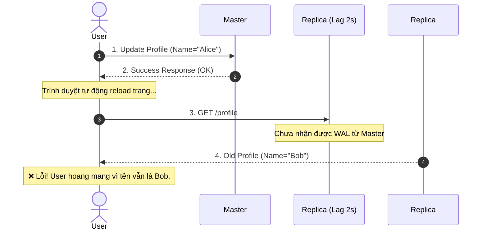
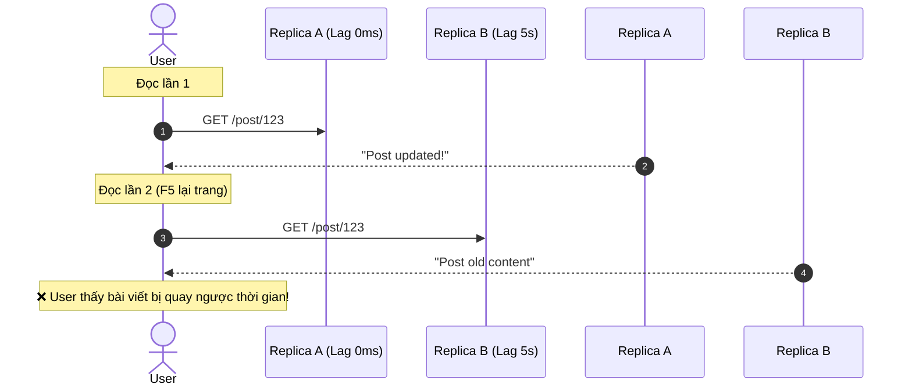

# Read Replica có vấn đề Consistency gì? Cách giải quyết thực chiến

## ⚡ Tóm tắt ngắn (30s)
Khi sử dụng kiến trúc **Single-Leader với Asynchronous Replication**, việc định tuyến truy vấn Đọc sang các **Read Replicas** để giảm tải cho Master sẽ đối mặt với rủi ro lớn về **Bất nhất dữ liệu (Data Inconsistency / Replication Lag)**. Có 3 hiện tượng bất nhất kinh điển:
1. **Read-After-Write (Đọc ngay sau khi Ghi)**: User vừa cập nhật dữ liệu (ghi vào Master), trang web tải lại và đọc từ Replica (đang bị lag). User thấy dữ liệu cũ và nghĩ hệ thống bị lỗi.
2. **Monotonic Reads (Đọc giật lùi thời gian)**: User tải trang 2 lần liên tục, lần 1 đọc từ Replica A (không lag) thấy thông tin mới, lần 2 đọc từ Replica B (đang bị lag) lại thấy thông tin cũ.
3. **Consistent Prefix Reads (Vi phạm thứ tự nhân quả)**: Lỗi xảy ra trong hệ thống phân vùng (sharding/partitioning). Câu trả lời xuất hiện trước cả câu hỏi vì câu hỏi được chuyển giao sang Replica chậm hơn câu trả lời.

---

## 🔍 Chi tiết bản chất & Kịch bản thực tế

### 1. Kịch bản 1: Read-After-Write Inconsistency (Bất nhất Đọc-Sau-Ghi)



#### Giải pháp thực chiến:
* **Định tuyến theo quyền sở hữu (Owner Routing)**: 
    * *Quy tắc*: Các dữ liệu do chính user đó vừa chỉnh sửa (ví dụ: hồ sơ cá nhân, giỏ hàng của họ) bắt buộc phải đọc từ **Master**. Các dữ liệu của user khác (ví dụ: profile người khác) thì đọc từ **Replica**.
* **Định tuyến dựa trên thời gian (Time-based Routing)**:
    * *Quy tắc*: Sau khi user thực hiện một hành động Ghi, ứng dụng sẽ ghi nhận thời điểm đó và ép buộc mọi truy vấn Đọc của user này phải hướng về **Master** trong một khoảng thời gian an toàn (ví dụ: 5 giây - ước lượng dư sức cho replication lag hoàn tất). Sau 5 giây, hệ thống tự động quay lại đọc từ Replica.
* **LSN/Transaction ID Tracking (Độ trễ dựa trên vị trí Log)**:
    * *Quy tắc*: Khi Master ghi thành công, nó trả về một **LSN (Log Sequence Number)** hoặc Transaction ID mới nhất. Khi client đọc từ Replica, nó gửi kèm LSN này. Ứng dụng/Middleware sẽ kiểm tra, nếu Replica chưa bắt kịp LSN đó, nó sẽ đợi (block) một vài mili-giây cho Replica cập nhật xong, hoặc tạm thời chuyển hướng đọc sang Master.

---

### 2. Kịch bản 2: Monotonic Reads Inconsistency (Mất tính đơn điệu)

Hiện tượng này xảy ra khi các request Đọc liên tiếp của một user được cân bằng tải (Load Balancing) ngẫu nhiên sang các Replica khác nhau có độ trễ lag khác nhau.



#### Giải pháp thực chiến:
* **Sticky Routing (Định tuyến dính)**:
    * *Quy tắc*: Đảm bảo mỗi user luôn luôn được định tuyến đọc tới **cùng một Replica duy nhất** trong suốt session của họ.
    * *Cách implement*: Thực hiện hash `user_id` hoặc Session ID để chọn Replica: `Replica_Index = Hash(user_id) % Total_Replicas`. Cách này đảm bảo user có thể bị đọc dữ liệu hơi cũ, nhưng dữ liệu của họ sẽ luôn tịnh tiến theo thời gian chứ không bị nhảy cóc ngược xuôi.

---

### 3. Kịch bản 3: Consistent Prefix Reads (Đọc vi phạm tiền tố nhất quán)

Xảy ra trong cơ sở dữ liệu sharded. Nếu sự kiện B phụ thuộc vào sự kiện A (nhân quả), nhưng sự kiện A nằm ở Shard 1 (lag nhiều), sự kiện B nằm ở Shard 2 (lag ít). Người đọc có thể thấy sự kiện B trước sự kiện A.
* **Ví dụ**: 
    * *Alice*: "Xin chào, bạn có rảnh không?" (Shard 1)
    * *Bob*: "Tôi rảnh, có chuyện gì thế?" (Shard 2)
    * *User X*: Nhìn thấy "Tôi rảnh, có chuyện gì thế?" trước, sau đó mới thấy "Xin chào..." -> Trông rất ngớ ngẩn.
* **Giải pháp thực chiến**: Đảm bảo các cuộc trò chuyện hoặc các thực thể có mối liên hệ nhân quả bắt buộc phải được lưu trên **cùng một phân vùng (Shard)** để thứ tự replication được bảo toàn tuyệt đối.

---

## 💻 Code thực chiến: Routing thông minh trong Spring Boot

Chúng ta có thể tự động hóa việc định tuyến Đọc/Ghi bằng cách kết hợp `@Transactional` của Spring với cơ chế phân tách DataSource động.

### 🛠️ Thiết kế Dynamic Routing DataSource

```java
public class RoutingDataSource extends AbstractRoutingDataSource {
    @Override
    protected Object determineCurrentLookupKey() {
        // Trả về "MASTER" hoặc "REPLICA" dựa trên Context hiện tại của Thread
        return DatabaseContextHolder.getDatabaseType();
    }
}
```

### 🛠️ Aspect tự động chuyển hướng dựa trên Annotation `@Transactional`

```java
@Aspect
@Component
public class DataSourceRouteAspect {

    @Before("@annotation(transactional)")
    public void route(JoinPoint joinPoint, Transactional transactional) {
        if (transactional.readOnly()) {
            // Nếu transaction là readOnly, định tuyến an toàn sang REPLICA
            DatabaseContextHolder.setDatabaseType(DatabaseType.REPLICA);
        } else {
            // Ngược lại, bắt buộc phải ghi/đọc trên MASTER
            DatabaseContextHolder.setDatabaseType(DatabaseType.MASTER);
        }
    }

    @After("@annotation(transactional)")
    public void clear(JoinPoint joinPoint, Transactional transactional) {
        DatabaseContextHolder.clear();
    }
}
```

---

## 📊 Bảng so sánh các cấp độ Consistency thực tế

| Cấp độ nhất quán | Độ trễ Đọc/Ghi | Trải nghiệm người dùng | Thích hợp cho |
| :--- | :--- | :--- | :--- |
| **Strong Consistency** | Cao (Chờ ghi hết Replica) | Hoàn hảo (Không bao giờ thấy lệch) | Số dư ví điện tử, thanh toán |
| **Read-Your-Own-Writes**| Thấp | Rất tốt (User thấy hành vi của mình đúng) | Profile cá nhân, viết comment |
| **Monotonic Reads** | Thấp | Khá (Dữ liệu tịnh tiến, không giật lùi) | Social media feed, xem tin tức |
| **Eventual Consistency**| Rất thấp | Chấp nhận được (Hệ thống tự cân bằng sau) | Số lượt Like, view video, thống kê |

---

## ⚠️ Common Gotchas & Questions follow-up

### 1. Vấn đề "Replication Lag Spike" trong giờ cao điểm
Vào khung giờ vàng, lượng ghi tăng vọt làm Master quá tải. Replica cũng quá tải CPU do phải liên tục parse WAL log để đuổi theo Master. Replication Lag tăng từ vài mili-giây lên đến vài chục giây. 
* **Hậu quả**: Nếu bạn áp dụng giải pháp "Time-based routing" cố định là 5 giây, nhưng lag thực tế là 20 giây, user sẽ lập tức bị bất nhất dữ liệu Read-After-Write.
* **Giải pháp thực chiến**: Cần cấu hình **Circuit Breaker cho Replica**. Nếu Replication Lag vượt quá ngưỡng cho phép (ví dụ: > 3 giây), hệ thống phải tự động ngắt kết nối đọc tới Replica đang bị lag và chuyển hướng toàn bộ traffic đọc quay lại Master để bảo vệ trải nghiệm của người dùng, chấp nhận Master chịu tải cao hơn trong thời gian ngắn.
