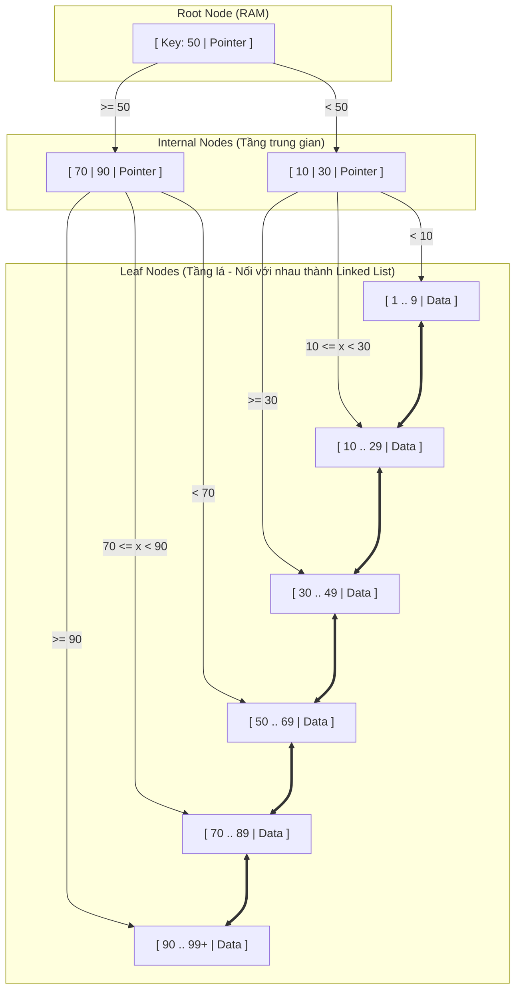

# Cấu trúc và cơ chế hoạt động của B-tree & B+ Tree Index

## ⚡ Tóm tắt ngắn (30s)
Hầu hết các hệ quản trị cơ sở dữ liệu quan hệ hiện đại (như MySQL InnoDB, PostgreSQL, Oracle, SQL Server) mặc định sử dụng **B+ Tree** (một biến thể tối ưu của **B-tree**) làm cấu trúc dữ liệu nền tảng cho Index. 

Cấu trúc này hoạt động dựa trên các nguyên tắc then chốt:
1.  **Cân bằng tự động (Self-balancing)**: Tất cả các nút lá (Leaf Nodes) luôn nằm trên cùng một mức độ sâu, đảm bảo hiệu năng truy vấn ổn định ở độ phức tạp $O(\log N)$ bất kể dữ liệu lớn thế nào.
2.  **Khả năng phân nhánh cực cao (High Fan-out)**: Mỗi nút của cây tương đương với một Trang đĩa (Page - thường là 8KB/16KB), chứa hàng trăm khóa (keys) và con trỏ liên kết thay vì chỉ có 2 như cây nhị phân. Điều này giúp chiều cao của cây cực kỳ thấp (chỉ khoảng 3-4 tầng đối với hàng trăm triệu dòng dữ liệu), giảm thiểu tối đa số lần đọc đĩa (Disk I/O).
3.  **B+ Tree tối ưu hơn B-tree chuẩn**: B+ Tree chỉ lưu trữ dữ liệu thực tế (hoặc con trỏ dữ liệu) ở **Nút lá**, các nút trung gian chỉ lưu trữ khóa khóa điều hướng. Đồng thời, toàn bộ nút lá được nối với nhau qua cấu trúc **Danh sách liên kết kép (Doubly Linked List)** giúp việc quét khoảng (Range Scan) đạt hiệu năng tối đa.

---

## 🔍 Chi tiết bản chất thực chiến

### 1. Phẫu thuật cấu trúc B+ Tree trong thực tế
Cấu trúc B+ Tree được chia làm 3 tầng nút chính:
*   **Root Node (Nút gốc)**: Điểm bắt đầu của mọi cuộc truy vết tìm kiếm. Luôn được giữ cố định trong bộ nhớ RAM để tối ưu tốc độ.
*   **Internal Nodes (Nút trung gian)**: Chỉ chứa khóa điều hướng (Key) và địa chỉ trỏ đến trang con ở tầng dưới. Không chứa con trỏ trỏ đến dòng dữ liệu thực tế. Nhờ vậy, một Internal Node 16KB có thể chứa hàng trăm khóa, tạo ra hệ số phân nhánh (Fan-out) khổng lồ.
*   **Leaf Nodes (Nút lá)**: Tầng cuối cùng của cây. Chứa khóa Index và **con trỏ thực tế trỏ đến dòng dữ liệu vật lý** (hoặc chứa luôn dòng dữ liệu nếu là Clustered Index). Quan trọng nhất, các nút lá liên kết tuần tự với nhau.



### 2. Tại sao RDBMS không dùng Cây Tìm Kiếm Nhị Phân (BST) hay Red-Black Tree?
*   **Vấn đề của BST**: Hệ số phân nhánh của cây nhị phân chỉ bằng 2. Để quản lý $10^6$ dòng dữ liệu, BST cần chiều cao khoảng $\log_2(10^6) \approx 20$ tầng. Nghĩa là trong kịch bản tệ nhất, hệ thống phải thực hiện 20 lần nhảy ổ đĩa để tìm dữ liệu. Mỗi lần nhảy đọc đĩa (Disk Seek) tốn từ 2-10ms trên ổ HDD cũ, khiến câu lệnh chạy cực kỳ chậm.
*   **Ưu thế vượt trội của B+ Tree**: Với hệ số phân nhánh (Fan-out) là 100, chiều cao cây chỉ cần $\log_{100}(10^6) \approx 3$ tầng. Hệ thống chỉ cần tối đa **3 lần đọc đĩa** là tìm thấy dữ liệu.

### 3. Cơ chế chèn dữ liệu và hiện tượng Phân mảnh trang đĩa (Page Split)
Khi ta chèn một bản ghi mới (`INSERT`):
1.  DBMS định vị Leaf Node phù hợp thông qua duyệt cây.
2.  Nếu Leaf Node đó còn khoảng trống trên đĩa (Page chưa đầy 100%), bản ghi mới được ghi vào một cách dễ dàng và nhanh chóng.
3.  **Page Split (Tách trang)**: Nếu Leaf Node đã đầy 100%, DBMS buộc phải phân bổ một Page trống mới hoàn toàn, di chuyển 50% dữ liệu từ Page cũ sang Page mới, thiết lập lại liên kết kép giữa các nút lá, và chèn khóa định hướng mới vào Internal Node phía trên.

> [!CAUTION]
> Page Split là một thao tác cực kỳ đắt đỏ về tài nguyên đĩa và CPU vì nó tạo ra các thao tác Random Write vật lý, đồng thời khóa (Lock) các Page liên quan trong quá trình xử lý, làm sụt giảm nghiêm trọng thông lượng ghi của hệ thống.

---

## 💻 Code thực chiến: BAD vs GOOD trong việc thiết kế khóa

### ❌ BAD: Dùng chuỗi dài hoặc giá trị ngẫu nhiên (UUID v4) làm Primary Key
Sử dụng UUID v4 ngẫu nhiên làm khóa chính dẫn đến dữ liệu chèn bị phân tán hỗn loạn trên cây chỉ mục, liên tục gây ra Page Split vật lý trên ổ đĩa.

```sql
CREATE TABLE bad_orders (
    -- UUID v4 ngẫu nhiên làm Primary Key (Clustered Index)
    id UUID PRIMARY KEY DEFAULT gen_random_uuid(), 
    customer_id BIGINT NOT NULL,
    total_amount DECIMAL(12,2) NOT NULL,
    -- Trường text quá dài bị lập index trực tiếp
    description VARCHAR(2000), 
    created_at TIMESTAMP DEFAULT CURRENT_TIMESTAMP
);

-- Tạo Index trực tiếp trên trường text siêu dài
CREATE INDEX idx_bad_desc ON bad_orders(description); 
-- Hạn chế: Khóa Index quá dài làm giảm trầm trọng Fan-out, tăng chiều cao cây!
```

###  GOOD: Sử dụng Auto-increment/Snowflake ID và Prefix Index
Sử dụng khóa chính tăng tuần tự đảm bảo dữ liệu mới luôn được ghi vào cuối cây Index (không gây Page Split ở giữa). Sử dụng Prefix Index cho trường ký tự dài để giữ kích thước cây nhỏ gọn.

```sql
CREATE TABLE good_orders (
    -- Khóa chính tăng tuần tự (hoặc Snowflake ID tăng dần theo thời gian)
    id BIGINT GENERATED ALWAYS AS IDENTITY PRIMARY KEY, 
    customer_id BIGINT NOT NULL,
    total_amount DECIMAL(12,2) NOT NULL,
    description VARCHAR(2000),
    created_at TIMESTAMP DEFAULT CURRENT_TIMESTAMP
);

-- Chỉ lập chỉ mục tiền tố (Prefix Index) cho các ký tự đầu tiên của chuỗi dài
-- Tiết kiệm không gian lưu trữ và duy trì Fan-out cực cao cho nút lá
CREATE INDEX idx_good_desc_prefix ON good_orders(description(20)); -- MySQL hỗ trợ cú pháp này
-- Trong PostgreSQL, có thể dùng biểu thức md5 hash hoặc dùng Partial Index nếu phù hợp
```

---

## 📊 Bảng so sánh B-Tree, B+ Tree và Hash Index

| Tiêu chí | B-Tree (Chuẩn) | B+ Tree (Mở rộng) | Hash Index |
| :--- | :--- | :--- | :--- |
| **Vị trí lưu dòng dữ liệu** | Tại bất kỳ nút nào (Root, Internal, Leaf) | **Chỉ lưu tại Nút lá (Leaf Nodes)** | Lưu trực tiếp tại các bucket liên kết |
| **Hệ số phân nhánh (Fan-out)** | Trung bình (do nút chứa cả dữ liệu chiếm diện tích) | **Rất cao** (Nút trung gian chỉ chứa khóa) | Không áp dụng cấu trúc cây |
| **Hỗ trợ truy vấn khoảng (`>`, `<`, `BETWEEN`)** | Kém (phải duyệt đệ quy qua nhiều tầng cây) | **Cực tốt** (nhờ Linked List ở các nút lá) | **Hoàn toàn không hỗ trợ** |
| **Độ phức tạp truy vấn chính xác (`=`)** | $O(\log N)$ | $O(\log N)$ (luôn ổn định do cây cân bằng) | $O(1)$ (tốt nhất cho Point Lookup) |

---

## ⚠️ Common Gotchas & Questions follow-up

### 1. Phân mảnh Index (Index Fragmentation) và cách xử lý
*   **Vấn đề**: Sau một thời gian dài hệ thống chạy `DELETE` dữ liệu cũ hoặc `UPDATE` dữ liệu liên tục làm phát sinh Page Splits, các Page của Index sẽ chứa nhiều khoảng trống trống rỗng (gọi là phân mảnh nội bộ). Hoặc các trang đĩa liên kết vật lý không còn nằm gần nhau trên ổ cứng (gọi là phân mảnh ngoại vi). Điều này làm tăng số lần đọc đĩa không cần thiết khi quét index.
*   **Giải pháp**: Cần định kỳ giám sát tỷ lệ phân mảnh Index và chạy bảo trì:
    *   **PostgreSQL**: Chạy lệnh `REINDEX INDEX index_name;` (hoặc an toàn hơn trên Prod là `REINDEX INDEX CONCURRENTLY index_name;` để tránh khóa bảng).
    *   **MySQL InnoDB**: Chạy lệnh `OPTIMIZE TABLE table_name;` để rebuild lại toàn bộ bảng và Clustered Index.

### 2. Câu hỏi đào sâu từ interviewer
*   **Q: Tại sao trong B+ Tree, việc dùng UUID v4 làm Primary Key lại có hại hơn rất nhiều so với việc dùng nó làm Secondary Key?**
    *   *Trả lời*: Trong các RDBMS sử dụng cơ chế Index-Organized Table như MySQL InnoDB, Primary Key chính là **Clustered Index**. Điều này có nghĩa là cấu trúc cây của khóa chính chứa toàn bộ dữ liệu vật lý của dòng đó tại các nút lá. Khi chèn một khóa UUID ngẫu nhiên vào giữa cây, một Page Split xảy ra sẽ buộc DBMS phải di chuyển toàn bộ dữ liệu của nửa dòng trong trang cũ sang trang mới. Chi phí I/O vật lý này lớn hơn gấp hàng chục lần so với Secondary Index (vốn chỉ chứa khóa phụ và con trỏ khóa chính, kích thước bản ghi rất nhỏ). Do đó, tác hại ghi phân mảnh của UUID đối với Clustered Index là cực kỳ nghiêm trọng.
*   **Q: Làm thế nào để ước tính kích thước (chiều cao) của một cây B+ Tree dựa trên kích thước dòng dữ liệu?**
    *   *Trả lời*: Ta có thể tính toán sơ bộ dựa trên dung lượng Page (mặc định 16KB). Giả sử khóa chính `BIGINT` (8 bytes) + con trỏ điều hướng (8 bytes) = 16 bytes. Mỗi trang trung gian chứa tối đa $16384 / 16 \approx 1000$ khóa (Fan-out = 1000). Ở tầng lá, giả sử mỗi dòng dữ liệu trung bình nặng 1KB (chứa 16 dòng/trang). 
        *   Tầng 1 (Root): 1 Page (chứa 1000 con trỏ tới tầng 2)
        *   Tầng 2 (Internal): 1000 Pages (mỗi Page trỏ tới 1000 Leaf Pages)
        *   Tầng 3 (Leaf): $1000 \times 1000 = 1,000,000$ Leaf Pages.
        *   Tổng số dòng tối đa có thể quản lý: $1,000,000 \times 16 \text{ dòng} = 16,000,000$ dòng dữ liệu. 
        Như vậy chỉ cần đúng **3 tầng cây** để quản lý 16 triệu dòng dữ liệu với tốc độ truy xuất tối đa 3 lần đọc đĩa.
