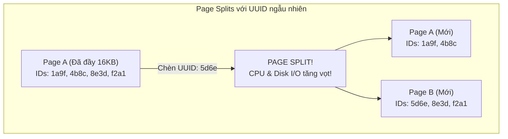

# UUID làm Primary Key: Vấn đề hiệu năng và Giải pháp thực chiến nâng cao

## ⚡ Tóm tắt ngắn (30s)
* **Vấn đề cốt lõi**: Mặc dù UUID (đặc biệt là UUIDv4 ngẫu nhiên) giúp tạo khóa duy nhất trên toàn cầu (Globally Unique) mà không cần hỏi ý kiến Database trung tâm, việc dùng nó làm Khóa chính (Primary Key) trong các RDBMS sử dụng Clustered Index (như MySQL InnoDB) sẽ gây ra thảm họa hiệu năng:
    1. **Page Fragmentation & Page Splits (Phân mảnh ổ đĩa)**: Dữ liệu ngẫu nhiên buộc DB Engine phải liên tục chèn bản ghi mới vào giữa các trang lưu trữ B-Tree hiện tại, gây phân mảnh vật lý và sụt giảm nghiêm trọng hiệu năng Ghi (Write Performance).
    2. **Phình to kích thước Index**: UUID chiếm tới 16-36 bytes (so với `BIGINT` chỉ 8 bytes). Điều này làm phình to mọi **Secondary Index** (vì các secondary index buộc phải lưu kèm giá trị Primary Key để trỏ về dòng dữ liệu gốc), làm RAM nhanh chóng cạn kiệt.
* **Giải pháp Senior**: Sử dụng **UUIDv7** (khóa tuần tự theo thời gian - Time-ordered UUID) hoặc **Snowflake ID** kết hợp lưu trữ dưới dạng nhị phân (`BINARY(16)` hoặc kiểu dữ liệu `UUID` native của PostgreSQL).

---

## 🔍 Chi tiết bản chất thực chiến dưới tầng vật lý DB

Để ghi điểm tuyệt đối trong mắt interviewer, bạn cần giải thích rõ cơ chế vật lý của Clustered Index hoạt động như thế nào khi nhận khóa ngẫu nhiên:

### 1. Hiện tượng Page Splits (Phân tách trang) và Phân mảnh B-Tree

Trong MySQL InnoDB, dữ liệu của bảng được sắp xếp vật lý trên ổ đĩa dựa theo thứ tự của **Primary Key (Clustered Index)**. Dữ liệu được lưu trữ theo từng khối gọi là **Pages** (mặc định là 16KB).

* **Với Auto-increment (`BIGINT`)**: Dữ liệu mới luôn có ID lớn hơn dữ liệu cũ. DB Engine chỉ việc tuần tự append (chèn nối tiếp) dữ liệu vào cuối trang hiện tại. Khi trang đầy, nó tạo trang mới cực kỳ mượt mà.
* **Với UUID ngẫu nhiên (`UUIDv4`)**: Dữ liệu mới có ID hoàn toàn ngẫu nhiên. DB buộc phải tìm vị trí tương ứng của nó ở giữa cấu trúc B-Tree hiện tại. Nếu trang lưu trữ tương ứng đã đầy (99%), DB Engine phải thực hiện **Page Split**: Tách đôi trang cũ thành 2 trang mới, di chuyển một nửa dữ liệu sang trang mới để nhường chỗ cho bản ghi vừa chèn.



**Hậu quả**: 
* Tốc độ chèn dữ liệu (Insert Throughput) giảm theo cấp số nhân khi bảng phình to vượt quá dung lượng RAM đệm (Buffer Pool).
* Các trang dữ liệu chỉ chứa khoảng 50-70% dữ liệu thực tế sau khi split, gây lãng phí hàng chục GB dung lượng ổ đĩa.

### 2. Sự ảnh hưởng tới Secondary Index (Chỉ mục phụ)

Trong InnoDB, mọi Secondary Index (ví dụ: index trên cột `email`, `created_at`) đều không trỏ thẳng tới địa chỉ vùng nhớ của dòng dữ liệu vật lý, mà lưu kèm theo **giá trị của Primary Key**.
* Nếu Primary Key là `BIGINT` (8 bytes) + Cấu trúc gọn gàng: Secondary Index chiếm rất ít RAM.
* Nếu Primary Key là `VARCHAR(36)` chứa chuỗi UUID (36 bytes): Secondary index phình to gấp 3-4 lần. Khi dung lượng index vượt quá kích thước RAM đệm (`innodb_buffer_pool_size`), mỗi truy vấn đọc dùng index phụ sẽ buộc phải đọc đĩa cứng (Disk Read), phá hủy hoàn toàn tốc độ phản hồi của hệ thống.

---

## 💻 Code thực chiến: Sử dụng UUIDv7 và Lưu trữ nhị phân

### 1. UUIDv7 là gì? Tại sao nó giải quyết được vấn đề?
UUIDv7 (được chuẩn hóa trong RFC 9562) tích hợp một **Unix Timestamp có độ phân giải milisecond (48-bit)** ở đầu chuỗi, phần còn lại là entropy ngẫu nhiên để đảm bảo tính duy nhất.
* Nhờ vậy, UUIDv7 có tính chất **Monotonically Increasing (Tuần tự tăng dần theo thời gian)**. Khi chèn vào B-Tree, nó hoạt động mượt mà và tối ưu y hệt Auto-increment!

### 2. Implement UUIDv7 lưu trữ tối ưu dưới dạng nhị phân trong Spring Boot (Hibernate 6+)

Hibernate 6 hỗ trợ trực tiếp việc tạo và ánh xạ UUID sang định dạng nhị phân cực kỳ tiết kiệm bộ nhớ:

```java
@Entity
@Table(name = "orders")
@Getter
@Setter
public class Order {

    @Id
    @GeneratedValue(generator = "uuid7")
    @GenericGenerator(
        name = "uuid7",
        strategy = "org.hibernate.id.uuid.UuidGenerator" // Hibernate 6 tự động tối ưu hóa UUIDv7
    )
    @Column(name = "id", updatable = false, nullable = false)
    // Trong PostgreSQL, trường này sẽ tự động map với kiểu dữ liệu UUID (16 bytes)
    // Trong MySQL, nó sẽ map với BINARY(16) cực kỳ tiết kiệm
    private UUID id;

    @Column(name = "amount", nullable = false)
    private BigDecimal amount;
}
```

### 3. Cách chuyển đổi chuỗi UUID sang BINARY trong MySQL khi viết SQL Native

```sql
-- Thiết kế bảng tối ưu trong MySQL
CREATE TABLE orders (
    id BINARY(16) PRIMARY KEY, -- Tiết kiệm tối đa bộ nhớ so với VARCHAR(36)
    amount DECIMAL(10,2) NOT NULL
);

-- Khi INSERT dữ liệu (Chuyển chuỗi UUID sang nhị phân)
INSERT INTO orders (id, amount) 
VALUES (UUID_TO_BIN('018fad5e-5b12-7000-8000-000000000001', true), 150.00); 
-- Lưu ý tham số thứ 2 'true' của UUID_TO_BIN: Tự sắp xếp lại byte thời gian để tối ưu index (chỉ dùng cho UUIDv1/v7)

-- Khi SELECT dữ liệu (Chuyển nhị phân ngược lại chuỗi)
SELECT BIN_TO_UUID(id) AS id, amount FROM orders WHERE id = UUID_TO_BIN('018fad5e-5b12-7000-8000-000000000001', true);
```

---

## 📊 Bảng so sánh các loại Khóa chính phổ biến

| Tiêu chí | Auto-increment (`BIGINT`) | UUIDv4 (Ngẫu nhiên) | UUIDv7 (Tuần tự) | Snowflake ID (Tuần tự phân tán) |
| :--- | :--- | :--- | :--- | :--- |
| **Kích thước lưu trữ**| 8 bytes (Cực nhỏ) | 16 bytes (Binary) / 36 bytes (Char) | 16 bytes (Binary) / 36 bytes (Char) | 8 bytes (BIGINT) |
| **Tính tuần tự** | Tuần tự tuyệt đối | Hoàn toàn ngẫu nhiên | Tuần tự theo thời gian | Tuần tự theo thời gian |
| **Khả năng sinh phân tán**| Không (phải hỏi DB trung tâm) | Hoàn hảo (không lo trùng) | Hoàn hảo (không lo trùng) | Rất tốt (cần ID của máy phát) |
| **Rò rỉ thông tin business**| Có (lộ tổng số record) | Bằng 0 | Ít (chỉ lộ thời gian tạo) | Ít (chỉ lộ thời gian tạo) |
| **Hiệu năng chèn (B-Tree)**| Tối ưu nhất | Tồi tệ nhất (Page splits liên tục) | Rất tốt (y hệt BigInt) | Rất tốt |

---

## ⚠️ Common Gotchas & Questions follow-up

### 1. Vấn đề lộ thông tin Business qua Auto-increment ID
Nếu bạn sử dụng Auto-increment làm Primary Key và phơi bày nó lên URL của API (ví dụ: `https://api.system.com/orders/1023`), đối thủ cạnh tranh có thể dễ dàng đoán ra tổng số đơn hàng của công ty bạn bằng cách lấy số ID lớn trừ số ID nhỏ. Họ cũng có thể viết script crawl dữ liệu dễ dàng bằng một vòng lặp `for (id = 1; id < 100000; id++)`.
* **Giải pháp thực chiến (Nếu vẫn dùng Auto-increment)**:
  1. Sử dụng cơ chế **Hashids** hoặc **Optimized UUID** chỉ cho tầng API hiển thị ra ngoài (External ID), trong khi dưới tầng DB quan hệ nội bộ vẫn sử dụng `BIGINT` làm Primary Key (Internal ID) để tối ưu các phép JOIN.
  2. Sử dụng **Snowflake ID** hoặc **UUIDv7** để giải quyết triệt để cả hai vấn đề.

### 2. Câu hỏi đào sâu từ interviewer: "Tại sao không dùng UUIDv1 mà lại cần dùng UUIDv7?"
* **Trả lời**: 
  * UUIDv1 cũng sắp xếp theo thời gian nhưng cấu trúc của nó đặt phần **Timestamp có tần suất thay đổi nhanh nhất (Low-order bits) ở đầu chuỗi**, còn phần timestamp thay đổi chậm nhất nằm ở giữa. Do đó, về mặt lexicographical (thứ tự chuỗi), UUIDv1 không thực sự tăng dần một cách tuần tự nếu không qua hàm đảo byte.
  * Ngoài ra, UUIDv1 sử dụng địa chỉ MAC của card mạng vật lý để đảm bảo duy nhất, gây ra rò rỉ thông tin bảo mật về mặt hạ tầng mạng.
  * **UUIDv7** sinh ra để sửa chữa hoàn toàn các nhược điểm này: Đưa timestamp thay đổi chậm nhất lên đầu (đảm bảo thứ tự tự nhiên tăng dần tuyệt đối) và loại bỏ hoàn toàn địa chỉ MAC card mạng (thay thế bằng entropy ngẫu nhiên an toàn).
