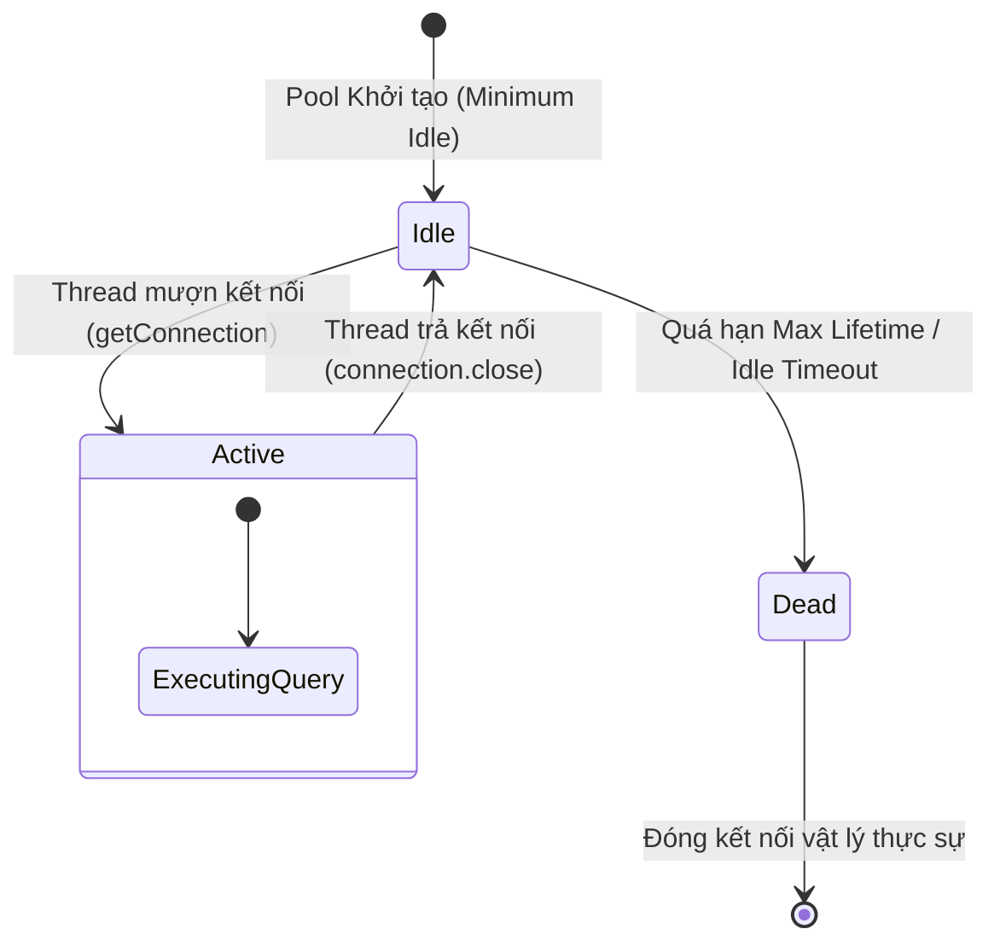

# Database Connection Pool hoạt động như thế nào?

## ⚡ Tóm tắt ngắn (30s)
* **Vấn đề**: Việc thiết lập một kết nối vật lý mới tới Database Server là một thao tác **cực kỳ đắt đỏ** (bao gồm: bắt tay TCP 3 bước, bắt tay mã hóa TLS/SSL, xác thực người dùng, cấp phát luồng xử lý và bộ nhớ RAM phía DB Server). Nó có thể mất từ 10ms đến hàng trăm mili-giây.
* **Giải pháp (Connection Pool)**: Là một thư mục đệm chứa sẵn một số lượng kết nối DB được mở trước.
    * Khi ứng dụng cần thực thi câu lệnh SQL: Nó mượn một kết nối có sẵn từ Pool (mất dưới 1ms).
    * Khi thực thi xong câu lệnh SQL và gọi `connection.close()`: Kết nối **không thực sự bị ngắt**, mà chỉ được trả ngược về Pool để các request sau tiếp tục tái sử dụng.
* **Thư viện tiêu chuẩn**: **HikariCP** là connection pool mặc định và nhanh nhất trong hệ sinh thái Java Spring Boot hiện nay nhờ tối ưu hóa cấp byte-code và loại bỏ hầu hết các đồng bộ hóa thread không cần thiết (lock-free structures).

---

## 🔍 Chi tiết bản chất vòng đời kết nối (Connection Lifecycle)



### 1. Luồng xử lý chi tiết của Connection Pool

Khi ứng dụng Spring Boot khởi động và nạp DataSource:

1. **Khởi tạo (Initialization)**: Pool sẽ tự động mở sẵn một lượng kết nối vật lý cố định (cấu hình bởi `minimum-idle`) tới Database Server và giữ chúng ở trạng thái chờ (**Idle**).
2. **Yêu cầu kết nối (Lease/Borrow)**: Khi một luồng ứng dụng thực thi câu lệnh SQL (ví dụ: thông qua Repository):
   * Nó sẽ gửi yêu cầu `getConnection()` tới Pool.
   * Nếu có kết nối rảnh (Idle), Pool lập tức bàn giao kết nối đó. Thời gian phản hồi đạt mức sub-millisecond.
   * Nếu không có kết nối rảnh, nhưng tổng số kết nối hiện tại chưa đạt ngưỡng tối đa (`maximum-pool-size`), Pool sẽ mở thêm một kết nối vật lý mới và bàn giao cho luồng.
   * Nếu đã đạt ngưỡng tối đa, luồng đó sẽ bị chặn (Blocked) và phải xếp hàng chờ một luồng khác trả kết nối về. Nếu quá thời gian chờ (`connection-timeout`, mặc định 30s), ứng dụng sẽ ném ra lỗi `SQLTransientConnectionException: Connection is not available`.
3. **Trả kết nối (Release/Return)**: Khi công việc hoàn tất, tầng ORM gọi hàm `close()` trên kết nối.
   * **Bản chất**: Đối tượng kết nối mà ứng dụng nhận được thực chất là một **Proxy/Wrapper** bao bọc kết nối vật lý thật. Khi gọi `close()`, Proxy này sẽ chặn lệnh đóng socket vật lý, dọn dẹp các transaction chưa commit (rollback nếu cần) và đưa kết nối trở lại danh sách rảnh (Idle list) của Pool.

---

### 2. Các tham số cấu hình cốt lõi cần ghi nhớ

Để tinh chỉnh (tuning) connection pool tối ưu trên Production, bạn bắt buộc phải hiểu rõ ý nghĩa của các tham số sau:

* **`maximum-pool-size` (Số lượng kết nối tối đa)**: Số lượng kết nối vật lý nhiều nhất mà pool có thể tạo ra. Tham số này là nút thắt cổ chai bảo vệ Database Server không bị quá tải CPU/RAM.
* **`minimum-idle` (Số kết nối rảnh tối thiểu)**: Pool luôn giữ tối thiểu bao nhiêu kết nối mở sẵn. 
  * *Best Practice*: Nên đặt `minimum-idle` **bằng** `maximum-pool-size` (Fixed-size pool) để tránh việc pool liên tục phải co giãn, tạo/xóa kết nối vật lý gây trồi sụt độ trễ API.
* **`connection-timeout` (Thời gian chờ tối đa)**: Thời gian một luồng chấp nhận xếp hàng chờ kết nối rảnh trước khi ném ra Exception (thường đặt từ 5000ms đến 10000ms).
* **`max-lifetime` (Vòng đời tối đa của kết nối)**: Thời gian tối đa một kết nối vật lý được phép tồn tại trước khi bị hủy và tạo mới. Điều này cực kỳ quan trọng để dọn dẹp các kết nối bị rò rỉ bộ nhớ hoặc tránh việc tường lửa (firewall) ngắt kết nối ngầm do không hoạt động lâu.
  * *Best Practice*: Phải đặt `max-lifetime` ngắn hơn cấu hình timeout kết nối phía Database Server (ví dụ: `wait_timeout` của MySQL) ít nhất 30 giây để tránh lỗi "Broken pipe".
* **`idle-timeout`**: Thời gian một kết nối được phép rảnh rỗi trước khi bị hủy (chỉ hoạt động khi `minimum-idle` nhỏ hơn `maximum-pool-size`).

---

## 💻 Code thực chiến: Cấu hình HikariCP tối ưu trong Spring Boot

Trong Spring Boot, cấu hình Connection Pool được định nghĩa trực tiếp trong file `application.yml`:

```yaml
spring:
  datasource:
    url: jdbc:postgresql://localhost:5432/production_db
    username: app_user
    password: secure_password
    driver-class-name: org.postgresql.Driver
    # Cấu hình chi tiết HikariCP
    hikari:
      pool-name: MySpringHikariPool
      # Đặt kích thước cố định để tối ưu hiệu năng
      maximum-pool-size: 50
      minimum-idle: 50 
      # Thời gian chờ mượn kết nối tối đa (5 giây)
      connection-timeout: 5000
      # Vòng đời tối đa của kết nối (30 phút)
      max-lifetime: 1800000
      # Thời gian tối đa cho phép một kết nối rảnh (10 phút)
      idle-timeout: 600000
      # Câu lệnh kiểm tra kết nối còn sống hay không trước khi bàn giao
      connection-test-query: SELECT 1
```

---

## 📊 Tại sao HikariCP lại nhanh vượt trội?

Trước khi HikariCP ra đời, các thư viện như **c3p0** hay **DBCP** là tiêu chuẩn. HikariCP đạt hiệu năng nhanh gấp nhiều lần nhờ các cải tiến cơ bản sau dưới tầng sâu Java:

1. **Lock-free / Concurrent Bag**: Sử dụng cấu trúc dữ liệu không dùng lock khóa luồng (synchronized) mà tận dụng các luồng xử lý song song thông qua `ThreadLocal` để truy cập cực nhanh kết nối rảnh mà luồng đó từng mượn trước đó.
2. **Tối ưu hóa ArrayList bằng FastList**: HikariCP thay thế `ArrayList` tiêu chuẩn bằng `FastList` tự custom, loại bỏ kiểm tra chỉ số mảng (index range check) không cần thiết và tối ưu hóa việc tìm kiếm từ cuối mảng lên đầu khi đóng kết nối.
3. **Bytecode Elimination**: Tối ưu hóa tối giản các class Proxy bằng cách trực tiếp chỉnh sửa bytecode Java, giúp JVM inline các method dễ dàng hơn khi biên dịch JIT.

---

## ⚠️ Common Gotchas & Questions follow-up

### 1. Connection Leak (Rò rỉ kết nối) - Kẻ giết người thầm lặng
Lỗi xảy ra khi ứng dụng mượn kết nối từ pool nhưng **không bao giờ trả lại** (quên gọi `close()` hoặc gặp Exception ở giữa và không có khối `finally` giải phóng).
* **Hậu quả**: Chỉ sau một vài request, connection pool sẽ cạn kiệt kết nối hoàn toàn. Toàn bộ API sau đó sẽ báo lỗi timeout.
* **Cách phát hiện & khắc phục thực chiến**:
  * Luôn sử dụng cú pháp **try-with-resources** trong Java để tự động đóng kết nối:
    ```java
    try (Connection conn = dataSource.getConnection();
         PreparedStatement ps = conn.prepareStatement("SELECT * FROM users")) {
        // Thực thi SQL an toàn. Java tự động đóng conn ngay cả khi có Exception xảy ra!
    } catch (SQLException e) {
        log.error("Database error", e);
    }
    ```
  * Bật chế độ debug phát hiện rò rỉ của HikariCP trên môi trường Staging:
    ```yaml
    spring.datasource.hikari.leak-detection-threshold: 2000 # Cảnh báo nếu một luồng giữ kết nối quá 2 giây không trả
    ```

### 2. Câu hỏi đào sâu từ interviewer: "Bạn chọn số lượng `maximum-pool-size` là bao nhiêu cho hệ thống có traffic lớn? Càng to có càng tốt không?"
* **Trả lời**: 
  * **Sai lầm phổ biến**: Nghĩ rằng càng nhiều kết nối càng tốt (ví dụ: cấu hình `maximum-pool-size = 1000` để phục vụ 1000 request đồng thời).
  * **Sự thật**: DB Server thực chất là một máy tính vật lý bị giới hạn bởi số nhân CPU và tốc độ đọc ghi ổ đĩa. Nếu DB Server chỉ có 8 nhân CPU, tại một thời điểm nó chỉ có thể xử lý tối đa **8 luồng tính toán thực tế**. Nếu bạn đẩy sang 1000 kết nối đồng thời, CPU của DB sẽ mất hầu hết thời gian chỉ để thực hiện **Context Switching (Chuyển đổi ngữ cảnh luồng)**, kéo hiệu năng hệ thống tụt dốc thê thảm.
  * **Công thức thực nghiệm của PostgreSQL**:
    $$\text{Connections} \approx ((\text{Core Count} \times 2) + \text{Effective Spindle Count})$$
    *Ví dụ*: Một DB Server có 8 Cores CPU và ổ SSD NVMe nhanh, số lượng kết nối tối ưu chỉ nên nằm trong khoảng **16 đến 30**. Connection Pool nên được giữ ở mức nhỏ, tập trung tối ưu tốc độ thực thi của từng câu lệnh SQL (quá trình xử lý chớp nhoáng dưới 2ms) để luân chuyển kết nối liên tục.
