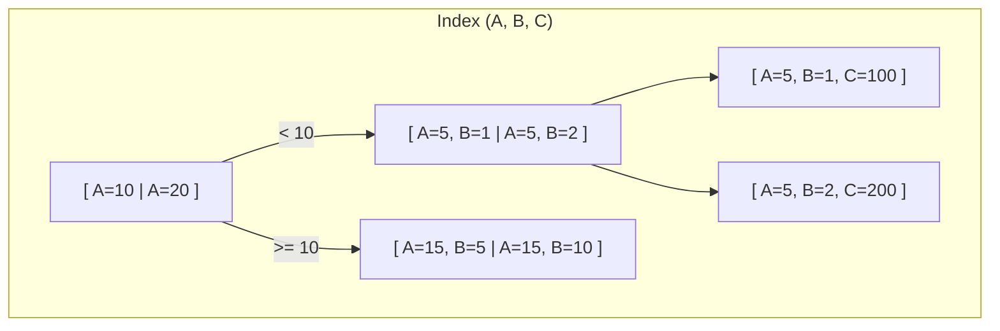

# Quy tắc Leftmost Prefix và Chiến lược sắp xếp thứ tự cột trong Composite Index

## ⚡ Tóm tắt ngắn (30s)
Trong **Composite Index (Chỉ mục đa cột)**, thứ tự khai báo của các cột quyết định hoàn toàn việc câu truy vấn của bạn có được tăng tốc hay không. Thiết kế thứ tự cột sai lầm sẽ khiến Index trở thành một "đống rác vô dụng" trên đĩa cứng.

Hai nguyên tắc vàng thực chiến khi thiết kế thứ tự cột:
1.  **Quy tắc Leftmost Prefix (Tiền tố ngoài cùng bên trái)**: Câu truy vấn buộc phải lọc theo các cột từ trái qua phải liên tục theo thứ tự định nghĩa của Index. Nếu bạn bỏ qua cột đầu tiên trong Index, toàn bộ Index sẽ bị vô hiệu hóa (trừ trường hợp đặc biệt là *Index Skip Scan*).
2.  **Quy tắc EQUAL-RANGE (Bằng trước - Khoảng sau)**: Luôn đặt các cột sử dụng toán tử so sánh bằng (`=`, `IS NULL`) lên phía trước, và đặt các cột sử dụng toán tử so sánh khoảng (`>`, `<`, `BETWEEN`, `LIKE`) ra phía sau cùng của Composite Index.

---

## 🔍 Chi tiết bản chất thực chiến

### 1. Quy tắc Leftmost Prefix: Cách DBMS duyệt cây chỉ mục
Giả sử ta có Composite Index trên ba cột `(A, B, C)`. Khóa chỉ mục vật lý được liên kết nối tiếp thành `A_B_C`.
Để tìm kiếm nhị phân trên cây B+ Tree, DBMS bắt buộc phải biết giá trị của `A` trước, rồi mới định vị đến nhóm giá trị của `B`, và cuối cùng là `C`.



Nếu bạn viết câu truy vấn:
*   `WHERE A = 5 AND B = 2 AND C = 200`: **Ăn 100% Index** (Khớp hoàn toàn 3 cột).
*   `WHERE A = 5 AND B = 2`: **Ăn Index** (Khớp tiền tố `(A, B)`, bỏ qua `C`).
*   `WHERE A = 5`: **Ăn Index** (Khớp tiền tố `A`, bỏ qua `B, C`).
*   `WHERE B = 2 AND C = 200`: **TRƯỢT INDEX** (Thiếu tiền tố `A` ngoài cùng bên trái, buộc phải quét toàn bộ bảng).

### 2. Chiến lược vàng: Quy tắc EQUAL-RANGE (Bằng trước - Khoảng sau)
Đây là lỗi kinh điển nhất của các nhà phát triển trung cấp. Giả sử bạn có câu truy vấn lọc danh sách giao dịch:
```sql
SELECT * FROM tx WHERE status = 'SUCCESS' AND amount > 500000;
```
Lập trình viên tạo Index `(amount, status)` với tư duy "amount có độ chọn lọc cao hơn status nên xếp trước". 

> [!CAUTION]
> **Đây là một thiết kế tồi.** Khi bạn so sánh khoảng trên cột đầu tiên (`amount > 500000`), DBMS sẽ định vị đến bản ghi đầu tiên có `amount = 500001` trên nút lá, sau đó duyệt tuyến tính liên tục qua tất cả các nút lá tiếp theo. Do các nút lá này chỉ được sắp xếp theo `status` đối với các dòng có **cùng** giá trị `amount`, nên khi quét qua các `amount` khác nhau, cột `status` hoàn toàn bị xáo trộn. Kết quả: DBMS không thể sử dụng phần `status` của Index để lọc nhị phân nữa mà phải quét tất cả các dòng có `amount > 500000` rồi lọc thủ công `status = 'SUCCESS'`.

**Giải pháp tối ưu**: Tạo Index là `(status, amount)`. 
*   DBMS dùng `status = 'SUCCESS'` để nhảy chính xác đến phân vùng dữ liệu thành công chỉ qua 1 lần duyệt cây.
*   Vì toàn bộ các bản ghi trong phân vùng này đã được sắp xếp sẵn theo `amount`, DBMS chỉ việc thực hiện quét khoảng cực kỳ mượt mà từ mốc `500000` trở lên.

---

## 💻 Code thực chiến: BAD vs GOOD trong việc sắp xếp thứ tự cột

### ❌ BAD: Lập thứ tự cột sai, đặt toán tử khoảng lên trước cột so sánh bằng
Tạo index với thứ tự cột không tối ưu, khiến câu truy vấn thực hiện lọc khoảng trước và vô hiệu hóa khả năng lọc nhị phân của các cột phía sau.

```sql
CREATE TABLE bad_logs (
    id BIGINT GENERATED ALWAYS AS IDENTITY PRIMARY KEY,
    level VARCHAR(10) NOT NULL,
    service_name VARCHAR(50) NOT NULL,
    created_at TIMESTAMP NOT NULL
);

-- TẠO INDEX SAI LẦM
-- Nghĩ rằng created_at có độ chọn lọc cực cao nên đặt lên trước
CREATE INDEX idx_logs_created_level ON bad_logs(created_at, level);

-- Câu truy vấn thực tế tìm log lỗi của service trong khoảng thời gian:
-- SELECT * FROM bad_logs WHERE created_at >= '2026-05-22 00:00:00' AND level = 'ERROR';
-- Hạn chế: Toán tử >= trên cột created_at đã ngắt kết nối Index đối với cột level ở phía sau.
-- DBMS phải scan toàn bộ index từ mốc thời gian đó trở đi và tự lọc level 'ERROR' bằng RAM.
```

###  GOOD: Triển khai theo nguyên tắc EQUAL-RANGE hoàn hảo
Đưa các cột lọc chính xác bằng `=` lên đầu Index, các cột lọc khoảng thời gian đưa xuống cuối cùng để tận dụng sức mạnh lọc đa tầng.

```sql
CREATE TABLE good_logs (
    id BIGINT GENERATED ALWAYS AS IDENTITY PRIMARY KEY,
    level VARCHAR(10) NOT NULL,
    service_name VARCHAR(50) NOT NULL,
    created_at TIMESTAMP NOT NULL
);

-- TẠO INDEX TỐI ƯU
-- level so sánh bằng (=) đặt lên đầu, created_at so sánh khoảng (>=) đặt ra sau cùng
CREATE INDEX idx_logs_level_created ON good_logs(level, created_at);

-- Câu truy vấn chạy với hiệu năng đỉnh cao:
-- SELECT * FROM good_logs WHERE level = 'ERROR' AND created_at >= '2026-05-22 00:00:00';
-- DBMS nhảy phát ăn ngay đến nhóm log 'ERROR' (Point Lookup)
-- Sau đó quét tuyến tính cực nhanh theo chiều thời gian đã được sắp xếp sẵn (Range Scan).
```

---

## 📊 Bảng ma trận ăn Index (Index Match Matrix)

Giả sử ta thiết kế Composite Index: `(status, user_id, created_at)`

| Mệnh đề `WHERE` thực tế | Ăn được những phần nào của Index? | Bản chất vận hành nội bộ |
| :--- | :--- | :--- |
| `WHERE status = 'A' AND user_id = 5 AND created_at >= '2026-05-22'` | **Ăn trọn vẹn cả 3 cột** | Hiệu năng tối đa ($O(\log N)$). |
| `WHERE status = 'A' AND user_id = 5` | **Ăn 2 cột đầu tiên** | Rất tốt, bỏ qua cột `created_at` không lọc. |
| `WHERE status = 'A' AND created_at >= '2026-05-22'` | **Chỉ ăn cột `status`** | Cột `created_at` bị trượt vì thiếu cột bắc cầu `user_id`. |
| `WHERE status = 'A' AND user_id >= 5 AND created_at = '2026-05-22'` | **Chỉ ăn 2 cột: `status` và `user_id`** | Lọc khoảng trên `user_id` ngắt kết nối, cột `created_at` bị trượt. |
| `WHERE user_id = 5 AND created_at >= '2026-05-22'` | **TRƯỢT HOÀN TOÀN** | Bị phạt Seq Scan vì thiếu tiền tố `status` ngoài cùng bên trái. |

---

## ⚠️ Common Gotchas & Questions follow-up

### 1. Hiện tượng "Index Skip Scan" trong các DB đời mới là gì?
*   **Vấn đề**: Đôi khi bạn quên không viết cột đầu tiên `A` trong mệnh đề `WHERE`, nhưng khi chạy `EXPLAIN` trên MySQL 8.0+ hoặc Oracle, bạn vẫn thấy câu lệnh ăn Index `(A, B)`.
*   **Cơ chế**: Đó là nhờ tối ưu hóa **Index Skip Scan**. Nếu cột đầu tiên `A` có **Cardinality cực thấp** (ví dụ: cột `gender` chỉ có 'M' và 'F'), DBMS sẽ tự động phân tách câu lệnh thành nhiều câu lệnh truy vấn con chạy song song:
    *   Tìm kiếm với `A = 'M' AND B = [giá trị]`
    *   Tìm kiếm với `A = 'F' AND B = [giá trị]`
*   **Lưu ý**: Cơ chế này chỉ hiệu quả khi cột đầu tiên có rất ít giá trị độc bản. Nếu cột đầu tiên có Cardinality cao (ví dụ: `customer_id`), Index Skip Scan sẽ bị vô hiệu hóa vì chi phí phân tách câu truy vấn quá lớn.

### 2. Câu hỏi đào sâu từ interviewer
*   **Q: Nếu tôi có Composite Index `(A, B, C)`. Câu truy vấn `WHERE A = 5 AND B IN (1, 2, 3) AND C = 10` sẽ ăn Index như thế nào?**
    *   *Trả lời*: Đây là một câu hỏi rất sâu về cách hoạt động của toán tử `IN`. Toán tử `IN` thực chất là một chuỗi các toán tử so sánh bằng liên tiếp (`B = 1 OR B = 2 OR B = 3`). 
        *   Trong **MySQL**: MySQL sẽ đối xử toán tử `IN` này tương tự như một dạng lọc khoảng (Range Query) đặc biệt. Nó sẽ quét các dải giá trị của `B`. Tùy thuộc vào phiên bản, việc sử dụng `IN` trên cột `B` có thể ngăn chặn việc sử dụng cột `C` tiếp theo trong Index để tìm kiếm nhị phân cấp độ cao.
        *   Trong **PostgreSQL**: PostgreSQL sử dụng cơ chế *Index Skip Scan* hoặc chuyển đổi thành quét nhiều nhánh (Bitmap Index Scan). Hệ thống vẫn có thể ăn trọn vẹn cả 3 cột bằng cách thực hiện 3 lần tìm kiếm Point Lookup song song cho các cặp khóa: `(5, 1, 10)`, `(5, 2, 10)`, và `(5, 3, 10)`. Đây là một điểm tối ưu hóa cực kỳ đáng giá của PostgreSQL so với các RDBMS khác.
