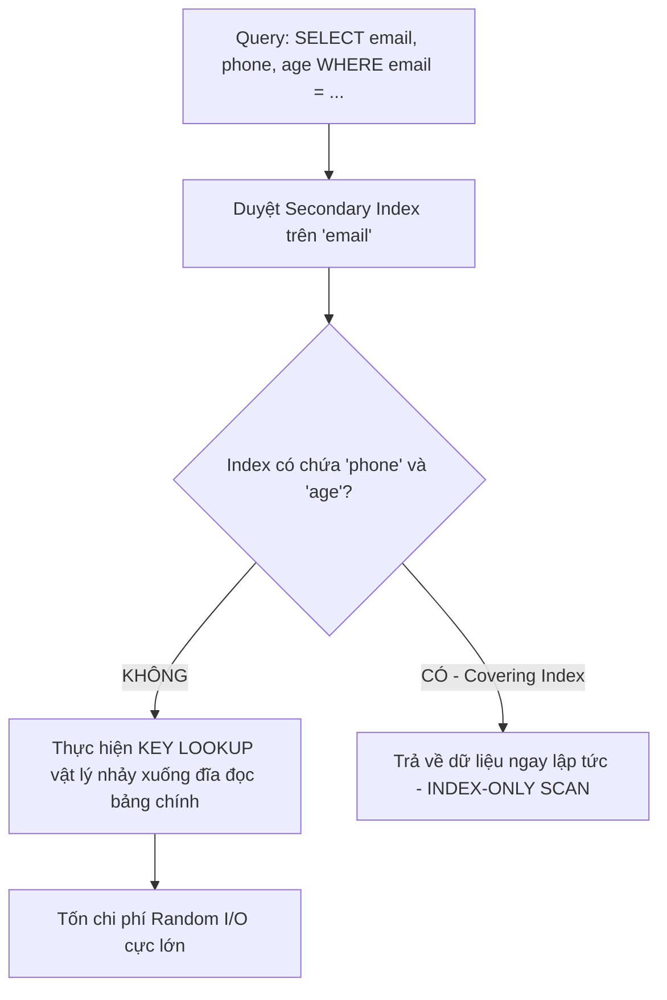

# Đỉnh cao tối ưu hóa hiệu năng SQL bằng Covering Index (Chỉ mục bao phủ)

## ⚡ Tóm tắt ngắn (30s)
**Covering Index (Chỉ mục bao phủ)** là một kỹ thuật tối ưu hóa SQL nâng cao, trong đó một Index chứa (bao phủ) toàn bộ các cột cần thiết để hoàn thành câu truy vấn — bao gồm các cột nằm trong mệnh đề `SELECT`, `WHERE`, `JOIN`, `ORDER BY`, và `GROUP BY`.

Bản chất thực chiến của Covering Index:
1.  **Loại bỏ hoàn toàn bước Key Lookup (RID Lookup)**: Khi một Index bao phủ toàn bộ các cột cần dùng, DBMS có thể lấy trực tiếp dữ liệu ngay trên cấu trúc của cây Index (gọi là **Index-Only Scan**) mà không cần thực hiện thêm bước nhảy xuống đĩa để đọc bảng dữ liệu gốc.
2.  **Triển khai bằng mệnh đề `INCLUDE`**: Trong PostgreSQL và SQL Server, ta sử dụng mệnh đề `INCLUDE` để đính kèm các cột chỉ dùng để hiển thị (`SELECT`) vào các **nút lá** của cây Index, giúp giữ kích thước các nút trung gian cực nhỏ gọn (duy trì Fan-out cao) mà vẫn đạt được hiệu quả bao phủ tuyệt đối.

---

## 🔍 Chi tiết bản chất thực chiến

### 1. Tại sao Key Lookup / RID Lookup lại là "kẻ sát nhân" hiệu năng?
Khi bạn truy vấn dữ liệu thông qua một Secondary Index (chỉ mục phụ), cây Index đó chỉ chứa khóa chỉ mục và một con trỏ (RowID hoặc Khóa chính). Nếu câu truy vấn của bạn yêu cầu thêm một cột không nằm trong Index, DBMS buộc phải làm hai bước:
*   **Bước 1**: Quét cây Index phụ để tìm các con trỏ RowID hợp lệ.
*   **Bước 2 (Key/RID Lookup)**: Sử dụng các con trỏ RowID này để nhảy xuống đĩa đọc các Page của bảng gốc nhằm lấy thêm các cột còn thiếu.



Vì các dòng dữ liệu cần tìm có thể nằm rải rác ở các Page vật lý khác nhau trên đĩa cứng, bước Key Lookup này sẽ phát sinh hàng loạt thao tác **Random Read (Đọc ngẫu nhiên đĩa)**. Khi traffic hệ thống tăng cao, hàng triệu thao tác Random Read này sẽ làm nghẽn băng thông ổ đĩa (I/O Bottleneck), khiến CPU quá tải ở trạng thái chờ I/O (I/O Wait).

### 2. Giải pháp tối ưu: Khái niệm Index-Only Scan
Với Covering Index, toàn bộ dữ liệu bạn cần đã nằm sẵn trên các nút lá của cây Index (vốn được sắp xếp tuần tự liên tục). DBMS chỉ việc thực hiện đọc tuần tự các Page của Index và trả thẳng dữ liệu về cho Client. Tốc độ truy xuất tăng lên từ 10 đến 100 lần vì loại bỏ được hoàn toàn chi phí nhảy đĩa vật lý của Key Lookup.

### 3. Nghệ thuật sử dụng mệnh đề `INCLUDE` (Postgres & SQL Server)
Thông thường, để bao phủ các cột, ta hay nghĩ đến việc tạo một Composite Index lớn chứa tất cả các cột đó. Tuy nhiên, việc đưa quá nhiều cột vào phần khóa của Index sẽ làm phình to các nút trung gian của cây B+ Tree, làm giảm hệ số phân nhánh (Fan-out), dẫn đến tăng chiều cao cây và tốn nhiều I/O đọc đĩa.

Để giải quyết bài toán này, các DBMS hiện đại cung cấp mệnh đề `INCLUDE`:
```sql
CREATE INDEX idx_user_email_inc ON users(email) INCLUDE (phone, age);
```
*   **Cột khóa (`email`)**: Được sắp xếp và nằm ở tất cả các tầng của cây Index (dùng để tìm kiếm nhanh trong `WHERE`).
*   **Cột đính kèm (`phone`, `age`)**: **Chỉ nằm ở các nút lá** của cây Index và không được sắp xếp. Chúng hoàn toàn không tham gia vào quá trình tìm kiếm điều hướng của cây, giữ cho kích thước nút trung gian cực kỳ gọn nhẹ nhưng vẫn sẵn sàng phục vụ dữ liệu trực tiếp tại nút lá để tránh Key Lookup.

---

## 💻 Code thực chiến: BAD vs GOOD trong thiết kế Index

### ❌ BAD: Viết `SELECT *` bừa bãi gây vỡ Covering Index và phát sinh Key Lookup
Lập chỉ mục phụ trên cột lọc nhưng câu lệnh truy vấn lại yêu cầu trả về toàn bộ các cột, ép hệ thống phải thực hiện Key Lookup đắt đỏ.

```sql
CREATE TABLE bad_accounts (
    id BIGINT GENERATED ALWAYS AS IDENTITY PRIMARY KEY,
    username VARCHAR(50) NOT NULL,
    email VARCHAR(100) NOT NULL,
    status VARCHAR(20) NOT NULL,
    balance DECIMAL(15,2) NOT NULL,
    last_login TIMESTAMP
);

-- Chỉ lập chỉ mục trên cột tìm kiếm
CREATE INDEX idx_acc_email ON bad_accounts(email);

-- Câu truy vấn thực tế của ứng dụng (chỉ cần lấy username và balance):
-- SELECT username, balance FROM bad_accounts WHERE email = 'ceo@tech.com';
-- DBMS duyệt idx_acc_email -> Tìm thấy RowID -> Phải nhảy xuống đĩa (Key Lookup) 
-- để lấy cột username và balance từ bảng chính.
```

###  GOOD: Tạo Covering Index bằng `INCLUDE` và SELECT chính xác cột cần dùng
Chỉ truy vấn chính xác các cột cần thiết, đồng thời sử dụng chỉ mục bao phủ đính kèm các cột hiển thị để đạt trạng thái Index-Only Scan hoàn hảo.

```sql
CREATE TABLE good_accounts (
    id BIGINT GENERATED ALWAYS AS IDENTITY PRIMARY KEY,
    username VARCHAR(50) NOT NULL,
    email VARCHAR(100) NOT NULL,
    status VARCHAR(20) NOT NULL,
    balance DECIMAL(15,2) NOT NULL,
    last_login TIMESTAMP
);

-- TẠO COVERING INDEX TỐI ƯU
-- email tham gia tìm kiếm, username và balance được đính kèm tại nút lá
CREATE INDEX idx_acc_email_covered 
ON good_accounts(email) 
INCLUDE (username, balance);

-- Câu truy vấn thực hiện Index-Only Scan tuyệt đối:
-- SELECT username, balance FROM good_accounts WHERE email = 'ceo@tech.com';
-- Toàn bộ thông tin email, username, balance được đọc trực tiếp từ cây Index.
-- Không có bất kỳ một thao tác nhảy đĩa vật lý (Key Lookup) nào xảy ra!
```

---

## 📊 Bảng so sánh hiệu năng vật lý

| Tiêu chí | Truy vấn thông thường (Có Key Lookup) | Truy vấn sử dụng Covering Index (Index-Only Scan) |
| :--- | :--- | :--- |
| **Lộ trình truy xuất** | Index Scan $\r\rightarrow$ Key Lookup $\r\rightarrow$ Data Page | **Chỉ quét duy nhất Index Page** |
| **Kiểu I/O ổ đĩa** | Đọc ngẫu nhiên đĩa (Random Read - rất tốn kém) | Đọc tuần tự đĩa (Sequential Read - rất nhanh) |
| **Hiện tượng nghẽn I/O khi chịu tải** | Dễ xảy ra nghẽn băng thông đĩa | Ổn định và cực kỳ tiết kiệm băng thông I/O |
| **Ảnh hưởng của câu lệnh `SELECT *`** | Không ảnh hưởng (vẫn phải Key Lookup) | **Phá vỡ hoàn toàn khả năng ăn Covering Index** |

---

## ⚠️ Common Gotchas & Questions follow-up

### 1. Cạm bẫy "Visibility Map" trong PostgreSQL đối với Index-Only Scan
*   **Vấn đề**: Đôi khi bạn chạy `EXPLAIN` một câu truy vấn có Covering Index trong PostgreSQL, nhưng kết quả vẫn hiển thị số lần đọc đĩa từ bảng gốc (`Heap Fetches`). Tại sao có Covering Index rồi mà Postgres vẫn phải đọc bảng chính?
*   **Cơ chế**: Do cơ chế kiểm soát đa phiên bản **MVCC** của PostgreSQL. Dữ liệu phiên bản dòng (Transaction ID) không được lưu trữ trong cây Index mà chỉ được lưu ở bảng chính (Heap). Để biết dòng dữ liệu trong Index có thực sự "hợp lệ/nhìn thấy" đối với Transaction hiện tại hay không, Postgres buộc phải kiểm tra bảng chính.
*   **Giải pháp**: PostgreSQL tối ưu bằng **Visibility Map** (Bản đồ hiển thị). Nếu một Page của bảng chính đã được xử lý bởi tiến trình **VACUUM** và xác nhận 100% dòng trong Page đó là cố định (không thay đổi), Postgres sẽ đánh dấu Page đó là "Fully Visible" trong Visibility Map. Khi quét Index, Postgres chỉ việc đọc Visibility Map trên RAM; nếu Page tương ứng là "Fully Visible", nó sẽ bỏ qua hoàn toàn bước Heap Fetch.
*   **Khuyên dùng thực chiến**: Đảm bảo tiến trình **Autovacuum** hoạt động tốt và định kỳ chạy bảo trì bảng đối với các bảng có tần suất ghi đọc cao để duy trì hiệu quả tối đa cho Index-Only Scan.

### 2. Câu hỏi đào sâu từ interviewer
*   **Q: Sự khác biệt cốt lõi giữa Composite Index `(A, B)` và Covering Index `A INCLUDE (B)` là gì? Khi nào nên dùng loại nào?**
    *   *Trả lời*: 
        *   **Composite Index `(A, B)`**: Cột `B` là một cột khóa. Dữ liệu trong index được sắp xếp theo cả `A` và `B`. Do đó, Index này có thể hỗ trợ các câu truy vấn lọc theo cả hai cột `WHERE A = ... AND B = ...` hoặc sắp xếp `ORDER BY A, B`. Nhược điểm: Cột `B` nằm ở tất cả các tầng của cây chỉ mục, làm phình to kích thước khóa trung gian.
        *   **Covering Index `A INCLUDE (B)`**: Cột `B` chỉ được đính kèm ở nút lá và không được sắp xếp. Index này **không thể** hỗ trợ lọc nhanh `WHERE B = ...` hay sắp xếp `ORDER BY A, B`. Nó chỉ dùng để lấy giá trị của `B` ra hiển thị khi tìm kiếm theo `A`. Ưu điểm: Cấu trúc cây trung gian cực kỳ gọn nhẹ, tối ưu hóa tốc độ tìm kiếm theo `A` và tiết kiệm bộ nhớ đệm RAM.
        *   **Khi nào dùng**: Nếu cột phụ `B` chỉ xuất hiện ở mệnh đề `SELECT` của câu truy vấn mà không tham gia lọc hoặc sắp xếp, hãy luôn ưu tiên sử dụng `INCLUDE` để tối ưu hóa tài nguyên.
