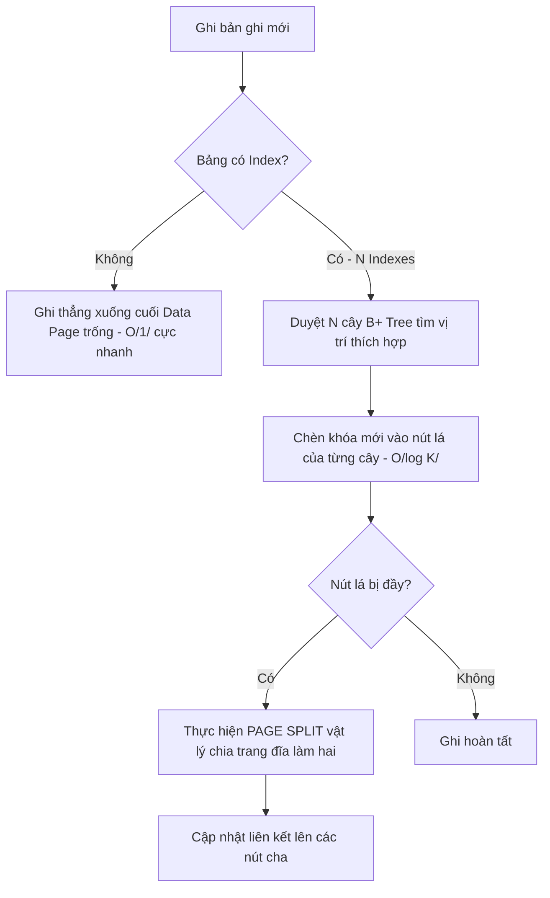

# Sự Thật Phũ Phàng: Khi Nào Index Biến Thành "Kẻ Phá Hoại" Hiệu Năng Hệ Thống?

## ⚡ Tóm tắt ngắn (30s)
Mặc dù **Index (Chỉ mục)** là vũ khí tối thượng để tăng tốc độ truy vấn (`SELECT`), nó không phải là "viên đạn bạc" miễn phí. Index hoạt động theo cơ chế đánh đổi tài nguyên: **mua tốc độ đọc bằng cái giá của tốc độ ghi, dung lượng đĩa và bộ nhớ RAM**.

Index sẽ làm chậm hoặc tổn hại hệ thống trong các trường hợp sau:
1.  **Hệ thống có tần suất ghi cao (Write-Heavy Systems)**: Mọi thao tác `INSERT`, `UPDATE`, `DELETE` đều bắt buộc hệ thống phải cập nhật, sắp xếp lại các nút trên cây B+ Tree của toàn bộ các Index liên quan, gây nghẽn I/O và lock contention.
2.  **Cột có độ chọn lọc thấp (Low Cardinality/Selectivity)**: Lập index trên các cột có quá ít giá trị phân biệt (ví dụ: `gender`, `order_status` chỉ có 2-3 trạng thái) sẽ vô tác dụng. Query Planner của DBMS thường sẽ bỏ qua index và thực hiện quét toàn bộ bảng (Sequential Scan) vì chi phí đọc ngẫu nhiên (Random I/O) từ Key Lookup lớn hơn rất nhiều.
3.  **Lạm dụng quá nhiều Index (Over-indexing)**: Làm phình to dung lượng cơ sở dữ liệu, chiếm dụng vùng đệm RAM (Buffer Pool / Shared Buffers), đẩy các trang dữ liệu thực tế (Data Pages) ra ngoài đĩa và làm giảm tỉ lệ Cache Hit.
4.  **Phân mảnh chỉ mục (Index Fragmentation)**: Do ghi dữ liệu không tuần tự (như dùng UUIDv4), gây ra hiện tượng chia tách trang (Page Split) liên tục trong cây B+ Tree.

---

## 🔍 Chi tiết bản chất thực chiến

### 1. Chi phí ghi vật lý và cơ chế Page Split của cây B+ Tree
Khi bạn chèn một dòng mới vào bảng không có index (Heap Table), DBMS chỉ việc ghi dòng đó vào cuối Page dữ liệu trống gần nhất - thao tác diễn ra cực nhanh với độ phức tạp $O(1)$. 
Tuy nhiên, nếu bảng có $N$ index, DBMS phải thực hiện tìm vị trí chính xác của khóa mới trên $N$ cây B+ Tree để chèn vào theo đúng thứ tự sắp xếp (độ phức tạp $O(\log K)$ cho mỗi cây).



Nếu trang đĩa (Page) chứa nút lá của cây B+ Tree đã đầy (kích thước mặc định thường là 8KB trong Postgres, 16KB trong MySQL InnoDB), DBMS sẽ phải thực hiện **Page Split (Chia tách trang)**:
*   Cấp phát một Page mới trên đĩa.
*   Di chuyển một nửa số khóa từ Page cũ sang Page mới.
*   Cập nhật con trỏ ở nút cha của cây.

Thao tác này tiêu tốn rất nhiều I/O đĩa, gây ra hiện tượng ghi đĩa ngẫu nhiên (Random Write) và khóa tài nguyên (Lock Contention) trên các Page liên quan, làm nghẽn toàn bộ các luồng ghi concurrent khác của ứng dụng.

### 2. Độ chọn lọc (Selectivity) và Lý thuyết Chi phí của Query Planner
**Độ chọn lọc (Selectivity)** của một cột được tính bằng công thức:
$$\text{Selectivity} = \frac{\text{Số lượng giá trị duy nhất (Cardinality)}}{\text{Tổng số dòng trong bảng}}$$

Giá trị Selectivity càng gần 1 thì index càng hiệu quả (ví dụ: `email`, `user_id`). Nếu Selectivity quá thấp (ví dụ dưới 20-30%), Query Planner của các RDBMS hiện đại sẽ tự động bỏ qua index vì lý do chi phí:
*   Nếu dùng Index: DBMS quét cây index $\r\rightarrow$ lấy RowID $\r\rightarrow$ thực hiện hàng ngàn thao tác **Random I/O** để nhảy xuống đĩa đọc bảng chính lấy các cột khác.
*   Nếu quét toàn bảng (Sequential Scan): DBMS đọc tuần tự các Page dữ liệu kế tiếp nhau trên đĩa (**Sequential I/O** - tốc độ đọc của SSD/HDD khi đọc tuần tự nhanh hơn gấp nhiều lần so với đọc ngẫu nhiên).

Do đó, tạo index trên các cột có độ chọn lọc thấp chỉ làm lãng phí dung lượng ghi mà không đem lại bất kỳ lợi ích đọc nào.

### 3. Áp lực lên RAM (Buffer Pool) và Cache Eviction
Hệ quản trị cơ sở dữ liệu giữ các Page dữ liệu và Page Index thường dùng trên vùng RAM đệm (như `innodb_buffer_pool_size` trong MySQL hoặc `shared_buffers` trong PostgreSQL).
Khi bạn có quá nhiều index, dung lượng index có thể vượt quá dung lượng RAM khả dụng. Lúc này:
*   Mỗi truy vấn tìm kiếm hoặc thao tác ghi buộc DBMS phải nạp các Page Index từ đĩa vào RAM.
*   Để giải phóng RAM, các Page dữ liệu thực tế (Data Pages) đang nằm trên RAM sẽ bị đẩy ra ngoài đĩa (Cache Eviction) theo thuật toán LRU.
*   Hậu quả: Hệ thống rơi vào trạng thái nghẽn băng thông đĩa liên tục (Disk Thrashing), CPU luôn ở mức cao do phải đợi nạp dữ liệu từ đĩa vật lý.

---

## 💻 Code thực chiến: BAD vs GOOD trong thiết kế Index

### ❌ BAD: Lạm dụng Index bừa bãi trên bảng E-commerce có tần suất ghi cao
Tạo index vô tội vạ trên mọi cột đơn lẻ, đặc biệt là các cột trạng thái có độ chọn lọc thấp hoặc các cột thường xuyên cập nhật.

```sql
CREATE TABLE bad_orders (
    order_id VARCHAR(64) PRIMARY KEY, -- Giả sử dùng UUIDv4 tạo ngẫu nhiên
    user_id BIGINT NOT NULL,
    payment_status VARCHAR(20) NOT NULL, -- Chỉ có 3 giá trị: PENDING, SUCCESS, FAILED
    shipping_status VARCHAR(20) NOT NULL, -- Chỉ có 4 giá trị: PREPARING, SHIPPING, DELIVERED, RETURNED
    total_amount DECIMAL(12,2) NOT NULL,
    created_at TIMESTAMP NOT NULL,
    updated_at TIMESTAMP NOT NULL
);

-- RÁC INDEX: Các chỉ mục đơn lẻ làm chậm tốc độ INSERT/UPDATE khủng khiếp
CREATE INDEX idx_bad_user_id ON bad_orders(user_id);
CREATE INDEX idx_bad_pay_status ON bad_orders(payment_status); -- SAI: Cardinality cực thấp!
CREATE INDEX idx_bad_ship_status ON bad_orders(shipping_status); -- SAI: Cardinality cực thấp!
CREATE INDEX idx_bad_total ON bad_orders(total_amount); -- Ít khi tìm kiếm độc lập theo số tiền chính xác
CREATE INDEX idx_bad_created ON bad_orders(created_at);
CREATE INDEX idx_bad_updated ON bad_orders(updated_at); -- SAI: Cột này cập nhật liên tục mỗi khi trạng thái đổi!
```

###  GOOD: Tối ưu hóa Index chọn lọc và tận dụng Partial Index (PostgreSQL)
Chỉ tạo các Index thực sự cần thiết dựa trên mẫu truy vấn (Query Pattern) và sử dụng chỉ mục một phần (Partial Index) để giảm kích thước lưu trữ.

```sql
CREATE TABLE good_orders (
    order_id BIGINT GENERATED ALWAYS AS IDENTITY PRIMARY KEY, -- Dùng Auto-increment để ghi tuần tự, tránh Page Split
    user_id BIGINT NOT NULL,
    payment_status VARCHAR(20) NOT NULL,
    shipping_status VARCHAR(20) NOT NULL,
    total_amount DECIMAL(12,2) NOT NULL,
    created_at TIMESTAMP NOT NULL,
    updated_at TIMESTAMP NOT NULL
);

-- 1. Composite Index phục vụ trực tiếp Query Pattern tìm đơn hàng của User sắp xếp theo thời gian
CREATE INDEX idx_good_user_created ON good_orders(user_id, created_at DESC);

-- 2. PARTIAL INDEX (Chỉ mục một phần): Thay vì index toàn bộ cột status,
-- ta chỉ index các đơn hàng đang ở trạng thái 'PENDING' để xử lý background job.
-- Kích thước index này cực nhỏ (chỉ chiếm ~1-5% dung lượng bảng) và không bị ảnh hưởng bởi các đơn hàng đã SUCCESS.
CREATE INDEX idx_good_pending_payment 
ON good_orders(created_at) 
WHERE payment_status = 'PENDING';
```

---

## 📊 Bảng so sánh tác động hiệu năng vật lý

| Tiêu chí | Bảng không có Index (Heap Table) | Bảng có Index phù hợp | Bảng bị lạm dụng Index (Over-indexed) |
| :--- | :--- | :--- | :--- |
| **Tốc độ INSERT (Ghi mới)** | $O(1)$ - Cực nhanh | $O(\log K)$ - Chậm hơn nhẹ | **Rất chậm** (Phải cập nhật hàng chục cây B+ Tree, dễ bị Page Split) |
| **Tốc độ UPDATE/DELETE** | Chậm (do phải quét bảng để tìm dòng cần sửa) | Cực nhanh (tìm dòng cần sửa qua Index) | **Chậm** (Phải tìm kiếm nhanh nhưng lại tốn chi phí cập nhật lại cây Index) |
| **Dung lượng lưu trữ đĩa** | Tối thiểu (chỉ chứa dữ liệu gốc) | Tăng nhẹ (~20-40% dung lượng bảng) | **Phình to kinh khủng** (Dung lượng index có thể gấp 2-3 lần dữ liệu gốc) |
| **Hiệu suất dùng RAM Cache** | Rất cao (RAM chỉ chứa Data Pages) | Cân bằng hoàn hảo | **Kém** (RAM bị chiếm phần lớn bởi các Page Index rác không dùng đến) |

---

## ⚠️ Common Gotchas & Questions follow-up

### 1. Làm sao để phát hiện và tiêu diệt các Index "chết" (Unused Indexes) trên Production?
*   **Vấn đề**: Trong quá trình phát triển dự án qua nhiều năm, nhiều index được tạo ra để phục vụ các tính năng cũ đã bị xóa bỏ, nhưng không ai dám xóa index vì sợ ảnh hưởng hệ thống.
*   **Giải pháp thực chiến**: Sử dụng các bảng thống kê hệ thống (System Catalogs) để tìm các chỉ mục có số lần quét (`idx_scan`) bằng 0 hoặc cực kỳ thấp so với số lần ghi (`idx_update`).
*   **PostgreSQL Script phát hiện Unused Indexes**:
    ```sql
    SELECT 
        schemaname,
        relname AS table_name,
        indexrelname AS index_name,
        pg_size_pretty(pg_relation_size(indexrelid)) AS index_size,
        idx_scan AS number_of_scans,
        idx_tup_read, idx_tup_fetch
    FROM pg_stat_user_indexes
    JOIN pg_index USING(indexrelid)
    WHERE idx_scan = 0 
      AND indisunique = false -- Bỏ qua các ràng buộc UNIQUE
    ORDER BY pg_relation_size(indexrelid) DESC;
    ```
*   **MySQL Script phát hiện Unused Indexes** (yêu cầu bật `performance_schema`):
    ```sql
    SELECT * FROM sys.schema_unused_indexes;
    ```
*   *Hành động thực chiến*: Thực hiện xóa các index này bằng lệnh `DROP INDEX CONCURRENTLY` (PostgreSQL) hoặc `DROP INDEX` để tránh việc lock toàn bộ bảng chính (Table Lock) trong lúc xóa.

### 2. Câu hỏi đào sâu từ interviewer
*   **Q: Tại sao dùng UUIDv4 làm khóa chính (Primary Key) lại là "ác mộng" đối với hiệu năng ghi của cơ sở dữ liệu quan hệ (như MySQL InnoDB)?**
    *   *Trả lời*: Khóa chính trong các DBMS như MySQL InnoDB là một **Clustered Index**, nghĩa là dữ liệu vật lý của các dòng được sắp xếp trực tiếp trên đĩa theo thứ tự của khóa chính.
    *   UUIDv4 được tạo ra hoàn toàn ngẫu nhiên và không có tính tuần tự (non-sequential). Khi chèn một dòng mới có UUID ngẫu nhiên, DBMS không thể chèn nó vào cuối bảng mà phải nhét nó vào một vị trí ngẫu nhiên ở giữa các Page đĩa đã tồn tại trên cây B+ Tree.
    *   Điều này liên tục kích hoạt cơ chế **Page Split vật lý**, phá vỡ tính tuần tự sắp xếp của ổ đĩa, làm rách nát cấu trúc cây chỉ mục (phân mảnh dữ liệu) và khiến hiệu năng ghi giảm dốc không phanh khi kích thước dữ liệu vượt quá dung lượng RAM đệm Buffer Pool.
    *   *Giải pháp*: Hãy sử dụng **UUIDv7** (có chứa timestamp ở phần đầu để đảm bảo tính tuần tự tăng dần) hoặc cơ chế phát sinh ID tuần tự như **Snowflake ID** hoặc **BIGINT Auto-increment**.
