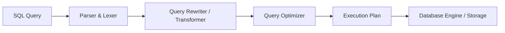

# Làm Chủ EXPLAIN PLAN: Con Mắt Thần Kỳ Để Phân Tích Và Cứu Cánh Slow Query

## ⚡ Tóm tắt ngắn (30s)
**EXPLAIN PLAN (Kế hoạch thực thi)** là bản thiết kế chi tiết do Bộ tối ưu hóa truy vấn (Query Optimizer) của hệ quản trị cơ sở dữ liệu (RDBMS) vạch ra, mô tả cách thức vật lý mà hệ thống sẽ sử dụng để tìm kiếm, lọc, và liên kết dữ liệu nhằm trả về kết quả cho một câu lệnh SQL.

Tác dụng cốt lõi của EXPLAIN PLAN:
1.  **Chẩn đoán Slow Query**: Cho biết chính xác lý do tại sao một câu truy vấn bị chậm (do quét toàn bảng Seq Scan, thiếu index, hay thuật toán join không phù hợp).
2.  **So sánh Ước tính vs Thực tế (EXPLAIN ANALYZE)**: Đo lường chi phí ước tính (Cost) và số dòng (Rows) so với thời gian chạy thực tế (Actual Time) và số lượng bản ghi thực tế được đọc trên ổ đĩa.
3.  **Tối ưu hóa chiến lược**: Giúp kỹ sư đưa ra quyết định chính xác về việc tạo Index, viết lại câu truy vấn (Query Refactoring), hay cập nhật số liệu thống kê (Database Statistics).

---

## 🔍 Chi tiết bản chất thực chiến

### 1. Vòng đời của một câu lệnh SQL và vị trí của Optimizer
SQL là ngôn ngữ khai báo (**Declarative Language**) — bạn chỉ định nghĩa *Bạn muốn lấy dữ liệu gì* chứ không chỉ định *Hệ thống phải tìm nó như thế nào*. 
Để thực thi, DBMS phải đưa câu lệnh qua các bước:



Bộ phận quan trọng nhất là **Query Optimizer**. Nó dựa vào **Database Statistics** (thông tin về phân phối dữ liệu, số dòng, kích thước trang lưu trữ trên đĩa RAM) để tính toán chi phí (Cost Model) của hàng ngàn phương án thực thi khả thi và chọn ra phương án có **Cost thấp nhất** để chạy. Lệnh `EXPLAIN` chính là công cụ hiển thị phương án được chọn này.

### 2. Cách giải mã các thông số cốt lõi trong EXPLAIN PLAN
Một dòng EXPLAIN cơ bản trong PostgreSQL có dạng:
```text
Index Scan using idx_users_email on users  (cost=0.43..8.45 rows=1 width=128) (actual time=0.015..0.017 rows=1 loops=1)
```

*   **`cost=0.43..8.45`**: 
    *   `0.43` (Start-up cost): Chi phí ước tính để chuẩn bị tài nguyên trước khi dòng dữ liệu đầu tiên được trả ra.
    *   `8.45` (Total cost): Tổng chi phí ước tính để hoàn thành toàn bộ phép toán này. Đơn vị cost là trừu tượng, dựa trên số trang đĩa cần đọc và chi phí tính toán CPU.
*   **`rows=1`**: Số lượng dòng ước tính mà phép toán này sẽ trả ra (dựa trên statistics).
*   **`width=128`**: Kích thước trung bình (tính bằng byte) của một dòng dữ liệu trả ra.
*   **`actual time=0.015..0.017`** (Chỉ xuất hiện khi dùng kèm `ANALYZE`): Thời gian thực thi thực tế (tính bằng mili-giây) từ lúc bắt đầu đến lúc hoàn thành phép toán.
*   **`rows=1 loops=1`**: Số dòng thực tế trả về là 1, và phép toán này được chạy lặp lại đúng 1 lần.

### 3. Phân biệt các kiểu truy xuất vật lý (Scan Types)
*   **Seq Scan (Sequential Scan / Table Scan)**: Đọc tuần tự toàn bộ các trang dữ liệu của bảng từ đầu đến cuối. Phù hợp khi cần lấy phần lớn dữ liệu của bảng hoặc bảng quá nhỏ.
*   **Index Scan**: Duyệt qua cây Index để tìm RowID, sau đó nhảy xuống đĩa để đọc trang dữ liệu tương ứng trong bảng chính nhằm lấy các cột khác. Rất nhanh đối với lượng dòng kết quả nhỏ, nhưng tốn chi phí Random I/O nếu số dòng tăng lên.
*   **Index Only Scan**: Quét trực tiếp trên cây Index và trả về dữ liệu ngay lập tức mà không cần chạm vào bảng chính (yêu cầu dùng **Covering Index**). Tốc độ nhanh nhất.
*   **Bitmap Index Scan / Bitmap Heap Scan**:
    *   *Bitmap Index Scan*: Quét index và tạo ra một bản đồ bit (bitmap) đánh dấu các trang dữ liệu chứa dòng thỏa mãn điều kiện.
    *   *Bitmap Heap Scan*: Đọc tuần tự các trang dữ liệu được đánh dấu trong bitmap. Kỹ thuật này biến Random I/O của Index Scan thành Sequential I/O, cực kỳ hiệu quả khi cần lấy số lượng dòng ở mức trung bình.

### 4. Giải mã các thuật toán liên kết bảng (Join Operators)
Khi bạn thực hiện JOIN hai bảng (bảng ngoài Outer Table và bảng trong Inner Table), Optimizer sẽ chọn một trong ba cơ chế join vật lý sau:
*   **Nested Loop (Vòng lặp lồng nhau)**: Với mỗi dòng ở bảng Outer, DBMS duyệt qua bảng Inner để tìm dòng khớp điều kiện. Phù hợp khi bảng Outer nhỏ và cột join ở bảng Inner có Index.
*   **Hash Join (Liên kết băm)**: DBMS quét bảng nhỏ hơn, build một bảng băm (Hash Table) trên RAM dựa trên khóa join. Sau đó quét bảng lớn hơn, băm khóa join của từng dòng và tra cứu nhanh trong Hash Table. Cực kỳ hiệu quả cho tập dữ liệu lớn và không cần sắp xếp.
*   **Merge Join (Liên kết hợp nhất)**: Cả hai bảng đều được sắp xếp theo khóa join (hoặc đọc qua index đã sắp xếp). DBMS tiến hành duyệt song song cả hai bảng và ghép nối các dòng khớp nhau. Thích hợp cho các bảng rất lớn đã được index sắp xếp sẵn.

---

## 💻 Code thực chiến: BAD vs GOOD trong phân tích Slow Query

### ❌ BAD: Câu truy vấn Seq Scan trên bảng 2 triệu bản ghi
Chúng ta thực hiện truy vấn lọc theo cột `last_name` chưa được đánh chỉ mục.

```sql
-- TRUY VẤN THỰC TẾ:
SELECT id, first_name, email FROM customers WHERE last_name = 'Nguyen';

-- CHẠY EXPLAIN ANALYZE:
EXPLAIN ANALYZE SELECT id, first_name, email FROM customers WHERE last_name = 'Nguyen';

-- KẾT QUẢ EXPLAIN PLAN TRẢ VỀ:
-- Gather  (cost=1000.00..35240.15 rows=4850 width=45) (actual time=0.320..185.450 rows=5120 loops=1)
--   Workers Planned: 2
--   Workers Launched: 2
--   ->  Parallel Seq Scan on customers  (cost=0.00..33755.15 rows=2021 width=45) (actual time=0.045..172.110 rows=1707 loops=3)
--         Filter: ((last_name)::text = 'Nguyen'::text)
--         Rows Removed by Filter: 664960
-- Planning Time: 0.180 ms
-- Execution Time: 187.210 ms
```
*   **Phân tích lỗi**: DBMS buộc phải chạy **Parallel Seq Scan** (Quét tuần tự song song bằng cách chia cho 2 Worker phụ). Nó đã phải đọc toàn bộ bảng dữ liệu vật lý và loại bỏ `664,960` dòng không khớp điều kiện (`Rows Removed by Filter`). Thời gian chạy lên tới **187ms** - một con số cực lớn trên Production với traffic cao.

###  GOOD: Tối ưu hóa bằng Index và đạt trạng thái Index Scan cực tốc
Tạo index trên cột lọc `last_name` để giúp Optimizer tìm kiếm nhanh chóng trên cây chỉ mục.

```sql
-- TẠO INDEX:
CREATE INDEX idx_customers_last_name ON customers(last_name);

-- CHẠY LẠI EXPLAIN ANALYZE:
EXPLAIN ANALYZE SELECT id, first_name, email FROM customers WHERE last_name = 'Nguyen';

-- KẾT QUẢ EXPLAIN PLAN MỚI:
-- Index Scan using idx_customers_last_name on customers  (cost=0.42..234.15 rows=4850 width=45) (actual time=0.012..4.250 rows=5120 loops=1)
--   Index Cond: ((last_name)::text = 'Nguyen'::text)
-- Planning Time: 0.115 ms
-- Execution Time: 4.820 ms
```
*   **Phân tích cải tiến**: Optimizer đã lập tức chuyển sang dùng **Index Scan** thông qua chỉ mục `idx_customers_last_name` vừa tạo. Nó điều hướng thẳng đến các nút lá chứa giá trị `'Nguyen'` và chỉ thực hiện các thao tác nhảy đĩa tối thiểu. Thời gian thực thi giảm từ **187ms xuống còn 4.8ms** (tốc độ tăng gấp ~39 lần!).

---

## 📊 Bảng đối chiếu các Scan Operators

| Toán tử thực thi | Điều kiện kích hoạt | Cơ chế I/O | Phù hợp với | Ưu điểm | Nhược điểm |
| :--- | :--- | :--- | :--- | :--- | :--- |
| **Seq Scan** | Cột không có index, hoặc cần lấy trên 30% dữ liệu | Sequential I/O (Đọc tuần tự) | Truy vấn báo cáo lớn, bảng rất nhỏ | Đọc tuần tự cực nhanh trên SSD | Tốc độ tỷ lệ thuận với kích thước bảng |
| **Index Scan** | Cột có index, lượng dòng kết quả cần lấy nhỏ | Random I/O (Đọc ngẫu nhiên) | Lọc điểm (Point Query), lấy ít dòng | Chỉ đọc chính xác các trang dữ liệu cần | Gây nghẽn nếu số lượng dòng cần lấy lớn |
| **Index Only Scan** | Cột lọc và cột hiển thị đều nằm trong index | Sequential/Random Index Pages | Lấy các cột nằm trọn trong Covering Index | Loại bỏ hoàn toàn bước Key Lookup đắt đỏ | Bị ảnh hưởng nếu Visibility Map bị lỗi thời |
| **Bitmap Scan** | Cột có index, lượng dòng kết quả ở mức trung bình | Hỗn hợp (Quét Index -> Tạo Bitmap -> Quét dữ liệu tuần tự) | Truy vấn phức tạp có nhiều điều kiện `AND`/`OR` | Giảm thiểu tối đa chi phí đọc đĩa ngẫu nhiên | Tốn RAM để duy trì Bitmap trong bộ nhớ |

---

## ⚠️ Common Gotchas & Questions follow-up

### 1. Cạm bẫy "Stale Statistics" (Số liệu thống kê bị lỗi thời)
*   **Hiện tượng**: Bạn đã tạo Index đầy đủ, cấu hình chuẩn, nhưng chạy `EXPLAIN` thấy DBMS vẫn kiên quyết dùng Seq Scan và câu truy vấn rất chậm.
*   **Nguyên nhân sâu xa**: Số liệu thống kê dữ liệu (`Statistics`) được lưu trữ trong DBMS đang bị lỗi thời. Ví dụ, bảng của bạn vừa được import thêm 10 triệu dòng dữ liệu mới, nhưng hệ thống thống kê tự động chưa chạy lại. DBMS vẫn nghĩ bảng chỉ có 100 dòng, nên nó cho rằng quét tuần tự Seq Scan sẽ rẻ hơn dùng Index.
*   **Giải pháp**: Bạn cần ép DBMS tính toán lại số liệu thống kê bằng lệnh:
    *   **PostgreSQL**: `ANALYZE table_name;` (hoặc `VACUUM ANALYZE table_name;`)
    *   **MySQL**: `ANALYZE TABLE table_name;`
*   *Hành động thực chiến*: Hãy định kỳ kiểm tra các tham số tự động dọn dẹp và thu thập số liệu thống kê như `autovacuum` trong PostgreSQL để đảm bảo Query Planner luôn đưa ra quyết định dựa trên dữ liệu thực tế chính xác nhất.

### 2. Câu hỏi đào sâu từ interviewer
*   **Q: Tại sao tuyệt đối KHÔNG ĐƯỢC chạy lệnh `EXPLAIN ANALYZE` bừa bãi trực tiếp trên cơ sở dữ liệu Production đối với các câu lệnh ghi (`INSERT`, `UPDATE`, `DELETE`)? Bạn sẽ giải quyết thế nào nếu buộc phải phân tích chúng?**
    *   *Trả lời*: 
        *   Sự khác biệt cốt lõi là lệnh `EXPLAIN` đơn thuần chỉ chạy ở mức lập kế hoạch (chỉ hỏi Optimizer sẽ chạy thế nào mà không thực thi truy vấn).
        *   Còn lệnh `EXPLAIN ANALYZE` (hoặc `EXPLAIN` trong MySQL có thực thi) sẽ **thực sự chạy câu truy vấn đó dưới cơ sở dữ liệu** để đo đạc thời gian thực tế.
        *   Nếu bạn chạy `EXPLAIN ANALYZE DELETE FROM orders WHERE status = 'CANCELLED';` trên Production, lệnh này sẽ **thực sự xóa sạch dữ liệu** của bạn khỏi database!
        *   *Cách xử lý an toàn*: Ta phải bọc câu lệnh trong một Database Transaction và thực hiện **Rollback** ngay sau khi lấy được kết quả EXPLAIN:
            ```sql
            BEGIN;
            EXPLAIN ANALYZE DELETE FROM orders WHERE status = 'CANCELLED';
            ROLLBACK; -- Đảm bảo dữ liệu không bị thay đổi vật lý!
            ```
