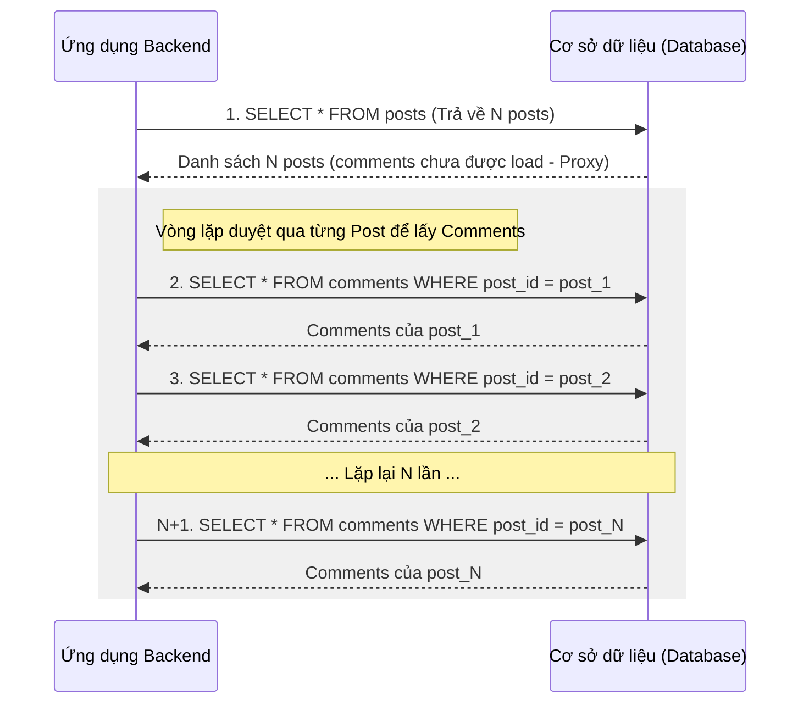

# Giải Mã N+1 Query Problem: Kẻ Sát Nhân Thầm Lặng Trong Hibernate/JPA Và Cách Diệt Tận Gốc

## ⚡ Tóm tắt ngắn (30s)
**N+1 Query Problem** là một lỗi hiệu năng kinh điển khi sử dụng các công cụ ORM (như Hibernate, JPA, Entity Framework). Hiện tượng này xảy ra khi ứng dụng thực hiện **1 truy vấn** ban đầu để lấy danh sách $N$ đối tượng cha (ví dụ: Orders), sau đó tiếp tục thực hiện **$N$ truy vấn riêng lẻ** tiếp theo để lấy thông tin các đối tượng con liên quan của từng cha (ví dụ: Order Items).

Hậu quả: Ứng dụng phải thực hiện tổng cộng **$N+1$ lần giao tiếp mạng (network roundtrip) với database**, gây trễ (latency) cực kỳ lớn và dễ làm sập database khi lượng người dùng tăng cao.

Giải pháp triệt để bao gồm:
1.  Sử dụng **`JOIN FETCH`** trong câu lệnh JPQL/HQL.
2.  Sử dụng **`@EntityGraph`** của Spring Data JPA.
3.  Sử dụng **`@BatchSize`** hoặc cấu hình `default_batch_fetch_size` của Hibernate để gom nhóm lazy loading.
4.  Sử dụng **DTO Projection** (truy vấn trực tiếp ra DTO thay vì nạp Entity).

---

## 🔍 Chi tiết bản chất thực chiến

### 1. Tại sao cơ chế Lazy Loading vô tình gây ra N+1?
Mặc định trong JPA, các mối quan hệ "một-nhiều" (`@OneToMany`) hoặc "nhiều-nhiều" (`@ManyToMany`) được cấu hình mặc định là **Lazy Loading** (tải lười). 
*   Khi bạn truy vấn thực thể cha (ví dụ: `Post`), Hibernate chỉ lấy dữ liệu của bảng cha và gán cho thuộc tính danh sách con (`List<Comment>`) một đối tượng đại diện giả lập (**Lazy Proxy**).
*   Khi bạn thực hiện duyệt qua danh sách cha và truy cập vào danh sách con (ví dụ: gọi `post.getComments().size()` hoặc khi thư viện Jackson tiến hành serialize thực thể thành JSON để trả về cho Client), Hibernate bắt buộc phải kích hoạt proxy này bằng cách tạo ra các câu lệnh SQL `SELECT` đơn lẻ để lấy dữ liệu con từ đĩa.



### 2. Cạm bẫy Eager Loading: Sự hiểu lầm tai hại
Nhiều lập trình viên nghĩ rằng chỉ cần đổi cấu hình sang `FetchType.EAGER` (tải ngay lập tức) là giải quyết được vấn đề. **Đây là một sai lầm chết người!**
*   Khi bạn chạy một câu lệnh JPQL như `SELECT p FROM Post p`, Hibernate sẽ thực thi câu lệnh SQL đầu tiên để lấy toàn bộ danh sách Post.
*   Ngay sau đó, vì thuộc tính `comments` được cấu hình là `EAGER`, Hibernate nhận ra nó buộc phải điền đầy dữ liệu này ngay lập tức. Hệ thống sẽ ngay lập tức tự động chạy $N$ câu lệnh truy vấn con tiếp theo để lấy Comments cho từng Post *trước khi* trả kết quả về cho code của bạn.
*   **Hậu quả**: Bạn vẫn chịu hoàn toàn $N+1$ câu truy vấn, chỉ khác là nó xảy ra tự động bên trong ORM và bạn hoàn toàn không có cơ hội trì hoãn (Lazy) việc tải dữ liệu con khi không cần dùng đến.

---

## 💻 Code thực chiến: BAD vs GOOD trong JPA/Hibernate

### ❌ BAD: Dẫn tới N+1 truy vấn khi trả dữ liệu API
Thực thể `Post` liên kết với nhiều `Comment`. Controller duyệt danh sách để hiển thị, kích hoạt N+1 query.

```java
// Entity định nghĩa quan hệ
@Entity
public class Post {
    @Id
    @GeneratedValue(strategy = GenerationType.IDENTITY)
    private Long id;
    private String title;

    @OneToMany(mappedBy = "post", fetch = FetchType.LAZY)
    private List<Comment> comments = new ArrayList<>();
}

// Repository thông thường
public interface PostRepository extends JpaRepository<Post, Long> {}

// Service duyệt danh sách
@Service
public class PostService {
    @Autowired private PostRepository postRepository;

    @Transactional(readOnly = true)
    public List<PostResponse> getAllPosts() {
        List<Post> posts = postRepository.findAll(); // SQL 1: SELECT * FROM post;
        
        return posts.stream().map(post -> {
            // LỖI N+1 XẢY RA Ở ĐÂY:
            // Mỗi vòng lặp sẽ sinh thêm 1 SQL: SELECT * FROM comment WHERE post_id = ?
            int commentCount = post.getComments().size(); 
            return new PostResponse(post.getId(), post.getTitle(), commentCount);
        }).collect(Collectors.toList());
    }
}
```

###  GOOD: Giải pháp 1 - Sử dụng `JOIN FETCH` trong JPQL
Sử dụng mệnh đề `JOIN FETCH` để chỉ định Hibernate thực hiện duy nhất **một** câu lệnh SQL kết hợp `LEFT JOIN` lấy cả cha lẫn con trong một nốt nhạc.

```java
public interface PostRepository extends JpaRepository<Post, Long> {
    
    @Query("SELECT p FROM Post p LEFT JOIN FETCH p.comments")
    List<Post> findAllWithCommentsFetch();
}

// SQL thực tế do Hibernate sinh ra (Chỉ 1 truy vấn duy nhất!):
// SELECT p.id, p.title, c.id, c.content, c.post_id 
// FROM post p 
// LEFT OUTER JOIN comment c ON p.id = c.post_id;
```

###  GOOD: Giải pháp 2 - Sử dụng `@EntityGraph` của Spring Data JPA
Một giải pháp declarative cực kỳ trực quan và thanh lịch giúp tùy biến chiến lược nạp dữ liệu ad-hoc cho từng Repository Method mà không cần viết SQL/JPQL thủ công.

```java
public interface PostRepository extends JpaRepository<Post, Long> {
    
    @EntityGraph(attributePaths = {"comments"})
    @Query("SELECT p FROM Post p")
    List<Post> findAllWithCommentsEntityGraph();
}
```

###  GOOD: Giải pháp 3 - Sử dụng `@BatchSize` để gom nhóm Lazy Loading
Trong các trường hợp dữ liệu quá lớn, việc sử dụng `LEFT JOIN FETCH` có thể tạo ra một kết quả tích Descartes (Cartesian Product) khổng lồ gây tốn RAM. Ta có thể cấu hình Hibernate nạp dữ liệu con theo từng Lô (Batch) bằng `@BatchSize`.

```java
@Entity
public class Post {
    @Id
    private Long id;
    private String title;

    @OneToMany(mappedBy = "post", fetch = FetchType.LAZY)
    @BatchSize(size = 20) -- Gom 20 thực thể cha để nạp con trong một truy vấn IN (?, ?, ...)
    private List<Comment> comments = new ArrayList<>();
}
```
*   *Cách thức hoạt động*: Khi duyệt qua phần tử đầu tiên, Hibernate sẽ tự động nạp comments cho 20 Posts cùng một lúc bằng lệnh: `SELECT * FROM comment WHERE post_id IN (1, 2, ..., 20);`. 
*   Số lượng truy vấn lúc này giảm từ $N+1$ xuống còn chỉ còn $\lceil N/20 \rceil + 1$ truy vấn!

---

## 📊 Bảng so sánh các giải pháp giải quyết N+1

| Giải pháp | Cơ chế vật lý SQL | Số lượng truy vấn | Ưu điểm | Nhược điểm |
| :--- | :--- | :--- | :--- | :--- |
| **Mặc định (Lazy)** | `SELECT * FROM parent` $\rightarrow$ $N$ câu `SELECT * FROM child` | $N+1$ | Cực kỳ nhẹ khi không cần chạm tới dữ liệu con | Hiệu năng tệ nhất nếu cần đọc dữ liệu con |
| **JOIN FETCH** | `SELECT ... LEFT OUTER JOIN` | **1** | Cực nhanh, lấy toàn bộ dữ liệu trong 1 vòng mạng | Có thể sinh tích Descartes gây phình to bộ nhớ |
| **@EntityGraph** | `SELECT ... LEFT OUTER JOIN` | **1** | Thanh lịch, declarative, linh hoạt cho từng method | Giống JOIN FETCH, có thể tạo tích Descartes |
| **Batch Fetching** | `SELECT ... WHERE parent_id IN (?, ?, ...)` | $1 + \lceil N/\text{BatchSize} \rceil$ | Tránh được tích Descartes, phù hợp phân trang (Paging) | Vẫn tốn nhiều hơn 1 roundtrip mạng |
| **DTO Projection** | `SELECT parent.cols, (count child) FROM ...` | **1** | Tối ưu tuyệt đối lượng băng thông mạng và RAM | Code dài dòng hơn, mất đi tính linh hoạt của Entity |

---

## ⚠️ Common Gotchas & Questions follow-up

### 1. Cơn ác mộng `MultipleBagFetchException` trong Hibernate
*   **Vấn đề**: Bạn muốn tối ưu hóa triệt để và viết JPQL để nạp đồng thời hai collection con khác nhau bằng `JOIN FETCH`:
    ```java
    @Query("SELECT u FROM User u LEFT JOIN FETCH u.roles LEFT JOIN FETCH u.addresses")
    List<User> findAllUsersWithRolesAndAddresses();
    ```
    Hệ thống lập tức sập nguồn với lỗi: `org.hibernate.loader.MultipleBagFetchException: cannot simultaneously fetch multiple bags`.
*   **Nguyên nhân**: Trong Java, `List` không có thứ tự và cho phép phần tử trùng lặp được Hibernate gọi là **Bag**. Khi bạn thực hiện hai câu lệnh `LEFT JOIN FETCH` song song trên hai danh sách này, SQL sẽ trả về kết quả tích Descartes chéo cực kỳ khổng lồ (ví dụ: User có 3 roles và 4 addresses sẽ sinh ra $3 \times 4 = 12$ dòng kết quả cho 1 User đơn lẻ). Hibernate từ chối xử lý vì nó không thể phân biệt dữ liệu trùng lặp nào thuộc về thuộc tính nào để phục hồi (hydrate) đúng đối tượng Java, đồng thời để bảo vệ bộ nhớ RAM hệ thống không bị tràn.
*   **Cách giải quyết chuẩn Senior**:
    1.  **Dùng Set thay vì List**: Đổi kiểu dữ liệu của một hoặc cả hai Collection từ `List<T>` thành `Set<T>` (ví dụ: `Set<Role>`). Set không cho trùng lặp giúp Hibernate giải quyết được bài toán. (Lưu ý: Cách này vẫn tạo ra tích Descartes lớn dưới database, chỉ là tránh được Exception).
    2.  **Giải pháp tối ưu kết hợp**: Chỉ dùng `JOIN FETCH` cho **một** mối quan hệ quan trọng nhất, các quan hệ còn lại sử dụng cấu hình `@BatchSize` (hoặc cấu hình global `spring.jpa.properties.hibernate.default_batch_fetch_size=50` trong file `application.properties`). Cách này giúp hệ thống hoạt động mượt mà, tránh tích Descartes và cực kỳ tối ưu RAM.

### 2. Câu hỏi đào sâu từ interviewer
*   **Q: Làm thế nào để bạn tự động phát hiện và kiểm thử lỗi N+1 Query trong môi trường CI/CD (Testing Pipeline) trước khi code được merge lên production?**
    *   *Trả lời*: 
        *   *Cách thủ công*: Bật hiển thị SQL log bằng `spring.jpa.properties.hibernate.show_sql=true` và quan sát log khi chạy thử. Tuy nhiên cách này bất khả thi khi dự án lớn.
        *   *Cách tự động thực chiến*: Ta sử dụng thư viện **QuickPerf** hoặc viết một **Custom SQL Statement Inspector** tích hợp vào JUnit Test.
        *   Với thư viện **QuickPerf** (dành cho Java), ta có thể viết unit test và đánh dấu annotation để test tự động fail nếu phát hiện số câu truy vấn vượt quá giới hạn mong đợi:
            ```java
            @Test
            @ExpectSelect(1) -- Mong đợi chỉ chạy duy nhất 1 câu SQL SELECT
            public void testGetAllPostsWithoutNPlusOne() {
                postService.getAllPosts();
            }
            ```
        *   Nếu có bất kỳ lỗi N+1 nào làm số lượng câu SELECT tăng lên $> 1$, test case sẽ fail ngay lập tức trong quá trình chạy CI/CD Build pipeline, ngăn chặn triệt để code lỗi đẩy lên Production.
