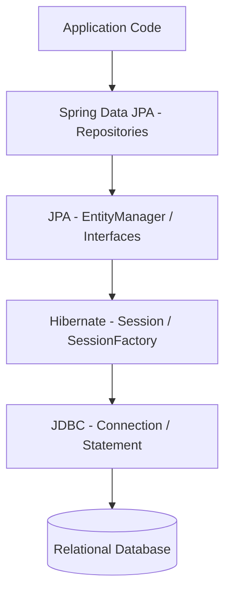

# JPA là gì? Hibernate là gì? Phân biệt Specification và Implementation

## ⚡ Tóm tắt ngắn (30s)
*   **JPA (Java Persistence API)** là **Specification (Thông số kỹ thuật/Chuẩn)**. Nó chỉ là một tập hợp các giao diện (Interfaces), quy tắc, và chú thích (Annotations) do Oracle/Jakarta định nghĩa nhằm chuẩn hóa cách thức ánh xạ đối tượng vào cơ sở dữ liệu quan hệ (ORM) trong Java. JPA không chứa bất kỳ dòng code thực thi logic nào.
*   **Hibernate** là **Implementation (Bộ thực thi)**. Đây là một thư viện ORM cụ thể hiện thực hóa toàn bộ các interface của JPA, đồng thời cung cấp thêm nhiều tính năng mở rộng độc quyền (như caching nâng cao, dirty checking tinh vi, generator tùy biến).
*   **Spring Data JPA** không phải là JPA cũng không phải Hibernate. Nó là một **Abstraction Layer (Lớp trừu tượng)** nằm trên cùng, giúp đơn giản hóa việc thao tác với cơ sở dữ liệu thông qua cơ chế tự động sinh câu lệnh từ tên hàm (Repository pattern) và giảm boilerplate code.

---

## 🔍 Chi tiết bản chất thực chiến

### 1. Mối quan hệ kiến trúc giữa Spring Data JPA, JPA, Hibernate và JDBC

Để hiểu rõ cách thức hoạt động vật lý, chúng ta cần nhìn vào sơ đồ phân lớp kiến trúc khi một câu lệnh được thực thi từ ứng dụng Java xuống Database:



*   **Lớp Application**: Gọi phương thức của Spring Data Repository (ví dụ: `userRepository.findById(1L)`).
*   **Lớp Spring Data JPA**: Dịch lời gọi hàm đó thành truy vấn JPA tiêu chuẩn thông qua `EntityManager`.
*   **Lớp JPA (Specification)**: Cung cấp API chuẩn (`jakarta.persistence.EntityManager`).
*   **Lớp Hibernate (Implementation)**: Engine thực tế nhận chỉ thị từ `EntityManager` (thực chất `EntityManager` của Hibernate bọc ngoài lớp `Session` vật lý), sinh ra các câu lệnh SQL tối ưu.
*   **Lớp JDBC**: Lớp giao tiếp cấp thấp của Java nhận SQL từ Hibernate, thiết lập kết nối socket TCP vật lý đến DB và nhận về ResultSet thô, sau đó Hibernate ánh xạ ngược lại thành đối tượng Java (Mapping).

### 2. Sự đánh đổi khi dùng ORM (Object-Relational Mapping)
Sử dụng ORM mang lại tốc độ phát triển dự án cực nhanh nhưng đi kèm những cái giá đắt đỏ:
*   **Điểm cộng (Pros)**: Độc lập với hệ quản trị cơ sở dữ liệu (Database Independence - dễ dàng switch từ MySQL sang PostgreSQL nhờ cấu hình Dialect), giảm thiểu tối đa mã SQL viết tay, tự động hóa ánh xạ dữ liệu phức tạp (Inheritance, Associations).
*   **Điểm trừ (Cons)**: Mất kiểm soát SQL vật lý (Hibernate tự động sinh SQL đôi khi không tối ưu, dẫn đến quét thừa cột hoặc N+1 query), tiêu tốn nhiều bộ nhớ RAM do phải duy trì Persistence Context (First-level Cache) để quản lý vòng đời đối tượng.

---

## 💻 Code thực chiến: BAD vs GOOD trong thiết kế ứng dụng

### ❌ BAD: Ghép cứng (Tight Coupling) mã nguồn vào thư viện Hibernate cụ thể
Sử dụng trực tiếp các class/interface của Hibernate trong mã nguồn nghiệp vụ. Điều này vi phạm nguyên lý SOLID (Dependency Inversion) và khiến hệ thống không thể kiểm thử hoặc thay đổi nhà cung cấp ORM khác khi cần thiết.

```java
import org.hibernate.Session;
import org.hibernate.SessionFactory;
import org.hibernate.Transaction;
import org.hibernate.cfg.Configuration;

@Service
public class UserService {
    // Anti-pattern: Ghép cứng vào SessionFactory cụ thể của Hibernate
    private final SessionFactory sessionFactory;

    public UserService() {
        this.sessionFactory = new Configuration().configure().buildSessionFactory();
    }

    public User getUserById(Long id) {
        // Mở Session thủ công và quản lý transaction mức thấp
        try (Session session = sessionFactory.openSession()) {
            Transaction tx = session.beginTransaction();
            User user = session.get(User.class, id); // Hibernate-specific method
            tx.commit();
            return user;
        }
    }
}
```

###  GOOD: Sử dụng tiêu chuẩn JPA trừu tượng qua Spring Data JPA
Sử dụng hoàn toàn các chú thích chuẩn của `jakarta.persistence` và tận dụng Spring Data JPA Repositories để tự động hóa hạ tầng. Hibernate chỉ đóng vai trò là engine chạy ngầm dưới nền.

```java
import jakarta.persistence.Entity;
import jakarta.persistence.Id;
import jakarta.persistence.Table;
import org.springframework.data.jpa.repository.JpaRepository;
import org.springframework.stereotype.Repository;
import org.springframework.stereotype.Service;
import org.springframework.transaction.annotation.Transactional;

// 1. Định nghĩa Entity bằng Annotation tiêu chuẩn của JPA (Jakarta)
@Entity
@Table(name = "users")
public class User {
    @Id
    private Long id;
    private String name;
    // Getters, Setters, Constructors
}

// 2. Định nghĩa Interface Repository kế thừa JpaRepository của Spring Data
@Repository
public interface UserRepository extends JpaRepository<User, Long> {
    // Không cần viết code thực thi, Spring Data JPA tự động sinh truy vấn
}

// 3. Sử dụng Service sạch sẽ, độc lập với thư viện ORM bên dưới
@Service
public class UserService {
    private final UserRepository userRepository;

    public UserService(UserRepository userRepository) {
        this.userRepository = userRepository;
    }

    @Transactional(readOnly = true) // Quản lý Transaction khai báo bằng AOP
    public User getUserById(Long id) {
        return userRepository.findById(id)
                .orElseThrow(() -> new EntityNotFoundException("User not found: " + id));
    }
}
```

---

## 📊 Bảng so sánh các thành phần trong hệ sinh thái ORM

| Tiêu chí | JPA (Specification) | Hibernate (Implementation) | Spring Data JPA (Abstraction) |
| :--- | :--- | :--- | :--- |
| **Bản chất** | Chuẩn giao tiếp (Specification) | Thư viện ORM (Thực thi) | Lớp trừu tượng tiện ích (Utility) |
| **Đơn vị quản lý chính** | `EntityManagerFactory`, `EntityManager` | `SessionFactory`, `Session` | `JpaRepository`, `SimpleJpaRepository` |
| **Định nghĩa gói (Package)** | `jakarta.persistence.*` | `org.hibernate.*` | `org.springframework.data.jpa.*` |
| **Khả năng chạy độc lập** | Không thể (chỉ là giao diện trống) | Có thể chạy độc lập không cần Spring | Cần một JPA provider (như Hibernate) chạy dưới nền |
| **Tính tương thích tiêu chuẩn** | Là bản thân tiêu chuẩn công nghiệp | Tuân thủ JPA và mở rộng thêm | Sử dụng JPA để giao tiếp với Hibernate |

---

## ⚠️ Common Gotchas & Questions follow-up

### 1. Cạm bẫy "Vendor Lock-in" (Ràng buộc nhà cung cấp)
*   **Vấn đề**: Nhiều nhà phát triển vô tình sử dụng các annotation độc quyền của Hibernate như `@Type`, `@DynamicUpdate`, `@SQLDelete`, `@Where` trong thực thể JPA. Khi đó, nếu dự án cần chuyển đổi nhà cung cấp ORM (ví dụ sang EclipseLink hoặc OpenJPA vì lý do tương thích máy chủ ứng dụng), mã nguồn sẽ bị lỗi biên dịch hàng loạt.
*   **Giải pháp**: Ưu tiên sử dụng tối đa các annotation tiêu chuẩn của JPA (`jakarta.persistence.*`). Nếu bắt buộc phải dùng tính năng nâng cao của Hibernate, hãy cô lập chúng và ghi chú rõ ràng các đánh đổi về kiến trúc.

### 2. Câu hỏi đào sâu từ interviewer

*   **Q: Nếu JPA chỉ là interface, tại sao chúng ta không dùng trực tiếp Hibernate để tận dụng tối đa các tính năng tối ưu độc quyền?**
    *   *Trả lời*: Việc lập trình hướng giao diện (Program to an Interface) là nguyên tắc cốt lõi của phát triển phần mềm bền vững. Sử dụng JPA giúp ứng dụng lỏng lẻo (decoupled) khỏi nhà cung cấp ORM. Nếu chúng ta dùng trực tiếp Hibernate API (`Session`, `SessionFactory`), mã nguồn sẽ bị ràng buộc chặt chẽ. Khi Hibernate có breaking changes ở phiên bản mới, hoặc doanh nghiệp muốn chuyển đổi sang một giải pháp ORM hiệu năng cao khác phù hợp hơn, chi phí refactor sẽ cực kỳ khổng lồ. Sử dụng JPA đảm bảo tính tương thích lâu dài và tuân thủ chặt chẽ tiêu chuẩn Enterprise Java.
