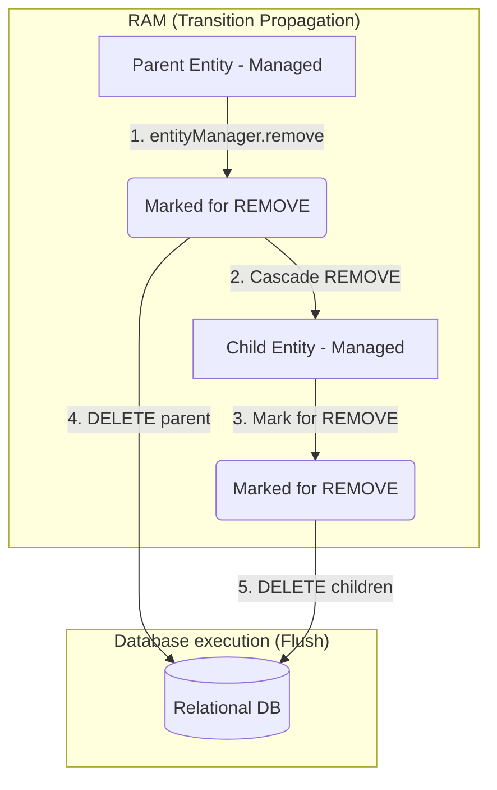

# Hiểu sâu về Cascade Type và các cạm bẫy phá hỏng Database

## ⚡ Tóm tắt ngắn (30s)
**Cascade Type (Lan truyền trạng thái)** trong JPA là cơ chế cho phép tự động chuyển dịch trạng thái vòng đời (lifecycle state transitions) từ thực thể Cha (Parent) sang các thực thể Con (Children) liên quan.

Các loại Cascade Type tiêu chuẩn bao gồm:
1.  **`PERSIST`**: Lưu cha tự động lưu con.
2.  **`MERGE`**: Cập nhật/Hợp nhất cha tự động cập nhật con.
3.  **`REMOVE`**: Xóa cha tự động xóa con.
4.  **`DETACH` / `REFRESH`**: Tách rời/Làm tươi cha tự động áp dụng lên con.
5.  **`ALL`**: Áp dụng tất cả các hành vi trên.

**Cảnh báo nghiêm trọng**: Chỉ sử dụng Cascade Type (đặc biệt là `REMOVE` và `ALL`) cho mối quan hệ **sở hữu sinh tồn chặt chẽ** (Composition - ví dụ: `Order` sở hữu `OrderItems`). Tuyệt đối tránh lạm dụng Cascade trên các quan hệ chia sẻ (Shared Associations - ví dụ: `@ManyToOne` hướng đến bảng Danh mục/Cấu hình) vì nó có thể xóa sổ toàn bộ dữ liệu hệ thống chỉ bằng một lệnh xóa đơn giản!

---

## 🔍 Chi tiết bản chất thực chiến

### 1. Bản chất hoạt động của các loại Cascade

Khi gọi một phương thức của `EntityManager` tác động lên thực thể Cha, Hibernate sẽ duyệt qua các thuộc tính được cấu hình `cascade` để lan truyền lệnh tương ứng:



*   **`CascadeType.PERSIST`**: Khi gọi `entityManager.persist(parent)`, nếu danh sách con chứa các đối tượng Transient mới tạo, Hibernate sẽ tự động lưu chúng xuống DB. Rất hữu ích khi tạo mới một đơn hàng kèm danh sách chi tiết sản phẩm.
*   **`CascadeType.MERGE`**: Khi gọi `entityManager.merge(detachedParent)` để đưa thực thể cha trở lại quản lý, Hibernate cũng tự động merge tất cả các thực thể con trong danh sách của nó.
*   **`CascadeType.REMOVE`**: Khi xóa cha, toàn bộ thực thể con bị xóa theo. 

### 2. Sự khác biệt giữa Aggregation và Composition trong thiết kế Cascade

Trong thiết kế hệ thống chuẩn DDD (Domain-Driven Design), ta phân biệt rõ:
*   **Composition (Quan hệ sở hữu - Sinh tồn)**: Con không thể tồn tại nếu không có cha (ví dụ: `OrderItem` không thể tồn tại độc lập ngoài `Order`). Đây là **ứng viên duy nhất phù hợp cho `CascadeType.ALL` hoặc `CascadeType.REMOVE`**.
*   **Aggregation (Quan hệ liên kết - Độc lập)**: Các thực thể có vòng đời độc lập (ví dụ: `User` thuộc về một `Department`). Nếu xóa `Department`, ta chỉ muốn đặt khóa ngoại của `User` thành NULL, chứ tuyệt đối không được xóa bản ghi `User`. Trường hợp này **cấm dùng `CascadeType.REMOVE`**.

---

## 💻 Code thực chiến: BAD vs GOOD trong thiết kế Cascade

### ❌ BAD: Dùng `CascadeType.ALL` trên quan hệ chia sẻ dẫn đến thảm họa xóa dữ liệu
Thiết lập `@ManyToOne` từ `Book` đến `Author` với cấu hình `CascadeType.ALL`. Khi ứng dụng thực hiện xóa một cuốn sách, Hibernate tự động lan truyền lệnh xóa sang cả tác giả `Author`, kéo theo việc tất cả các cuốn sách khác của tác giả này bị lỗi khóa ngoại liên đới hoặc bị xóa sạch!

```java
@Entity
public class Book {
    @Id
    private Long id;
    private String title;

    // Anti-pattern cực kỳ nguy hiểm: Dùng ALL (gồm cả REMOVE) trên ManyToOne
    @ManyToOne(cascade = CascadeType.ALL, fetch = FetchType.LAZY)
    @JoinColumn(name = "author_id")
    private Author author;
}
```

*Nếu chạy lệnh:*
```java
bookRepository.deleteById(1L); // Xóa cuốn sách ID = 1
```
*Hệ quả SQL Console:*
```sql
-- Hibernate tự động xóa tác giả!
DELETE FROM authors WHERE id = 5; 
-- Lỗi IntegrityViolationException lập tức ném ra vì tác giả ID 5 vẫn đang được liên kết bởi 10 cuốn sách khác!
```

---

###  GOOD: Cấu hình Cascade có chiến lược và an toàn dữ liệu

```java
// 1. Phía quan hệ cha-con sở hữu chặt chẽ: Dùng CascadeType.ALL an toàn
@Entity
@Table(name = "orders")
public class Order {
    @Id
    @GeneratedValue(strategy = GenerationType.IDENTITY)
    private Long id;

    // Đúng đắn: Sử dụng ALL vì OrderItem hoàn toàn phụ thuộc vào Order
    @OneToMany(mappedBy = "order", cascade = CascadeType.ALL, orphanRemoval = true)
    private List<OrderItem> items = new ArrayList<>();
}

// 2. Phía quan hệ chia sẻ: Tuyệt đối không dùng Cascade REMOVE
@Entity
@Table(name = "books")
public class Book {
    @Id
    private Long id;
    private String title;

    // Đúng đắn: Chỉ cascade PERSIST và MERGE nếu muốn tự động tạo/cập nhật tác giả mới,
    // tuyệt đối KHÔNG đưa REMOVE vào đây!
    @ManyToOne(cascade = {CascadeType.PERSIST, CascadeType.MERGE}, fetch = FetchType.LAZY)
    @JoinColumn(name = "author_id")
    private Author author;
}
```

---

## 📊 Bảng tra cứu các loại Cascade Type thực chiến

| JPA CascadeType | Tác dụng | Hàm tương ứng của JPA | Khi nào nên dùng? |
| :--- | :--- | :--- | :--- |
| **`PERSIST`** | Lan truyền lệnh chèn mới | `persist(entity)` | Tạo mới cha kèm danh sách con mới |
| **`MERGE`** | Lan truyền lệnh hợp nhất | `merge(entity)` | Cập nhật thực thể cha từ Form DTO gửi lên |
| **`REMOVE`** | Lan truyền lệnh xóa | `remove(entity)` | Chỉ dùng cho Composition (Order -> OrderItem) |
| **`REFRESH`** | Lan truyền lệnh nạp lại dữ liệu | `refresh(entity)` | Đồng bộ lại dữ liệu từ DB lên RAM cho cả cụm |
| **`DETACH`** | Lan truyền lệnh tách rời khỏi Session| `detach(entity)` | Đưa cả cụm Entity ra khỏi Persistence Context |
| **`ALL`** | Gồm tất cả 5 loại trên | Tất cả các hàm | Rất tiện lợi nhưng **chỉ dùng cho quan hệ cha-con sở hữu** |

---

## ⚠️ Common Gotchas & Questions follow-up

### 1. Cạm bẫy "Xóa mồ côi" (Orphan Removal) bị nhầm lẫn với Cascade REMOVE
*   **Vấn đề**: Nhiều người nghĩ rằng `CascadeType.REMOVE` sẽ tự động xóa bản ghi con khi ta xóa nó ra khỏi Collection của cha (ví dụ: gọi `post.getComments().remove(comment)`). **Thực tế hoàn toàn không.** `CascadeType.REMOVE` chỉ hoạt động khi bạn **xóa bản ghi Cha** (`entityManager.remove(post)`). Nếu bạn chỉ gỡ con ra khỏi danh sách của cha, bản ghi con đó sẽ trở thành "mồ côi" (orphan) nhưng vẫn nằm trơ trọi dưới Database.
*   **Giải pháp**: Để tự động xóa bản ghi con khi gỡ khỏi danh sách của cha, bạn bắt buộc phải cấu hình thêm thuộc tính **`orphanRemoval = true`** trên `@OneToMany`.

### 2. Câu hỏi đào sâu từ interviewer

*   **Q: Sự khác biệt bản chất vật lý giữa JPA `CascadeType.REMOVE` và cơ chế `ON DELETE CASCADE` khai báo ở mức Database vật lý (DDL SQL) là gì?**
    *   *Trả lời*: Đây là hai cơ chế hoạt động ở hai tầng hoàn toàn khác nhau với những đánh đổi hiệu năng cực lớn:
        1.  **JPA `CascadeType.REMOVE` (Xử lý ở tầng Java)**: Khi bạn xóa thực thể Cha, Hibernate buộc phải **gửi truy vấn nạp toàn bộ các thực thể con lên RAM của JVM trước**, sau đó duyệt qua từng thực thể con để thực hiện các câu lệnh `DELETE` riêng lẻ xuống DB. 
            *   *Ưu điểm*: Kích hoạt đầy đủ các Hook vòng đời của JPA (`@PreRemove`, `@PostRemove`) giúp đồng bộ cache L1, L2 hoặc ghi Audit Log.
            *   *Nhược điểm*: Hiệu năng cực kỳ tệ nếu cha có hàng ngàn con (tốn hàng ngàn câu lệnh DELETE mạng).
        2.  **Database `ON DELETE CASCADE` (Xử lý ở tầng DB vật lý)**: Được khai báo trực tiếp trong ràng buộc khóa ngoại DDL (`FOREIGN KEY ... ON DELETE CASCADE`). Khi bạn gửi lệnh xóa cha, hệ quản trị cơ sở dữ liệu (MySQL/Postgres) sẽ tự động quét và xóa sạch các dòng con ở mức vật lý cực kỳ nhanh chóng.
            *   *Ưu điểm*: Tốc độ ánh sáng, chỉ tốn đúng 1 câu lệnh DELETE cha từ Java.
            *   *Nhược điểm*: Hibernate hoàn toàn bypass qua cơ chế này. Do đó, các thực thể con bị xóa dưới DB nhưng Hibernate không hề biết, dẫn đến bộ nhớ đệm L1/L2 Cache vẫn giữ các thực thể con đã chết (Stale Cache), và các Callback `@PreRemove` của con sẽ không bao giờ được kích hoạt.
            *   *Kết luận thực chiến*: Thông thường trong hệ thống lớn, ta kết hợp cả hai: Sử dụng DB level `ON DELETE CASCADE` để đảm bảo hiệu năng ghi tối đa, nhưng phải phối hợp gọi `entityManager.clear()` để dọn dẹp cache đồng bộ an toàn.
