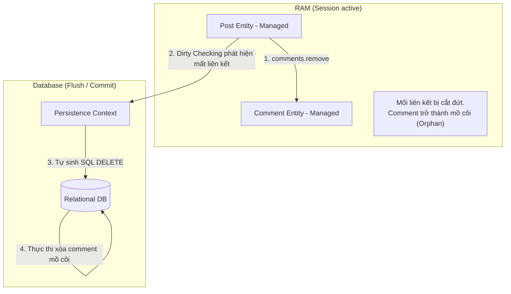

# Bản chất Orphan Removal và Phân biệt với Cascade REMOVE

## ⚡ Tóm tắt ngắn (30s)
*   **`orphanRemoval = true` (Xóa mồ côi)**: Là cơ chế dọn dẹp tự động ở mức phần tử. Khi bạn **gỡ bỏ** một thực thể con ra khỏi Collection của thực thể cha (ví dụ: `post.getComments().remove(comment)`), Hibernate sẽ phát hiện mối quan hệ bị cắt đứt và **tự động gửi lệnh `DELETE`** để xóa sổ thực thể con đó dưới Database.
*   **Phân biệt nhanh**:
    *   `CascadeType.REMOVE`: Chỉ kích hoạt lệnh xóa con khi **bản thân thực thể Cha bị xóa** (`entityManager.remove(post)`).
    *   `orphanRemoval = true`: Kích hoạt lệnh xóa con **trong cả hai trường hợp**: Khi Cha bị xóa, HOẶC khi Con bị gỡ khỏi danh sách của Cha trên RAM.
*   **Phạm vi áp dụng**: Chỉ được phép cấu hình trên `@OneToMany` và `@OneToOne`. Không tồn tại trên `@ManyToOne` hay `@ManyToMany`.

---

## 🔍 Chi tiết bản chất thực chiến

### 1. Luồng vận hành vật lý của Orphan Removal

Khi bạn gỡ một thực thể con ra khỏi danh sách được quản lý bởi thực thể cha:



Nếu **không** cấu hình `orphanRemoval = true`, khi bạn gọi `post.getComments().remove(comment)`:
*   Hibernate chỉ cố gắng cập nhật cột khóa ngoại `post_id` thành `NULL` trong bảng `comments` (nếu cột này cho phép NULL). Bản ghi con vẫn tồn tại vĩnh viễn dưới DB và trở thành dữ liệu rác (Orphan record).
*   Nếu cột khóa ngoại được cấu hình `nullable = false`, hệ thống sẽ ném ra ngoại lệ **`PropertyValueException`** hoặc **`ConstraintViolationException`** vì khóa ngoại không được phép gán giá trị NULL.

---

## 💻 Code thực chiến: BAD vs GOOD trong quản lý phần tử con

### ❌ BAD: Chỉ xóa con khỏi Collection và tạo dữ liệu rác mồ côi dưới DB
Thiếu cấu hình `orphanRemoval = true` khiến việc gỡ bỏ phần tử khỏi danh sách cha chỉ làm gán NULL cột khóa ngoại (hoặc lỗi Integrity DB), không thực sự xóa bản ghi.

```java
@Entity
public class Post {
    @Id
    private Long id;

    // Thiếu orphanRemoval = true
    @OneToMany(mappedBy = "post", cascade = CascadeType.ALL)
    private List<Comment> comments = new ArrayList<>();
}
```
*Mã nghiệp vụ:*
```java
@Transactional
public void removeCommentBad(Long postId, Long commentId) {
    Post post = postRepository.findById(postId).orElseThrow();
    Comment comment = commentRepository.findById(commentId).orElseThrow();

    // Chỉ gỡ khỏi danh sách của cha trên RAM
    post.getComments().remove(comment); 
    
    // KẾT QUẢ VẬT LÝ: Bản ghi comment vẫn nằm dưới DB! 
    // Cột post_id trong bảng comments bị UPDATE thành NULL (Tạo dữ liệu rác).
}
```

---

###  GOOD: Triển khai `orphanRemoval = true` chuẩn chỉ và dọn dẹp an toàn

```java
@Entity
@Table(name = "posts")
public class Post {
    @Id
    @GeneratedValue(strategy = GenerationType.IDENTITY)
    private Long id;
    private String title;

    // Cấu hình orphanRemoval = true chính xác
    @OneToMany(mappedBy = "post", cascade = CascadeType.ALL, orphanRemoval = true)
    private List<Comment> comments = new ArrayList<>();
    
    // Helper Method
    public void removeComment(Comment comment) {
        comments.remove(comment);
        comment.setPost(null); // Đồng bộ hai chiều vật lý
    }
}
```
*Mã nghiệp vụ:*
```java
@Transactional
public void removeCommentGood(Long postId, Long commentId) {
    Post post = postRepository.findById(postId).orElseThrow();
    Comment comment = commentRepository.findById(commentId).orElseThrow();

    // Gỡ bỏ con thông qua Helper Method
    post.removeComment(comment);
    
    // KẾT QUẢ VẬT LÝ: Hibernate tự động phát hiện và gửi lệnh DELETE xuống DB vật lý:
    // DELETE FROM comments WHERE id = <commentId>;
}
```

---

## 📊 Bảng so sánh CascadeType.REMOVE và orphanRemoval = true

| Tiêu chí | CascadeType.REMOVE | orphanRemoval = true |
| :--- | :--- | :--- |
| **Xóa con khi Cha bị xóa?** | **Có** | **Có** |
| **Xóa con khi Con bị gỡ khỏi danh sách Cha?** | Không (Chỉ gán NULL khóa ngoại) | **Có** (Tự động gửi SQL DELETE) |
| **Mục đích thiết kế chính** | Lan truyền lệnh xóa từ trên xuống | Quản lý vòng đời phần tử con nghiêm ngặt |
| **Thích hợp cho** | Xóa toàn bộ cụm dữ liệu cha-con | Thay đổi danh sách con (Thêm/Sửa/Xóa chi tiết) |

---

## ⚠️ Common Gotchas & Questions follow-up

### 1. Thảm họa "Thay thế Collection" phá hỏng Dirty Checking
*   **Vấn đề cực kỳ phổ biến**: Khi viết phương thức cập nhật danh sách con, Junior Developer thường gán một danh sách mới hoàn toàn cho thuộc tính Collection của thực thể cha:
    ```java
    post.setComments(newArrayList); // LỖI HIỆU NĂNG HOẶC HIBERNATE EXCEPTION!
    ```
    *Tại sao lỗi?* Hibernate quản lý các Collection bằng các lớp bọc đặc biệt (như `PersistentBag`, `PersistentSet`) chứa các logic theo dõi thay đổi (Dirty Checking) và quản lý Orphan. Khi bạn gán một danh sách raw `new ArrayList<>()` vào trường đó, bạn đã **cắt đứt hoàn toàn khả năng theo dõi của Hibernate**. Kết quả là Hibernate sẽ ném ra ngoại lệ **`HibernateException: A collection with cascade="all-delete-orphan" was no longer referenced by the owning entity instance`**.
*   **Giải pháp**: Không bao giờ viết hàm Setter thay thế toàn bộ Collection. Hãy sử dụng các phương thức `.clear()` và `.addAll()` trên danh sách hiện tại để Hibernate theo dõi đúng các phần tử bị mồ côi:
    ```java
    post.getComments().clear(); // Đánh dấu xóa toàn bộ con cũ
    post.getComments().addAll(newComments); // Thêm các con mới vào
    ```

### 2. Câu hỏi đào sâu từ interviewer

*   **Q: Tại sao `orphanRemoval` lại chỉ được phép cấu hình trên `@OneToMany` và `@OneToOne`, mà tuyệt đối không thể có trên `@ManyToOne` hay `@ManyToMany`? Hãy giải thích dưới góc độ logic nghiệp vụ.**
    *   *Trả lời*: Bản chất của khái niệm "Mồ côi" (Orphan) là đối tượng con **hoàn toàn phụ thuộc sinh tồn vào duy nhất một thực thể cha** (quan hệ sở hữu độc quyền 1-đến-1 hoặc 1-đến-nhiều).
        *   Trong quan hệ `@ManyToOne` (nhiều Con hướng về 1 Cha) hoặc `@ManyToMany` (nhiều Cha - nhiều Con), một thực thể con (ví dụ: `Tag` hoặc `Author`) có thể được **chia sẻ và liên kết bởi nhiều thực thể cha khác nhau cùng một lúc**.
        *   Nếu ta gỡ một `Tag` ra khỏi một bài viết `Post` cụ thể, thực thể `Tag` đó không hề bị mồ côi, vì nó vẫn đang được liên kết và sử dụng bởi hàng chục bài viết `Post` khác trong hệ thống. Nếu Hibernate tự ý xóa `Tag` này khỏi database, nó sẽ phá vỡ hoàn toàn tính toàn vẹn dữ liệu của các bài viết khác, gây ra lỗi nghiêm trọng. Do đó, `orphanRemoval` chỉ có ý nghĩa logic và được phép khai báo đối với các quan hệ sở hữu độc quyền (`@OneToMany` hoặc `@OneToOne`).
