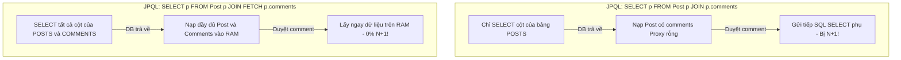

# Bản chất fetch join trong JPQL và Tuyệt chiêu giải quyết MultipleBagFetchException

## ⚡ Tóm tắt ngắn (30s)
**`JOIN FETCH` (fetch join)** là một cú pháp đặc quyền của JPQL (Java Persistence Query Language). Nó chỉ thị cho Hibernate thực hiện một câu truy vấn SQL chứa mệnh đề `JOIN` để **nạp đồng thời thực thể Cha và các thực thể Con liên quan lên RAM chỉ trong 1 câu SELECT duy nhất**, giải quyết triệt để vấn đề N+1 Query.

Cần phân biệt rõ:
*   **JPQL `JOIN`**: Chỉ dùng để **lọc (filter)** dữ liệu của thực thể cha dựa trên điều kiện của con, hoàn toàn không nạp dữ liệu con vào RAM (vẫn bị N+1 nếu duyệt con).
*   **JPQL `JOIN FETCH`**: Vừa dùng để lọc, vừa **nạp đầy đủ dữ liệu con vào RAM** để sử dụng trực tiếp.

---

## 🔍 Chi tiết bản chất thực chiến

### 1. Phân biệt cơ học giữa JPQL JOIN và JOIN FETCH

Hãy xem sự khác biệt vật lý khi Hibernate dịch hai câu lệnh JPQL này xuống Database:



*   **`JOIN`**: Dịch thành SQL `JOIN` nhưng mệnh đề `SELECT` chỉ lấy các cột của bảng `posts`.
*   **`JOIN FETCH`**: Dịch thành SQL `JOIN` và mệnh đề `SELECT` lấy toàn bộ cột của cả hai bảng `posts` và `comments` để lắp ráp đối tượng đầy đủ.

### 2. Thảm họa MultipleBagFetchException là gì và Cách xử lý?

Khi bạn cố gắng dùng `JOIN FETCH` để nạp đồng thời hai danh sách con dạng `List` (ví dụ: một `Post` vừa fetch danh sách `comments`, vừa fetch danh sách `tags`):
```java
@Query("SELECT p FROM Post p LEFT JOIN FETCH p.comments LEFT JOIN FETCH p.tags")
```
Hibernate sẽ ném ra ngoại lệ nổi tiếng: **`org.hibernate.loader.MultipleBagFetchException: cannot simultaneously fetch multiple bags`**.

*Tại sao?* Vì trong Hibernate, một `List` không có thứ tự và cho phép trùng lặp được coi là một **Bag**. Việc JOIN FETCH cùng lúc hai danh sách con sẽ tạo ra một **phép nhân Cartesian tích chập (Cartesian Product)** khổng lồ ở mức Database (ví dụ: Post có 10 comments và 10 tags sẽ trả về $10 \times 10 = 100$ dòng SQL trùng lặp). Hibernate không thể phân biệt dữ liệu thô này để phân rã chính xác vào hai danh sách `List` khác nhau.

#### Cách giải quyết MultipleBagFetchException chuẩn Senior:
1.  **Cách 1: Đổi kiểu dữ liệu từ `List` sang `Set`**: `Set` không cho phép trùng lặp, giúp Hibernate khử trùng lặp Descartes dễ dàng. 
    *   *Đánh đổi*: Tạo ra câu lệnh SQL JOIN khổng lồ, gây áp lực CPU lớn cho Database và tốn băng thông mạng tải dữ liệu trùng lặp.
2.  **Cách 2: Chia để trị bằng 2 câu truy vấn tuần tự kết hợp L1 Cache (Khuyên dùng)**:
    *   *Bước 1*: Query lấy Post và fetch `comments`.
    *   *Bước 2*: Query lấy chính Post đó và fetch `tags`.
    *   Nhờ có **L1 Cache (Persistence Context)** đảm bảo tính đồng nhất đối tượng (Identity Map), Hibernate sẽ tự động ghép danh sách `tags` nạp ở bước 2 vào đúng đối tượng `Post` đã có trên RAM ở bước 1. Hiệu năng tối ưu tuyệt đối mà không có Cartesian Product!

---

## 💻 Code thực chiến: BAD vs GOOD trong xử lý nạp nhiều Collection

### ❌ BAD: Dùng JOIN FETCH bừa bãi dẫn đến MultipleBagFetchException
Cố gắng fetch hai collection `List` cùng lúc gây lỗi biên dịch.

```java
@Entity
public class Post {
    @Id
    private Long id;

    @OneToMany(mappedBy = "post")
    private List<Comment> comments = new ArrayList<>();

    @OneToMany(mappedBy = "post")
    private List<Tag> tags = new ArrayList<>();
}

// JPQL LỖI BIÊN DỊCH RUNTIME:
// SELECT p FROM Post p LEFT JOIN FETCH p.comments LEFT JOIN FETCH p.tags
```

---

###  GOOD: Giải quyết MultipleBagFetchException bằng "Chia để trị" (Tối ưu nhất)

```java
@Repository
public interface PostRepository extends JpaRepository<Post, Long> {
    
    // Câu truy vấn 1: Lấy Post và fetch Comments
    @Query("SELECT DISTINCT p FROM Post p LEFT JOIN FETCH p.comments WHERE p.id = :id")
    Optional<Post> findByIdWithComments(@Param("id") Long id);

    // Câu truy vấn 2: Lấy Post và fetch Tags
    @Query("SELECT DISTINCT p FROM Post p LEFT JOIN FETCH p.tags WHERE p.id = :id")
    Optional<Post> findByIdWithTags(@Param("id") Long id);
}
```

*Mã Service điều phối sạch sẽ, hiệu năng cực cao:*
```java
@Service
public class PostService {
    private final PostRepository postRepository;

    public PostService(PostRepository postRepository) {
        this.postRepository = postRepository;
    }

    @Transactional(readOnly = true)
    public Post getPostDetails(Long postId) {
        // 1. Nạp Post và fetch Comments vào Persistence Context (RAM)
        Post post = postRepository.findByIdWithComments(postId)
                .orElseThrow(() -> new EntityNotFoundException());

        // 2. Chạy tiếp câu query 2 để nạp Tags. 
        // Nhờ L1 Cache, Hibernate tự động ghép Tags vào chính đối tượng 'post' trên RAM!
        postRepository.findByIdWithTags(postId);

        return post; // Post hiện tại đã được nạp đầy đủ cả Comments và Tags chỉ với 2 câu SELECT sạch!
    }
}
```

---

## 📊 Bảng so sánh các kiểu JOIN trong JPQL

| Kiêu JOIN | Bản chất SQL sinh ra | Nạp dữ liệu con vào RAM? | Giải quyết được N+1? | Thích hợp cho |
| :--- | :--- | :--- | :--- | :--- |
| **`JOIN`** | `INNER JOIN` | **Không** (Chỉ nạp cột Cha) | Không | Lọc Cha dựa trên điều kiện bắt buộc của Con |
| **`LEFT JOIN`** | `LEFT OUTER JOIN` | **Không** (Chỉ nạp cột Cha) | Không | Lọc Cha dựa trên điều kiện tùy chọn của Con |
| **`JOIN FETCH`** | `INNER JOIN` | **Có** (Nạp cả Cha và Con) | **Có** | Lấy dữ liệu Cha và nạp kèm Con bắt buộc |
| **`LEFT JOIN FETCH`**| `LEFT OUTER JOIN` | **Có** (Nạp cả Cha và Con) | **Có** | Lấy dữ liệu Cha và nạp kèm Con (nếu có) |

---

## ⚠️ Common Gotchas & Questions follow-up

### 1. Cạm bẫy "Descartes thầm lặng" làm nghẽn băng thông mạng
*   **Vấn đề**: Mặc dù chuyển sang `Set` giúp bạn bypass qua lỗi `MultipleBagFetchException` thành công khi fetch nhiều collection. Tuy nhiên, dưới DB, câu lệnh SQL JOIN chéo 3 bảng sẽ tạo ra tích Descartes khổng lồ. Ví dụ: 1 Post có 50 Comments và 50 Tags sẽ sinh ra $50 \times 50 = 2500$ dòng kết quả thô gửi qua đường truyền mạng từ DB đến App. Điều này làm nghẽn I/O mạng và tiêu tốn CPU của ứng dụng vô ích để khử trùng lặp.
*   **Giải pháp**: Hãy tuân thủ quy tắc Senior: **Không bao giờ JOIN FETCH cùng lúc quá 1 Collection**. Hãy sử dụng phương án "Chia để trị" (2 câu query tuần tự) hoặc kết hợp cấu hình `@BatchSize`.

### 2. Câu hỏi đào sâu từ interviewer

*   **Q: Sự khác biệt bản chất giữa JPQL `JOIN` thông thường và JPQL `JOIN FETCH` là gì? Tại sao Hibernate lại tách riêng hai cú pháp này?**
    *   *Trả lời*: Sự phân tách này là cực kỳ tinh tế và tối ưu cho hiệu năng hệ thống:
        *   **JPQL `JOIN`** được thiết kế cho mục đích **Lọc dữ liệu (Filtering)**. Ví dụ, bạn cần tìm *"Danh sách tất cả các bài viết Post có chứa ít nhất một bình luận bị báo cáo xấu (status = 'SPAM')"*. Ở đây, bạn chỉ muốn lấy thông tin của `Post` để hiển thị danh sách kiểm duyệt. Bạn hoàn toàn không cần hiển thị chi tiết các bình luận đó. Do đó, dùng `JOIN` giúp DB thực hiện lọc chính xác ở tầng lưu trữ, và chỉ truyền về các cột của bảng `posts`, tiết kiệm tối đa RAM và băng thông.
        *   **JPQL `JOIN FETCH`** được thiết kế cho mục đích **Nạp dữ liệu (Fetching/Retrieving)**. Khi bạn cần hiển thị chi tiết một bài viết và toàn bộ các bình luận của nó lên màn hình. Lúc này, bạn thực sự cần dùng dữ liệu của con nên `JOIN FETCH` là lựa chọn bắt buộc để gộp tất cả vào một câu truy vấn I/O duy nhất.
