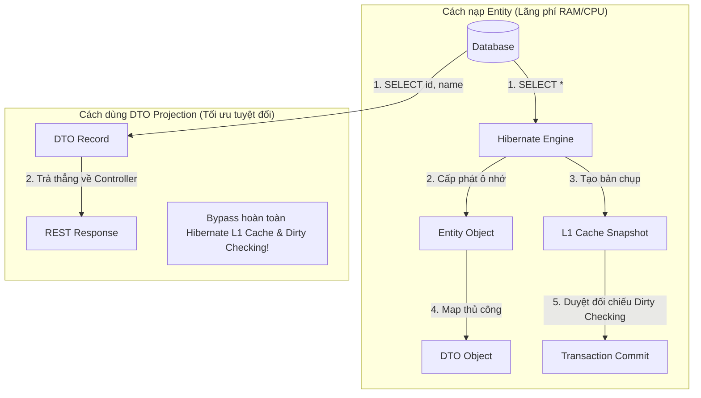

# Lợi ích vượt trội của DTO Projection trong REST API High-Performance

## ⚡ Tóm tắt ngắn (30s)
*   **DTO Projection (Chiếu dữ liệu sang DTO)** là kỹ thuật truy vấn dữ liệu trực tiếp từ các cột được chỉ định dưới Database để gán thẳng vào một đối tượng Java phẳng (Class hoặc Java Record) phục vụ cho API trả về, bỏ qua hoàn toàn việc nạp các Thực thể (Entity) đồ sộ.
*   **Lợi ích cốt lõi**:
    1.  **Tối ưu băng thông và RAM**: Chỉ SELECT đúng những cột cần hiển thị trên UI. Loại bỏ hoàn toàn các cột nặng như TEXT, BLOB hoặc các quan hệ không dùng đến.
    2.  **Bỏ qua Overhead của Hibernate**: Vì dữ liệu không nạp dưới dạng Entity, Hibernate sẽ **không quản lý** nó trong Persistence Context. Không tốn bộ nhớ lưu Snapshot, không chạy Dirty Checking, giải phóng tài nguyên CPU của JVM cực lớn.
    3.  **Chống lỗi Runtime**: Loại bỏ 100% nguy cơ xảy ra `LazyInitializationException` và lỗi vòng lặp Jackson Serializer.

---

## 🔍 Chi tiết bản chất thực chiến

### 1. Tại sao nạp Entity cho API chỉ đọc (Read-only) là một Anti-pattern?

Khi bạn gọi `userRepository.findAll()` để hiển thị danh sách người dùng lên trang Admin Dashboard (chỉ hiển thị `id` và `username`):
1.  **RAM bị phình to**: Hibernate nạp toàn bộ thực thể `User` chứa tất cả các trường (mật khẩu băm, thông tin địa chỉ, ngày tạo).
2.  **Nhân đôi bộ nhớ L1 Cache**: Với mỗi Entity được nạp, Persistence Context tạo thêm một bản chụp tĩnh (Snapshot) song song để phục vụ Dirty Checking sau này.
3.  **Hao phí CPU vô ích**: Khi Transaction kết thúc, Hibernate duyệt qua toàn bộ danh sách Entity này để đối chiếu Snapshot (Dirty Checking) mặc dù bạn không hề thực hiện bất kỳ lệnh sửa đổi nào.



### 2. Các kiểu Projection chính trong Spring Data JPA

*   **Interface-based Projection (Chiếu dựa trên giao diện)**:
    *   Spring Data tự động sinh một Dynamic Proxy để bọc dữ liệu thô nhận về từ DB và map vào các phương thức `getter` của Interface. Rất tiện lợi nhưng tốn một ít tài nguyên CPU để sinh Proxy tại runtime.
*   **Class-based / Constructor Projection (Chiếu dựa trên Lớp/Record - KHUYÊN DÙNG)**:
    *   Sử dụng truy vấn JPQL chứa từ khóa `new com.example.UserDto(...)` hoặc Spring Data DTO Class. Hibernate sẽ biên dịch câu lệnh, lấy trực tiếp kết quả DB để khởi tạo Class/Record qua Constructor. Đây là giải pháp có hiệu năng cơ học cao nhất.

---

## 💻 Code thực chiến: BAD vs GOOD trong truy vấn danh sách

### ❌ BAD: Nạp toàn bộ Entity đồ sộ chỉ để trả về một vài trường DTO
Ứng dụng nạp toàn bộ thực thể `Article` chứa nội dung bài viết cực nặng (`content` dạng CLOB/TEXT) cùng quan hệ tác giả, sau đó mới dùng DTO để map lại ở tầng Controller.

```java
@Entity
public class Article {
    @Id
    private Long id;
    private String title;
    
    @Lob // Cực kỳ nặng
    private String content;
    
    @ManyToOne(fetch = FetchType.LAZY)
    private Author author;
}
```
*Mã Service tốn kém:*
```java
@Transactional(readOnly = true)
public List<ArticleSummaryDto> getArticlesBad() {
    // 1. SELECT * và nạp toàn bộ Entity Article (kèm theo trường content khổng lồ) vào RAM
    List<Article> articles = articleRepository.findAll(); 
    
    // 2. Map sang DTO thủ công (Lãng phí tài nguyên RAM nghiêm trọng)
    return articles.stream()
            .map(a -> new ArticleSummaryDto(a.getId(), a.getTitle()))
            .toList();
}
```

---

###  GOOD: Truy vấn trực tiếp sang Java Record DTO bằng Constructor Projection

#### 1. Định nghĩa Record DTO phẳng, gọn nhẹ
```java
public record ArticleSummaryDto(Long id, String title) {}
```

#### 2. Viết Query Projection tối ưu trong Repository
```java
@Repository
public interface ArticleRepository extends JpaRepository<Article, Long> {

    // Đúng đắn: Sử dụng JPQL Constructor Expression
    // SQL sinh ra chỉ SELECT đúng 2 cột id và title từ DB, không nạp Entity, 0% Overhead!
    @Query("SELECT new com.example.dto.ArticleSummaryDto(a.id, a.title) FROM Article a")
    List<ArticleSummaryDto> findAllSummariesViaConstructor();
    
    // Đúng đắn (Cách 2): Sử dụng Dynamic Projection của Spring Data JPA
    // Chỉ cần khai báo kiểu trả về là Record/DTO Class, Spring Data tự tối ưu câu SELECT dưới DB!
    List<ArticleSummaryDto> findByTitleContaining(String keyword);
}
```

---

## 📊 Bảng so sánh Entity Hydration vs Các kiểu DTO Projection

| Tiêu chí | Entity Hydration (Nạp đầy đủ) | Interface-based Projection | Class-based (Record) Projection |
| :--- | :--- | :--- | :--- |
| **SQL SELECT sinh ra** | `SELECT *` (Tải mọi cột) | Chỉ tải các cột khai báo getter | Chỉ tải các cột truyền vào Constructor |
| **Nạp vào L1 Cache?** | **Có** (Chiếm dụng RAM) | Không | **Không** (Giải phóng RAM ngay) |
| **Overhead Dirty Checking?**| **Có** (Tốn CPU khi commit) | Không | **Không** |
| **Nguy cơ lỗi Lazy** | Rất cao | Thấp | **Hoàn toàn 0%** |
| **Tốc độ thực thi cơ học** | Chậm nhất | Trung bình (Tốn phí sinh Proxy) | **Nhanh nhất** |

---

## ⚠️ Common Gotchas & Questions follow-up

### 1. Cạm bẫy "Interface Projection bị vô hiệu hóa" bởi Spring Expression Language (SpEL)
*   **Vấn đề**: Khi sử dụng Interface Projection, lập trình viên lạm dụng chú thích `@Value` để tính toán động các giá trị phức tạp:
    ```java
    public interface UserSummary {
        String getUsername();
        @Value("#{target.firstName + ' ' + target.lastName}") // Dùng SpEL truy cập thuộc tính target
        String getFullName();
    }
    ```
    *Hậu quả vật lý*: Để đánh giá được chuỗi SpEL `target.firstName`, Spring bắt buộc phải **nạp toàn bộ thực thể `User` gốc chứa mọi cột từ DB lên RAM** để làm đối tượng nguồn `target` cho biểu thức. Điều này vô hiệu hóa hoàn toàn tính năng tối ưu hóa SELECT của Projection, hệ thống quay trở lại quét toàn bộ cột (`SELECT *`) mà không hề báo lỗi compile!
*   **Giải pháp**: Tránh dùng SpEL phức tạp trong Interface Projection. Hãy chuyển sang sử dụng Class-based (Record) Projection và xử lý ghép chuỗi trực tiếp trong JPQL Query (`CONCAT(u.firstName, ' ', u.lastName)`) hoặc viết logic trong Constructor của Record DTO.

### 2. Câu hỏi đào sâu từ interviewer

*   **Q: Khi nào bắt buộc phải truy vấn ra thực thể Entity đầy đủ? Khi nào nên sử dụng DTO Projection?**
    *   *Trả lời*: Đây là nguyên tắc phân cấp kiến trúc cực kỳ quan trọng:
        1.  **Bắt buộc dùng Entity**: Khi và chỉ khi thực hiện các thao tác **Ghi, Cập nhật hoặc Xóa dữ liệu (Write Operations / Command)** liên quan đến logic nghiệp vụ cốt lõi (Business Domain Logic). Hibernate bắt buộc phải nạp Entity vào Persistence Context để thực hiện kiểm soát vòng đời, Dirty Checking, quản lý các ràng buộc khóa ngoại vật lý và kích hoạt các Callback kiểm duyệt Audit.
        2.  **Luôn ưu tiên dùng DTO Projection**: Đối với tất cả các tác vụ **Đọc dữ liệu (Read Operations / Query)** như tìm kiếm, hiển thị danh sách, phân trang, vẽ biểu đồ dashboard, hoặc trả dữ liệu qua JSON REST API. DTO Projection là lựa chọn hoàn hảo để bypass qua toàn bộ overhead của Hibernate, mang lại hiệu năng tối đa cho hệ thống dưới tải lớn.
