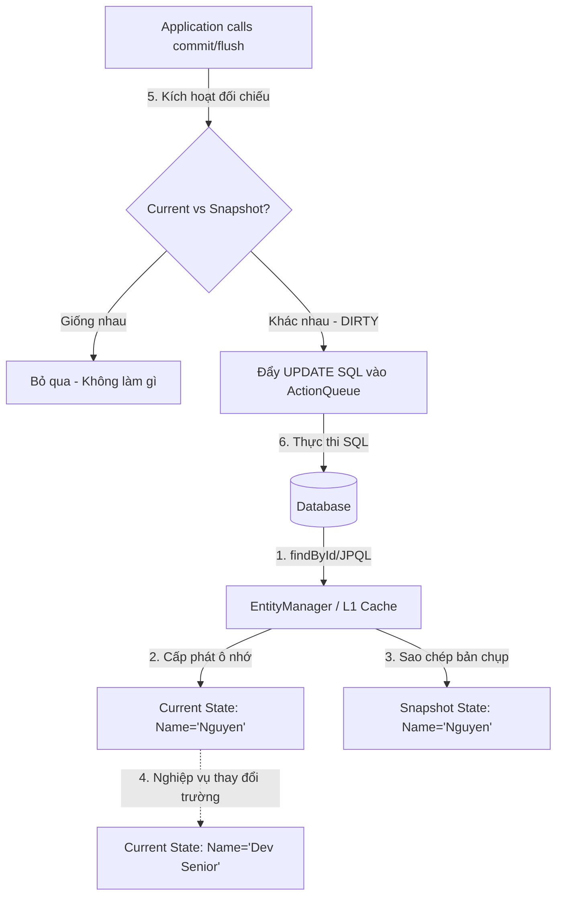

# Cơ chế tự động đồng bộ Dirty Checking và Kỹ thuật tối ưu hóa nâng cao

## ⚡ Tóm tắt ngắn (30s)
**Dirty Checking (Kiểm tra dữ liệu bẩn/thay đổi)** là cơ chế cốt lõi của Hibernate giúp **tự động phát hiện sự thay đổi trạng thái của Entity và tự sinh câu lệnh SQL `UPDATE` tương ứng** để đồng bộ xuống Database khi kết thúc giao dịch (Transaction commit/flush), mà không cần lập trình viên phải gọi hàm `save()` thủ công.

Cơ chế này hoạt động dựa trên bản chụp tĩnh **Snapshot** được tạo ra ngay khi nạp Entity vào RAM (First-Level Cache). Khi giao dịch kết thúc, Hibernate duyệt qua các thực thể Managed, đối chiếu trường dữ liệu hiện tại với Snapshot ban đầu. Nếu phát hiện sai khác (trạng thái "Dirty"), nó tự động chèn một câu lệnh `UPDATE` vào hàng đợi SQL để thực thi.

---

## 🔍 Chi tiết bản chất thực chiến

### 1. Luồng vận hành vật lý của Dirty Checking

Dirty Checking diễn ra hoàn toàn tự động ở tầng ngầm của Persistence Context theo các bước sau:



### 2. Các kỹ thuật tối ưu hóa nâng cao liên quan đến Dirty Checking

Mặc dù Dirty Checking rất thông minh, nhưng nó đi kèm các chi phí Overhead lớn về CPU và RAM. Lập trình viên Senior cần biết các kỹ thuật tối ưu hóa sau:

#### A. `@Transactional(readOnly = true)` (Tối ưu hóa cực đại cho API đọc)
Khi bạn đánh dấu một Transaction là `readOnly = true`:
*   Spring Data JPA sẽ cấu hình Hibernate Session ở chế độ `FlushMode.MANUAL`.
*   Hibernate **bỏ qua việc tạo bản chụp Snapshot** cho tất cả các Entity được nạp lên RAM trong transaction này.
*   Khi commit, Hibernate **bỏ qua hoàn toàn bước đối chiếu Dirty Checking**.
*   *Kết quả*: Tiết kiệm 50% dung lượng RAM L1 Cache và giải phóng 100% CPU chạy vòng lặp đối chiếu.

#### B. `@DynamicUpdate` (Cập nhật động chọn lọc cột)
*   *Hành vi mặc định*: Khi Dirty Checking phát hiện 1 cột thay đổi, Hibernate vẫn sinh ra câu lệnh cập nhật **toàn bộ các cột** trong bảng: `UPDATE users SET name = ?, email = ?, password = ?, gender = ? WHERE id = ?`.
*   *Hành vi khi bật `@DynamicUpdate`*: Hibernate sẽ phân tích cột thực sự thay đổi và sinh SQL chọn lọc: `UPDATE users SET name = ? WHERE id = ?`.
*   *Đánh đổi*: Hibernate phải tốn CPU ở tầng Java để dựng động chuỗi SQL tại runtime thay vì dùng Prepared Statement tĩnh đã được cache sẵn.

---

## 💻 Code thực chiến: BAD vs GOOD trong cập nhật thực thể

### ❌ BAD: Gọi `save()` dư thừa trên Managed Entity và bỏ quên Read-only Transaction
Gọi `repository.save()` dư thừa trong transaction gây loãng code, có thể sinh ra thêm truy vấn SELECT kiểm tra tồn tại và tăng nguy cơ xung đột khóa. Đồng thời không dùng `readOnly = true` cho tác vụ đọc.

```java
@Service
public class UserService {
    private final UserRepository userRepository;

    public UserService(UserRepository userRepository) {
        this.userRepository = userRepository;
    }

    @Transactional
    public void updateUserBad(Long id, String newName) {
        User user = userRepository.findById(id).orElseThrow();
        user.setName(newName);

        // Anti-pattern: Gọi save() dư thừa. 
        // Khi method kết thúc, Spring commit transaction, Dirty Checking đã tự động cập nhật rồi.
        userRepository.save(user); 
    }

    @Transactional // Anti-pattern: Thiếu readOnly = true cho API chỉ đọc
    public List<User> getAllUsersBad() {
        return userRepository.findAll(); // Tốn RAM lưu Snapshot và tốn CPU đối chiếu vô ích
    }
}
```

---

###  GOOD: Tận dụng Dirty Checking tự động và tối ưu hóa Read-Only cực hạn

```java
@Entity
@Table(name = "users")
@DynamicUpdate // Tối ưu hóa: Chỉ sinh câu UPDATE cho các cột thực sự thay đổi
public class User {
    @Id
    private Long id;
    private String name;
    private String email;
}
```
*Mã Service tối ưu:*
```java
@Service
public class UserService {
    private final UserRepository userRepository;

    public UserService(UserRepository userRepository) {
        this.userRepository = userRepository;
    }

    @Transactional
    public void updateUserGood(Long id, String newName) {
        // Nạp Entity lên RAM ở trạng thái MANAGED
        User user = userRepository.findById(id).orElseThrow();
        
        // Thay đổi giá trị thuộc tính
        user.setName(newName);
        
        // Tuyệt đối KHÔNG gọi save(). 
        // Khi kết thúc transaction, Hibernate tự động sinh: UPDATE users SET name = ? WHERE id = ?
    }

    // Tối ưu hóa cực hạn cho API chỉ đọc: Giải phóng RAM/CPU khỏi Snapshot & Dirty Checking
    @Transactional(readOnly = true) 
    public List<UserDto> getAllUsersGood() {
        return userRepository.findAll().stream()
                .map(u -> new UserDto(u.getId(), u.getName()))
                .toList();
    }
}
```

---

## 📊 Bảng so sánh các cơ chế cập nhật

| Tiêu chí | Dirty Checking mặc định | Cập nhật với `@DynamicUpdate` | Cập nhật với `@Transactional(readOnly=true)` |
| :--- | :--- | :--- | :--- |
| **Cấu trúc SQL UPDATE** | Cố định (Cập nhật mọi cột) | Động (Chỉ cập nhật cột bẩn) | **Không bao giờ sinh UPDATE SQL** |
| **Tạo bản chụp Snapshot?**| **Có** | **Có** | **Không** (Tiết kiệm bộ nhớ RAM) |
| **Overhead CPU đối chiếu** | Trung bình | Cao (Tốn phí dựng chuỗi SQL động) | **Hoàn toàn 0%** |
| **Prepared Statement Cache**| Được tận dụng tối đa | Bị hạn chế do SQL thay đổi liên tục | Không áp dụng |
| **Phù hợp nhất khi nào?** | Bảng hẹp, ít cột, ghi bình thường | Bảng siêu rộng (>50 cột), nhiều Index | **Tất cả các API chỉ đọc (List, Detail)** |

---

## ⚠️ Common Gotchas & Questions follow-up

### 1. Cạm bẫy "Cập nhật ngoài ý muốn" (Unintended Updates) cực kỳ tai hại
*   **Vấn đề**: Bạn truy vấn một thực thể `User` lên để tính toán logic hoặc chỉ format dữ liệu để trả ra Client. Bạn vô tình thay đổi thuộc tính của nó trên RAM (ví dụ: `user.setName(user.getName().toUpperCase())`) trong một method được đánh dấu `@Transactional`. Kết thúc method, bạn hoàn toàn **không gọi bất kỳ hàm lưu nào**. Tuy nhiên, khi transaction commit, Dirty Checking phát hiện tên của User bị biến đổi so với Snapshot và **tự động cập nhật tên viết hoa đó vào Database vật lý**! Đây là thảm họa làm sai lệch dữ liệu phổ biến nhất do không hiểu rõ vòng đời Entity.
*   **Giải pháp**: 
    1.  Đối với các tác vụ chỉ đọc dữ liệu để tính toán, luôn sử dụng `@Transactional(readOnly = true)`.
    2.  Nếu cần biến đổi dữ liệu của Entity trên RAM mà không muốn ghi xuống DB, hãy gọi `entityManager.detach(entity)` để đưa nó về trạng thái **Detached** trước khi biến đổi.

### 2. Câu hỏi đào sâu từ interviewer

*   **Q: Tại sao mặc định Hibernate lại chọn cập nhật toàn bộ các cột thay vì chỉ cập nhật những cột thay đổi (như `@DynamicUpdate`)? Việc cập nhật toàn bộ cột có ưu điểm gì về mặt vật lý Database?**
    *   *Trả lời*: Đây là một quyết định cân bằng kỹ thuật (Trade-off) cực kỳ sâu sắc của các kỹ sư thiết kế Hibernate:
        1.  **Tận dụng Prepared Statement Cache của Database**: Khi câu lệnh SQL có cấu trúc cố định và giống hệt nhau mọi lúc (`UPDATE users SET name=?, email=?, status=? WHERE id=?`), Database Engine (PostgreSQL, Oracle, MySQL) chỉ cần phân tích cú pháp (Parsing), kiểm tra quyền hạn và lập kế hoạch thực thi (Execution Plan) **duy nhất 1 lần đầu tiên**. Kế hoạch này được lưu vào bộ nhớ đệm Prepared Statement Cache. Ở các lần gọi tiếp theo, DB chỉ việc truyền tham số vào chạy ngay lập tức, mang lại hiệu năng tối đa. Nếu dùng `@DynamicUpdate`, mỗi biến thể cột thay đổi sẽ sinh ra 1 chuỗi SQL khác nhau, DB buộc phải parsing và sinh kế hoạch thực thi lại từ đầu mỗi lần chạy, gây quá tải CPU của Database.
        2.  **Tối ưu hóa Java Application CPU**: Hibernate mặc định chỉ cần sinh chuỗi SQL tĩnh 1 lần duy nhất khi ứng dụng khởi động (Bootstrap phase). Nếu dùng `@DynamicUpdate`, với mỗi thực thể bẩn, Hibernate phải duyệt qua toàn bộ các thuộc tính, đối chiếu giá trị để build động chuỗi SQL tại runtime, gây tốn CPU của ứng dụng Java.
        3.  *Kết luận*: Chỉ nên dùng `@DynamicUpdate` khi bảng có kích thước cực kỳ lớn chứa nhiều cột TEXT/BLOB nặng nề hoặc có các Index phức tạp trên các cột ít khi thay đổi (nhằm tránh việc DB phải ghi đè Index vô ích).
