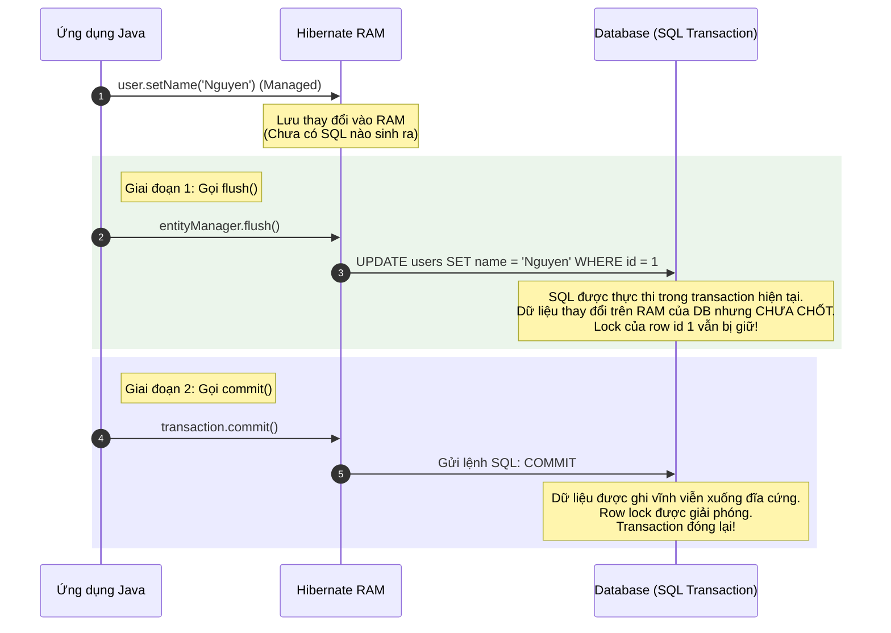

# Phân biệt sâu sắc flush() và commit() trong JPA/Hibernate

## ⚡ Tóm tắt ngắn (30s)
*   **`flush()` (Đồng bộ vật lý)**: Gửi toàn bộ các câu lệnh SQL ghi (`INSERT`, `UPDATE`, `DELETE`) đang nằm trong hàng đợi bộ nhớ RAM (ActionQueue) của Hibernate xuống Database vật lý để đồng bộ trạng thái. Tuy nhiên, **Transaction vẫn mở, chưa kết thúc**, dữ liệu chưa được chốt và các database lock (khóa) vẫn được giữ chặt.
*   **`commit()` (Chốt giao dịch)**: Kết thúc hoàn toàn Database Transaction hiện tại. Nó tự động gọi `flush()` trước để đẩy hết SQL xuống, sau đó gửi câu lệnh **`COMMIT`** vật lý xuống DB để lưu dữ liệu vĩnh viễn, giải phóng toàn bộ database lock và đóng kết nối.
*   **Điểm mấu chốt**: Gọi `flush()` thì dữ liệu vẫn có thể bị `rollback` (hủy bỏ) hoàn toàn nếu transaction gặp lỗi sau đó. Nhưng khi đã gọi `commit()` thành công, dữ liệu đã ghi vĩnh viễn không thể khôi phục lại.

---

## 🔍 Chi tiết bản chất thực chiến

### 1. Luồng vận hành vật lý của flush() và commit()

Hãy quan sát cách thức tương tác với Database của hai hành động này qua sơ đồ sau:



### 2. Khi nào Hibernate tự động Flush dữ liệu? (Auto-Flush Trigger)

Hibernate cấu hình mặc định là `FlushModeType.AUTO`. Nó sẽ tự động kích hoạt `flush()` trong 3 trường hợp sau để đảm bảo an toàn dữ liệu:
1.  **Trước khi thực thi các câu truy vấn JPQL/HQL/Native SQL**: Để đảm bảo kết quả truy vấn chính xác. Nếu bạn vừa đổi tên User trên RAM, sau đó chạy câu lệnh JPQL tìm User theo tên mới, Hibernate buộc phải flush tên mới xuống DB trước khi query thì mới tìm ra kết quả đúng.
2.  **Trước khi transaction commit**: Để đảm bảo toàn bộ thay đổi được lưu trước khi chốt.
3.  **Khi gọi `entityManager.flush()` thủ công**: Lập trình viên ép buộc đồng bộ.

---

## 💻 Code thực chiến: BAD vs GOOD trong quản lý Flush/Commit

### ❌ BAD: Lạm dụng gọi `flush()` thủ công phá hỏng cơ chế Write-Behind
Nhiều lập trình viên có thói quen gọi `saveAndFlush()` hoặc `entityManager.flush()` liên tục sau mỗi câu lệnh ghi. Điều này ép buộc Hibernate phải gửi SQL liên tục qua mạng, triệt tiêu hoàn toàn khả năng gộp lô (batching) và trì hoãn chiếm giữ lock của Write-Behind, gây nghẽn hiệu năng nghiêm trọng.

```java
@Service
public class OrderService {
    private final OrderRepository orderRepository;

    public OrderService(OrderRepository orderRepository) {
        this.orderRepository = orderRepository;
    }

    @Transactional
    public void createOrdersBad(List<Order> newOrders) {
        for (Order order : newOrders) {
            // Anti-pattern: Gọi saveAndFlush() bắt Hibernate gửi SQL INSERT 
            // lập tức sau từng vòng lặp. Tăng I/O mạng và chiếm dụng row lock DB quá lâu!
            orderRepository.saveAndFlush(order); 
        }
    }
}
```

---

###  GOOD: Tận dụng Write-Behind tự động và dùng `flush()` thủ công đúng use case
Để mặc định Hibernate tự quản lý Flush/Commit. Chỉ gọi `flush()` thủ công khi cần kiểm tra các ràng buộc vật lý (Database Constraints - ví dụ: kiểm tra trùng lặp khóa duy nhất `UNIQUE`) ngay giữa lòng transaction để xử lý exception trước khi tiếp tục logic.

```java
@Service
public class UserService {
    private final UserRepository userRepository;
    private final EntityManager entityManager;

    public UserService(UserRepository userRepository, EntityManager entityManager) {
        this.userRepository = userRepository;
        this.entityManager = entityManager;
    }

    @Transactional
    public void registerUserWithUniqueCheck(User newUser) {
        userRepository.save(newUser); // Lưu vào RAM ở dạng Managed

        try {
            // Use case hợp lệ duy nhất để dùng flush() thủ công:
            // Ép buộc ghi xuống DB ngay để DB kiểm tra ràng buộc UNIQUE của cột email.
            // Nếu trùng email, DB sẽ ném lỗi ConstraintViolation ngay lập tức tại đây!
            entityManager.flush(); 
        } catch (PersistenceException ex) {
            // Bắt lỗi trùng email chủ động ở mức DB ngay lập tức và đưa ra logic xử lý thay thế
            throw new CustomDuplicateEmailException("Email already exists: " + newUser.getEmail());
        }

        // ... Tiếp tục các bước nghiệp vụ phức tạp khác (gửi email, tạo ví) sau khi chắc chắn user hợp lệ
    }
}
```

---

## 📊 Bảng so sánh toàn diện flush() và commit()

| Tiêu chí | flush() (Đồng bộ vật lý) | commit() (Chốt giao dịch) |
| :--- | :--- | :--- |
| **Vòng đời Transaction** | Tiếp tục mở (Không kết thúc) | **Đóng và hoàn tất hoàn toàn** |
| **Database Lock (Khóa hàng/bảng)**| **Tiếp tục chiếm giữ** | **Giải phóng toàn bộ** |
| **Khả năng Rollback dữ liệu** | **CÓ THỂ** (Hủy bỏ 100% nếu rollback) | **KHÔNG THỂ** (Dữ liệu đã ghi vĩnh viễn) |
| **Lệnh SQL vật lý tương ứng** | Gửi các câu lệnh `INSERT`, `UPDATE`, `DELETE` | Gửi câu lệnh `COMMIT;` |
| **Tầm nhìn với Transaction khác** | **Không nhìn thấy** (ở mức Read Committed) | **Nhìn thấy ngay lập tức** |

---

## ⚠️ Common Gotchas & Questions follow-up

### 1. Cạm bẫy "Mù thông tin" giữa các Transaction song song sau khi Flush
*   **Vấn đề**: Bạn gọi `entityManager.flush()` thành công trong Transaction A. Bạn nghĩ rằng dữ liệu mới đã được cập nhật nên ở một API khác chạy Transaction B song song, bạn thực hiện SELECT để đọc dữ liệu đó. Tuy nhiên, Transaction B hoàn toàn không tìm thấy dữ liệu mới! 
    *   *Tại sao?* Vì Transaction A mới chỉ `flush` chứ chưa `commit`. Hầu hết các cơ sở dữ liệu production đều cấu hình Isolation Level mặc định là **Read Committed** (chỉ đọc dữ liệu đã chốt). Do đó, dữ liệu chưa committed của Transaction A sẽ bị cô lập hoàn toàn đối với thế giới bên ngoài nhằm tránh lỗi Dirty Read.
*   **Giải pháp**: Không bao giờ thiết kế nghiệp vụ dựa trên giả định Transaction khác có thể đọc được dữ liệu vừa `flush`. Dữ liệu chỉ thực sự khả dụng toàn cục khi Transaction chứa nó đã `commit` thành công.

### 2. Câu hỏi đào sâu từ interviewer

*   **Q: Nếu tôi gọi `flush()` thủ công để đẩy dữ liệu xuống DB, nhưng ngay sau đó ứng dụng Java bị crash hoặc transaction bị rollback, dữ liệu đã flush dưới DB có bị mất đi không? Hãy giải thích cơ chế bộ nhớ của DB.**
    *   *Trả lời*: **Dữ liệu đã flush sẽ bị xóa sạch và hoàn trả về trạng thái cũ (Mất đi hoàn toàn).**
        *   Khi gọi `flush()`, Hibernate gửi các câu lệnh SQL (`INSERT/UPDATE/DELETE`) qua kết nối TCP socket đến Database. Database Engine nhận lệnh và thực thi các thay đổi này trong không gian đệm giao dịch tạm thời của nó (gồm Undo Log, Redo Log hoặc bộ đệm RAM của DB). Các database lock cũng được thiết lập trên các hàng bị thay đổi để bảo vệ tài nguyên.
        *   Tuy nhiên, vì lệnh `COMMIT` chưa được gửi xuống, Database Engine coi toàn bộ các thay đổi vừa flush này là **Trạng thái chưa hoàn tất (Pending State)**.
        *   Nếu ứng dụng Java bị crash đột ngột, kết nối socket TCP bị ngắt, hoặc transaction phát sinh ngoại lệ kích hoạt lệnh `ROLLBACK` vật lý. Database Engine sẽ lập tức kích hoạt Undo Log, đảo ngược (Rollback) toàn bộ dữ liệu tạm thời vừa flush trở lại trạng thái ban đầu của nó, đồng thời giải phóng mọi Locks. Do đó, dữ liệu được bảo vệ an toàn tuyệt đối ở mức Database vật lý.
