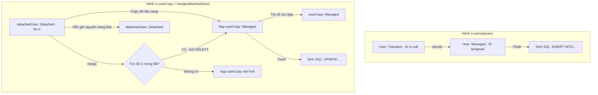

# Phân biệt sâu sắc merge() và persist() trong JPA/Hibernate

## ⚡ Tóm tắt ngắn (30s)
*   **`persist(entity)` (Khởi tạo Managed)**: Chỉ chấp nhận thực thể ở trạng thái **Transient** (đối tượng mới `new`). Nó chuyển đối tượng đó thành trạng thái **Managed** trong Persistence Context để chuẩn bị chèn mới (`INSERT`). Phương thức này trả về kiểu `void`, và bản thân chính đối tượng truyền vào sẽ trở thành Managed.
*   **`merge(entity)` (Hợp nhất dữ liệu)**: Được thiết kế cho thực thể ở trạng thái **Detached** (đã có ID nhưng nằm ngoài Session). Nó truy vấn bản ghi tương ứng dưới DB (hoặc L1 cache) để lấy ra một thực thể Managed song song, **copy toàn bộ dữ liệu** từ thực thể Detached vào thực thể Managed đó, rồi trả về thực thể Managed mới này.
*   **Cảnh báo nghiêm trọng**: Bản thân đối tượng gốc truyền vào hàm `merge()` **vẫn tiếp tục ở trạng thái Detached**. Chỉ có đối tượng sao chép trả về từ hàm `merge()` mới ở trạng thái Managed.
*   **Ghi phạt hiệu năng**: Dùng `merge()` cho thực thể mới chèn sẽ ép buộc Hibernate gửi một câu lệnh `SELECT` kiểm tra tồn tại vô ích trước khi `INSERT`.

---

## 🔍 Chi tiết bản chất thực chiến

### 1. Bản chất cơ học của persist() và merge()

Hãy xem sự khác biệt vật lý trên RAM và dưới SQL khi thực thi hai phương thức này:



### 2. Spring Data JPA repository.save() hoạt động thế nào dưới nền?

Spring Data JPA ẩn giấu hai phương thức này đằng sau hàm tiện ích `save()`. Lớp `SimpleJpaRepository` của Spring thực thi logic như sau:

```java
@Transactional
@Override
public <S extends T> S save(S entity) {
    if (entityInformation.isNew(entity)) {
        // 1. Nếu là thực thể mới (ID null hoặc cấu hình isNewCustom = true)
        em.persist(entity);
        return entity;
    } else {
        // 2. Nếu đã có ID (Thực thể cũ hoặc Detached)
        return em.merge(entity);
    }
}
```

---

## 💻 Code thực chiến: BAD vs GOOD trong sử dụng merge/persist

### ❌ BAD: Dùng sai đối tượng sau khi gọi merge() và dùng save() sai cách cho thực thể mới có sẵn ID
Lập trình viên gọi `merge()` và tiếp tục chỉnh sửa đối tượng gốc truyền vào, hoặc sử dụng `save()` cho thực thể mới nhưng đã được gán sẵn ID vật lý (ví dụ: dùng mã UUID gán tay), gây ra câu lệnh SELECT kiểm tra dư thừa.

```java
@Service
public class UserService {
    @PersistenceContext
    private EntityManager entityManager;
    private final UserRepository userRepository;

    public UserService(UserRepository userRepository) {
        this.userRepository = userRepository;
    }

    @Transactional
    public void updateUserBad(User detachedUser) {
        // Anti-pattern 1: Nghĩ rằng detachedUser sẽ trở thành managed sau khi gọi merge
        entityManager.merge(detachedUser); 
        
        // Dòng này vô nghĩa! Vì detachedUser vẫn là Detached. Thay đổi này không được lưu!
        detachedUser.setName("Senior Dev"); 
    }

    @Transactional
    public void createNewUserWithCustomIdBad(String customId, String name) {
        User user = new User();
        user.setId(customId); // Gán sẵn ID vật lý (UUID)
        user.setName(name);

        // Anti-pattern 2: Gọi save(). Vì Spring thấy ID khác null, nó phán đoán đây là 
        // thực thể Detached cũ và gọi merge(). merge() ép DB chạy câu SELECT kiểm tra tồn tại 
        // trước khi chèn INSERT. Tốn 2 câu lệnh mạng vô ích!
        userRepository.save(user); 
    }
}
```

---

###  GOOD: Sử dụng đối tượng trả về của `merge()` và tối ưu hóa tạo mới thực thể có ID

```java
@Service
public class UserService {
    @PersistenceContext
    private EntityManager entityManager;

    @Transactional
    public User updateUserGood(User detachedUser) {
        // Đúng đắn 1: Luôn hứng lấy thực thể Managed trả về từ hàm merge()
        User managedUser = entityManager.merge(detachedUser);
        
        // Đúng đắn 2: Mọi chỉnh sửa tiếp theo phải thực hiện trên thực thể Managed này!
        managedUser.setName("Senior Dev"); 
        
        return managedUser; // Trả về đối tượng Managed sạch sẽ
    }

    @Transactional
    public void createNewUserWithCustomIdGood(String customId, String name) {
        User user = new User();
        user.setId(customId);
        user.setName(name);

        // Đúng đắn 3: Ép buộc sử dụng persist() trực tiếp thông qua EntityManager 
        // để chèn thẳng INSERT mà không tốn câu lệnh SELECT kiểm tra tồn tại!
        entityManager.persist(user); 
    }
}
```

---

## 📊 Bảng so sánh toàn diện persist() và merge()

| Tiêu chí | persist(entity) | merge(entity) |
| :--- | :--- | :--- |
| **Trạng thái đầu vào phù hợp** | **Transient** (Đối tượng mới `new`) | **Detached** (Thực thể cũ ngoài session) |
| **Kiểu trả về (Return Type)** | `void` | **Thực thể Managed mới** (`S extends T`) |
| **Trạng thái thực thể truyền vào**| Chuyển thành **Managed** | **Vẫn giữ nguyên là Detached** |
| **Có gửi câu SELECT trước không?**| **Không bao giờ** (Chèn thẳng INSERT) | **Có** (SELECT kiểm tra trước khi UPDATE/INSERT) |
| **Lệnh SQL sinh ra khi commit** | `INSERT INTO...` | `UPDATE...` hoặc `INSERT INTO...` |

---

## ⚠️ Common Gotchas & Questions follow-up

### 1. Cạm bẫy "Bản sao vô hình" (The Invisible Copy) của hàm Merge
*   **Vấn đề**: Bạn gọi `User merged = entityManager.merge(detachedUser)`. Sau đó, bạn đưa đối tượng `detachedUser` ban đầu vào một Collection hoặc trả về trực tiếp cho Client. Client chỉnh sửa dữ liệu trên màn hình và gửi lại. Tuy nhiên, mọi thay đổi tiếp theo của client đều bị lỗi hoặc không khớp phiên bản (Optimistic Lock).
    *   *Tại sao?* Vì `detachedUser` và `merged` là hai đối tượng vật lý hoàn toàn khác nhau trên RAM. Chỉ có `merged` được đồng bộ với L1 Cache. `detachedUser` gốc đã bị mồ côi và không còn bất kỳ mối liên hệ nào với Hibernate Session.
*   **Giải pháp**: Bất kỳ khi nào gọi `merge()`, hãy **lập tức loại bỏ tham chiếu đến đối tượng cũ** và chỉ sử dụng duy nhất đối tượng trả về mới.

### 2. Câu hỏi đào sâu từ interviewer

*   **Q: Làm thế nào để cấu hình Spring Data JPA `save()` hoạt động tối ưu (không chạy SELECT kiểm tra trước khi INSERT) khi chúng ta thiết kế hệ thống sử dụng khóa chính tự sinh gán thủ công (UUID hoặc String Id gán tay)?**
    *   *Trả lời*: Đây là một câu hỏi thực chiến cực kỳ sâu sắc. Mặc định, Spring Data dùng thuộc tính ID khác `null` để phân biệt thực thể cũ hay mới. Nếu ta gán UUID thủ công trước khi lưu, Spring Data sẽ luôn gọi `merge()` gây chậm hiệu năng do tốn câu lệnh SELECT.
    *   Để xử lý tối ưu, chúng ta có 2 phương án:
        1.  **Cách 1: Triển khai Interface `Persistable<ID>` trên Entity**:
            *   Thực thể Entity của chúng ta sẽ kế thừa `Persistable<String>` và ghi đè phương thức `isNew()`.
            *   Ta thêm một trường `@Transient private boolean isNew = true;` trong Entity.
            *   Ghi đè `isNew()` để trả về trường này. Sau khi nạp từ DB lên (sử dụng callback `@PostLoad`), ta set `isNew = false`.
            *   Spring Data JPA sẽ đọc phương thức `isNew()` này để quyết định gọi `persist()` tối ưu thay vì `merge()`.
        2.  **Cách 2: Sử dụng trực tiếp `EntityManager.persist()`**: Viết một Custom Repository và tiêm trực tiếp `EntityManager` vào để gọi `persist()` thủ công cho các tác vụ tạo mới có gán sẵn ID, bỏ qua hoàn toàn hàm `save()` mặc định của Spring Data.
