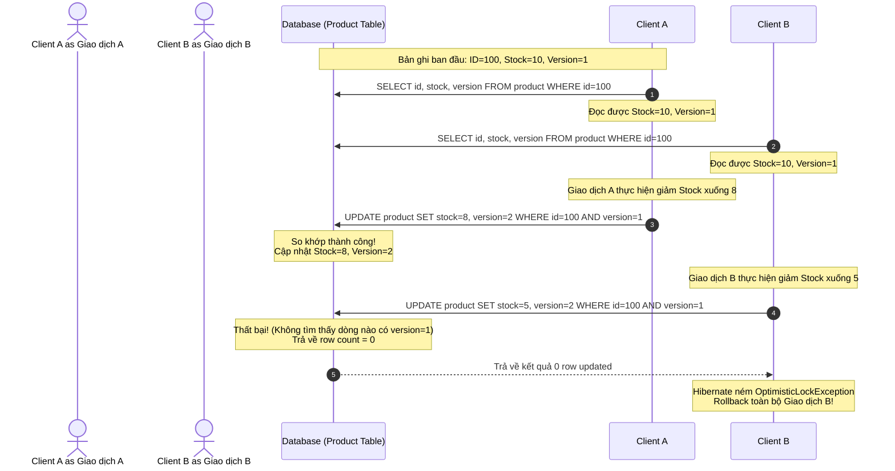

# Cơ chế Optimistic Locking với @Version trong JPA/Hibernate

## ⚡ Tóm tắt ngắn (30s)
*   **Bản chất**: Optimistic Locking (Khóa lạc quan) là giải pháp kiểm soát giao dịch đồng thời mà **không khóa vật lý** các dòng dữ liệu ở mức Database. Nó giả định rằng xung đột ghi rất hiếm khi xảy ra.
*   **Cơ chế hoạt động**: Sử dụng một cột phiên bản (thường gắn tag `@Version` kiểu `Long` hoặc `Integer`). Khi thực hiện `UPDATE`, Hibernate sẽ tự động chèn thêm điều kiện so khớp phiên bản vào câu lệnh SQL: `UPDATE ... SET name = ?, version = version + 1 WHERE id = ? AND version = ?`.
*   **Kịch bản thất bại**: Nếu dòng dữ liệu đã bị giao dịch khác thay đổi trước đó, giá trị `version` dưới DB đã tăng lên. Câu lệnh `UPDATE` trên sẽ khớp 0 bản ghi. Hibernate nhận thấy số dòng bị thay đổi bằng 0 và lập tức ném ra `OptimisticLockException` (bọc ngoài `StaleObjectStateException`).
*   **Lựa chọn tối ưu**: Phù hợp cho ứng dụng có lưu lượng đọc lớn, ghi ít (Read-heavy, Write-light), giảm thiểu tối đa việc block kết nối DB so với Pessimistic Locking.

---

## 🔍 Chi tiết bản chất thực chiến

### 1. Luồng chạy đồng thời của Optimistic Locking
Hãy hình dung kịch bản hai giao dịch cùng muốn sửa đổi thông tin của cùng một thực thể (ví dụ: Số dư ví, số lượng hàng tồn kho) tại cùng một thời điểm:



### 2. Các tầng ngoại lệ trong Spring Data JPA
Khi xung đột xảy ra dưới hạ tầng JDBC, ngoại lệ được ném ra và bọc qua nhiều lớp từ dưới lên trên:
1.  **Tầng Driver/Hibernate**: Ném `org.hibernate.StaleObjectStateException` khi row count bằng 0.
2.  **Tầng JPA tiêu chuẩn**: Chuyển đổi thành `jakarta.persistence.OptimisticLockException`.
3.  **Tầng Spring Framework**: Bọc lại thành `org.springframework.orm.ObjectOptimisticLockingFailureException` (một nhánh của `DataAccessException`) để dễ dàng tích hợp và quản lý thống nhất.

---

## 💻 Code thực chiến: BAD vs GOOD trong xử lý Optimistic Locking

### ❌ BAD: Dùng kiểu dữ liệu Version không tối ưu và bỏ mặc không bắt exception
Sử dụng kiểu dữ liệu `Date` hoặc `Timestamp` làm phiên bản dễ bị sai lệch do độ chính xác mili-giây phụ thuộc hệ điều hành/cơ sở dữ liệu. Đồng thời, không bắt ngoại lệ khiến ứng dụng bị crash trực tiếp và hiển thị lỗi 500 cho Client.

```java
@Entity
public class ProductBad {
    @Id
    private Long id;
    private String name;
    private int stock;

    // Anti-pattern 1: Dùng Timestamp làm Version.
    // Độ phân giải thời gian của một số Database cũ (như MySQL < 5.6.4) chỉ chính xác tới giây, 
    // khiến các giao dịch diễn ra trong cùng 1 giây dễ dàng vượt qua chốt chặn bảo vệ!
    @Version
    private Date lastUpdated; 
}

@Service
public class ProductServiceBad {
    @Autowired
    private ProductRepositoryBad repository;

    @Transactional
    public void updateStockBad(Long id, int quantity) {
        ProductBad product = repository.findById(id).orElseThrow();
        product.setStock(product.getStock() - quantity);
        // Anti-pattern 2: Không hề bắt ngoại lệ xử lý xung đột ghi đồng thời.
        // Khi xảy ra tranh chấp, transaction rollback và client nhận lỗi HTTP 500 ghê rợn.
        repository.save(product);
    }
}
```

---

###  GOOD: Sử dụng kiểu Long và cơ chế tự động Retry sạch sẽ
Kiểu số nguyên (`Long`/`Integer`) là lựa chọn tối ưu, an toàn tuyệt đối. Chúng ta thiết lập cơ chế tự động retry transaction bằng Spring Retry khi phát hiện xung đột.

```java
@Entity
@Table(name = "products")
public class ProductGood {
    @Id
    @GeneratedValue(strategy = GenerationType.IDENTITY)
    private Long id;
    
    private String name;
    private int stock;

    // Đúng đắn 1: Sử dụng kiểu số nguyên tăng dần (Long) làm phiên bản.
    // Đảm bảo chính xác tuyệt đối, hiệu năng so khớp cực kỳ cao.
    @Version
    private Long version;
    
    // Getters, Setters
}

@Service
public class ProductServiceGood {
    private final ProductRepositoryGood repository;

    public ProductServiceGood(ProductRepositoryGood repository) {
        this.repository = repository;
    }

    // Đúng đắn 2: Tích hợp @Retryable để tự động chạy lại transaction khi bị xung đột.
    // maxAttempts = 3 nghĩa là thử tối đa 3 lần. delay = 100ms giãn cách giữa các lần thử.
    // CHÚ Ý: @Retryable phải nằm ngoài @Transactional để mỗi lần thử là một Transaction mới tinh!
    @Retryable(
        retryFor = { ObjectOptimisticLockingFailureException.class },
        maxAttempts = 3,
        backoff = @Backoff(delay = 100)
    )
    @Transactional
    public void updateStockGood(Long id, int quantity) {
        ProductGood product = repository.findById(id)
            .orElseThrow(() -> new EntityNotFoundException("Không tìm thấy sản phẩm"));
        
        if (product.getStock() < quantity) {
            throw new IllegalArgumentException("Hàng tồn kho không đủ");
        }
        
        product.setStock(product.getStock() - quantity);
        // Không cần gọi repository.save() thủ công, Dirty Checking sẽ tự kích hoạt UPDATE kèm Version!
    }
}
```

---

## 📊 Bảng so sánh Optimistic Locking và Pessimistic Locking

| Tiêu chí | Optimistic Locking (`@Version`) | Pessimistic Locking (`SELECT ... FOR UPDATE`) |
| :--- | :--- | :--- |
| **Cơ chế khóa** | Khóa logic tầng ứng dụng (không giữ khóa DB). | Khóa vật lý trực tiếp trên các dòng dữ liệu của DB. |
| **Hành vi luồng khác**| Vẫn đọc/ghi bình thường, chỉ bị báo lỗi lúc commit. | Bị block (chờ đợi) ngay lập tức khi cố truy cập dòng dữ liệu. |
| **Hiệu năng hệ thống** | **Cực cao** khi ít xảy ra xung đột. | Bị giảm mạnh do chiếm dụng kết nối và hàng đợi của DB. |
| **Khả năng mở rộng** | Rất tốt (Scalable), không chiếm dụng connection pool. | Kém, dễ gây nghẽn kết nối khi lượng truy cập tăng đột biến. |
| **Mối hiểm họa** | Thất bại ghi nhiều (cần cơ chế Retry). | **Deadlock** giữa các giao dịch cạnh tranh tài nguyên chéo. |
| **Kịch bản phù hợp** | Hệ thống Read-heavy (như Catalog, Profile). | Hệ thống Write-heavy, giá trị nhạy cảm (Giao dịch tài chính, Ví). |

---

## ⚠️ Common Gotchas & Questions follow-up

### 1. Cạm bẫy "Bỏ quên Version" khi cập nhật các quan hệ con (Collection)
*   **Vấn đề**: Bạn có một thực thể cha `Order` chứa danh sách con `@OneToMany List<OrderItem> items`. Khi bạn thêm một `OrderItem` mới vào danh sách, bạn mong đợi `version` của `Order` sẽ tăng lên để bảo vệ tính toàn vẹn của đơn hàng. Nhưng thực tế, **Hibernate không hề tăng version của Order!**
    *   *Tại sao?* Vì trường phiên bản `@Version` chỉ được tăng lên khi các thuộc tính trực tiếp (basic properties) của thực thể cha bị sửa đổi dưới DB. Việc chèn thêm dữ liệu vào bảng `order_items` (bảng phụ) không thay đổi bất kỳ cột nào trên bảng `orders`.
*   **Giải pháp**: Sử dụng cơ chế khóa thủ công hoặc chỉ định lock mode tăng version bắt buộc khi truy vấn:
    ```java
    // Sử dụng EntityManager để ép buộc tăng version của thực thể cha
    entityManager.lock(order, LockModeType.OPTIMISTIC_FORCE_INCREMENT);
    ```

### 2. Xung đột ngầm với các truy vấn Bulk Update (JPQL / Native SQL)
*   **Cạm bẫy**: Khi bạn sử dụng câu lệnh `@Modifying` kèm JPQL để cập nhật hàng loạt: `UPDATE Product p SET p.stock = p.stock - 1 WHERE p.category = :cat`.
    *   Hibernate **bỏ qua hoàn toàn** việc kiểm tra `@Version` và cũng không tự động tăng trường này lên. Điều này phá vỡ cơ chế an toàn của Optimistic Locking đối với các giao dịch đọc-ghi thông thường khác đang chạy song song.
*   **Giải pháp**: Phải tự cộng dồn version trong câu JPQL một cách thủ công nếu muốn duy trì cơ chế bảo vệ: `UPDATE Product p SET p.stock = p.stock - 1, p.version = p.version + 1 WHERE ...`.

### 3. Câu hỏi đào sâu từ interviewer
*   **Q: Tại sao phải đặt `@Retryable` bên ngoài `@Transactional`? Nếu đặt bên trong thì điều gì xảy ra?**
    *   *Trả lời*: Đây là một chi tiết kiến trúc vô cùng quan trọng.
    *   Nếu đặt `@Retryable` **bên trong** `@Transactional`, khi `OptimisticLockException` xảy ra, Transaction hiện tại đã bị đánh dấu là rollback-only tại tầng DB. Mọi nỗ lực retry kế tiếp của Spring Retry vẫn sẽ chạy bên trong chính Transaction hỏng đó, dẫn tới lỗi kết nối hoặc ngoại lệ chồng ngoại lệ mà không thể cứu vãn.
    *   Bằng cách đặt `@Retryable` **bên ngoài** `@Transactional`, khi Transaction đầu tiên thất bại và rollback hoàn toàn, Spring Retry sẽ bắt lấy ngoại lệ, kết thúc vòng đời Transaction hỏng đó, và khởi tạo một Transaction hoàn toàn mới tinh sạch sẽ ở lượt thử tiếp theo.
