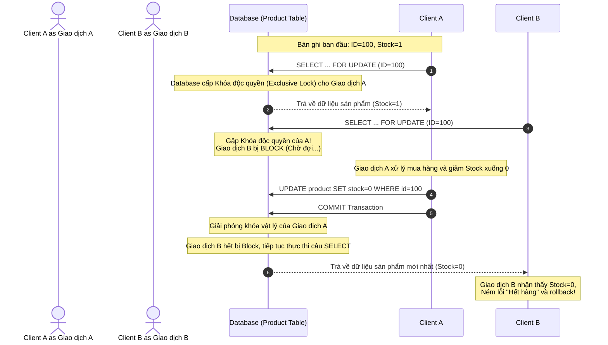

# Cơ chế Pessimistic Locking (Khóa bi quan) trong JPA/Hibernate

## ⚡ Tóm tắt ngắn (30s)
*   **Bản chất**: Pessimistic Locking (Khóa bi quan) ngăn chặn xung đột đồng thời bằng cách **thiết lập khóa vật lý trực tiếp** lên dòng dữ liệu ở mức Database thông qua câu lệnh SQL như `SELECT ... FOR UPDATE`. Nó giả định xung đột dữ liệu là chắc chắn xảy ra.
*   **Các mức độ khóa (LockModeType)**:
    *   `PESSIMISTIC_READ` (`FOR SHARE`): Khóa chia sẻ. Cho phép các luồng khác đọc nhưng chặn toàn bộ hành vi cập nhật (`UPDATE`/`DELETE`).
    *   `PESSIMISTIC_WRITE` (`FOR UPDATE`): Khóa độc quyền. Chặn toàn bộ hành vi đọc để cập nhật, sửa đổi từ luồng khác trên dòng dữ liệu đó.
    *   `PESSIMISTIC_FORCE_INCREMENT`: Khóa độc quyền vật lý đồng thời tự động tăng giá trị trường `@Version` ở cuối transaction (kết hợp tối ưu giữa bi quan và lạc quan).
*   **Ghi phạt hiệu năng**: Làm tắc nghẽn Database Connection Pool do giữ kết nối lâu hơn, tăng nguy cơ xảy ra lỗi nghẽn cổ chai và **Deadlock** (khóa chết). Chỉ dùng cho các hệ thống yêu cầu độ chính xác tuyệt đối như số dư tài khoản ví điện tử, quản lý tồn kho flash-sale.

---

## 🔍 Chi tiết bản chất thực chiến

### 1. Luồng chặn vật lý của Pessimistic Locking
Dưới đây là kịch bản hai giao dịch đồng thời cùng cố gắng tranh chấp khóa ghi độc quyền trên cùng một dòng sản phẩm:



### 2. Sự khác biệt vật lý ở mức câu lệnh SQL (PostgreSQL & MySQL InnoDB)

*   **`PESSIMISTIC_READ`**:
    *   **PostgreSQL**: Sinh câu lệnh `SELECT ... FOR SHARE`.
    *   **MySQL**: Sinh câu lệnh `SELECT ... LOCK IN SHARE MODE`.
    *   *Ứng dụng*: Khi bạn muốn đảm bảo dữ liệu đọc lên không bị giao dịch khác thay đổi trong lúc bạn đang tính toán (Read-consistency), nhưng bạn không có ý định cập nhật trực tiếp dòng này.
*   **`PESSIMISTIC_WRITE`**:
    *   **PostgreSQL & MySQL**: Sinh câu lệnh `SELECT ... FOR UPDATE`.
    *   *Ứng dụng*: Chặn đứng tất cả các luồng khác sửa đổi dữ liệu dòng này trước khi bạn thực hiện cập nhật.
*   **Chiến lược tránh xếp hàng dài vô hạn (Timeout & Skip Locked)**:
    *   Mặc định, khi một dòng đã bị khóa độc quyền, luồng thứ hai gọi `FOR UPDATE` sẽ bị treo vĩnh viễn chờ cho đến khi giao dịch thứ nhất commit hoặc timeout của DB xảy ra.
    *   **NOWAIT** (`FOR UPDATE NOWAIT`): Lập tức trả về lỗi nếu dòng đã bị khóa, không chịu chờ đợi.
    *   **SKIP LOCKED** (`FOR UPDATE SKIP LOCKED`): Bỏ qua những dòng đang bị khóa, chỉ nạp lên những dòng tự do. Đây là xương sống để xây dựng hệ thống hàng đợi (Message Queue / Job Queue) hiệu năng cao trên RDBMS.

---

## 💻 Code thực chiến: BAD vs GOOD trong sử dụng Pessimistic Locking

### ❌ BAD: Dùng sai PESSIMISTIC_READ cho tác vụ Update gây Deadlock hàng loạt
Lập trình viên sử dụng khóa đọc (`PESSIMISTIC_READ`) để truy vấn số dư ví, sau đó thực hiện cộng trừ tiền. Khi hai giao dịch chạy song song cùng đọc thành công, đến bước cập nhật, cả hai đều cố gắng nâng cấp từ khóa đọc lên khóa ghi độc quyền, dẫn đến tình trạng khóa chéo lẫn nhau (Deadlock).

```java
@Repository
public interface WalletRepositoryBad extends JpaRepository<Wallet, Long> {
    
    // Anti-pattern 1: Dùng PESSIMISTIC_READ cho tác vụ sắp cập nhật dữ liệu.
    // Khi hai Thread cùng đọc dòng này, cả hai đều có Share Lock.
    // Đến khi Thread 1 muốn UPDATE, nó phải chờ Thread 2 nhả Share Lock.
    // Thread 2 cũng muốn UPDATE và phải chờ Thread 1 nhả Share Lock. 
    // Hệ quả: DEADLOCK!
    @Lock(LockModeType.PESSIMISTIC_READ)
    @Query("SELECT w FROM Wallet w WHERE w.id = :id")
    Optional<Wallet> findByIdForUpdateBad(@Param("id") Long id);
}

@Service
public class WalletServiceBad {
    @Autowired
    private WalletRepositoryBad walletRepository;

    @Transactional
    public void deductMoneyBad(Long walletId, BigDecimal amount) {
        Wallet wallet = walletRepository.findByIdForUpdateBad(walletId).orElseThrow();
        wallet.setBalance(wallet.getBalance().subtract(amount));
        // Lệnh update này sẽ kích hoạt nâng cấp khóa và gây crash hệ thống do Deadlock!
    }
}
```

---

###  GOOD: Sử dụng PESSIMISTIC_WRITE kết hợp cấu hình Timeout an toàn
Sử dụng khóa ghi độc quyền trực tiếp kèm theo cấu hình Query Hint giới hạn thời gian chờ khóa (`lock timeout`). Nếu quá hạn không lấy được khóa, hệ thống lập tức ném lỗi thay vì treo luồng làm nghẽn toàn bộ ứng dụng.

```java
@Repository
public interface WalletRepositoryGood extends JpaRepository<Wallet, Long> {

    // Đúng đắn 1: Sử dụng PESSIMISTIC_WRITE đảm bảo khóa ghi độc quyền ngay từ đầu.
    // Chặn đứng hoàn toàn luồng khác không cho xen vào đọc để cập nhật.
    @Lock(LockModeType.PESSIMISTIC_WRITE)
    @QueryHints({
        // Đúng đắn 2: Thiết lập thời gian chờ khóa tối đa là 3000ms (3 giây).
        // Tránh tình trạng luồng bị treo vĩnh viễn gây cạn kiệt Connection Pool.
        @QueryHint(name = "jakarta.persistence.lock.timeout", value = "3000")
    })
    @Query("SELECT w FROM Wallet w WHERE w.id = :id")
    Optional<Wallet> findByIdForUpdateGood(@Param("id") Long id);
}

@Service
public class WalletServiceGood {
    private final WalletRepositoryGood walletRepository;

    public WalletServiceGood(WalletRepositoryGood walletRepository) {
        this.walletRepository = walletRepository;
    }

    @Transactional
    public void deductMoneyGood(Long walletId, BigDecimal amount) {
        try {
            Wallet wallet = walletRepository.findByIdForUpdateGood(walletId)
                .orElseThrow(() -> new EntityNotFoundException("Ví không tồn tại"));
            
            if (wallet.getBalance().compareTo(amount) < 0) {
                throw new IllegalArgumentException("Số dư không đủ");
            }
            
            wallet.setBalance(wallet.getBalance().subtract(amount));
        } catch (PessimisticLockException ex) {
            // Đúng đắn 3: Bắt ngoại lệ timeout chủ động để xử lý retry hoặc phản hồi thân thiện.
            throw new RuntimeException("Hệ thống đang bận xử lý giao dịch khác, vui lòng thử lại sau!", ex);
        }
    }
}
```

---

## 📊 Bảng so sánh các LockModeType trong JPA

| Đặc tính so sánh | `PESSIMISTIC_READ` | `PESSIMISTIC_WRITE` | `PESSIMISTIC_FORCE_INCREMENT` |
| :--- | :--- | :--- | :--- |
| **SQL tương ứng (Postgres)** | `SELECT ... FOR SHARE` | `SELECT ... FOR UPDATE` | `SELECT ... FOR UPDATE` |
| **Cho đọc đồng thời không?**| **Có** (Các luồng chỉ đọc vẫn chạy được). | **Không** (Chặn các luồng đọc dùng khóa ghi).| **Không** (Khóa ghi độc quyền tuyệt đối). |
| **Cho ghi đồng thời không?**| **Không** (Bị block chờ đến khi nhả khóa).| **Không** (Bị block hoàn toàn). | **Không** (Bị block hoàn toàn). |
| **Tự tăng `@Version`?** | Không. | Không. | **Có** (Ép buộc tăng version dù không thay đổi gì). |
| **Nguy cơ Deadlock** | **Cực kỳ cao** nếu nâng cấp khóa ghi. | Trung bình (nếu sắp xếp thứ tự lấy khóa sai). | Thấp (thường dùng khóa thô diện rộng). |
| **Ứng dụng thực chiến** | Đọc báo cáo dữ liệu tĩnh đang cập nhật. | Tranh chấp ví tiền, vé tàu xe, kho hàng. | Bảo vệ quan hệ Parent-Child toàn vẹn. |

---

## ⚠️ Common Gotchas & Questions follow-up

### 1. Cạm bẫy "Khóa ngoài Transaction" (Out of Transaction Boundary)
*   **Vấn đề**: Bạn gọi `walletRepository.findByIdForUpdateGood(id)` trong một Controller hoặc một Service không có annotation `@Transactional`. Ứng dụng chạy không hề báo lỗi, nhưng thực tế **không có bất kỳ dòng nào được khóa vật lý dưới DB!**
    *   *Tại sao?* Khóa bi quan được quản lý hoàn toàn dựa trên vòng đời kết nối của Database Transaction (`autocommit = false`). Khi không có `@Transactional`, Spring Data JPA sẽ mở một transaction tạm để chạy xong câu SELECT và lập tức commit/close ngay sau đó. Khóa độc quyền bị giải phóng ngay lập tức trước khi bạn kịp làm việc gì tiếp theo.
*   **Giải pháp**: Phải luôn đảm bảo các phương thức gọi truy vấn Pessimistic Lock bắt buộc phải nằm trong ranh giới của một `@Transactional` hợp lệ.

### 2. Thiết kế hàng đợi phi chặn (Non-blocking Queue) bằng SKIP LOCKED
*   **Kịch bản**: Bạn có bảng `JobQueue` chứa hàng triệu công việc cần xử lý. Bạn chạy 10 Worker song song quét bảng này để nhặt job xử lý. Nếu dùng `FOR UPDATE` thông thường, cả 10 Worker sẽ tranh nhau dòng đầu tiên, 9 Worker bị block chờ Worker 1 hoàn thành, dẫn đến nghẽn cổ chai nghiêm trọng.
*   **Giải pháp**: Sử dụng cơ chế Native Query với `SKIP LOCKED` để các Worker tự động bỏ qua những dòng đang bị khóa:
    ```java
    @Query(value = "SELECT * FROM jobs j WHERE j.status = 'PENDING' LIMIT 1 FOR UPDATE SKIP LOCKED", nativeQuery = true)
    Optional<Job> findNextJobToProcess();
    ```

### 3. Câu hỏi đào sâu từ interviewer
*   **Q: Nếu hai transaction đồng thời chạy câu lệnh UPDATE trực tiếp (không thông qua SELECT FOR UPDATE trước đó), thì cơ chế khóa nào sẽ hoạt động dưới DB?**
    *   *Trả lời*: Dưới cơ sở dữ liệu quan hệ (như MySQL InnoDB hay PostgreSQL), bản thân bất kỳ câu lệnh sửa đổi dữ liệu nào (`UPDATE`, `DELETE`) đều tự động ngầm kích hoạt một khóa ghi độc quyền vật lý (`Exclusive Lock` / `Write Lock`) trên các dòng dữ liệu bị ảnh hưởng cho đến khi transaction kết thúc.
    *   Do đó, nếu hai transaction chạy `UPDATE products SET stock = stock - 1 WHERE id = 1` song song, câu lệnh thứ hai sẽ tự động bị chặn vật lý dưới DB (xếp hàng chờ) giống hệt như cơ chế `PESSIMISTIC_WRITE`, ngay cả khi lập trình viên không hề khai báo `@Lock` trên code Java.
