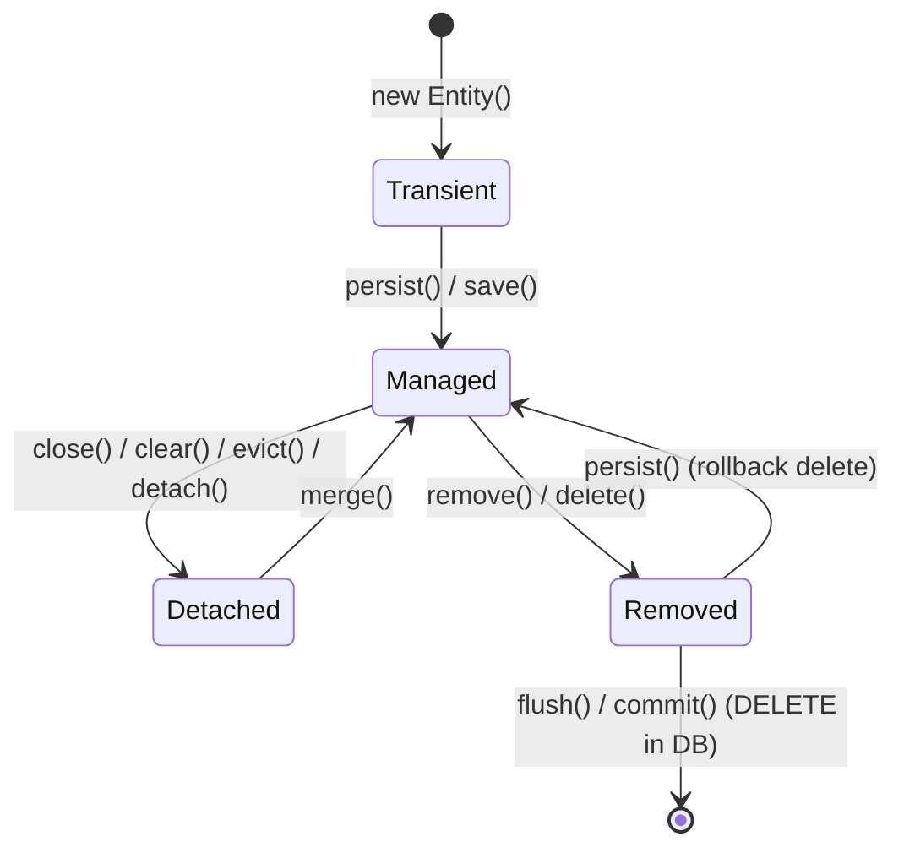

# Vòng đời của Entity (Entity Lifecycle) trong JPA/Hibernate

## ⚡ Tóm tắt ngắn (30s)
Vòng đời của một Entity trong JPA được quản lý chặt chẽ bởi **Persistence Context (Context kiên định)** thông qua 4 trạng thái cốt lõi:
1.  **Transient (Tạm thời)**: Đối tượng mới được tạo bằng từ khóa `new`. Chưa có định danh ID trong database, chưa nằm trong Persistence Context.
2.  **Managed (Được quản lý)**: Đối tượng đã nằm trong Persistence Context và có ID tương ứng dưới database. Mọi thay đổi trên thuộc tính của đối tượng sẽ được Hibernate tự động đồng bộ xuống DB (Dirty Checking) khi flush/commit transaction.
3.  **Detached (Bị tách rời)**: Đối tượng đã từng ở trạng thái Managed nhưng Session/Transaction quản lý nó đã bị đóng lại hoặc bị xóa (`clear`/`evict`). Các thay đổi trên đối tượng này không còn được Hibernate theo dõi hay tự động lưu nữa.
4.  **Removed (Đã xóa)**: Đối tượng được đánh dấu để xóa khỏi Database (`remove`). Thực tế câu lệnh `DELETE` sẽ chỉ chạy khi transaction thực hiện flush hoặc commit.

---

## 🔍 Chi tiết bản chất thực chiến

### 1. Sơ đồ chuyển đổi trạng thái (State Transition Flowchart)

Hiểu rõ cách thức dịch chuyển giữa các trạng thái là chìa khóa để làm chủ hiệu năng JPA và tránh các ngoại lệ runtime kinh điển:



### 2. Bản chất sâu xa của từng trạng thái vật lý

*   **Transient**: Chỉ tồn tại trên bộ nhớ RAM như một đối tượng POJO bình thường. Nếu ứng dụng gặp sự cố hoặc đối tượng bị Garbage Collector thu gom, dữ liệu sẽ mất vĩnh viễn. Không có liên kết nào đến cơ sở dữ liệu.
*   **Managed**: Đây là trạng thái quyền lực nhất. Đối tượng được liên kết với một hàng (row) duy nhất trong Database và được định danh bằng `@Id`. Persistence Context hoạt động như một tấm gương: nó giữ một bản chụp trạng thái ban đầu của Entity (Snapshot) khi nạp vào RAM. Khi transaction kết thúc, Hibernate sẽ so sánh trạng thái hiện tại với bản chụp này (gọi là **Dirty Checking**) để tự sinh ra câu lệnh `UPDATE` phù hợp mà không cần lập trình viên can thiệp.
*   **Detached**: Đối tượng vẫn giữ nguyên dữ liệu và ID của nó, nhưng liên kết vật lý với Session đã bị cắt đứt. Điều này thường xảy ra khi:
    *   Transaction kết thúc (ở các ứng dụng web truyền thống không dùng Open Session in View).
    *   Gọi `entityManager.clear()` để giải phóng toàn bộ Persistence Context.
    *   Gọi `entityManager.detach(entity)` để đưa một entity cụ thể ra ngoài tầm quản lý.
*   **Removed**: Đối tượng vẫn nằm trong Persistence Context nhưng được đánh dấu sẽ bị xóa. Hibernate hoãn việc chạy lệnh `DELETE` vật lý cho đến giây phút cuối cùng của Transaction để tối ưu hóa hiệu năng I/O đĩa.

---

## 💻 Code thực chiến: BAD vs GOOD trong quản lý vòng đời

### ❌ BAD: Gọi phương thức `save()` vô tội vạ và nhầm lẫn về trạng thái Detached
Một lỗi cực kỳ phổ biến của Junior Developer là luôn gọi `repository.save(entity)` mỗi khi thay đổi dữ liệu, hoặc thay đổi thuộc tính của một Detached Entity và nghĩ rằng nó sẽ tự cập nhật vào database.

```java
@Service
public class OrderService {
    private final OrderRepository orderRepository;

    public OrderService(OrderRepository orderRepository) {
        this.orderRepository = orderRepository;
    }

    @Transactional
    public void updateOrderStatusBad(Long orderId, String newStatus) {
        // 1. Nạp Entity lên RAM -> Trạng thái MANAGED
        Order order = orderRepository.findById(orderId)
                .orElseThrow(() -> new EntityNotFoundException());

        // 2. Thay đổi thuộc tính
        order.setStatus(newStatus);

        // Anti-pattern: Gọi save() dư thừa trên Managed Entity. 
        // Lệnh này không cần thiết vì Hibernate tự động chạy UPDATE khi kết thúc method (commit).
        // Gọi save() ở đây làm loãng code và có thể kích hoạt các câu SELECT không mong muốn dưới nền.
        orderRepository.save(order); 
    }

    public void modifyDetachedEntityBad(Order detachedOrder) {
        // Giả sử detachedOrder được truyền từ Controller (sau khi kết thúc transaction trước đó)
        detachedOrder.setStatus("SHIPPED");
        
        // Anti-pattern: Nghĩ rằng thay đổi trên detachedOrder sẽ tự lưu vào DB.
        // Thực tế: Không có bất kỳ câu lệnh SQL nào được sinh ra vì entity đang ở trạng thái DETACHED.
    }
}
```

###  GOOD: Tận dụng Dirty Checking và sử dụng `merge()` đúng cách cho Detached Entity

```java
@Service
public class OrderService {
    private final OrderRepository orderRepository;
    private final EntityManager entityManager;

    public OrderService(OrderRepository orderRepository, EntityManager entityManager) {
        this.orderRepository = orderRepository;
        this.entityManager = entityManager;
    }

    @Transactional
    public void updateOrderStatusGood(Long orderId, String newStatus) {
        // 1. Nạp Entity -> Trạng thái MANAGED
        Order order = orderRepository.findById(orderId)
                .orElseThrow(() -> new EntityNotFoundException());

        // 2. Chỉ cần set giá trị mới.
        order.setStatus(newStatus); 
        
        // KHÔNG gọi save(). Khi kết thúc phương thức này, Transaction AOP của Spring
        // sẽ commit, kích hoạt Hibernate Dirty Checking tự động sinh ra SQL UPDATE.
    }

    @Transactional
    public Order updateDetachedEntityGood(Order detachedOrder) {
        // Đối với Detached Entity, ta phải đưa nó trở lại MANAGED bằng merge()
        // merge() KHÔNG chuyển bản thân detachedOrder thành managed, mà nó sẽ:
        // 1. Tìm trong L1 Cache hoặc DB xem có Entity nào cùng ID không.
        // 2. Copy dữ liệu từ detachedOrder vào Entity managed tìm được.
        // 3. Trả về thực thể Managed mới (managedCopy).
        Order managedCopy = entityManager.merge(detachedOrder);
        
        return managedCopy; // Mọi thay đổi tiếp theo trên managedCopy sẽ được tự động lưu
    }
}
```

---

## 📊 Bảng so sánh các trạng thái vòng đời

| Tiêu chí | Transient | Managed | Detached | Removed |
| :--- | :--- | :--- | :--- | :--- |
| **Nằm trong Persistence Context?** | Không | **Có** | Không | **Có** (Đánh dấu xóa) |
| **Đã có bản ghi dưới Database?** | Không | **Có** | **Có** | Sẽ bị xóa khi flush |
| **Có giá trị định danh ID?** | Thường là `null` | **Có** | **Có** | **Có** |
| **Tự động đồng bộ (Dirty Checking)?**| Không | **Có** | Không | Không |
| **Lệnh chuyển trạng thái chính** | `new Entity()` | `persist()`, `find()`, `merge()`| `clear()`, `detach()` | `remove()` |

---

## ⚠️ Common Gotchas & Questions follow-up

### 1. Cạm bẫy "LazyInitializationException" của Detached Entity
*   **Vấn đề**: Khi một Entity chuyển sang trạng thái **Detached** (sau khi đóng Session), nếu bạn cố truy cập vào một thuộc tính được cấu hình `FetchType.LAZY` (ví dụ: `user.getRoles()`), Hibernate sẽ ném ra ngoại lệ `LazyInitializationException` vì Session vật lý để tải dữ liệu bổ sung đó không còn tồn tại nữa.
*   **Giải pháp**: Sử dụng `JOIN FETCH` hoặc `@EntityGraph` để nạp đầy đủ (Eagerly fetch) các quan hệ cần thiết trước khi đóng Session/kết thúc Transaction.

### 2. Câu hỏi đào sâu từ interviewer

*   **Q: Điều gì xảy ra khi tôi gọi `persist()` lên một Transient Entity có ID được sinh tự động bằng `@GeneratedValue(strategy = GenerationType.IDENTITY)`?**
    *   *Trả lời*: Thông thường, Hibernate sẽ hoãn các lệnh ghi (`INSERT`) cho đến khi transaction flush/commit để gom lô (batching). Tuy nhiên, với chiến lược khóa chính tự động tăng `IDENTITY`, database cần thực thi câu lệnh chèn dữ liệu vật lý thì mới sinh ra được ID mới. Do đó, để gán được ID cho Entity ngay khi nó chuyển sang trạng thái **Managed**, Hibernate buộc phải phá vỡ cơ chế hoãn ghi (Write-Behind) và **chạy lập tức câu lệnh INSERT** xuống database ngay tại thời điểm gọi `persist()`. Đây là một đánh đổi hiệu năng cực lớn cần lưu ý khi thiết kế hệ thống ghi lượng lớn dữ liệu (bulk insert).
