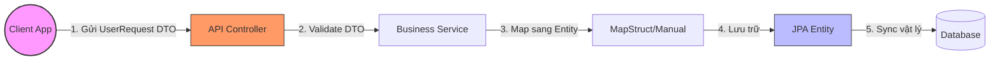

# Tại sao không bao giờ nên expose Entity trực tiếp ra bên ngoài API?

## ⚡ Tóm tắt ngắn (30s)
*   **Nguyên nhân cốt lõi**: JPA Entity là bản thiết kế đại diện cho **tầng lưu trữ vật lý** dưới Database. API JSON lại là cam kết dịch vụ đại diện cho **tầng hiển thị và giao tiếp** với Client. Việc phơi bày trực tiếp Entity ra ngoài API là một phản hoa văn (Anti-pattern) cực kỳ nguy hiểm.
*   **Các thảm họa bảo mật & hiệu năng**:
    1.  **Tấn công Over-posting**: Client có thể tự ý chèn thêm các trường nhạy cảm trong JSON gửi lên (ví dụ: `role: "ADMIN"`, `balance: 9999999`) và Hibernate Dirty Checking sẽ âm thầm cập nhật nó xuống DB.
    2.  **Rò rỉ thông tin nhạy cảm**: Vô tình trả về `password_hash`, `salt`, `internal_status` cho người dùng.
    3.  **Lỗi vòng lặp Jackson (`StackOverflowError`)**: Quan hệ hai chiều (ví dụ: `User` có danh sách `Order`, `Order` có thuộc tính `User`) tạo thành vòng tuần tự hóa vô hạn khi chuyển dịch thành JSON.
    4.  **Lỗi `LazyInitializationException`**: Jackson cố quét qua các trường lazy-loaded để sinh JSON sau khi Hibernate Session đã đóng.
*   **Giải pháp vàng**: Luôn thiết lập một lớp trung gian **DTO (Data Transfer Object)** kết hợp các công cụ ánh xạ dữ liệu như **MapStruct** để phân tách hoàn toàn tầng DB và tầng API.

---

## 🔍 Chi tiết bản chất thực chiến

### 1. Phân tách kiến trúc đa tầng (Decoupled Layer Architecture)
Để xây dựng một hệ thống bền vững, dữ liệu đi vào và đi ra phải được kiểm soát nghiêm ngặt qua các chốt chặn:



### 2. Các rủi ro kỹ thuật chi tiết
*   **Lỗ hổng Over-posting (Mass Assignment)**:
    Khi Controller nhận tham số đầu vào trực tiếp là một JPA Entity: `@PostMapping public void updateProfile(@RequestBody User user)`. 
    Nếu đối tượng `user` này có ID, Hibernate sẽ tự động nạp nó từ DB lên, sau đó Jackson ghi đè toàn bộ dữ liệu Client gửi lên đè lên các thuộc tính Entity. Nếu kẻ tấn công cố tình sửa đổi payload JSON để thêm trường `isAdmin = true`, do thực thể đang ở trạng thái Managed, cơ chế Dirty Checking của Hibernate sẽ cập nhật cột này xuống DB ngay khi commit giao dịch.
*   **Tuần tự hóa vòng lặp (Circular Dependency)**:
    Khi đối tượng JSON được tạo bởi thư viện Jackson, nó sẽ gọi đệ quy getter của các thuộc tính.
    `User.getOrders()` -> Gọi getter từng `Order` -> `Order.getUser()` -> Gọi `User.getOrders()` -> ... 
    Vòng lặp này tiếp diễn vô tận trên bộ nhớ RAM cho đến khi gây ra lỗi **`java.lang.StackOverflowError`** làm sập luồng xử lý của Web Server.
*   **Treo luồng do Lazy Loading & N+1 âm thầm**:
    Nếu Entity chứa các quan hệ Lazy-loaded và bạn cố tình bỏ qua lỗi `LazyInitializationException` bằng các thủ thuật như cấu hình cấu phần Serialization của Jackson. Khi Jackson quét qua các Collection lười biếng này, nó sẽ âm thầm kích hoạt hàng loạt câu lệnh `SELECT` bổ sung để nạp dữ liệu (N+1 Query) dưới nền, bóp nghẹt băng thông kết nối Database mà lập trình viên không hề hay biết.

---

## 💻 Code thực chiến: BAD vs GOOD

### ❌ BAD: Nhận và trả về trực tiếp Entity ở API
Controller phơi bày trực tiếp Entity `User` chứa thông tin nhạy cảm (password) và cho phép người dùng thay đổi mọi trường tùy ý, đồng thời gây ra lỗi vòng lặp tuần tự hóa khi lấy thông tin đơn hàng của User.

```java
@Entity
public class UserBad {
    @Id
    @GeneratedValue(strategy = GenerationType.IDENTITY)
    private Long id;
    private String username;
    private String passwordHash; // Thông tin nhạy cảm
    private String role; // Trường đặc quyền nguy hiểm

    @OneToMany(mappedBy = "user", fetch = FetchType.LAZY)
    private List<OrderBad> orders;
}

@RestController
@RequestMapping("/api/users")
public class UserControllerBad {
    @Autowired
    private UserRepositoryBad userRepository;

    // Anti-pattern 1: Expose thẳng Entity ở API response. 
    // Trả về cả passwordHash cho Client xem!
    // Đồng thời, nếu gọi orders sẽ gây StackOverflowError do tuần tự hóa vòng lặp với OrderBad.
    @GetMapping("/{id}")
    public UserBad getUser(@PathVariable Long id) {
        return userRepository.findById(id).orElseThrow();
    }

    // Anti-pattern 2: Nhận Entity trực tiếp làm Request Body.
    // Lỗ hổng Over-posting: Kẻ xấu gửi JSON {"username": "hack", "role": "ADMIN"}
    // Hibernate dirty checking sẽ cập nhật quyền ADMIN trực tiếp xuống DB!
    @PutMapping("/{id}")
    @Transactional
    public UserBad updateProfile(@PathVariable Long id, @RequestBody UserBad input) {
        UserBad user = userRepository.findById(id).orElseThrow();
        user.setUsername(input.getUsername());
        user.setRole(input.getRole()); // Cực kỳ nguy hiểm!
        return user;
    }
}
```

---

###  GOOD: Phân tách rõ ràng bằng DTO, MapStruct và Input Validation
Sử dụng DTO riêng biệt cho đầu vào (`UserRequest`) và đầu ra (`UserResponse`). Chỉ nhận những trường được phép thay đổi, ẩn hoàn toàn các trường bảo mật và thông tin cấu trúc cơ sở dữ liệu.

#### Thiết kế DTO an toàn:
```java
// DTO chỉ nhận các trường được phép thay đổi ở đầu vào
public record UserRequest(
    @NotBlank @Size(min = 3, max = 50) String username
) {}

// DTO định hình cấu trúc JSON sạch sẽ trả về cho Client
public record UserResponse(
    Long id,
    String username
) {}
```

#### Sử dụng MapStruct để ánh xạ tự động, tường minh:
```java
@Mapper(componentModel = "spring")
public interface UserMapper {
    UserResponse toResponse(UserGood entity);
    
    // Chỉ cập nhật các trường được phép từ Request vào Entity gốc
    @Mapping(target = "id", ignore = true)
    @Mapping(target = "passwordHash", ignore = true)
    @Mapping(target = "role", ignore = true)
    void updateEntityFromRequest(UserRequest request, @MappingTarget UserGood entity);
}
```

#### API Controller an toàn tuyệt đối:
```java
@RestController
@RequestMapping("/api/users")
public class UserControllerGood {
    private final UserRepositoryGood userRepository;
    private final UserMapper userMapper;

    public UserControllerGood(UserRepositoryGood userRepository, UserMapper userMapper) {
        this.userRepository = userRepository;
        this.userMapper = userMapper;
    }

    @GetMapping("/{id}")
    public ResponseEntity<UserResponse> getUser(@PathVariable Long id) {
        UserGood user = userRepository.findById(id)
            .orElseThrow(() -> new EntityNotFoundException("Không tìm thấy người dùng"));
        
        // Đúng đắn 1: Luôn trả về DTO sạch, không chứa password và không bị lỗi vòng lặp
        return ResponseEntity.ok(userMapper.toResponse(user));
    }

    @PutMapping("/{id}")
    @Transactional
    public ResponseEntity<UserResponse> updateProfile(
        @PathVariable Long id, 
        @Valid @RequestBody UserRequest request
    ) {
        UserGood user = userRepository.findById(id)
            .orElseThrow(() -> new EntityNotFoundException("Không tìm thấy người dùng"));

        // Đúng đắn 2: Chỉ cập nhật các trường an toàn được định nghĩa trong UserRequest
        userMapper.updateEntityFromRequest(request, user);
        
        return ResponseEntity.ok(userMapper.toResponse(user));
    }
}
```

---

## 📊 Bảng so sánh Entity và DTO

| Tiêu chí so sánh | JPA Entity | DTO (Data Transfer Object) |
| :--- | :--- | :--- |
| **Mục đích thiết kế** | Đại diện cho cấu trúc bảng vật lý DB. | Cam kết giao tiếp dữ liệu API với Client. |
| **Sự phụ thuộc** | Gắn chặt vào các annotation của JPA/Hibernate. | Độc lập hoàn toàn, POJO hoặc Java Record. |
| **Bảo mật dữ liệu** | Có thể chứa các thông tin nhạy cảm. | Chỉ chứa các cột được định nghĩa rõ ràng cho View. |
| **Dirty Checking** | Có (được quản lý bởi Persistence Context). | **Không bao giờ** (an toàn trước Over-posting). |
| **Tuần tự hóa JSON**| Phức tạp, dễ bị lỗi đệ quy vòng lặp hoặc Lazy. | Đơn giản, cấu trúc phẳng, hiệu năng cao. |
| **Tần suất thay đổi**| Rất ít (vì ảnh hưởng cấu trúc Database vật lý).| Rất thường xuyên (để phục vụ UI/UX đổi mới). |

---

## ⚠️ Common Gotchas & Questions follow-up

### 1. Cạm bẫy "Nhiễm độc Entity" bằng `@JsonIgnore` hoặc `@JsonBackReference`
*   **Vấn đề**: Để vá nhanh lỗi vòng lặp JSON hoặc rò rỉ password, lập trình viên thường đặt trực tiếp `@JsonIgnore` lên thuộc tính `passwordHash` hoặc `@JsonIgnoreProperties` trên Entity.
    *   *Tại sao đây là cạm bẫy?* Đây là sự vi phạm nghiêm trọng **Nguyên lý Đơn Nhiệm (Single Responsibility Principle)**. JPA Entity lúc này bị nhiễm độc bởi các annotation thuộc tầng View (Jackson). Hơn nữa, nếu hệ thống có 2 API khác nhau (một API Admin cần xem danh sách đơn hàng của User, một API User thường thì không), việc đặt cố định `@JsonIgnore` sẽ triệt tiêu khả năng tùy biến cấu trúc trả về của các API khác nhau.
*   **Giải pháp**: Gỡ bỏ toàn bộ Jackson annotations khỏi Entity và sử dụng các DTO tương ứng cho từng ngữ cảnh nghiệp vụ cụ thể.

### 2. Sự cố "N+1 ngầm" khi mapping tự động bằng MapStruct/ModelMapper
*   **Cảnh báo**: Khi cấu hình các công cụ tự động ánh xạ dữ liệu, nếu DTO của bạn có trường `List<OrderDTO> orders` và Entity có quan hệ Lazy `List<Order> orders`.
    *   Thư viện mapper khi chạy sinh code tự động sẽ gọi phương thức `entity.getOrders()` để lặp qua danh sách và chuyển đổi. Việc này vô tình kích hoạt tải dữ liệu Lazy từ DB ngay trong tầng Mapping, tạo ra cơn mưa truy vấn N+1 làm nghẽn hệ thống âm thầm.
*   **Giải pháp**: Luôn kiểm tra mã nguồn do MapStruct tự động tạo ra, hoặc sử dụng DTO Projections của Spring Data JPA để chỉ truy vấn đúng các trường mong muốn ngay từ DB.

### 3. Câu hỏi đào sâu từ interviewer
*   **Q: DTO giải quyết được rủi ro ở RAM và API, nhưng làm thế nào để tối ưu hóa hiệu năng truy vấn ở mức mạng và đĩa? Nếu ta dùng DTO, DB vẫn phải nạp toàn bộ thực thể Entity lên RAM rồi mới map sang DTO thì có lãng phí không?**
    *   *Trả lời*: Đây là một câu hỏi cực kỳ xuất sắc chứng minh tư duy thiết kế tối ưu hệ thống lớn.
    *   Đúng vậy, nếu ta dùng Hibernate để truy vấn nguyên vẹn Entity (SELECT *), sau đó nạp lên JVM rồi mới dùng MapStruct để chuyển thành DTO chỉ lấy 2 cột, thì ta vẫn bị lãng phí băng thông mạng giữa DB và App, đồng thời Hibernate vẫn tốn tài nguyên quản lý thực thể trong L1 Cache.
    *   Để tối ưu hóa triệt để, chúng ta sử dụng **DTO Projection** của Spring Data JPA bằng cách viết câu truy vấn JPQL Constructor Expression:
        ```java
        @Query("SELECT new com.example.dto.UserResponse(u.id, u.username) FROM UserGood u WHERE u.id = :id")
        Optional<UserResponse> findActiveUserDtoById(@Param("id") Long id);
        ```
    *   Bằng cách này, Hibernate sẽ sinh ra câu lệnh SQL cực kỳ tinh gọn, chỉ SELECT đúng 2 cột `id` và `username`. Toàn bộ dữ liệu được ánh xạ thẳng sang đối tượng DTO ngay từ tầng JDBC Driver, bỏ qua hoàn toàn việc tạo thực thể Entity managed trong Persistence Context, giúp tiết kiệm bộ nhớ RAM cực kỳ lớn cho ứng dụng read-heavy.
