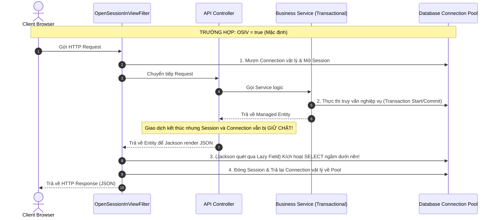

# Bản chất của Open Session in View (OSIV) và tại sao nên tránh trong môi trường Production

## ⚡ Tóm tắt ngắn (30s)
*   **Bản chất**: Open Session in View (OSIV) là cơ chế **giữ cho Hibernate Session (EntityManager) tiếp tục mở** trong suốt vòng đời của một HTTP Request, ngay cả sau khi Database Transaction gốc đã đóng tại Service layer. Nó được bật mặc định (`spring.jpa.open-in-view=true`) trong các dự án Spring Boot.
*   **Mục đích duy nhất**: Giúp lập trình viên lười biếng dễ dàng gọi dữ liệu Lazy-loaded tại tầng Controller hoặc tầng Render View (Jackson JSON) mà không bao giờ lo bị dính lỗi **`LazyInitializationException`**.
*   **Tại sao đây là thảm họa vật lý?**
    1.  **Cạn kiệt Connection Pool**: Mỗi Request sẽ chiếm giữ một kết nối Database vật lý (`java.sql.Connection`) trong suốt thời gian phản hồi mạng (Network Roundtrip) và Serialization, thay vì trả lại Pool ngay khi thoát khỏi tầng Service. Hệ thống sẽ nhanh chóng bị treo cứng khi có lượng truy cập đồng thời trung bình.
    2.  **Truy vấn N+1 ngầm (Silent N+1)**: Jackson Serializer tự động quét qua các quan hệ Lazy-loaded của Entity, kích hoạt hàng loạt câu lệnh `SELECT` bổ sung âm thầm dưới nền, bóp nghẹt hiệu năng ứng dụng.
*   **Quyết định Senior**: Luôn cấu hình **`spring.jpa.open-in-view=false`** trong môi trường Production và xử lý nạp trước dữ liệu bằng DTO/JOIN FETCH tường minh.

---

## 🔍 Chi tiết bản chất thực chiến

### 1. Sự khác biệt về kiến trúc luồng Request giữa OSIV = true và OSIV = false

Để hiểu sâu sắc lý do tại sao kết nối DB bị chiếm dụng quá lâu, hãy quan sát sơ đồ vòng đời Request dưới đây:



Khi **OSIV = false**, luồng chạy sẽ được tối ưu hóa triệt để:
1.  Connection vật lý chỉ được lấy ra khỏi Pool **ngay khi đi vào Service** (Bắt đầu `@Transactional`).
2.  Mọi câu lệnh truy vấn được thực thi nhanh gọn trong ranh giới Service.
3.  **Ngay khi thoát khỏi Service**, Transaction commit, Hibernate Session đóng lại và **trả ngay lập tức Connection vật lý về Pool**. 
4.  Controller và Jackson làm việc trên RAM, hoàn toàn không chiếm giữ tài nguyên kết nối quý giá của Database trong thời gian truyền tải mạng tới Client.

---

## 💻 Code thực chiến: BAD (OSIV = true) vs GOOD (OSIV = false)

### ❌ BAD: Dựa dẫm vào OSIV mặc định gây thảm họa nghẽn cổ chai âm thầm
Lập trình viên không cấu hình tắt OSIV. Ở tầng Controller, họ duyệt qua danh sách đơn hàng Lazy-loaded để trả về API. Dưới nền, Hibernate âm thầm sinh ra 100 câu SELECT N+1 khi Jackson render JSON, đồng thời kết nối DB bị giữ lại cho đến khi mạng truyền gói tin xong tới Client.

```yaml
# application.yml
spring:
  jpa:
    # Không cấu hình gì, mặc định là true! Spring Boot cảnh báo khi khởi động nhưng bị phớt lờ.
    open-in-view: true 
```

```java
@RestController
@RequestMapping("/api/customers")
public class CustomerControllerBad {
    @Autowired
    private CustomerRepositoryBad customerRepository;

    @GetMapping("/{id}")
    public CustomerBad getCustomerBad(@PathVariable Long id) {
        CustomerBad customer = customerRepository.findById(id).orElseThrow();
        
        // Anti-pattern: Trả trực tiếp Entity có quan hệ @OneToMany(fetch = FetchType.LAZY) 
        // Jackson serializer cố chuyển danh sách orders thành JSON.
        // Vì OSIV = true, Session vẫn mở, Jackson tự động kích hoạt hàng loạt câu SELECT orders.
        // Kết nối DB bị giữ khư khư trong suốt thời gian Jackson chạy và truyền dữ liệu qua mạng!
        return customer; 
    }
}
```

---

###  GOOD: Tắt hoàn toàn OSIV, nạp trước dữ liệu và map sang DTO tường minh
Tắt hoàn toàn cơ chế OSIV để giải phóng kết nối DB siêu tốc. Ở tầng Repository/Service, nạp trước các quan hệ cần thiết bằng `JOIN FETCH` (hoặc EntityGraph) và trả về DTO độc lập.

#### Tắt OSIV trong `application.yml`:
```yaml
spring:
  jpa:
    # Đúng đắn 1: Tắt hoàn toàn OSIV để bảo vệ Connection Pool ở Production!
    open-in-view: false 
```

#### Code Java thực chiến an toàn và tối ưu:
```java
// DTO phẳng gọn gàng, không dính dáng tới Hibernate Session
public record CustomerResponse(
    Long id,
    String name,
    List<OrderDto> orders
) {}

@Repository
public interface CustomerRepositoryGood extends JpaRepository<CustomerGood, Long> {
    
    // Đúng đắn 2: Viết câu truy vấn nạp trước (Eager Fetch) rõ ràng để lấy sạch dữ liệu trong 1 câu lệnh duy nhất
    @Query("SELECT c FROM CustomerGood c LEFT JOIN FETCH c.orders WHERE c.id = :id")
    Optional<CustomerGood> findByIdWithOrders(@Param("id") Long id);
}

@Service
public class CustomerServiceGood {
    private final CustomerRepositoryGood customerRepository;
    private final CustomerMapper customerMapper; // Công cụ chuyển đổi sang DTO

    public CustomerServiceGood(CustomerRepositoryGood customerRepository, CustomerMapper customerMapper) {
        this.customerRepository = customerRepository;
        this.customerMapper = customerMapper;
    }

    @Transactional(readOnly = true)
    public CustomerResponse getCustomerDetail(Long id) {
        CustomerGood customer = customerRepository.findByIdWithOrders(id)
            .orElseThrow(() -> new EntityNotFoundException("Khách hàng không tồn tại"));
            
        // Đúng đắn 3: Chuyển đổi toàn bộ sang DTO độc lập ngay trong ranh giới Transaction
        return customerMapper.toResponse(customer);
    } // Thoát khỏi hàm này, Transaction đóng, Connection được trả ngay lập tức về Pool!
}

@RestController
@RequestMapping("/api/customers")
public class CustomerControllerGood {
    private final CustomerServiceGood customerService;

    public CustomerControllerGood(CustomerServiceGood customerService) {
        this.customerService = customerService;
    }

    @GetMapping("/{id}")
    public ResponseEntity<CustomerResponse> getCustomer(@PathVariable Long id) {
        // Đúng đắn 4: Controller hoàn toàn làm việc trên RAM với DTO, không chạm vào DB
        return ResponseEntity.ok(customerService.getCustomerDetail(id));
    }
}
```

---

## 📊 Bảng so sánh Bật (OSIV = true) và Tắt (OSIV = false)

| Tiêu chí phân tích | OSIV = true (Mặc định) | OSIV = false (Senior Dev khuyên dùng) |
| :--- | :--- | :--- |
| **Thời gian giữ DB Connection**| **Quá lâu** (Từ đầu HTTP Request tới khi nhận HTTP Response). | **Cực ngắn** (Chỉ trong ranh giới phương thức `@Transactional`). |
| **Khả năng chịu tải (Scalability)**| **Tệ hại**. HikariCP Pool nhanh chóng cạn kiệt gây treo luồng. | **Tuyệt vời**. Tối ưu hóa tối đa số lượng Connection sử dụng. |
| **Lỗi `LazyInitializationException`**| **Không bao giờ xảy ra** (Do Session luôn mở). | **Có thể xảy ra** nếu cố truy cập quan hệ Lazy ngoài Service. |
| **Mức độ kiểm soát câu lệnh SQL**| **Mất kiểm soát**. Jackson tự phát sinh SELECT ngầm bừa bãi. | **Tường minh 100%**. Lập trình viên kiểm soát rõ ràng mọi câu lệnh. |
| **Phản hồi lỗi ở API** | Khó bắt lỗi. Nếu Jackson chạy lỗi SELECT ở View, API trả về JSON nửa chừng. | Dễ dàng quản lý và bắt lỗi bằng `@RestControllerAdvice` chuẩn chỉ. |

---

## ⚠️ Common Gotchas & Questions follow-up

### 1. Cạm bẫy "Cập nhật ngầm ngoài ý muốn" (Silent Dirty Checking)
*   **Vấn đề**: Khi OSIV hoạt động, thực thể được trả về Controller vẫn ở trạng thái **Managed** (vì Session vẫn mở). Nếu tại Controller hoặc tầng View, một lập trình viên vô tình thay đổi thuộc tính của Entity (ví dụ: `customer.setName("Modified")`), Hibernate Dirty Checking sẽ **tự động sinh ra câu lệnh UPDATE** ghi xuống DB khi HTTP Request kết thúc và Session chuẩn bị đóng!
    *   *Tại sao cực kỳ nguy hiểm?* Đây là sự thay đổi dữ liệu ngầm, không qua tầng Service xử lý nghiệp vụ hay kiểm tra hợp lệ, phá vỡ hoàn toàn tính toàn vẹn của ứng dụng.
*   **Giải pháp**: Tắt OSIV lập tức. Khi OSIV tắt, thực thể đi ra Controller sẽ tự chuyển sang trạng thái **Detached**, mọi sửa đổi trên RAM sẽ vô hại và không thể cập nhật bậy bạ xuống DB.

### 2. Sự cố nghẽn cổ chai HikariCP ở môi trường Production lớn
*   **Kịch bản**: Hệ thống của bạn cấu hình HikariCP `maximum-pool-size = 10`. Bạn có một API lấy dữ liệu thông tin cá nhân. API này chạy SQL chỉ mất 5ms, nhưng thời gian trả dữ liệu JSON qua mạng cho client mạng yếu mất tới 500ms.
    *   Nếu bật OSIV: Mỗi request giữ chặt 1 Connection trong 500ms. Nghĩa là hệ thống của bạn tối đa chỉ chịu được 20 requests/giây (10 connection * 2) là nghẽn cứng toàn bộ.
    *   Nếu tắt OSIV: Kết nối DB chỉ bị chiếm dụng trong 5ms chạy SQL. Sau đó Connection trả lại Pool ngay. 1 Connection có thể quay vòng phục vụ hàng trăm request song song. Hệ thống của bạn dễ dàng chịu được 2000 requests/giây!

### 3. Câu hỏi đào sâu từ interviewer
*   **Q: Nếu dự án đã phình quá to, hàng ngàn chỗ đang lạm dụng OSIV và không thể tắt ngay `spring.jpa.open-in-view` vì sợ lỗi LazyInitializationException hàng loạt, bạn sẽ đề xuất chiến lược cứu vãn hiệu năng nào?**
    *   *Trả lời*: Đây là một câu hỏi tình huống thực chiến cực kỳ thực tế khi đi xử lý "nợ kỹ thuật" (technical debt). Biện pháp tắt OSIV lập tức sẽ làm sập hàng loạt API, do đó ta cần đi theo lộ trình an toàn:
        1.  **Bật cấu hình SQL log và cài đặt công cụ giám sát**: Sử dụng thư viện `datasource-proxy` hoặc `p6spy` ở môi trường UAT để đếm số lượng câu lệnh SQL sinh ra trên mỗi HTTP Request. Xác định các API có số lượng query lớn (>20 queries) để ưu tiên sửa trước.
        2.  **Sử dụng `@EntityGraph` hoặc `JOIN FETCH` để dọn dẹp dần**: Viết các DTO tương ứng cho các API nghẽn nhất, cấu hình nạp trước dữ liệu và chuyển Controller sang dùng DTO.
        3.  **Tách cấu hình đọc ghi (Read-Write Splitting)**: Hướng các API đọc lười biếng sang một Database Read-Replica để giảm tải cho DB Master ghi chính.
        4.  **Cấu hình tăng HikariCP Connection Timeout tạm thời** để tránh lỗi cạn kiệt pool đột ngột, kết hợp cấu hình `spring.datasource.hikari.leak-detection-threshold` để phát hiện nhanh các kết nối bị giữ quá lâu vô lý.
        5.  Khi toàn bộ các API quan trọng đã được chuyển đổi sang DTO và nạp trước dữ liệu, lúc đó mới chính thức tắt cấu hình `open-in-view=false`.
