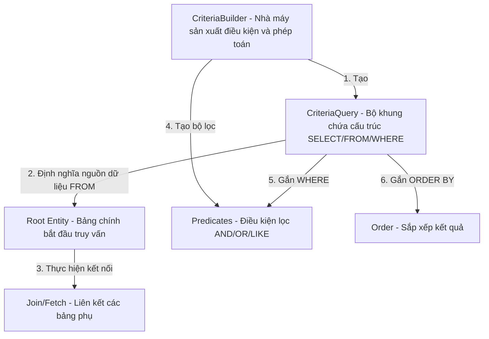

# Khi nào nên sử dụng JPA Criteria API? Phân tích ưu và nhược điểm thực chiến

## ⚡ Tóm tắt ngắn (30s)
*   **Bản chất**: Criteria API là công cụ hướng đối tượng (Object-oriented) được JPA cung cấp để xây dựng câu truy vấn cơ sở dữ liệu động bằng mã Java thuần túy. Nó giúp phát hiện lỗi sai tên cột hay sai kiểu dữ liệu ngay trong quá trình biên dịch (Compile-time type-safety) thay vì đợi ứng dụng chạy mới nổ lỗi.
*   **Khi nào bắt buộc dùng**: Chỉ dùng cho các **truy vấn động cực kỳ phức tạp** (ví dụ: màn hình bộ lọc tìm kiếm nâng cao - Advanced Search Filter với 20 điều kiện tùy chọn lọc ngẫu nhiên từ người dùng, phân trang và sắp xếp đa chiều linh hoạt).
*   **Ưu điểm lớn**: An toàn kiểu dữ liệu tuyệt đối (khi kết hợp JPA Metamodel); Thân thiện với việc Refactor mã nguồn bằng các IDE hiện đại; Giảm thiểu nguy cơ bị tấn công **SQL Injection**.
*   **Nhược điểm chí mạng**: **Boilerplate khủng khiếp!** Cú pháp cực kỳ dài dòng, rườm rà, rối rắm và rất khó đọc. Một câu lệnh JOIN thông thường viết bằng JPQL chỉ mất 1 dòng, nhưng viết bằng Criteria API có thể tốn tới 10-15 dòng code Java.

---

## 🔍 Chi tiết bản chất thực chiến

### 1. Kiến trúc xây dựng câu truy vấn của Criteria API
Criteria API hoạt động như một nhà máy sản xuất câu lệnh (Query Factory) từng bước thiết lập cấu trúc truy vấn:



### 2. Sức mạnh của JPA Metamodel (Compile-time Safety)
Mặc định, nếu bạn viết:
```java
// Vẫn dùng chuỗi cứng "username" -> Nếu DB đổi tên cột thành "userName", compiler không hề phát hiện ra!
Path<String> path = root.get("username"); 
```
Để đạt được sự an toàn tuyệt đối, JPA cung cấp cơ chế sinh tự động các **Metamodel Class** (thường có hậu tố `_` được sinh ra trong thư mục `target/generated-sources`).
```java
// Type-safe tuyệt đối! Nếu thuộc tính đổi tên, code Java lập tức báo lỗi biên dịch đỏ lòm tại IDE.
Path<String> path = root.get(User_.username); 
```

---

## 💻 Code thực chiến: BAD vs GOOD trong sử dụng Criteria API

### ❌ BAD: Lạm dụng Criteria API cho các truy vấn tĩnh đơn giản
Lập trình viên viết một truy vấn tĩnh, đơn giản (tìm kiếm người dùng hoạt động theo category) bằng Criteria API. Việc này biến một dòng code JPQL cực kỳ thanh thoát thành một đống code Java dài dòng lê thê, cực kỳ khó đọc và khó bảo trì.

```java
@Repository
public class UserRepositoryBad {
    @PersistenceContext
    private EntityManager em;

    // Anti-pattern: Truy vấn tĩnh, cố định nhưng lại viết bằng Criteria API.
    // Viết thế này cực kỳ tốn thời gian, rườm rà và làm hoa mắt các lập trình viên khác!
    public List<User> findActiveUsersByCategoryBad(String category) {
        CriteriaBuilder cb = em.getCriteriaBuilder();
        CriteriaQuery<User> cq = cb.createQuery(User.class);
        Root<User> root = cq.from(User.class);
        
        Predicate activePredicate = cb.equal(root.get("status"), "ACTIVE");
        Predicate categoryPredicate = cb.equal(root.get("category"), category);
        
        cq.select(root).where(cb.and(activePredicate, categoryPredicate));
        
        return em.createQuery(cq).getResultList();
    }
}
```
*Viết bằng JPQL/Spring Data JPA tĩnh thay thế chỉ tốn đúng 1 dòng:*
```java
List<User> findByStatusAndCategory(String status, String category);
```

---

###  GOOD: Ứng dụng Criteria API xây dựng Bộ lọc Tìm kiếm Động thực tế
Sử dụng Criteria API một cách đúng đắn cho kịch bản tìm kiếm nâng cao, nơi các tham số đầu vào (`name`, `email`, `role`, `minAge`) hoàn toàn tùy chọn (có thể null hoặc rỗng). Hệ thống sẽ tự động ghép nối các điều kiện một cách thông minh.

```java
public record UserSearchCriteria(
    String name,
    String email,
    String role,
    Integer minAge
) {}

@Repository
public class UserRepositoryGood {
    @PersistenceContext
    private EntityManager em;

    // Đúng đắn: Sử dụng Criteria API để lắp ráp câu lệnh động tùy biến theo dữ liệu truyền vào
    public List<UserGood> searchUsersDynamic(UserSearchCriteria criteria) {
        CriteriaBuilder cb = em.getCriteriaBuilder();
        CriteriaQuery<UserGood> cq = cb.createQuery(UserGood.class);
        Root<UserGood> root = cq.from(UserGood.class);
        
        List<Predicate> predicates = new ArrayList<>();

        // 1. Lọc động theo Name (nếu truyền vào)
        if (StringUtils.hasText(criteria.name())) {
            predicates.add(cb.like(
                cb.lower(root.get(UserGood_.name)), 
                "%" + criteria.name().toLowerCase() + "%"
            ));
        }

        // 2. Lọc động theo Email khớp chính xác
        if (StringUtils.hasText(criteria.email())) {
            predicates.add(cb.equal(root.get(UserGood_.email), criteria.email()));
        }

        // 3. Lọc động theo Role
        if (StringUtils.hasText(criteria.role())) {
            predicates.add(cb.equal(root.get(UserGood_.role), criteria.role()));
        }

        // 4. Lọc động theo Tuổi tối thiểu
        if (criteria.minAge() != null) {
            predicates.add(cb.greaterThanOrEqualTo(root.get(UserGood_.age), criteria.minAge()));
        }

        // Áp dụng danh sách Predicates kết hợp bằng toán tử AND
        cq.select(root).where(cb.and(predicates.toArray(new Predicate[0])));
        
        // Thực thi truy vấn động sạch sẽ
        return em.createQuery(cq).getResultList();
    }
}
```

---

## 📊 Bảng so sánh JPQL, Native Query và Criteria API

| Tiêu chí so sánh | JPQL (Java Persistence Query Language) | Native SQL Query | JPA Criteria API |
| :--- | :--- | :--- | :--- |
| **Tính động (Dynamic)** | Kém (phải ghép chuỗi String rất bẩn và dễ lỗi). | Kém (ghép chuỗi String SQL phức tạp). | **Tuyệt vời** (Xây dựng động bằng Java Code). |
| **Type-safety** | Khá tệ (Lỗi chính tả chỉ phát hiện ở Runtime). | Tệ nhất (Không kiểm soát kiểu dữ liệu Java). | **Hoàn hảo** (Phát hiện lỗi ngay khi Compile). |
| **Khả năng Refactor** | Khó (Đổi tên thuộc tính Entity không đổi chuỗi JPQL).| Cực khó (Đổi tên cột DB làm hỏng chuỗi SQL). | **Dễ dàng** (IDE tự động đổi tên thuộc tính Metamodel). |
| **Độ dễ đọc (Readability)**| **Rất cao** (Cú pháp giống SQL tiêu chuẩn). | **Rất cao** (SQL thuần túy của DB). | **Rất kém** (Dài dòng, rối mắt vì Boilerplate). |
| **Rủi ro SQL Injection** | Thấp (nếu truyền parameter chuẩn). | Cao (nếu ghép chuỗi String SQL trực tiếp).| **Hầu như bằng không** (Không có chuỗi thô). |

---

## ⚠️ Common Gotchas & Questions follow-up

### 1. Cạm bẫy "Cross Join vô hình" khi quên kết nối bảng tường minh
*   **Vấn đề**: Bạn muốn lọc các User có đơn hàng (Order) trạng thái `DELIVERED`. Bạn viết code Criteria API như sau:
    ```java
    // Sai lầm: Gọi get() lướt qua thuộc tính quan hệ!
    Predicate p = cb.equal(root.get("orders").get("status"), "DELIVERED");
    ```
    *   *Tại sao cực kỳ nguy hại?* Khi bạn gọi `root.get("orders")` thay vì gọi `root.join("orders")`, một số JPA provider (như Hibernate cũ) sẽ không tạo ra câu lệnh `INNER JOIN` tối ưu. Thay vào đó, nó sinh ra một câu lệnh **`CROSS JOIN`** thô bạo (tích Descartes giữa bảng Users và Orders) rồi lọc ở điều kiện `WHERE`. Điều này làm nổ số lượng bản ghi quét dưới DB và giết chết hiệu năng hệ thống ngay lập tức!
*   **Giải pháp**: Phải luôn tạo quan hệ Join tường minh khi làm việc với thuộc tính liên kết:
    ```java
    Join<UserGood, Order> ordersJoin = root.join(UserGood_.orders);
    Predicate p = cb.equal(ordersJoin.get(Order_.status), "DELIVERED");
    ```

### 2. Nỗi đau duy trì JPA Metamodel trong CI/CD pipeline
*   **Thực tế đau đớn**: Để có các class Metamodel như `User_`, bạn phải tích hợp annotation processor của Hibernate vào build tool (Maven/Gradle). Khi chạy local trên IDE (IntelliJ), đôi khi IDE không tự động sinh Metamodel khiến code bị báo lỗi đỏ lòm không thể compile, hoặc trong hệ thống CI/CD pipeline, việc cấu hình thiếu thư viện sinh code tự động sẽ làm hỏng toàn bộ tiến trình build.
*   **Giải pháp**: Cấu hình plugin sinh tự động Metamodel (như `hibernate-jpamodelgen`) một cách chuẩn chỉ trong `pom.xml` hoặc `build.gradle` để đảm bảo Metamodel luôn được sinh ra ổn định trong thư mục `generated-sources`.

### 3. Câu hỏi đào sâu từ interviewer
*   **Q: Cú pháp Criteria API quá dài dòng khiến team phát triển bị giảm năng suất và khó đọc code. Có giải pháp nào thay thế ở tầng Spring Boot giúp viết truy vấn động vừa Type-safe tuyệt đối mà cú pháp lại ngắn gọn, trực quan như JPQL không?**
    *   *Trả lời*: Đây là một câu hỏi mở thực chiến cực hay. Trong thực tế các dự án Spring Boot lớn, chúng ta có hai giải pháp thay thế hoàn hảo để triệt tiêu sự dài dòng của Criteria API:
        1.  **Sử dụng QueryDSL (Lựa chọn hàng đầu)**:
            *   QueryDSL là một thư viện bên thứ ba tích hợp cực tốt với Spring Data JPA. Nó cũng sinh ra các lớp truy vấn tự động (Q-Classes như `QUser`).
            *   Cú pháp viết cực kỳ mượt mà (Fluent API) và trực quan giống hệt SQL:
                ```java
                List<User> users = queryFactory.selectFrom(qUser)
                    .where(qUser.status.eq("ACTIVE").and(qUser.age.gt(18)))
                    .fetch();
                ```
            *   Nó giải quyết triệt để vấn đề Boilerplate của Criteria API trong khi vẫn giữ nguyên tính an toàn compile-time type-safety và khả năng refactor mượt mà.
        2.  **Sử dụng Spring Data JPA Specification**:
            *   Giúp bọc Criteria API vào trong các đối tượng Specification nhỏ, có tính tái sử dụng cao, cho phép lắp ghép các điều kiện lọc linh hoạt bằng các hàm logic đơn giản như `.and()`, `.or()`.
