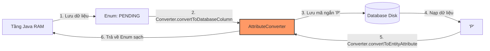

# Các chiến lược Mapping Enum an toàn và tối ưu trong JPA/Hibernate

## ⚡ Tóm tắt ngắn (30s)
*   **Vấn đề cốt lõi**: Enum là kiểu dữ liệu tuyệt vời trong Java để định nghĩa các tập hợp hằng số cố định (như `OrderStatus`, `UserRole`). Tuy nhiên, việc lưu trữ chúng xuống cơ sở dữ liệu quan hệ (RDBMS) thường gặp nhiều cạm bẫy về bảo mật, hiệu năng và khả năng bảo trì.
*   **Các giải pháp truyền thống và nhược điểm**:
    *   **`EnumType.ORDINAL` (Mặc định)**: Lưu chỉ số vị trí (0, 1, 2) của Enum dưới DB. **Cực kỳ nguy hiểm!** Nếu bạn thay đổi thứ tự khai báo hoặc chèn thêm Enum mới vào giữa, toàn bộ dữ liệu lịch sử dưới DB sẽ bị sai lệch hoàn toàn.
    *   **`EnumType.STRING`**: Lưu chuỗi văn bản thô (ví dụ: `"PENDING"`, `"DELIVERED"`). Nhược điểm: Làm phình to dung lượng đĩa và chậm index của DB khi có hàng triệu dòng, đồng thời sẽ phá vỡ dữ liệu nếu bạn đổi tên Enum trong mã nguồn.
*   **Giải pháp tối thượng (Senior Choice)**: Sử dụng **Custom `@Converter` (triển khai interface `AttributeConverter`)**. Nó giúp ánh xạ Enum trên Java thành các mã ký tự cực ngắn dưới DB (ví dụ: `P` đại diện cho `PENDING`, `D` đại diện cho `DELIVERED`). Đảm bảo an toàn tuyệt đối khi đổi tên, đổi thứ tự Enum và tối ưu hóa hiệu năng lưu trữ ở mức tối đa.

---

## 🔍 Chi tiết bản chất thực chiến

### 1. Sự nguy hiểm vật lý của EnumType.ORDINAL
Hãy hình dung hệ thống của bạn đang hoạt động ổn định với Enum vai trò người dùng:
```java
public enum UserRole {
    USER,  // 0 dưới DB
    ADMIN  // 1 dưới DB
}
```
Một ngày đẹp trời, yêu cầu nghiệp vụ phát sinh vai trò `MODERATOR`. Lập trình viên chèn nó vào giữa để gom nhóm logic cho đẹp mắt:
```java
public enum UserRole {
    USER,      // 0 dưới DB
    MODERATOR, // 1 dưới DB (Mới chèn)
    ADMIN      // 2 dưới DB (Bị đẩy xuống)
}
```
**Hậu quả thảm khốc**: Toàn bộ dữ liệu của những người dùng là `ADMIN` cũ (đang lưu số `1` trong DB) lúc này khi nạp lên Java sẽ bị Hibernate hiểu nhầm thành vai trò `MODERATOR`. Quyền hạn hệ thống bị đảo lộn hoàn toàn mà trình biên dịch không hề báo bất kỳ lỗi nào!

### 2. Sự lãng phí không gian của EnumType.STRING
Nếu bảng `orders` của bạn chứa 50 triệu bản ghi, việc lưu trữ chuỗi dài `"PROCESSING"` (10 ký tự ~ 10 bytes) thay vì mã hóa ký tự ngắn `"P"` (1 byte) sẽ làm lãng phí khoảng **450 Megabytes** dung lượng đĩa cứng chỉ riêng cho cột này. Điều quan trọng hơn, dung lượng index phình to sẽ làm cạn kiệt bộ nhớ đệm RAM (Buffer Pool) của Database nhanh hơn, làm suy giảm tốc độ truy vấn đáng kể.

### 3. Cơ chế hoạt động của AttributeConverter
`AttributeConverter` đóng vai trò là một chốt chặn bảo vệ vững chắc ở giữa RAM và ổ đĩa:



---

## 💻 Code thực chiến: BAD vs GOOD trong Mapping Enum

### ❌ BAD: Dùng ORDINAL nguy hiểm hoặc STRING tốn dung lượng
Lập trình viên sử dụng `ORDINAL` mặc định cho các cột nhạy cảm hoặc dùng `STRING` lưu các giá trị chuỗi dài làm chậm hệ thống và dễ hỏng dữ liệu khi refactor tên Enum.

```java
public enum StatusBad {
    PENDING,
    ACTIVE,
    DELETED
}

@Entity
public class UserBad {
    @Id
    private Long id;

    // Anti-pattern 1: Dùng ORDINAL cực kỳ nguy hiểm nếu thay đổi thứ tự khai báo Enum sau này!
    @Enumerated(EnumType.ORDINAL)
    private StatusBad status;

    // Anti-pattern 2: Dùng STRING lưu chuỗi dài "SUPER_ADMINISTRATOR" chiếm dụng đĩa và index,
    // đồng thời nếu đổi tên Enum trên Java sẽ làm hỏng dữ liệu DB ngay lập tức!
    @Enumerated(EnumType.STRING)
    private UserRoleBad role; 
}
```

---

###  GOOD: Triển khai Custom AttributeConverter an toàn tuyệt đối
Định nghĩa Enum với các mã code nội bộ tường minh, sau đó xây dựng một bộ Converter kế thừa `AttributeConverter` để thực hiện ánh xạ an toàn, chính xác và hiệu năng cao.

#### Đúng đắn 1: Định nghĩa Enum kèm mã code nội bộ cố định
```java
public enum OrderStatus {
    PENDING("P", "Đang chờ xử lý"),
    SHIPPED("S", "Đã giao hàng"),
    CANCELLED("C", "Đã hủy đơn");

    private final String code;
    private final String description;

    OrderStatus(String code, String description) {
        this.code = code;
        this.description = description;
    }

    public String getCode() {
        return code;
    }

    // Static factory method để tìm Enum từ mã code dưới DB nạp lên
    public static OrderStatus fromCode(String code) {
        if (code == null) return null;
        for (OrderStatus status : OrderStatus.values()) {
            if (status.getCode().equals(code)) {
                return status;
            }
        }
        throw new IllegalArgumentException("Mã trạng thái đơn hàng không hợp lệ: " + code);
    }
}
```

#### Đúng đắn 2: Viết lớp Converter bảo vệ
```java
// autoApply = true giúp tự động áp dụng Converter này cho mọi Entity có trường thuộc kiểu OrderStatus
@Converter(autoApply = true)
public class OrderStatusConverter implements AttributeConverter<OrderStatus, String> {

    @Override
    public String convertToDatabaseColumn(OrderStatus attribute) {
        if (attribute == null) return null;
        return attribute.getCode(); // Lưu duy nhất 1 ký tự "P", "S", "C" xuống DB
    }

    @Override
    public OrderStatus convertToEntityAttribute(String dbData) {
        if (dbData == null) return null;
        return OrderStatus.fromCode(dbData); // Map ngược lại thành Enum chuẩn trên Java
    }
}
```

#### Đúng đắn 3: Khai báo Entity tinh gọn, sạch sẽ
```java
@Entity
@Table(name = "orders")
public class OrderGood {
    @Id
    @GeneratedValue(strategy = GenerationType.IDENTITY)
    private Long id;

    // Không cần dùng annotation @Enumerated nữa! 
    // Nhờ autoApply = true, Hibernate sẽ tự động áp dụng OrderStatusConverter
    private OrderStatus status; 
    
    // Getters, Setters
}
```

---

## 📊 Bảng so sánh các chiến lược Mapping Enum

| Tiêu chí phân tích | `@Enumerated(EnumType.ORDINAL)` | `@Enumerated(EnumType.STRING)` | Custom `AttributeConverter` |
| :--- | :--- | :--- | :--- |
| **Dung lượng đĩa dưới DB** | **Thấp nhất** (Lưu kiểu số Integer 4 bytes hoặc Tinyint 1 byte). | **Rất cao** (Lưu chuỗi String độ dài tùy ý). | **Thấp tuyệt đối** (Lưu ký tự mã hóa ngắn 1-2 bytes). |
| **An toàn khi đổi thứ tự** | **Không** (Lập tức làm sai lệch toàn bộ dữ liệu). | Có. | **Có** (Tuyệt đối an toàn). |
| **An toàn khi đổi tên Enum** | Có. | **Không** (Đổi tên Enum làm hỏng mapping dữ liệu cũ). | **Có** (Tuyệt đối an toàn vì map qua mã code). |
| **Tính tương thích cơ sở dữ liệu**| Tốt. | Tốt. | **Tuyệt vời** (Dễ dàng map sang kiểu số hay chữ tùy ý). |
| **Độ phức tạp khi viết code** | Cực thấp (Chỉ cần đặt annotation). | Cực thấp (Chỉ cần đặt annotation). | Trung bình (Cần viết thêm 1 class Converter nhỏ). |

---

## ⚠️ Common Gotchas & Questions follow-up

### 1. Cạm bẫy "Legacy Data" hoặc dữ liệu bẩn dưới DB
*   **Vấn đề**: Khi bạn sử dụng `AttributeConverter`, nếu cơ sở dữ liệu của bạn bị can thiệp thủ công từ bên ngoài và một cột trạng thái đơn hàng bị ghi giá trị lạ `"X"` (không tồn tại trong Enum).
    *   Khi nạp dữ liệu lên, hàm `OrderStatus.fromCode("X")` sẽ ném ra `IllegalArgumentException`, gây sập toàn bộ câu truy vấn lấy danh sách đơn hàng (kể cả những bản ghi sạch khác).
*   **Giải pháp**: Trong hàm `fromCode()`, cần xử lý khéo léo lỗi này tùy theo yêu cầu nghiệp vụ. Có thể ném lỗi rõ ràng nếu yêu cầu tính toàn vẹn cao, hoặc trả về một giá trị mặc định như `UNKNOWN` để bảo vệ ứng dụng không bị sập hoàn toàn:
    ```java
    public static OrderStatus fromCode(String code) {
        for (OrderStatus status : OrderStatus.values()) {
            if (status.getCode().equals(code)) {
                return status;
            }
        }
        return OrderStatus.UNKNOWN; // Tránh nổ lỗi ứng dụng khi gặp dữ liệu bẩn
    }
    ```

### 2. Sự cố Mapping Enum với JPQL / Criteria Queries
*   **Cảnh báo**: Khi bạn viết câu truy vấn JPQL:
    ```java
    // Đúng đắn: Hibernate tự động áp dụng Converter để dịch Enum sang mã code 'P'
    @Query("SELECT o FROM OrderGood o WHERE o.status = :status")
    List<OrderGood> findByStatus(@Param("status") OrderStatus status);
    ```
    *   *Gotcha*: Nếu bạn viết câu truy vấn bằng **Native SQL** (`nativeQuery = true`), Hibernate sẽ **không hề áp dụng Converter**! Lúc này DB mong đợi bạn truyền vào chuỗi ký tự `"P"`, nhưng nếu bạn truyền đối tượng Enum `OrderStatus.PENDING`, driver JDBC sẽ gọi hàm `toString()` của Enum (trả về chuỗi `"PENDING"`) và câu truy vấn sẽ không khớp bất kỳ bản ghi nào.
*   **Giải pháp**: Khi dùng Native Query, luôn truyền trực tiếp mã code đại diện của Enum: `o.status = :#{#status.code}` hoặc `.status = :statusString` (với `statusString = status.getCode()`).

### 3. Câu hỏi đào sâu từ interviewer
*   **Q: Làm thế nào để tự động áp dụng Converter này cho toàn bộ hệ thống mà không cần khai báo `@Converter(autoApply = true)` hoặc khi chúng ta sử dụng thư viện chung (Shared Library) chứa các Enum?**
    *   *Trả lời*: Đây là câu hỏi cấu hình nâng cao trong dự án Microservices/Multi-module.
    *   Nếu không muốn dùng `autoApply = true` (vì đôi khi có những thực thể đặc biệt không muốn áp dụng tự động), ta có thể khai báo thủ công Converter trực tiếp trên thuộc tính Entity bằng annotation `@Convert`:
        ```java
        @Convert(converter = OrderStatusConverter.class)
        private OrderStatus status;
        ```
    *   Nếu trong dự án lớn sử dụng XML cấu hình tập trung, chúng ta có thể định nghĩa các converter trong tệp cấu hình JPA `orm.xml` để quản lý tập trung toàn bộ hành vi ánh xạ Enum của hệ thống tại một nơi duy nhất mà không cần can thiệp chỉnh sửa mã nguồn của các module Entity dùng chung.
