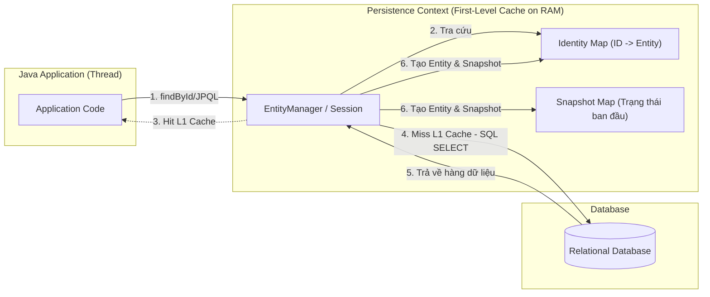

# Persistence Context là gì? Bản chất của First-Level Cache

## ⚡ Tóm tắt ngắn (30s)
**Persistence Context (Bối cảnh kiên định)** là một vùng lưu trữ trung gian nằm trên RAM (In-memory storage) được quản lý bởi `EntityManager` (trong JPA) hoặc `Session` (trong Hibernate). Nó hoạt động như một trạm trung chuyển dữ liệu giữa ứng dụng Java và Database gốc.

Mọi thực thể (Entity) khi được nạp từ DB lên hoặc chuẩn bị ghi xuống đều phải đi qua Persistence Context. Nó đóng vai trò là **First-Level Cache (Bộ nhớ đệm cấp 1)** nhằm mang lại 4 tính năng cốt lõi:
1.  **Tránh trùng lặp truy vấn (First-Level Cache)**: Không gửi câu SELECT thứ hai nếu cùng một bản ghi được tìm kiếm nhiều lần trong một Session.
2.  **Đảm bảo tính đồng nhất đối tượng (Identity Map)**: Đảm bảo hai biến tham chiếu trỏ đến cùng một hàng trong DB sẽ luôn bằng nhau về mặt vật lý (`a == b`).
3.  **Hoãn ghi tối ưu (Write-Behind)**: Trì hoãn việc chạy lệnh SQL xuống DB cho đến khi thực sự cần thiết (khi flush/commit) để gộp lô truy vấn.
4.  **Tự động theo dõi thay đổi (Dirty Checking)**: Tự sinh ra lệnh UPDATE khi phát hiện thuộc tính của Entity bị thay đổi.

---

## 🔍 Chi tiết bản chất thực chiến

### 1. Kiến trúc vật lý của Persistence Context

Persistence Context hoạt động ở mức luồng (Thread-level) và thường được liên kết chặt chẽ với vòng đời của một Database Transaction.



### 2. Các cơ chế vận hành chính

*   **First-Level Cache**: Mặc định luôn được bật và không thể tắt. Phạm vi (Scope) của nó gắn liền với Session. Khi bạn gọi `entityManager.find(User.class, 1L)`, Hibernate lưu kết quả vào L1 Cache. Nếu dòng code tiếp theo gọi lại chính lệnh đó, Hibernate trả ngay đối tượng trong RAM về mà không tốn bất kỳ chi phí I/O mạng nào đến Database.
*   **Identity Map**: Trong thế giới hướng đối tượng, hai đối tượng đại diện cho cùng một người dùng có thể là hai vùng nhớ khác nhau. Nhưng trong JPA, Identity Map đảm bảo rằng trong cùng một Persistence Context, truy vấn khóa chính `id = 1` sẽ **luôn luôn trả về duy nhất một thực thể vùng nhớ**, giúp duy trì tính nhất quán của dữ liệu.
*   **Write-Behind**: Thay vì thực thi ngay lập tức câu lệnh SQL xuống database khi bạn gọi `persist()` hoặc thay đổi thuộc tính, Hibernate lưu giữ các chỉ thị này trong bộ nhớ hàng đợi (ActionQueue). Khi transaction chuẩn bị commit, Hibernate mới xả hàng đợi (Flush), sắp xếp các lệnh SQL theo thứ tự tối ưu nhất (ví dụ: gộp các lệnh chèn liên tiếp) nhằm giảm thiểu thời gian chiếm giữ khóa (Lock duration) của Database.

---

## 💻 Code thực chiến: BAD vs GOOD trong quản lý bộ nhớ

### ❌ BAD: Gây tràn bộ nhớ (OutOfMemoryError) khi xử lý dữ liệu lớn (Batch Processing)
Do L1 Cache giữ lại tham chiếu của toàn bộ các Entity được nạp vào Persistence Context cho đến khi đóng Session. Nếu ta thực hiện truy vấn và xử lý hàng triệu bản ghi trong một Transaction dài, bộ nhớ RAM sẽ bị phình to liên tục dẫn đến sập ứng dụng.

```java
@Service
public class ReportService {
    private final UserRepository userRepository;

    public ReportService(UserRepository userRepository) {
        this.userRepository = userRepository;
    }

    @Transactional
    public void processMillionsUsersBad() {
        // Giả sử có 1 triệu người dùng dưới DB
        List<User> allUsers = userRepository.findAll(); 

        for (User user : allUsers) {
            user.setStatus("PROCESSED");
            // Anti-pattern: Tất cả 1 triệu đối tượng User cùng với Snapshot chụp trạng thái
            // của chúng đều bị giữ chặt trong L1 Cache của Persistence Context. 
            // RAM sẽ cạn kiệt cực kỳ nhanh chóng!
        }
    }
}
```

###  GOOD: Giải phóng bộ nhớ Persistence Context định kỳ bằng `flush()` và `clear()`
Đối với các tiến trình xử lý hàng loạt (Batch processes), ta phải chủ động xả dữ liệu xuống Database và dọn dẹp Persistence Context để giải phóng bộ nhớ.

```java
@Service
public class ReportService {
    @PersistenceContext
    private EntityManager entityManager;

    @Transactional
    public void processMillionsUsersGood() {
        int batchSize = 500; // Định mức xử lý mỗi lô
        
        // Sử dụng Cursor/Scrollable hoặc phân trang để tránh nạp toàn bộ danh sách cùng lúc
        for (int i = 0; i < 2000; i++) { // Giả sử lặp qua 2000 trang, mỗi trang 500 dòng
            List<User> users = entityManager.createQuery("SELECT u FROM User u", User.class)
                    .setFirstResult(i * batchSize)
                    .setMaxResults(batchSize)
                    .getResultList();

            for (User user : users) {
                user.setStatus("PROCESSED");
            }

            // Kỹ thuật then chốt: Đồng bộ và dọn dẹp L1 Cache
            entityManager.flush(); // 1. Đẩy toàn bộ UPDATE SQL xuống DB
            entityManager.clear(); // 2. Xóa sạch L1 Cache, giải phóng RAM hoàn toàn
        }
    }
}
```

---

## 📊 Bảng so sánh các cơ chế của Persistence Context

| Tính năng | Cơ chế hoạt động | Mục tiêu vật lý | Cách tối ưu hóa/Điều khiển |
| :--- | :--- | :--- | :--- |
| **First-Level Cache** | Lưu trữ đối tượng trong RAM theo map `[Class + ID -> Entity]` | Giảm thiểu số lượng câu truy vấn `SELECT` trùng lặp | `evict()`, `clear()` để xóa thủ công |
| **Identity Map** | Đảm bảo tính duy nhất tham chiếu vùng nhớ | Ngăn chặn mâu thuẫn dữ liệu trên RAM | Không thể tắt, tự động kích hoạt |
| **Write-Behind** | Lưu trữ lệnh ghi vào hàng đợi `ActionQueue` | Giảm thời gian chiếm giữ Lock ở DB, tối ưu hóa I/O | `flush()` để ép buộc thực thi ngay lập tức |
| **Dirty Checking** | So sánh đối tượng hiện tại với bản chụp gốc (Snapshot) | Tự động cập nhật những thay đổi thực tế | Sử dụng `@DynamicUpdate` để chỉ cập nhật cột thay đổi |

---

## ⚠️ Common Gotchas & Questions follow-up

### 1. Cạm bẫy "Truy vấn Native Query bypass qua L1 Cache"
*   **Vấn đề**: Khi bạn sử dụng Native SQL Query (`entityManager.createNativeQuery`) để cập nhật dữ liệu trực tiếp trong database, Hibernate không hề hay biết vì câu truy vấn này chạy trực tiếp dưới DB bypass qua các Entity đang nằm trên L1 Cache. Hậu quả là dữ liệu trên RAM trong Persistence Context bị lệch (Stale data) so với database gốc.
*   **Giải pháp**: Sau khi thực thi native query thay đổi dữ liệu, hãy gọi `entityManager.clear()` để ép buộc các truy vấn sau nạp lại dữ liệu mới nhất từ DB, hoặc dùng chú thích `@Modifying(clearAutomatically = true)` của Spring Data JPA.

### 2. Câu hỏi đào sâu từ interviewer

*   **Q: Nếu tôi truy vấn cùng một bản ghi bằng phương thức `findById()` 2 lần liên tiếp trong cùng một Transaction, Hibernate sẽ tạo ra 1 hay 2 câu SELECT? Nếu tôi đổi thành Spring Data JPA JPQL `@Query("SELECT u FROM User u WHERE u.id = :id")` thì sao?**
    *   *Trả lời*: 
        *   Trường hợp 1: Dùng `findById()` hoặc `entityManager.find()`. Câu SELECT chỉ được tạo ra **1 lần duy nhất** ở lần gọi đầu tiên. Lần thứ hai sẽ lấy thẳng đối tượng từ L1 Cache (Point Lookup).
        *   Trường hợp 2: Dùng JPQL `@Query`. Hibernate **sẽ gửi 2 câu SELECT xuống Database**. Lý do là JPQL/HQL luôn bắt buộc phải phân tích cú pháp và thực thi SQL để lấy kết quả. Tuy nhiên, điểm đặc biệt là sau khi nhận ResultSet của câu SELECT thứ hai từ DB về, Hibernate thấy ID này đã tồn tại trong L1 Cache, nó sẽ **vứt bỏ kết quả vừa nạp từ DB** và trả về đối tượng L1 Cache ban đầu để đảm bảo tính đồng nhất (Identity Map). Dù vậy, nó vẫn tốn chi phí gửi truy vấn mạng lần 2. Để tối ưu hóa, ta nên tận dụng Point Lookup thay vì lạm dụng JPQL.
