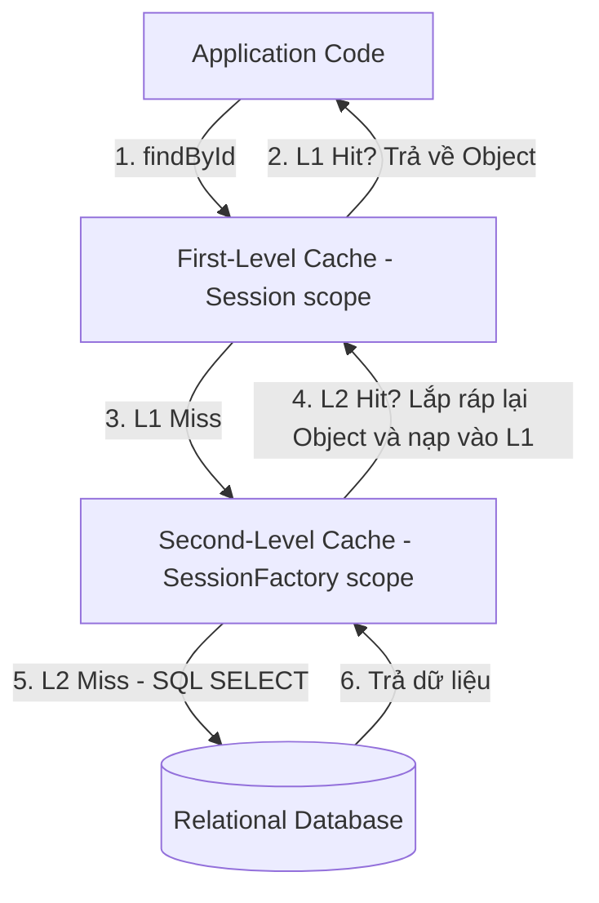

# Phân biệt First-level Cache và Second-level Cache trong Hibernate

## ⚡ Tóm tắt ngắn (30s)
*   **First-Level Cache (L1 Cache)**: Là bộ nhớ đệm **bắt buộc** và **mặc định luôn bật** của Hibernate. Phạm vi của nó là **Session** (thường gắn liền với một Transaction đơn lẻ). Nó lưu trữ trực tiếp các tham chiếu đối tượng (Java Object Instances). Chỉ có thread sở hữu Session mới truy cập được L1 Cache.
*   **Second-Level Cache (L2 Cache)**: Là bộ nhớ đệm **tùy chọn** (mặc định tắt). Phạm vi của nó là **SessionFactory** (chia sẻ trên toàn bộ ứng dụng, xuyên suốt các Session và các Threads khác nhau). Nó không lưu trữ đối tượng Java, mà phân rã dữ liệu thành dạng mảng giá trị nguyên thủy (Hydrated/Disassembled State) để đảm bảo an toàn đa luồng. Cần cấu hình các thư viện bên thứ ba (Ehcache, Redis, Hazelcast) làm nhà cung cấp.

---

## 🔍 Chi tiết bản chất thực chiến

### 1. Kiến trúc phân tầng Cache trong Hibernate

Khi ứng dụng yêu cầu nạp một thực thể, Hibernate sẽ duyệt qua các tầng cache theo thứ tự ưu tiên giảm dần:



### 2. Cách lưu trữ vật lý kỳ lạ của L2 Cache (Disassembled State)

Một hiểu lầm phổ biến là L2 Cache lưu trữ các đối tượng Java giống hệt L1 Cache. 

> [!IMPORTANT]
> Thực tế, nếu L2 Cache lưu đối tượng Java trực tiếp, hai Thread chạy song song lấy cùng một bản ghi từ L2 Cache sẽ nhận về hai tham chiếu trỏ đến **cùng một ô nhớ**. Khi Thread A thay đổi thuộc tính của đối tượng, Thread B sẽ lập tức nhìn thấy thay đổi đó dù chưa commit transaction — vi phạm hoàn toàn nguyên lý cô lập transaction (ACID).
> 
> Để khắc phục, L2 Cache lưu trữ thực thể dưới dạng **phân rã (Disassembled / Hydrated state)**: một mảng các kiểu dữ liệu thô (ví dụ: `['Nguyen', 28, true]`). Khi một Session yêu cầu dữ liệu từ L2 Cache, Hibernate sẽ lấy mảng thô này ra, cấp phát vùng nhớ mới trên RAM và **lắp ráp lại (Assemble)** thành một thực thể Java mới tinh độc lập để nạp vào L1 Cache của Session đó.

### 3. Các chiến lược đồng thời (Concurrency Strategies) trong L2 Cache

Khi bật L2 Cache, việc chọn chiến lược đồng thời quyết định độ nhất quán dữ liệu và hiệu năng:
*   **Read-Only**: Phù hợp nhất cho dữ liệu cấu hình, danh mục tĩnh (gần như không bao giờ thay đổi). Rất nhanh và an toàn tuyệt đối.
*   **Nonstrict-Read-Write**: Phù hợp cho dữ liệu ít khi cập nhật và hệ thống chấp nhận sự không nhất quán tạm thời (Eventual Consistency). Không sử dụng cơ chế khóa (Lock) ở L2 Cache.
*   **Read-Write**: Sử dụng cơ chế khóa mềm (Soft Lock). Đảm bảo tính nhất quán cao, phù hợp cho dữ liệu có cập nhật thường xuyên. Nếu có ghi, L2 Cache sẽ bị khóa mềm cho đến khi transaction ghi commit.
*   **Transactional**: Đảm bảo an toàn giao dịch tuyệt đối, hỗ trợ JTA (phù hợp trong các ứng dụng Enterprise phân tán khổng lồ). Đánh đổi bằng hiệu năng rất thấp.

---

## 💻 Code thực chiến: BAD vs GOOD trong cấu hình L2 Cache

### ❌ BAD: Không bật L2 Cache cho dữ liệu tĩnh hoặc lạm dụng chiến lược Transactional cho ghi nhiều
Tạo thực thể lưu trữ cấu hình hệ thống (Country list, Currency list) được đọc liên tục từ mọi request, nhưng không cấu hình L2 Cache khiến database liên tục gánh chịu hàng ngàn câu SELECT trùng lặp vô nghĩa. Hoặc bật L2 Cache bừa bãi trên các bảng có tần suất ghi cực cao.

```java
@Entity
@Table(name = "countries")
// Anti-pattern: Không cấu hình @Cache hoặc cấu hình sai chiến lược
public class Country {
    @Id
    private String code;
    private String name;
}
```

###  GOOD: Bật L2 Cache với chiến lược Read-Only kết hợp cấu hình Ehcache tối ưu

```java
import jakarta.persistence.Entity;
import jakarta.persistence.Id;
import jakarta.persistence.Table;
import org.hibernate.annotations.Cache;
import org.hibernate.annotations.CacheConcurrencyStrategy;

@Entity
@Table(name = "countries")
// 1. Chỉ định rõ ràng sử dụng L2 Cache với chiến lược READ_ONLY (tối ưu nhất cho dữ liệu tĩnh)
@Cache(usage = CacheConcurrencyStrategy.READ_ONLY, region = "countryCache")
public class Country {
    @Id
    private String code;
    private String name;
}
```

**Cấu hình cấu phần trong `application.properties`:**
```properties
# 2. Bật tính năng L2 Cache của Hibernate
spring.jpa.properties.hibernate.cache.use_second_level_cache=true

# 3. Chỉ định Provider (Ví dụ dùng JCache / Ehcache 3)
spring.jpa.properties.hibernate.cache.region.factory_class=org.hibernate.cache.jcache.internal.JCacheRegionFactory
spring.jpa.properties.javax.persistence.sharedCache.mode=ENABLE_SELECTIVE

# 4. Bật Query Cache (nếu muốn cache cả kết quả tìm kiếm danh sách JPQL)
spring.jpa.properties.hibernate.cache.use_query_cache=true
```

---

## 📊 Bảng so sánh toàn diện L1 Cache và L2 Cache

| Tiêu chí | First-Level Cache (L1) | Second-Level Cache (L2) |
| :--- | :--- | :--- |
| **Phạm vi (Scope)** | Session (Mỗi luồng đơn) | SessionFactory (Toàn ứng dụng / Cluster) |
| **Trạng thái mặc định** | Luôn luôn bật (Không thể tắt) | Mặc định tắt (Phải cấu hình thủ công) |
| **Bộ nhớ lưu trữ** | RAM dưới dạng Java Object Instance | RAM/Disk dưới dạng Hydrated State thô |
| **Chia sẻ giữa các luồng?**| Không (Độc quyền bởi Session tạo ra nó) | **Có** (An toàn đa luồng nhờ cơ chế lắp ráp) |
| **Nhà cung cấp mở rộng** | Do chính Hibernate tự quản lý | Ehcache, Hazelcast, Redis, Infinispan |
| **Tác dụng chính** | Tránh lặp câu truy vấn trong 1 transaction | Tránh lặp câu truy vấn xuyên suốt hệ thống |
| **Dọn dẹp bộ đệm** | `session.clear()`, `session.evict()` | `sessionFactory.getCache().evictAllRegions()` |

---

## ⚠️ Common Gotchas & Questions follow-up

### 1. Cạm bẫy "Query Cache N+1" cực kỳ nguy hiểm
*   **Vấn đề**: Khi bạn bật Query Cache để lưu kết quả các câu lệnh JPQL (ví dụ: `SELECT u FROM User u`), Query Cache **chỉ lưu trữ danh sách các ID của kết quả** (`[1, 2, 3]`), chứ không lưu toàn bộ dữ liệu của Entity. Khi chạy lại câu truy vấn đó lần hai, Hibernate lấy danh sách ID từ Query Cache ra, sau đó với mỗi ID, nó cố gắng tra cứu trong L2 Cache. **Nếu L2 Cache của thực thể đó chưa được bật**, Hibernate buộc phải gửi $N$ câu lệnh `SELECT` riêng lẻ xuống Database để lấy dữ liệu cho từng ID! Đây là lỗi cấu hình dẫn đến thảm họa hiệu năng N+1 kinh điển.
*   **Giải pháp**: Bất cứ khi nào cấu hình Query Cache, phải đảm bảo các Entity trả về từ câu truy vấn đó cũng **đã được bật L2 Cache** tương ứng.

### 2. Câu hỏi đào sâu từ interviewer

*   **Q: Tại sao L2 Cache lại không lưu trữ trực tiếp các Instance đối tượng (Java Objects) giống như L1 Cache? Hãy giải thích bản chất đa luồng vật lý dưới góc độ JVM.**
    *   *Trả lời*: L1 Cache hoạt động đơn luồng (Thread-confined) vì mỗi Thread có một Session riêng biệt, nên không lo ngại tranh chấp tài nguyên (Race condition). Tuy nhiên, L2 Cache hoạt động ở mức SessionFactory, tức là mọi luồng xử lý HTTP Requests trong Tomcat đều có thể truy cập L2 Cache song song. Nếu L2 Cache lưu trữ đối tượng Java trực tiếp và trả về cùng một tham chiếu ô nhớ cho nhiều luồng, một luồng sửa đổi dữ liệu (ví dụ: `user.setName("John")`) trong khi chạy nghiệp vụ sẽ vô tình làm thay đổi dữ liệu của luồng khác đang xử lý (Dirty Read trên RAM), phá hỏng tính cô lập dữ liệu. Bằng cách phân rã thực thể thành mảng dữ liệu thô (Disassembled State), Hibernate buộc mỗi luồng khi lấy dữ liệu ra phải tự cấp phát ô nhớ mới trên JVM Heap của riêng mình để lắp ráp (Assemble) thành Object độc lập. Điều này đảm bảo an toàn đa luồng tuyệt đối và duy trì tính toàn vẹn của transaction.
