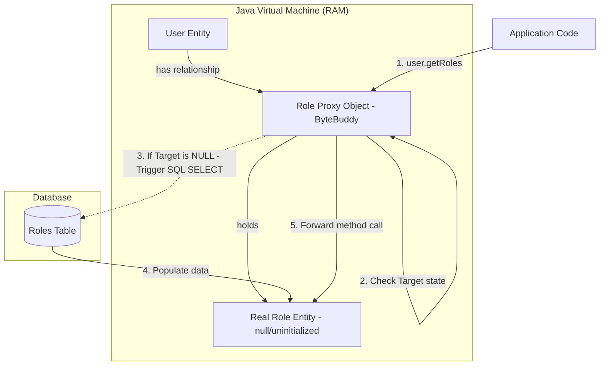

# Phân biệt Lazy Loading và Eager Loading trong JPA/Hibernate

## ⚡ Tóm tắt ngắn (30s)
*   **Lazy Loading (Tải chậm - `FetchType.LAZY`)**: Hibernate trì hoãn việc tải dữ liệu của thực thể liên quan (hoặc collection) xuống database cho đến khi ứng dụng thực sự gọi thuộc tính đó lần đầu tiên. Cơ chế này hoạt động dựa trên các **Dynamic Proxy (Đối tượng ủy quyền động)**.
*   **Eager Loading (Tải ngay - `FetchType.EAGER`)**: Hibernate thực hiện nạp toàn bộ thực thể liên quan ngay lập tức cùng với thực thể chính trong câu lệnh SELECT đầu tiên (thường dùng truy vấn LEFT JOIN hoặc gửi thêm một câu SELECT phụ).
*   **Best Practice**: Luôn luôn cấu hình mặc định là **`FetchType.LAZY` cho tất cả các quan hệ** (kể cả `@ManyToOne` vốn mặc định là EAGER). Việc nạp dữ liệu liên quan nên được quyết định động theo từng truy vấn nghiệp vụ cụ thể bằng cách dùng `JOIN FETCH` hoặc `@EntityGraph`.

---

## 🔍 Chi tiết bản chất thực chiến

### 1. Cơ chế hoạt động vật lý của Lazy Loading thông qua Dynamic Proxy

Khi bạn cấu hình một thuộc tính là `LAZY`, Hibernate không gán đối tượng thực tế cho thuộc tính đó khi nạp thực thể cha lên RAM. Thay vào đó, nó gán một **Proxy** (do thư viện ByteBuddy tự động tạo ra tại runtime).



*   **Khi Proxy chưa được khởi tạo (Uninitialized)**: Nó chỉ chứa giá trị Khóa chính ID. Nếu bạn gọi `role.getId()`, Hibernate không cần gửi truy vấn xuống DB (vì ID đã có sẵn trong Proxy).
*   **Khi Proxy được kích hoạt (Initialization)**: Khi bạn gọi một phương thức phi-ID (ví dụ: `role.getName()` hoặc `roles.size()`), Proxy nhận thấy mục tiêu thực tế (Target) đang là null. Nó lập tức mở kết nối DB thông qua Session hiện tại, gửi câu SELECT để nạp dữ liệu thực tế, gán vào Target và chuyển tiếp lời gọi hàm sang Target.

### 2. Thảm họa LazyInitializationException: Nguyên nhân vật lý
Đây là lỗi ám ảnh nhất đối với các lập trình viên Java Web. Nó xảy ra khi:
1.  Một thực thể được nạp lên RAM với các quan hệ là `LAZY`.
2.  Database Transaction kết thúc, Session vật lý bị đóng lại. Thực thể chuyển sang trạng thái **Detached**.
3.  Ở tầng Controller hoặc View (ngoài Transaction), ứng dụng gọi `user.getRoles().size()`.
4.  Proxy cố gắng kết nối DB để tải dữ liệu nhưng Session đã đóng (`Session is closed`). Hibernate ném ra **`LazyInitializationException`**.

---

## 💻 Code thực chiến: BAD vs GOOD trong thiết kế FetchType

### ❌ BAD: Dùng mặc định Eager Loading hoặc lạm dụng Eager gây nghẽn hiệu năng
Sử dụng mặc định EAGER trên quan hệ `@ManyToOne` hoặc cấu hình EAGER bừa bãi khiến cho mỗi câu SELECT cha kéo theo hàng tá câu lệnh JOIN/SELECT con vô nghĩa, làm quá tải I/O Database và tốn bộ nhớ RAM.

```java
@Entity
@Table(name = "employees")
public class Employee {
    @Id
    private Long id;
    private String name;

    // Anti-pattern: @ManyToOne mặc định là EAGER. Mỗi lần select Employee 
    // sẽ tự động ép buộc JOIN với bảng Department, ngay cả khi chỉ cần in tên Employee.
    @ManyToOne 
    @JoinColumn(name = "department_id")
    private Department department;

    // Anti-pattern: Cấu hình EAGER cho Collection. Nếu Department có 10.000 Employee,
    // nạp Department sẽ kéo theo 10.000 Employee vào RAM!
    @OneToMany(mappedBy = "department", fetch = FetchType.EAGER)
    private List<Project> projects;
}
```

###  GOOD: Mặc định LAZY và nạp động (Dynamic Fetching) khi cần thiết

```java
@Entity
@Table(name = "employees")
public class Employee {
    @Id
    private Long id;
    private String name;

    // Thay đổi mặc định sang LAZY an toàn
    @ManyToOne(fetch = FetchType.LAZY) 
    @JoinColumn(name = "department_id")
    private Department department;

    @OneToMany(mappedBy = "department", fetch = FetchType.LAZY)
    private List<Project> projects;
}
```

**Cách viết Repository truy vấn động bằng `JOIN FETCH` (Giải quyết triệt để LazyInitializationException):**
```java
@Repository
public interface EmployeeRepository extends JpaRepository<Employee, Long> {
    
    // Khi chỉ cần lấy thông tin cơ bản Employee:
    // Dùng findById() mặc định -> department và projects sẽ là LAZY (tối ưu).

    // Khi làm màn hình chi tiết Employee cần hiển thị cả Department:
    // Sử dụng JOIN FETCH để nạp Eagerly một cách chủ động chỉ trong query này!
    @Query("SELECT e FROM Employee e JOIN FETCH e.department WHERE e.id = :id")
    Optional<Employee> findByIdWithDepartment(@Param("id") Long id);
}
```

---

## 📊 Bảng so sánh Eager Loading và Lazy Loading

| Tiêu chí | Eager Loading (`FetchType.EAGER`) | Lazy Loading (`FetchType.LAZY`) |
| :--- | :--- | :--- |
| **Thời điểm tải dữ liệu** | Ngay lập tức cùng với thực thể chính | Khi được gọi thuộc tính lần đầu tiên |
| **Cơ chế kỹ thuật** | LEFT JOIN hoặc câu lệnh SELECT phụ chạy liền | Dynamic Proxy (ByteBuddy) bọc ngoài |
| **Hiệu năng hệ thống** | Tệ khi bảng có nhiều quan hệ (nạp thừa dữ liệu) | Tối ưu (chỉ nạp những gì thực sự dùng) |
| **Mức tiêu hao RAM** | Rất cao (RAM giữ nhiều đối tượng thừa) | Thấp và tối ưu |
| **Nguy cơ lỗi Runtime** | Không bị LazyInitializationException | Có nguy cơ cao nếu truy cập ngoài Transaction |
| **Cấu hình mặc định** | `@ManyToOne`, `@OneToOne` | `@OneToMany`, `@ManyToMany` |

---

## ⚠️ Common Gotchas & Questions follow-up

### 1. Cạm bẫy "Jackson Serialization Loop" (Vòng lặp tuần hoàn JSON)
*   **Vấn đề**: Khi viết REST API trả về trực tiếp Entity có quan hệ hai chiều (`User` có `@OneToMany Roles`, `Role` có `@ManyToOne User`) được cấu hình `LAZY`. Thư viện Jackson Serializer quét qua đối tượng `User` để biến thành chuỗi JSON, nó gặp thuộc tính `roles` (đang là Lazy Proxy). Jackson sẽ gọi các getter để chuyển đổi, vô tình kích hoạt tải Proxy. Trong `Role`, Jackson lại quét qua thuộc tính `user` và kích hoạt tải ngược lại, dẫn đến **vòng lặp vô tận** gây ra lỗi **`StackOverflowError`** hoặc ném ra `LazyInitializationException`.
*   **Giải pháp**: Không bao giờ expose Entity trực tiếp ra API Controller. Luôn luôn map Entity sang **DTO (Data Transfer Object)** sạch sẽ trước khi trả về client.

### 2. Câu hỏi đào sâu từ interviewer

*   **Q: Tại sao mặc định trong đặc tả JPA, các quan hệ đơn giá trị (`@ManyToOne`, `@OneToOne`) lại là EAGER, trong khi quan hệ tập hợp (`@OneToMany`, `@ManyToMany`) lại là LAZY? Điều này có hợp lý không?**
    *   *Trả lời*: Thiết kế mặc định này dựa trên giả định an toàn về mặt dữ liệu. `@ManyToOne` và `@OneToOne` chỉ liên kết với tối đa 1 thực thể đơn lẻ (Single-valued association), việc nạp thêm 1 bản ghi bằng câu lệnh JOIN thường có chi phí I/O rất nhỏ và ít nguy cơ gây tràn bộ nhớ. Ngược lại, `@OneToMany` liên kết với một Collection (Tập hợp), số lượng phần tử con có thể lên tới hàng ngàn hoặc hàng triệu dòng dữ liệu. Nếu mặc định là EAGER, việc nạp 1 bản ghi cha có thể vô tình kéo sập hệ thống do nạp lượng dữ liệu khổng lồ vào RAM. Tuy nhiên, trong thực tế phát triển dự án High-performance, **quyết định mặc định EAGER cho `@ManyToOne` là không hợp lý** vì hàng chục quan hệ `@ManyToOne` trên một bảng sẽ tạo ra những câu lệnh JOIN khổng lồ. Do đó, các Senior Developer luôn chủ động override thiết kế mặc định này bằng cách gán `fetch = FetchType.LAZY` cho toàn bộ các quan hệ `@ManyToOne`.
