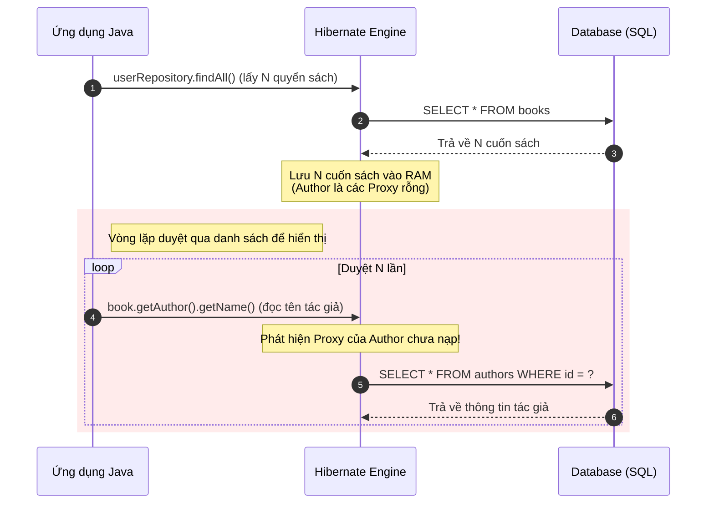

# N+1 Query xảy ra như thế nào trong Hibernate? Bản chất vật lý và nguồn gốc

## ⚡ Tóm tắt ngắn (30s)
Ngoại lệ hiệu năng **N+1 Query** xảy ra khi ứng dụng của bạn cần nạp một danh sách gồm $N$ thực thể cha (ví dụ: Orders), sau đó với mỗi thực thể cha, Hibernate lại gửi thêm một câu truy vấn `SELECT` phụ độc lập để lấy thông tin của thực thể con liên quan (ví dụ: Customer).

Kết quả vật lý: Hệ thống phải thực thi tổng cộng **$1$ câu SELECT ban đầu (để lấy danh sách cha) + $N$ câu SELECT phụ (cho từng cha)** xuống database. 

Hậu quả là thảm họa nghẽn I/O mạng và quá tải Database Connection Pool khi $N$ tăng lên (ví dụ: $N = 1000$ thì hệ thống phải chạy tới $1001$ câu truy vấn chỉ để hiển thị một trang danh sách!).

---

## 🔍 Chi tiết bản chất thực chiến

### 1. Phân tích luồng vật lý sinh ra câu lệnh N+1

Hãy tưởng tượng bạn có quan hệ: Một `Book` (Sách) thuộc về một `Author` (Tác giả) với cấu hình mặc định hoặc cấu hình `LAZY`.



### 2. Cạm bẫy Eager Loading: Tại sao Eager KHÔNG cứu được N+1?

Một hiểu lầm kinh điển của lập trình viên là: *"Nếu bị N+1 do Lazy loading trì hoãn tải, vậy tôi chỉ cần đổi sang `FetchType.EAGER` để nó tải luôn cùng lúc!"*.

> [!WARNING]
> **Thực tế hoàn toàn ngược lại.** Nếu bạn cấu hình là `EAGER` và chạy một câu lệnh JPQL/HQL như `SELECT b FROM Book b`:
> 1.  Hibernate phân tích câu lệnh JPQL thô, nó dịch nghĩa đen thành: `SELECT * FROM books`. Nó gửi lệnh này xuống DB và nhận về danh sách $N$ cuốn sách.
> 2.  Sau khi nhận danh sách về, Hibernate phân tích cấu hình thực thể và thấy thuộc tính `author` là `EAGER` (bắt buộc phải có dữ liệu ngay lập tức).
> 3.  Hibernate duyệt qua $N$ cuốn sách vừa lấy, và với mỗi cuốn, nó **tự động gửi ngay lập tức một câu SELECT phụ** `SELECT * FROM authors WHERE id = ?` xuống DB để lấy Author.
> 
> Hệ quả là: Bạn thậm chí **chưa cần viết một dòng code duyệt vòng lặp nào**, chỉ mới gọi `findAll()` thôi thì Hibernate đã **tự động kích hoạt thảm họa N+1 câu lệnh truy vấn chạy ngầm dưới nền!**

---

## 💻 Code thực chiến: BAD trong thực tiễn gây ra N+1

### ❌ BAD: Viết truy vấn JPQL danh sách thông thường và duyệt lấy thông tin quan hệ

Dưới đây là kịch bản chuẩn tạo ra N+1 trong Spring Boot:

**Thực thể Book & Author:**
```java
@Entity
public class Book {
    @Id
    private Long id;
    private String title;

    @ManyToOne(fetch = FetchType.LAZY) // Mặc dù là LAZY
    @JoinColumn(name = "author_id")
    private Author author;
}

@Entity
public class Author {
    @Id
    private Long id;
    private String name;
}
```

**Mã nguồn Service gây lỗi:**
```java
@Service
public class BookService {
    private final BookRepository bookRepository;

    public BookService(BookRepository bookRepository) {
        this.bookRepository = bookRepository;
    }

    @Transactional(readOnly = true)
    public List<BookDto> getBooksReportBad() {
        // Lệnh 1: Gửi SELECT * FROM book (Trả về N bản ghi)
        List<Book> books = bookRepository.findAll(); 

        List<BookDto> dtos = new ArrayList<>();
        for (Book book : books) {
            // Khi gọi getAuthor().getName(), vì author là Lazy Proxy chưa được nạp,
            // Hibernate buộc phải gửi thêm 1 câu SELECT phụ cho mỗi vòng lặp!
            // Tổng cộng gửi N câu SELECT phụ!
            BookDto dto = new BookDto(book.getTitle(), book.getAuthor().getName());
            dtos.add(dto);
        }
        return dtos;
    }
}
```

**Nhật ký SQL Console thực tế (SQL Log):**
```sql
-- 1. Câu truy vấn ban đầu
Hibernate: select b1_0.id, b1_0.author_id, b1_0.title from book b1_0

-- N câu truy vấn phụ sinh ra liên tiếp trong vòng lặp!
Hibernate: select a1_0.id, a1_0.name from author a1_0 where a1_0.id=?
Hibernate: select a1_0.id, a1_0.name from author a1_0 where a1_0.id=?
Hibernate: select a1_0.id, a1_0.name from author a1_0 where a1_0.id=?
... (lặp lại N lần)
```

---

## 📊 Bảng so sánh số lượng câu truy vấn sinh ra thực tế

Để hiểu sâu bản chất, ta so sánh hành vi sinh SQL của Hibernate giữa Point Lookup (`findById`) và JPQL Query danh sách (`findAll`):

| Cách truy vấn | Thuộc tính FetchType | Số câu lệnh SQL sinh ra | Bản chất vật lý |
| :--- | :--- | :--- | :--- |
| `entityManager.find(id)` | `FetchType.EAGER` | **1 câu lệnh** (Có JOIN) | Hibernate tối ưu hóa được Point Lookup, tự động sinh lệnh `LEFT JOIN` để nạp cả hai. |
| `entityManager.find(id)` | `FetchType.LAZY` | **1 câu lệnh** (Không JOIN) | Chỉ nạp bảng cha, con ở dạng Proxy. |
| JPQL `SELECT b FROM Book b` | `FetchType.EAGER` | **N + 1 câu lệnh** | HQL dịch trực tiếp thành SQL đơn lẻ, sau đó nạp Eager cưỡng bức từng thực thể con. |
| JPQL `SELECT b FROM Book b` | `FetchType.LAZY` | **1 câu lệnh** ban đầu | Chỉ bị N+1 khi bắt đầu duyệt và truy cập thuộc tính con ở tầng ứng dụng. |

---

## ⚠️ Common Gotchas & Questions follow-up

### 1. Cạm bẫy "N+1 ẩn giấu" qua các thư viện Mapper (MapStruct/ModelMapper)
*   **Vấn đề**: Nhiều dự án cấu hình LAZY rất chuẩn chỉnh, code Service không hề có vòng lặp gọi getter của đối tượng con. Tuy nhiên, khi trả dữ liệu về Controller, lập trình viên sử dụng các công cụ map tự động như MapStruct hoặc ModelMapper để chuyển đổi `Book` thành `BookDto`. Dưới nền, các thư viện này tự động quét qua tất cả các thuộc tính của `Book`, gọi các phương thức getter tương ứng (bao gồm cả `getAuthor()`) để gán sang DTO, vô tình kích hoạt tải Proxy hàng loạt ngoài tầm kiểm soát và gây ra N+1 cực kỳ âm thầm.
*   **Giải pháp**: Cấu hình MapStruct bỏ qua (ignore) các thuộc tính lazy nếu không cần dùng, hoặc tốt nhất là sử dụng JPQL DTO Projection để select thẳng sang DTO ngay từ Database.

### 2. Câu hỏi đào sâu từ interviewer

*   **Q: Tại sao Point Lookup (`entityManager.find()`) có thể tránh được N+1 bằng cách tự sinh câu lệnh LEFT JOIN khi gặp EAGER, nhưng JPQL `SELECT p FROM Parent p` thì lại chịu bó tay và tạo ra N+1?**
    *   *Trả lời*: Bản chất nằm ở kiến trúc của bộ phân tích tối ưu hóa truy vấn (Query Optimizer) của Hibernate. 
        *   Khi gọi `find(id)`, Hibernate biết chính xác bạn chỉ tìm kiếm **duy nhất một bản ghi cụ thể** bằng khóa chính. Do đó, Metadata Engine của Hibernate có thể dễ dàng tính toán trước và sinh ra một câu lệnh chứa `LEFT OUTER JOIN` duy nhất để kéo toàn bộ dữ liệu của cha và con lên cùng một lúc một cách an toàn và tối ưu.
        *   Khi bạn chạy JPQL `SELECT p FROM Parent p`, JPQL là một ngôn ngữ truy vấn trừu tượng hướng đối tượng. Hibernate bắt buộc phải biên dịch chuỗi JPQL này thành một câu lệnh SQL tương đương trực tiếp. Do JPQL không có mệnh đề JOIN rõ ràng, SQL được dịch ra chỉ đơn thuần là `SELECT * FROM parent`. Hibernate không thể tự ý chèn thêm `LEFT JOIN` vào câu lệnh SQL của bạn vì điều đó có thể làm thay đổi hoàn toàn ngữ nghĩa, cấu trúc kết quả trả về, hoặc gây sai lệch phân trang (Pagination). Chỉ sau khi nhận ResultSet về, Hibernate mới duyệt qua các đối tượng đã tạo và phát hiện ra các quan hệ EAGER cần phải nạp, dẫn đến việc gửi thêm $N$ câu SELECT phụ một cách cưỡng bức.
