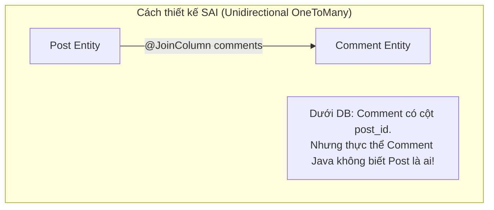

# Hướng dẫn thiết kế và sử dụng @OneToMany, @ManyToOne, @ManyToMany chuẩn Production

## ⚡ Tóm tắt ngắn (30s)
*   **`@ManyToOne`**: Luôn là **nền tảng** của mọi thiết kế quan hệ. Phải luôn cấu hình **`fetch = FetchType.LAZY`** (ghi đè mặc định EAGER).
*   **`@OneToMany`**: Nên sử dụng dạng **Bidirectional (Hai chiều)** kết hợp với `@ManyToOne`. Phải luôn khai báo thuộc tính **`mappedBy`** để chỉ định bên `@ManyToOne` làm **Owning Side** (Bên sở hữu liên kết vật lý dưới DB). Tránh dùng `@OneToMany` một chiều (Unidirectional) vì nó sinh ra các câu lệnh `UPDATE` dư thừa vô cùng tệ hại.
*   **`@ManyToMany`**: Thực tế production rất hiếm khi dùng `@ManyToMany` thuần túy. Hầu hết các quan hệ nhiều-nhiều đều phát sinh thêm thuộc tính (ví dụ: ngày tạo, trạng thái liên kết). Do đó, giải pháp tối ưu là **phân rã `@ManyToMany` thành hai quan hệ `@OneToMany` và `@ManyToOne`** thông qua một Thực thể trung gian (Bridge Entity).

---

## 🔍 Chi tiết bản chất thực chiến

### 1. Thảm họa hiệu năng của Unidirectional @OneToMany (Một chiều)

Nhiều lập trình viên tạo quan hệ một chiều từ cha sang con bằng cách chỉ khai báo `@OneToMany` ở thực thể Cha kèm `@JoinColumn` mà không khai báo `@ManyToOne` ở thực thể Con.



Khi bạn thêm một `Comment` mới vào danh sách của `Post`:
1.  Hibernate không biết gán `post_id` thế nào vì thực thể `Comment` không có tham chiếu ngược về `Post`.
2.  Do đó, đầu tiên Hibernate gửi lệnh: `INSERT INTO comment (id, content) VALUES (1, 'Nice!');` (với cột `post_id` tạm thời để trống/NULL).
3.  Sau đó, Hibernate gửi tiếp lệnh: `UPDATE comment SET post_id = 1 WHERE id = 1;` để cập nhật khóa ngoại.
4.  **Hậu quả**: Tốn gấp đôi số lượng truy vấn (`INSERT` + `UPDATE`), và bắt buộc cột khóa ngoại `post_id` phải cho phép giá trị `NULL` (vi phạm tính toàn vẹn dữ liệu).

### 2. Thiết kế hai chiều chuẩn (Bidirectional) và Helper Methods

Để tối ưu hóa, ta dùng quan hệ hai chiều. Khi đó, bên `@ManyToOne` (ở thực thể Con) sẽ là **Owning Side** chịu trách nhiệm quản lý cột khóa ngoại vật lý trong DB. Bên `@OneToMany` (ở thực thể Cha) chỉ dùng thuộc tính **`mappedBy`** đóng vai trò là gương chiếu (Non-owning side).

> [!IMPORTANT]
> Vì dữ liệu được quản lý ở cả RAM (hướng đối tượng Java) và Disk (SQL). Khi thêm/xóa phần tử trong danh sách hai chiều, ta bắt buộc phải viết các **Helper Methods (Phương thức đồng bộ)** để cập nhật đồng thời cả hai đầu liên kết trên RAM. Nếu không, bạn sẽ gặp lỗi dữ liệu không đồng bộ trên RAM trước khi transaction commit.

---

## 💻 Code thực chiến: BAD vs GOOD trong thiết kế quan hệ

### ❌ BAD: Dùng `@OneToMany` một chiều và thiếu Helper Methods đồng bộ

```java
@Entity
public class Post {
    @Id
    @GeneratedValue(strategy = GenerationType.IDENTITY)
    private Long id;
    private String title;

    // Anti-pattern 1: @OneToMany một chiều gây dư thừa câu lệnh UPDATE
    @OneToMany(cascade = CascadeType.ALL, orphanRemoval = true)
    @JoinColumn(name = "post_id") // Tạo liên kết một chiều
    private List<Comment> comments = new ArrayList<>();
    
    // Getters và Setters thông thường
}
```

---

###  GOOD: Thiết kế hai chiều tối ưu và phân rã `@ManyToMany` thực chiến

#### 1. Thiết kế quan hệ một-nhiều hai chiều hoàn hảo (One-To-Many Bidirectional)
```java
@Entity
@Table(name = "posts")
public class Post {
    @Id
    @GeneratedValue(strategy = GenerationType.IDENTITY)
    private Long id;
    private String title;

    // mappedBy chỉ định thuộc tính "post" trong thực thể Comment làm chủ liên kết
    @OneToMany(mappedBy = "post", cascade = CascadeType.ALL, orphanRemoval = true)
    private List<Comment> comments = new ArrayList<>();

    // HELPER METHOD: Đồng bộ hai đầu liên kết vật lý trên RAM bắt buộc phải có!
    public void addComment(Comment comment) {
        comments.add(comment);
        comment.setPost(this); // Cập nhật đầu ngược lại để Hibernate nhận biết khóa ngoại
    }

    public void removeComment(Comment comment) {
        comments.remove(comment);
        comment.setPost(null); // Giải phóng liên kết
    }
}

@Entity
@Table(name = "comments")
public class Comment {
    @Id
    @GeneratedValue(strategy = GenerationType.IDENTITY)
    private Long id;
    private String content;

    // Luôn ghi đè EAGER bằng LAZY!
    @ManyToOne(fetch = FetchType.LAZY)
    @JoinColumn(name = "post_id", nullable = false) // Khóa ngoại vật lý NOT NULL an toàn dữ liệu
    private Post post;
}
```

#### 2. Phân rã `@ManyToMany` thực chiến thông qua Thực thể trung gian (PostTag)
Thay vì dùng `@ManyToMany` thô sơ khiến ta bất lực khi cần lưu thêm thông tin (ví dụ: ngày gán nhãn tag, người gán), hãy phân rã thành thực thể trung gian cầu nối.

```java
@Entity
@Table(name = "posts")
public class Post {
    @Id
    private Long id;
    
    @OneToMany(mappedBy = "post", cascade = CascadeType.ALL, orphanRemoval = true)
    private Set<PostTag> postTags = new HashSet<>();
}

@Entity
@Table(name = "tags")
public class Tag {
    @Id
    private Long id;
    private String name;
    
    @OneToMany(mappedBy = "tag")
    private Set<PostTag> postTags = new HashSet<>();
}

// THỰC THỂ CẦU NỐI TRUNG GIAN - Thiết kế chuẩn hệ thống lớn
@Entity
@Table(name = "post_tags")
public class PostTag {
    @EmbeddedId
    private PostTagId id; // Composite Primary Key chứa [post_id, tag_id]

    @ManyToOne(fetch = FetchType.LAZY)
    @MapsId("postId")
    @JoinColumn(name = "post_id")
    private Post post;

    @ManyToOne(fetch = FetchType.LAZY)
    @MapsId("tagId")
    @JoinColumn(name = "tag_id")
    private Tag tag;

    // Lợi thế cực đại: Lưu thêm thuộc tính nghiệp vụ tùy ý!
    private LocalDateTime assignedAt = LocalDateTime.now();
    private String assignedBy;
}
```

---

## 📊 Bảng so sánh các kiểu thiết kế quan hệ

| Tiêu chí | Unidirectional OneToMany | Bidirectional One-to-Many / Many-to-One | Phân rã Many-to-Many qua thực thể trung gian |
| :--- | :--- | :--- | :--- |
| **Bảng phụ trung gian?** | Không | Không | **Có** (Bảng liên kết chứa dữ liệu bổ sung) |
| **Vị trí khóa ngoại dưới DB**| Bảng Con (`post_id`) | Bảng Con (`post_id`) | Bảng liên kết (`post_id`, `tag_id`) |
| **Câu lệnh UPDATE dư thừa?**| **CÓ** (Thảm họa hiệu năng) | **KHÔNG** (Chỉ chạy 1 lệnh INSERT) | **KHÔNG** |
| **Khóa ngoại cho phép NULL?**| Bắt buộc phải cho phép NULL | Có thể cấu hình `NOT NULL` an toàn | `NOT NULL` hoàn toàn |
| **Khuyên dùng (Best Practice)?**| ❌ Tuyệt đối tránh | **Được khuyến nghị cao** | **Bắt buộc cho hệ thống thực tế** |

---

## ⚠️ Common Gotchas & Questions follow-up

### 1. Cạm bẫy "CascadeType.REMOVE" trên `@ManyToMany`
*   **Vấn đề**: Khi sử dụng `@ManyToMany` thô sơ (ví dụ: giữa `Post` và `Tag`), lập trình viên vô tình gán thuộc tính `cascade = CascadeType.REMOVE` hoặc `CascadeType.ALL` vào quan hệ này. Khi ứng dụng thực hiện xóa một bài viết `Post`, Hibernate sẽ tự động lan truyền lệnh xóa sang các thực thể `Tag` liên quan. Hậu quả là, nhãn `Tag` đó bị xóa khỏi DB, kéo theo việc tất cả các bài viết `Post` khác đang sử dụng nhãn này cũng bị ảnh hưởng hoặc lỗi khóa ngoại liên đới!
*   **Giải pháp**: Tuyệt đối không bao giờ dùng `CascadeType.REMOVE` hay `CascadeType.ALL` trên quan hệ nhiều-nhiều `@ManyToMany`. Chỉ sử dụng cascading trên quan hệ cha-con sở hữu chặt chẽ (`@OneToMany` có tính phụ thuộc sinh tồn).

### 2. Câu hỏi đào sâu từ interviewer

*   **Q: Tại sao khi viết Helper Methods để đồng bộ quan hệ hai chiều, chúng ta phải gán giá trị cho cả hai đầu (ví dụ: vừa `comments.add(comment)` vừa `comment.setPost(this)`)? Chẳng phải chỉ cần set một bên thì Hibernate vẫn lưu đúng xuống DB sao?**
    *   *Trả lời*: Đúng là Hibernate chỉ quan tâm đến **Owning Side** (phía thực thể Con có chứa `@JoinColumn`). Chỉ cần bạn gọi `comment.setPost(post)` và lưu thực thể `Comment`, Hibernate đã có đủ thông tin khóa ngoại để sinh ra câu lệnh `INSERT` đúng đắn xuống DB. Tuy nhiên, việc đồng bộ đầu ngược lại (`post.getComments().add(comment)`) là cực kỳ quan trọng đối với **Trạng thái bộ nhớ RAM**. Nếu bạn không đồng bộ đầu ngược lại, Persistence Context hiện tại vẫn giữ thực thể `Post` với danh sách `comments` trống rỗng. Nếu ngay sau đó trong cùng một Transaction, ứng dụng thực hiện nghiệp vụ duyệt danh sách `post.getComments()` để tính toán hoặc trả dữ liệu về client, kết quả sẽ bị sai lệch hoàn toàn so với Database thực tế. Việc đồng bộ hai đầu giúp đảm bảo tính nhất quán của dữ liệu trên RAM và tránh các lỗi logic nghiệp vụ ngầm vô cùng khó debug.
