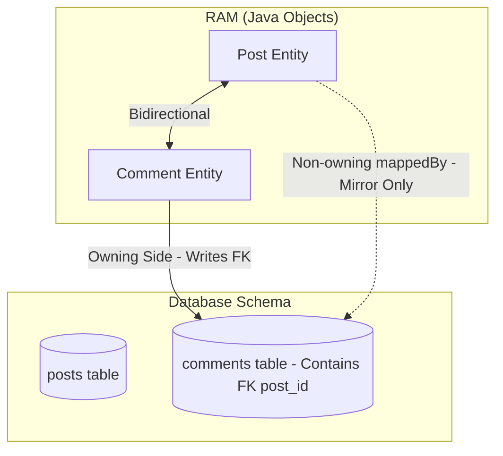

# Owning Side trong Relationship là gì? Vai trò của mappedBy

## ⚡ Tóm tắt ngắn (30s)
Trong quan hệ hai chiều (Bidirectional) của JPA/Hibernate, **Owning Side (Bên sở hữu)** là thực thể chịu trách nhiệm duy nhất cho việc đồng bộ và cập nhật khóa ngoại (Foreign Key) xuống Database vật lý.
*   **Bên sở hữu (Owning Side)**: Được định nghĩa bằng chú thích **`@JoinColumn`** (thường nằm ở phía `@ManyToOne`). Mọi thay đổi vật lý dưới DB (thêm, sửa, xóa quan hệ) chỉ được thực thi khi bạn tác động lên bên sở hữu này.
*   **Bên tham chiếu (Non-owning / Inverse Side)**: Được định nghĩa bằng thuộc tính **`mappedBy`** (thường nằm ở phía `@OneToMany`). Bên này chỉ đóng vai trò là "chiếc gương chiếu" để đọc dữ liệu (Read-only view). Hibernate hoàn toàn bỏ qua (ignore) các thay đổi được thực hiện trên danh sách của bên tham chiếu khi sinh ra câu lệnh ghi SQL.

---

## 🔍 Chi tiết bản chất thực chiến

### 1. Tại sao JPA cần khái niệm Owning Side?

Hãy tưởng tượng bạn có hai đối tượng Java đang tham chiếu hai chiều đến nhau trên RAM:
```java
// Trên RAM
post.getComments().add(comment);
comment.setPost(post);
```

Dưới Database vật lý, quan hệ một-nhiều này chỉ được biểu diễn bằng **duy nhất một cột khóa ngoại** `post_id` nằm trong bảng `comments`. 

Nếu không có khái niệm Owning Side, khi bạn lưu thay đổi, Hibernate sẽ bối rối: Nó nên quét qua danh sách `comments` của `Post` để sinh ra lệnh update, hay quét qua thuộc tính `post` của `Comment`? Nếu quét cả hai, nó sẽ sinh ra **2 câu lệnh SQL ghi trùng lặp** tác động lên cùng một cột khóa ngoại. 

Để giải quyết mâu thuẫn này, JPA đưa ra quy tắc: **Chỉ duy nhất một bên được quyền thay đổi cột khóa ngoại vật lý, bên còn lại chỉ được đọc.**



### 2. Ý nghĩa sâu xa của `mappedBy`

Thuộc tính `mappedBy = "post"` khai báo ở thực thể `Post` mang thông điệp vật lý gửi đến Hibernate: *"Tôi (Post) chỉ là gương chiếu. Mối quan hệ này thực chất đã được ánh xạ và quản lý bởi thuộc tính có tên là **'post'** bên trong thực thể **Comment** rồi. Hãy bỏ qua tôi khi sinh SQL chèn/cập nhật khóa ngoại."*

---

## 💻 Code thực chiến: BAD vs GOOD trong thiết lập quan hệ

### ❌ BAD: Chỉ cập nhật bên Non-owning side và nhận về khóa ngoại NULL
Lỗi kinh điển của lập trình viên là chỉ thêm đối tượng con vào danh sách của đối tượng cha (bên có `mappedBy`), mà không gán tham chiếu ngược lại ở đối tượng con (bên sở hữu). Kết quả là bản ghi con được thêm vào DB thành công nhưng **cột khóa ngoại bị NULL**.

```java
@Service
public class PostService {
    private final PostRepository postRepository;
    private final CommentRepository commentRepository;

    public PostService(PostRepository postRepository, CommentRepository commentRepository) {
        this.postRepository = postRepository;
        this.commentRepository = commentRepository;
    }

    @Transactional
    public void addCommentBad(Long postId, String content) {
        Post post = postRepository.findById(postId)
                .orElseThrow(() -> new EntityNotFoundException());

        Comment comment = new Comment();
        comment.setContent(content);

        // Anti-pattern: Chỉ thêm vào danh sách của cha (Non-owning side)
        post.getComments().add(comment); 

        // Lưu con xuống DB
        commentRepository.save(comment);
        
        // KẾT QUẢ VẬT LÝ: Bản ghi comment được chèn vào DB, 
        // nhưng cột post_id = NULL! Vì ta chưa thiết lập giá trị cho bên sở hữu.
    }
}
```

###  GOOD: Cập nhật bên sở hữu (Owning Side) thông qua Helper Method đồng bộ

```java
@Service
public class PostService {
    private final PostRepository postRepository;
    private final CommentRepository commentRepository;

    public PostService(PostRepository postRepository, CommentRepository commentRepository) {
        this.postRepository = postRepository;
        this.commentRepository = commentRepository;
    }

    @Transactional
    public void addCommentGood(Long postId, String content) {
        Post post = postRepository.findById(postId)
                .orElseThrow(() -> new EntityNotFoundException());

        Comment comment = new Comment();
        comment.setContent(content);

        // BẮT BUỘC: Sử dụng Helper Method để đồng bộ hai đầu.
        // Bên dưới method này sẽ gọi comment.setPost(post) - Thiết lập giá trị cho Owning Side!
        post.addComment(comment);

        // Lưu con
        commentRepository.save(comment);
        
        // KẾT QUẢ VẬT LÝ: Bản ghi comment được chèn thành công với post_id chính xác!
    }
}
```

---

## 📊 Bảng so sánh Owning Side và Non-Owning Side

| Tiêu chí | Bên sở hữu (Owning Side) | Bên tham chiếu (Non-owning Side) |
| :--- | :--- | :--- |
| **Annotation chính** | `@ManyToOne` kèm `@JoinColumn` | `@OneToMany(mappedBy = "...")` |
| **Vai trò vật lý** | **Quản lý khóa ngoại trực tiếp** | Chỉ là hình chiếu đọc dữ liệu (Read-only) |
| **Hibernate sinh SQL ghi khi nào?**| Khi thuộc tính của bên này thay đổi | **Bị bỏ qua hoàn toàn** |
| **Cột khóa ngoại dưới DB** | Nằm ở bảng tương ứng với thực thể này | Không có cột khóa ngoại nào ở bảng này |
| **Bắt buộc có trong thiết kế?**| **Có** (Bắt buộc phải có 1 bên sở hữu) | Không bắt buộc (quan hệ một chiều chỉ có owning side) |

---

## ⚠️ Common Gotchas & Questions follow-up

### 1. Cạm bẫy "Lưu thất bại do TransientObjectException"
*   **Vấn đề**: Khi bạn thiết lập đúng quan hệ ở bên sở hữu (`comment.setPost(post)`) nhưng đối tượng `Post` là một đối tượng mới hoàn toàn (`Transient` state, chưa được lưu xuống DB, chưa có ID). Khi bạn cố gắng lưu `Comment`, Hibernate sẽ ném ra ngoại lệ **`TransientObjectException: object references an unsaved transient instance`** vì nó không thể lấy được ID của `Post` để gán vào khóa ngoại `post_id`.
*   **Giải pháp**: Hãy đảm bảo thực thể cha đã được lưu trước để có ID (`postRepository.save(post)`), hoặc sử dụng cấu hình **`CascadeType.PERSIST`** trên thực thể cha để Hibernate tự động lưu cha trước rồi lưu con sau.

### 2. Câu hỏi đào sâu từ interviewer

*   **Q: Tại sao trong quan hệ Một-Nhiều hai chiều, `@ManyToOne` (phía thực thể Con) luôn luôn phải làm Owning Side? Tại sao chúng ta không thiết kế ngược lại, cho `@OneToMany` (phía thực thể Cha) làm Owning Side?**
    *   *Trả lời*: Thiết kế này được quyết định bởi **Cấu trúc vật lý của cơ sở dữ liệu quan hệ (RDBMS)**.
        *   Trong mô hình cơ sở dữ liệu quan hệ, cột khóa ngoại `post_id` **bắt buộc phải nằm ở bảng con** `comments` (bên Nhiều) để đảm bảo chuẩn hóa dữ liệu. Bảng cha `posts` (bên Một) hoàn toàn không có cột nào để chứa danh sách ID của các comment.
        *   Nếu chúng ta cố tình biến `@OneToMany` làm Owning Side (giả định JPA cho phép không cần `mappedBy`), khi bạn chèn một `Comment` mới, Hibernate sẽ thực hiện lệnh `INSERT` vào bảng `comments` trước. Do thực thể `Comment` không sở hữu khóa ngoại, câu lệnh `INSERT` này không thể gán giá trị cho cột `post_id`. Sau đó, Hibernate buộc phải quét qua thực thể `Post` (bên sở hữu), tìm danh sách comment và thực hiện thêm một câu lệnh **`UPDATE comments SET post_id = ? WHERE id = ?`** để cập nhật khóa ngoại cho comment vừa chèn.
        *   Việc chỉ định `@ManyToOne` (nơi chứa khóa ngoại vật lý) làm Owning Side giúp ánh xạ Java khớp hoàn toàn 1:1 với cấu trúc DB. Nhờ đó, Hibernate có thể chèn trực tiếp khóa ngoại ngay trong câu lệnh `INSERT` đầu tiên của `Comment` mà không cần tốn thêm bất kỳ câu lệnh `UPDATE` dư thừa nào, mang lại hiệu năng tối ưu nhất.
