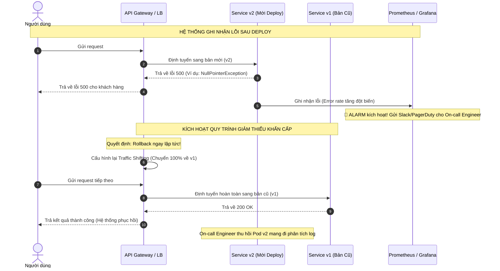

# Sau deploy, error rate tăng. Quy trình xử lý của bạn là gì?

## ⚡ Tóm tắt ngắn (30s)
* **Bản chất**: Khi hệ thống ghi nhận tỷ lệ lỗi (Error Rate) tăng đột biến ngay sau khi deploy, hành động cốt lõi là **cô lập và giảm thiểu thiệt hại ngay lập tức (Mitigate First, Investigate Later)**. Tuyệt đối không đứng dò tìm bug hay đọc log chi tiết trong lúc hệ thống đang "bốc cháy". Việc khôi phục dịch vụ về trạng thái ổn định gần nhất luôn là ưu tiên tối thượng.
* **Thảm họa thực chiến được giải quyết**:
  1. **Kéo dài thời gian gián đoạn (High MTTR - Mean Time To Resolution)**: Dành quá nhiều thời gian cố gắng đọc log debug trên production trong khi hàng triệu request của khách hàng tiếp tục bị lỗi, làm sụt giảm nghiêm trọng doanh thu và uy tín.
  2. **Rollback mù gây hỏng dữ liệu (Data Corruption)**: Thực hiện rollback vội vã mà không kiểm tra tính tương thích ngược (backward compatibility) của Database Schema đã chạy trước đó, gây lỗi ghi dữ liệu vĩnh viễn.
* **Quyết định Senior**:
  1. **Quy tắc 5 Phút / Rollback tức thì**: Nếu tỷ lệ lỗi vượt ngưỡng SLA (ví dụ: > 1% trong 5 phút liên tiếp sau deploy) và không thể tắt nhanh bằng Feature Flag, lập tức kích hoạt quy trình Rollback tự động/bằng tay.
  2. **Tắt nóng bằng Feature Flag**: Nếu tính năng mới được bọc trong Feature Flag, lập tức tắt flag đó trên Admin Dashboard để đưa code path về luồng cũ trong vòng 2 giây mà không cần rollback container.
  3. **Cô lập lỗi và Phân tích an toàn**: Sau khi hệ thống đã ổn định ở phiên bản cũ, thu thập các thông tin (Trace ID, log, metrics của phiên bản lỗi) mang sang môi trường Staging/Sandbox để phân tích nguyên nhân gốc rễ (RCA - Root Cause Analysis).

---

## 🔍 Chi tiết bản chất thực chiến: Quy trình phản ứng sự cố (Incident Response Runbook)

Quy trình phản ứng sự cố tiêu chuẩn của một Senior Engineer bao gồm 5 bước phối hợp nhịp nhàng:

```
[Báo động: Error Rate Tăng 🚨] ──> [1. ĐÁNH GIÁ NHANH (SLA)]
                                         │
                                         ▼ (Vượt ngưỡng)
                                  [2. GIẢM THIỂU THIỆT HẠI (FF/Rollback) 🛠️]
                                         │
                                         ▼ (Hệ thống ổn định trở lại)
                                  [3. XÁC ĐỊNH LỖI (Trace ID/Metrics) 🔍]
                                         │
                                         ▼
                                  [4. SỬA LỖI & RETEST AN TOÀN 💻]
                                         │
                                         ▼
                                  [5. VIẾT POSTMORTEM 📝]
```

### Bước 1: Đánh giá nhanh (Assess & Triage) trong 2 phút
* Nhìn vào Dashboard giám sát (Grafana/Datadog) để xác định: Lỗi xảy ra ở toàn bộ hệ thống hay chỉ ở một vài endpoint nhất định?
* Kiểm tra xem các downstream service hoặc database có bị quá tải không (CPU, Connection Pool).
* Xác định phạm vi ảnh hưởng: Có bao nhiêu % người dùng bị ảnh hưởng? Lỗi này có ngăn cản luồng nghiệp vụ cốt lõi (ví dụ: Thanh toán, Đặt hàng) hay không?

### Bước 2: Giảm thiểu thiệt hại lập tức (Mitigate) trong 3 phút
* **Trường hợp dùng Feature Flag**: Tắt ngay lập tức flag liên quan đến tính năng mới.
* **Trường hợp dùng Canary/Blue-Green**: 
  * Chuyển toàn bộ traffic (100%) về phiên bản cũ (Blue) trên Load Balancer hoặc API Gateway.
  * Hủy bỏ (Abort) đợt rollout Canary đang diễn ra.
* **Trường hợp Rolling Update truyền thống**: Thực hiện Rollback Deployment về tag/image ổn định trước đó (`helm rollback` hoặc `kubectl rollout undo`).

### Bước 3: Thu thập bằng chứng và Xác định lỗi (Investigate)
* Sau khi hệ thống đã an toàn, không còn lỗi 5xx trên production, ta tiến hành phân tích log của các Pod chạy phiên bản lỗi đã bị hạ xuống hoặc dựa vào dữ liệu APM đã lưu lại.
* Lọc log theo `Correlation ID / Trace ID` của các request bị lỗi 500 để tìm ra chính xác Class/Line code gây crash ứng dụng.

### Bước 4: Sửa lỗi và Viết Postmortem
* Tái hiện lỗi trên Staging, thực hiện fix và viết testcase bổ sung để đảm bảo lỗi này không bao giờ lọt lên một lần nữa.
* Viết tài liệu Postmortem chi tiết gửi cho team và stakeholders giải thích rõ: Nguyên nhân (Why), Hành động khắc phục (How), và giải pháp ngăn ngừa trong tương lai (Preventative actions).

---

## 🎨 Sơ đồ trực quan (Luồng xử lý sự cố khẩn cấp)



---

## 💻 Code thực chiến: Tự động phát hiện lỗi và Auto-Rollback bằng Script Shell / CI-CD pipeline

Trong thực tế, ta có thể tự động hóa quy trình phát hiện error rate tăng và tự động rollback bằng script tích hợp trong CI/CD hoặc Kubernetes Operator. Dưới đây là ví dụ script Shell giám sát Prometheus API và thực hiện rollback Kubernetes Deployment nếu error rate > 5%.

### Script giám sát Prometheus và Tự động Rollback
```bash
#!/bin/bash
# auto-rollback.sh
# Hướng dẫn: Chạy script này ngay sau khi deploy trong vòng 10 phút đầu.

DEPLOYMENT_NAME="payment-service"
NAMESPACE="production"
PROMETHEUS_URL="http://prometheus.monitoring:9090"
THRESHOLD_ERROR_RATE=5.0 # Ngưỡng lỗi 5%
CHECK_INTERVAL_SECONDS=30
MONITOR_DURATION_MINUTES=5 # Giám sát trong 5 phút đầu

echo "🚀 Bắt đầu giám sát Deployment ${DEPLOYMENT_NAME} sau khi deploy..."

total_checks=$(( (MONITOR_DURATION_MINUTES * 60) / CHECK_INTERVAL_SECONDS ))

for ((i=1; i<=total_checks; i++)); do
    # Query Prometheus tính toán tỷ lệ lỗi 5xx trong 1 phút gần nhất
    # Công thức: (sum(rate(http_requests_total{status=~"5.."}[1m])) / sum(rate(http_requests_total[1m]))) * 100
    PROM_QUERY="sum(rate(http_requests_total{status=~\"5..\",app=\"${DEPLOYMENT_NAME}\"}[1m]))%20/%20sum(rate(http_requests_total{app=\"${DEPLOYMENT_NAME}\"}[1m]))%20*%20100"
    
    response=$(curl -s "${PROMETHEUS_URL}/api/v1/query?query=${PROM_QUERY}")
    error_rate=$(echo "$response" | jq -r '.data.result[0].value[1]')

    # Nếu không có lỗi, gán error_rate = 0
    if [ "$error_rate" == "null" ] || [ -z "$error_rate" ]; then
        error_rate=0.0
    fi

    echo "📊 Lần kiểm tra $i/$total_checks: Tỷ lệ lỗi hiện tại là ${error_rate}%"

    # So sánh tỷ lệ lỗi với ngưỡng quy định
    if (( $(echo "$error_rate > $THRESHOLD_ERROR_RATE" | bc -l) )); then
        echo "🚨 CẢNH BÁO: Tỷ lệ lỗi (${error_rate}%) vượt quá ngưỡng cho phép (${THRESHOLD_ERROR_RATE}%)!"
        echo "🔥 Thực hiện AUTO-ROLLBACK deployment ${DEPLOYMENT_NAME} ngay lập tức..."
        
        # Lệnh Rollback Kubernetes
        kubectl rollout undo deployment/${DEPLOYMENT_NAME} -n ${NAMESPACE}
        
        if [ $? -eq 0 ]; then
            echo "✅ Auto-Rollback thành công! Gửi thông báo khẩn cấp lên Slack..."
            # Lệnh curl gửi webhook tới Slack ở đây
        else
            echo "❌ LỖI: Rollback thất bại! Yêu cầu can thiệp thủ công bằng tay lập tức!"
        fi
        exit 1
    fi

    sleep $CHECK_INTERVAL_SECONDS
done

echo "🎉 Chúc mừng! Deployment vượt qua thời gian giám sát an toàn mà không có lỗi bất thường."
exit 0
```

---

## 📊 Bảng so sánh 3 Chiến lược Ứng phó Sự cố trên Production

| Tiêu chí | Giải pháp 1: Rollback Deployment (`kubectl rollout undo`) | Giải pháp 2: Feature Flag Off (Tắt Flag) | Giải pháp 3: Hotfix trực tiếp (Fix & Deploy đè) |
| :--- | :--- | :--- | :--- |
| **Tốc độ phục hồi (MTTR)** | **Trung bình** (2 - 5 phút tùy thuộc tốc độ khởi động Pod mới). | **Cực nhanh** (1 - 5 giây, chỉ cần cập nhật cấu hình flag trên RAM). | **Cực chậm** (15 - 30 phút vì phải viết code, build image, chạy CI/CD). |
| **Độ rủi ro dữ liệu** | Trung bình (Cần lưu ý tính tương thích ngược của DB schema). | **Rất thấp** (Vì luồng code cũ vẫn chạy song song cực kỳ ổn định). | **Rất cao** (Dễ viết sai code trong trạng thái cuống, gây lỗi chồng lỗi). |
| **Độ phức tạp vận hành** | Thấp (Chỉ cần 1 lệnh rollback). | Trung bình (Đòi hỏi hệ thống phải tích hợp SDK Feature Flag trước). | Cao (Đòi hỏi bypass qua quy trình test thông thường). |
| **Khuyên dùng** | Khi lỗi nằm sâu trong core logic, thư viện hệ thống hoặc lỗi crash dump. | Khi lỗi nằm ở tính năng mới, giao diện hoặc luồng nghiệp vụ độc lập. | **Tuyệt đối tránh** (Chỉ dùng khi lỗi cực kỳ nhỏ và rollback có nguy cơ gây hỏng DB nặng hơn). |

---

## ⚠️ Common Gotchas & Questions follow-up

### 1. Cạm bẫy "Bão lỗi kép khi Rollback (The Rollback Trap)"
* **Vấn đề**: Bạn deploy phiên bản v2 có kèm theo database migration thêm một cột mới và xóa một cột cũ. Khi phát hiện v2 bị lỗi và thực hiện `kubectl rollout undo` về v1, code v1 khởi chạy lại nhưng không thể đọc ghi vào Database nữa vì cột cũ đã bị v2 xóa mất rồi! Kết quả là hệ thống sập toàn diện ở cả hai phiên bản.
* **Giải pháp khắc phục**: Tuyệt đối tuân thủ nguyên tắc **Phát triển tương thích ngược (Expand and Contract Pattern)** trong thiết kế Database Schema. Không bao giờ xóa cột cũ trong cùng một đợt deploy với thêm cột mới. Chia nhỏ quá trình thay đổi DB ra làm nhiều phase độc lập để luôn đảm bảo code cũ (v1) vẫn chạy tốt trên DB mới.

### 2. Câu hỏi đào sâu từ interviewer
* **Q: Làm sao bạn phân biệt được error rate tăng đột biến là do code bạn mới deploy bị lỗi hay do network, do nhà mạng hoặc do hệ thống thanh toán bên thứ ba bị sập đúng vào thời điểm đó?**
* **Trả lời**:
  * Để phân biệt chính xác nguyên nhân, ta dựa vào việc phân tích dữ liệu đa chiều (High-Cardinality Metrics):
    1. **Phân tích theo Lớp Lỗi (Error Classification)**: Xem mã HTTP status code trả về. Nếu lỗi là `504 Gateway Timeout` hoặc `502 Bad Gateway`, khả năng cao là do network hoặc nghẽn gateway. Nếu lỗi là `500 Internal Server Error` đi kèm với exception class cụ thể trong log (như `NullPointerException`, `IndexOutOfBoundsException`), chắc chắn 100% là do code ứng dụng.
    2. **Cô lập theo Pod/Version**: Prometheus/Grafana cho phép ta nhóm tỷ lệ lỗi theo tag `version` hoặc `pod_name`. Nếu tỷ lệ lỗi chỉ tăng vọt trên các Pod chạy version `v2.0` mới deploy, trong khi các Pod cũ `v1.9` (chạy song song trong quá trình rolling update) vẫn hoạt động hoàn toàn bình thường, thì lỗi chắc chắn nằm ở bản deploy mới.
    3. **Kiểm tra downstream/third-party metrics**: Nhìn vào biểu đồ latency và error rate của riêng luồng gọi sang đối tác thứ ba. Nếu tỷ lệ lỗi tăng nhưng biểu đồ gọi sang đối tác vẫn xanh sạch, lỗi nằm ở xử lý nội bộ của chúng ta.
