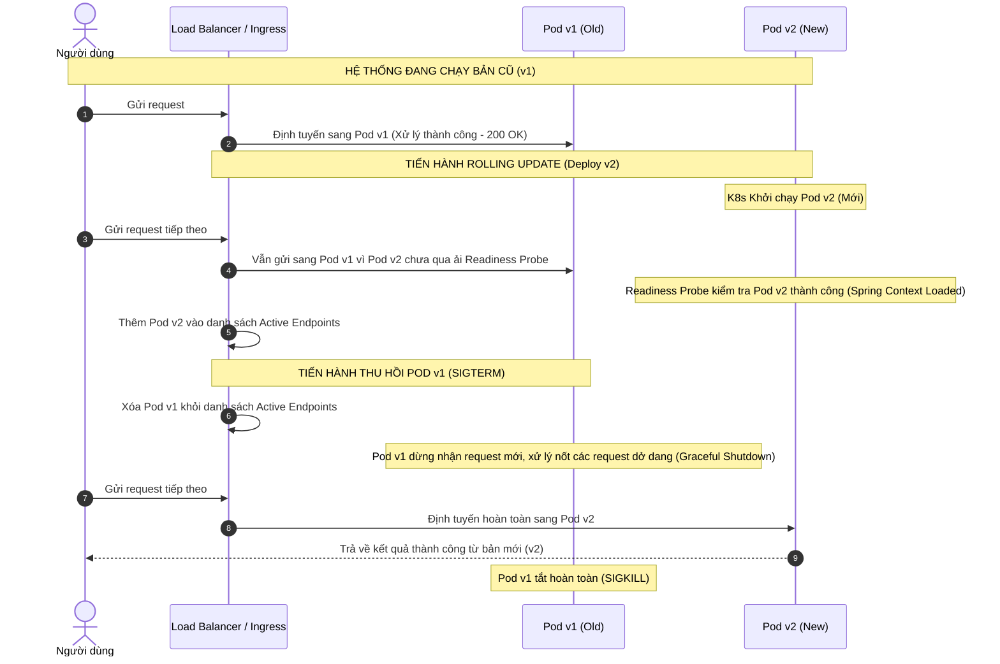

# Làm sao thiết kế deployment không downtime?

## ⚡ Tóm tắt ngắn (30s)
* **Bản chất**: Thiết kế Deployment không downtime (Zero-Downtime Deployment) là sự kết hợp đồng bộ giữa **Chiến lược định tuyến Traffic (Rolling Update, Blue-Green, Canary)** ở tầng hạ tầng và **Thiết kế tương thích ngược (Backward Compatibility / Expand & Contract Pattern)** ở tầng ứng dụng và Database. Nếu chỉ cấu hình hạ tầng Kubernetes tốt mà Database Schema bị vỡ tương thích ngược, toàn bộ hệ thống vẫn sẽ sập khi deploy.
* **Thảm họa thực chiến được giải quyết**:
  1. **Deploy sập luồng ghi do Lock Table**: Chạy lệnh DDL trực tiếp trên production (như `ALTER TABLE ADD COLUMN DEFAULT 'X'`) làm khóa toàn bộ bảng (table lock) trong vài phút trên database lớn, khiến toàn bộ các Pods hiện tại bị nghẽn connection và lăn ra chết.
  2. **Rớt request trong lúc chuyển giao (Dangling Request)**: Kill Pod cũ khi nó đang xử lý dở giao dịch thanh toán của khách hàng, hoặc định tuyến request vào Pod mới vừa khởi động nhưng chưa load xong Spring Context (chưa sẵn sàng nhận traffic).
* **Quyết định Senior**:
  1. **Áp dụng Expand & Contract Pattern**: Mọi thay đổi Database Schema bắt buộc phải chia nhỏ thành nhiều bước tương thích ngược (Multi-phase Migration). Không bao giờ đổi tên cột hay xóa cột trực tiếp trong một lần deploy.
  2. **Đồng bộ Liveness/Readiness Probes & Graceful Shutdown**: Cấu hình Spring Boot lắng nghe tín hiệu `SIGTERM`, dừng nhận request mới từ Load Balancer, hoàn tất các request đang xử lý dở (Graceful Shutdown) trước khi tắt hoàn toàn.
  3. **Sử dụng Canary Deployment**: Chuyển trước 2% - 5% traffic sang phiên bản mới để kiểm tra lỗi thực tế trước khi tự động scale rộng ra toàn bộ hệ thống.

---

## 🔍 Chi tiết bản chất thực chiến: Expand & Contract Pattern cho Database

Thách thức lớn nhất của zero-downtime deployment không nằm ở tầng Stateless Code (như API App) mà nằm ở tầng Stateful Database. Khi deploy code v2, code v1 vẫn đang chạy song song để xử lý traffic. Do đó, Database tại thời điểm đó bắt buộc phải tương thích với cả hai phiên bản code.

Để đổi tên một cột `phone` thành `phone_number` không downtime, ta áp dụng quy trình **Expand & Contract** gồm 5 bước:

```
[Môi trường ban đầu: Code v1 dùng cột 'phone']
                      │
                      ▼
[Bước 1: EXPAND - Deploy DB Migration]
  ├── Tạo cột mới 'phone_number' (chấp nhận NULL hoặc có default value).
  └── Lúc này DB có cả 2 cột 'phone' và 'phone_number'.
                      │
                      ▼
[Bước 2: Deploy Code v2 (Trạng thái trung gian - Dual Write)]
  ├── Code v2 ghi dữ liệu vào CẢ HAI cột 'phone' và 'phone_number'.
  └── Code v2 vẫn đọc dữ liệu từ cột cũ 'phone' (để đảm bảo an toàn).
                      │
                      ▼
[Bước 3: Chạy Data Migration Script]
  └── Copy toàn bộ dữ liệu lịch sử từ cột 'phone' sang 'phone_number' cho các record cũ.
                      │
                      ▼
[Bước 4: Deploy Code v3 (Chuyển đổi hoàn toàn)]
  ├── Code v3 chỉ đọc và ghi trên cột mới 'phone_number'.
  └── Lúc này cột cũ 'phone' hoàn toàn không còn được sử dụng bởi bất kỳ Pod nào.
                      │
                      ▼
[Bước 5: CONTRACT - Dọn dẹp]
  └── Chạy lệnh DB Migration xóa cột cũ 'phone' để tiết kiệm dung lượng.
```

---

## 🎨 Sơ đồ trực quan: Quy trình chuyển đổi traffic an toàn trong Rolling Update

Dưới đây là mô tả quá trình Kubernetes thực hiện Rolling Update kết hợp với `Readiness Probe` để đảm bảo không một request nào bị định tuyến vào Pod chưa sẵn sàng:



---

## 💻 Code thực chiến: Cấu hình Kubernetes & Spring Boot Graceful Shutdown

Để đảm bảo các request không bị ngắt quãng giữa chừng khi Pod bị hạ xuống, ứng dụng phải hỗ trợ Graceful Shutdown và cấu hình Kubernetes Endpoint đúng cách.

### 1. File cấu hình ứng dụng Spring Boot (`application.yml`)
Cấu hình Spring Boot dừng nhận request và chờ tối đa 30 giây để hoàn tất các request đang xử lý trước khi shutdown.

```yaml
server:
  port: 8080
  # Kích hoạt tính năng graceful shutdown (mặc định là immediate - tắt luôn)
  shutdown: graceful

spring:
  lifecycle:
    # Thời gian tối đa Spring chờ xử lý các request hiện tại (mặc định 30s)
    timeout-per-shutdown-phase: 30s
```

### 2. Cấu hình Kubernetes Deployment (`deployment.yaml`)
Cấu hình Kubernetes kết hợp `readinessProbe` và `preStop` lifecycle hook. `preStop` hook ép Pod chờ thêm vài giây sau khi nhận tín hiệu `SIGTERM` để đảm bảo hệ thống routing (Kubernetes Services, Ingress, IPVS) có đủ thời gian đồng bộ và loại bỏ IP của Pod cũ ra khỏi Load Balancer trước khi app thực sự shutdown.

```yaml
apiVersion: apps/v1
kind: Deployment
metadata:
  name: payment-service
  namespace: production
spec:
  replicas: 3
  strategy:
    type: RollingUpdate
    rollingUpdate:
      maxSurge: 1       # Cho phép khởi chạy tối đa 1 Pod vượt quá số replica quy định trong lúc deploy
      maxUnavailable: 0 # Đảm bảo luôn có ít nhất 3 Pod (100%) hoạt động bình thường trong suốt quá trình deploy
  selector:
    matchLabels:
      app: payment-service
  template:
    metadata:
      labels:
        app: payment-service
    spec:
      # Thời gian tối đa K8s chờ Pod tắt trước khi gửi tín hiệu SIGKILL ép buộc (mặc định 30s)
      # Lưu ý: Con số này phải lớn hơn thời gian timeout-per-shutdown-phase của Spring Boot + thời gian preStop sleep
      terminationGracePeriodSeconds: 45
      
      containers:
      - name: payment-service
        image: payment-service:v2.0.0
        ports:
        - containerPort: 8080
        
        lifecycle:
          preStop:
            exec:
              command: ["/bin/sh", "-c", "sleep 15"] # Chờ 15s để Load Balancer đồng bộ trạng thái, dừng gửi traffic mới
              
        livenessProbe:
          httpGet:
            path: /actuator/health/liveness
            port: 8080
          initialDelaySeconds: 20
          periodSeconds: 10
          
        readinessProbe:
          httpGet:
            path: /actuator/health/readiness
            port: 8080
          initialDelaySeconds: 25 # Đảm bảo app Spring Boot đã khởi động hoàn toàn
          periodSeconds: 10
          failureThreshold: 3
```

---

## 📊 Bảng so sánh 3 Chiến lược Deployment phổ biến

| Tiêu chí | Rolling Update (Cuốn chiếu) | Blue-Green Deployment | Canary Deployment |
| :--- | :--- | :--- | :--- |
| **Cơ chế hoạt động** | Cập nhật từng Pod một. Tắt 1 Pod cũ, dựng 1 Pod mới cho đến khi hoàn tất toàn bộ cụm. | Dựng một cụm mới (Green) song song cụm cũ (Blue). Tráo 100% traffic tại Load Balancer. | Dựng một vài Pod mới (Canary), chuyển 2-5% traffic qua test, nếu ổn định thì rollout 100%. |
| **Chi phí tài nguyên** | **Thấp nhất** (Chỉ cần thừa ra 1 Pod tài nguyên dự phòng trong quá trình deploy). | **Cao nhất** (Đòi hỏi gấp đôi tài nguyên hệ thống - 200% để chạy song song 2 cụm). | Trung bình (Chỉ cần thêm vài % tài nguyên cho cụm Canary ban đầu). |
| **Tốc độ Rollback** | Chậm (Phải làm ngược lại quy trình cuốn chiếu: tắt từng Pod mới, dựng lại Pod cũ). | **Cực nhanh** (Chỉ mất vài giây để tráo ngược traffic về cụm cũ Blue tại Load Balancer). | Nhanh (Chỉ cần tắt traffic sang cụm Canary). |
| **Độ an toàn thực tế** | Trung bình (Nếu code lỗi, những user kết nối vào Pod mới đầu tiên vẫn sẽ gặp lỗi). | Cao (Cho phép test trực tiếp cụm Green trên production trước khi mở traffic). | **Cao nhất** (Hạn chế tối đa phạm vi ảnh hưởng - Blast Radius nếu code mới có lỗi nghiêm trọng). |

---

## ⚠️ Common Gotchas & Questions follow-up

### 1. Cạm bẫy "Readiness Probe trỏ nhầm vào DB Health Check (Cascading Failure Trap)"
* **Vấn đề**: Nhiều dev cấu hình `readinessProbe` trỏ vào endpoint `/actuator/health` chung của Spring Boot. Mặc định, endpoint này sẽ kiểm tra kết nối tới cả Database, Redis, Kafka. Vào một ngày đẹp trời, Database bị quá tải nhẹ và phản hồi chậm, khiến endpoint `/health` trả về `DOWN`. Kubernetes hiểu nhầm là app không sẵn sàng, ngay lập tức gỡ bỏ toàn bộ 3 Pods đang chạy ra khỏi Load Balancer. Hệ thống sập toàn diện vì không còn Pod nào nhận traffic, mặc dù code app hoàn toàn không lỗi.
* **Giải pháp khắc phục**: Luôn tách biệt hai loại probe:
  * **Liveness Probe**: Kiểm tra xem app có bị deadlock/treo không (sử dụng `/actuator/health/liveness`).
  * **Readiness Probe**: Chỉ kiểm tra xem Web Server đã khởi động và sẵn sàng nhận HTTP request chưa (sử dụng `/actuator/health/readiness`). Tuyệt đối không kiểm tra các dependency bên ngoài (DB, Third-party) trong Readiness Probe để tránh lỗi sụp đổ dây chuyền (Cascading Failure).

### 2. Câu hỏi đào sâu từ interviewer
* **Interviewer: "Trong quá trình Rolling Update, nếu Database Schema đã migrate lên v2 nhưng code mới deploy bị lỗi nghiêm trọng và ta phải thực hiện rollback code về v1, điều gì xảy ra với Database? Làm sao thiết kế Database tương thích ngược cả chiều xuôi và chiều ngược (Forward & Backward Compatibility)?"**
* **Trả lời**:
  * Để rollback code an toàn mà không cần rollback Database (việc rollback DB cực kỳ rủi ro và dễ mất mát dữ liệu mới phát sinh), Database Schema bắt buộc phải được thiết kế tương thích cả hai chiều (Bi-directional Compatibility).
  * Điều này có nghĩa là phiên bản Database mới (v2) phải cho phép phiên bản code cũ (v1) thực hiện các thao tác Đọc và Ghi bình thường.
  * *Nguyên tắc thiết kế*:
    1. Khi thêm cột mới: Luôn cho phép cột mới nhận giá trị `NULL` hoặc có giá trị `DEFAULT` hợp lệ để code cũ (v1) khi ghi dữ liệu (không truyền cột mới) không bị DB từ chối.
    2. Khi xóa cột cũ: Không xóa vật lý ngay lập tức. Code mới (v2) sẽ dừng đọc ghi cột đó, nhưng DB vẫn giữ cột đó để nếu code cũ (v1) có chạy lại vẫn tìm thấy cột để thao tác. Chỉ xóa cột sau khi chắc chắn hệ thống v2 đã chạy ổn định 100% và không còn khả năng rollback.
