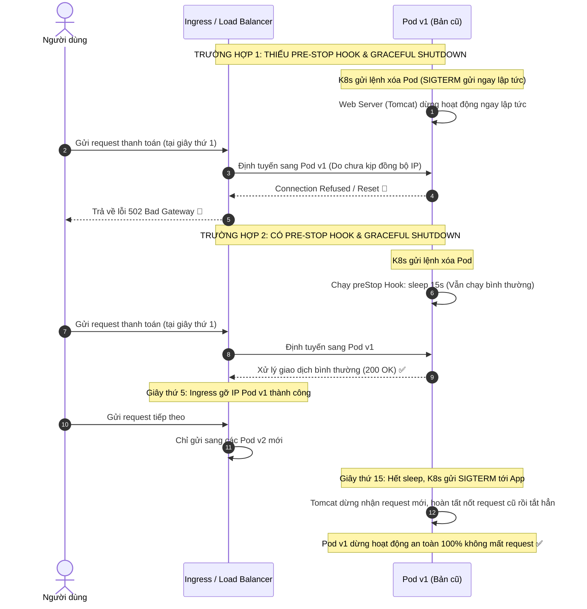

# Graceful shutdown không hoạt động làm mất request. Bạn fix ra sao?

## ⚡ Tóm tắt ngắn (30s)
* **Bản chất**: Lỗi mất request trong quá trình deploy cuốn chiếu (Rolling Update) hoặc giảm quy mô (Scale Down) xảy ra khi ứng dụng không phản ứng đúng với tín hiệu **`SIGTERM`** do Kubernetes gửi đến. Tiến trình Web Server bị tắt lập tức, ngắt kết nối các request đang xử lý dở dang (Connection Reset). Để fix triệt để, ta phải phối hợp **Graceful Shutdown ở tầng ứng dụng** (Tomcat/Jetty) và **Độ trễ đồng bộ định tuyến (preStop Sleep Delay)** ở tầng Kubernetes.
* **Thảm họa thực chiến được giải quyết**:
  1. **Lỗi 502 Bad Gateway hàng loạt**: Khi deploy, Load Balancer vẫn định tuyến request mới vào Pod cũ vừa bị ra lệnh tắt (do K8s Endpoint Controller mất 2-5 giây để đồng bộ mạng). Pod cũ bị tắt ngay lập tức dẫn đến hàng ngàn request của khách hàng bị lỗi 502/504.
  2. **Giao dịch bị đứt gãy nửa chừng (Dangling Transactions)**: Một request thanh toán mất 5 giây để gọi sang Gateway Stripe. Đúng giây thứ 2, Pod bị sập đột ngột. Khách hàng bị trừ tiền bên Stripe nhưng database của ta chưa kịp lưu trạng thái thành công, gây mất mát dữ liệu nghiêm trọng.
* **Quyết định Senior**:
  1. **Kích hoạt Graceful Shutdown ở tầng App**: Cấu hình ứng dụng dừng nhận kết nối mới (stop accept TCP socket) nhưng giữ các kết nối hiện tại để xử lý nốt các request đang chạy trong hàng đợi.
  2. **Sử dụng preStop Hook Sleep**: Ép Pod "chờ" từ 10 - 15 giây trước khi thực sự tắt. Khoảng thời gian này giúp Load Balancer/Ingress có đủ thời gian gỡ IP của Pod ra khỏi bảng định tuyến, đảm bảo không có request mới nào gửi tới Pod cũ nữa.
  3. **Đặt `terminationGracePeriodSeconds` hợp lý**: Đảm bảo tổng thời gian chờ tắt của Kubernetes lớn hơn tổng thời gian chờ của `preStop sleep` + `graceful shutdown timeout` của ứng dụng để tránh bị K8s kill bằng `SIGKILL` (kill -9) giữa chừng.

---

## 🔍 Chi tiết bản chất thực chiến: Quy trình Tắt Pod chuẩn trên Kubernetes

Khi Kubernetes quyết định xóa một Pod (do deploy mới hoặc scale down), quy trình diễn ra từng bước như sau:

```
[K8s Đổi trạng thái Pod sang Terminating]
                  │
        ┌─────────┴─────────┐
        ▼ (Tầng Hạ tầng)    ▼ (Tầng Container)
[Gỡ IP khỏi K8s Service]   [Chạy Lifecycle preStop Hook (nếu có)]
        │                   ├── Chạy lệnh: sleep 15
        │                   └── Pod dừng nhận request mới từ Load Balancer.
        ▼                   │
[LB đồng bộ bảng định tuyến] │
  (Mất khoảng 5-10 giây)     ▼ (Sau 15 giây)
        │            [K8s gửi tín hiệu SIGTERM tới App]
        │                   ├── Web Server dừng nhận connection mới.
        │                   └── Tiếp tục xử lý nốt các connection cũ dở dang.
        │                   │
        └─────────┬─────────┘
                  ▼
[Hết thời gian terminationGracePeriodSeconds (ví dụ 45s)]
                  │
                  ▼
 [K8s gửi tín hiệu SIGKILL (kill -9) - App bị tắt cứng]
```

Nếu ta **không cấu hình preStop Hook**: `SIGTERM` sẽ được gửi ngay lập tức tới App tại giây thứ 0. Lúc này Load Balancer chưa kịp gỡ IP của Pod ra khỏi bảng định tuyến, vẫn tiếp tục gửi request mới tới Pod cũ. Do App đã nhận `SIGTERM` nên Web server lập tức từ chối/ngắt kết nối, gây lỗi `502 Bad Gateway` cho khách hàng.

---

## 🎨 Sơ đồ trực quan: So sánh Tắt lập tức vs Graceful Shutdown có preStop Hook



---

## 💻 Code thực chiến: Cấu hình Graceful Shutdown trên Production

Để cấu hình Graceful Shutdown hoạt động hoàn hảo, ta cần đồng bộ cấu hình ở cả tầng Spring Boot (hoặc Node.js) và Kubernetes.

### 1. Cấu hình Spring Boot (`application.yml`)
Kích hoạt cơ chế graceful shutdown cho Tomcat/Undertow và cấu hình thời gian chờ tối đa.

```yaml
server:
  port: 8080
  # Kích hoạt graceful shutdown
  shutdown: graceful

spring:
  lifecycle:
    # Thời gian tối đa Spring chờ xử lý các request hiện tại (mặc định 30s)
    timeout-per-shutdown-phase: 30s
```

### 2. Cấu hình Kubernetes Deployment (`deployment.yaml`)
Cấu hình lệnh `sleep 15` để trì hoãn tín hiệu `SIGTERM` và đặt `terminationGracePeriodSeconds` lớn hơn tổng thời gian chờ để tránh bị kill cưỡng bức.

```yaml
apiVersion: apps/v1
kind: Deployment
metadata:
  name: order-service
  namespace: production
spec:
  replicas: 3
  selector:
    matchLabels:
      app: order-service
  template:
    metadata:
      labels:
        app: order-service
    spec:
      # terminationGracePeriodSeconds = preStop sleep (15s) + spring timeout (30s) + buffer (5s) = 50s
      terminationGracePeriodSeconds: 50
      
      containers:
      - name: order-service
        image: order-service:v2.1.0
        ports:
        - containerPort: 8080
        
        # Thêm lifecycle hook trì hoãn tắt container
        lifecycle:
          preStop:
            exec:
              command: ["/bin/sh", "-c", "sleep 15"]
              
        livenessProbe:
          httpGet:
            path: /actuator/health/liveness
            port: 8080
          initialDelaySeconds: 15
          periodSeconds: 10
        readinessProbe:
          httpGet:
            path: /actuator/health/readiness
            port: 8080
          initialDelaySeconds: 20
          periodSeconds: 10
```

### 3. Java Code: Đăng ký Custom Shutdown Hook xử lý tác vụ nền (Background Tasks)
Nếu ứng dụng của bạn chạy các luồng xử lý không đồng bộ (như ThreadPoolExecutor hoặc Kafka Consumer), bạn cần tự đăng ký lắng nghe sự kiện đóng ứng dụng để shutdown các ExecutorService một cách an toàn.

```java
package com.example.config;

import org.slf4j.Logger;
import org.slf4j.LoggerFactory;
import org.springframework.context.ApplicationListener;
import org.springframework.context.event.ContextClosedEvent;
import org.springframework.stereotype.Component;
import java.util.concurrent.ExecutorService;
import java.util.concurrent.TimeUnit;

@Component
public class SafeShutdownHandler implements ApplicationListener<ContextClosedEvent> {
    private static final Logger log = LoggerFactory.getLogger(SafeShutdownHandler.class);
    
    private final ExecutorService backgroundExecutor; // Giả sử bạn có một thread pool xử lý task nền

    public SafeShutdownHandler(ExecutorService backgroundExecutor) {
        this.backgroundExecutor = backgroundExecutor;
    }

    @Override
    public void onApplicationEvent(ContextClosedEvent event) {
        log.info("🚨 Ứng dụng nhận tín hiệu đóng context (SIGTERM). Tiến hành shutdown Thread Pool an toàn...");
        
        // 1. Dừng nhận task mới vào pool
        backgroundExecutor.shutdown();
        
        try {
            // 2. Chờ tối đa 20 giây để các task đang chạy hoàn tất nốt
            if (!backgroundExecutor.awaitTermination(20, TimeUnit.SECONDS)) {
                log.warn("⚠️ Một số task nền chưa hoàn thành sau 20s. Ép buộc shutdown...");
                backgroundExecutor.shutdownNow();
            } else {
                log.info("✅ Thread Pool đã tắt hoàn toàn an toàn.");
            }
        } catch (InterruptedException e) {
            log.error("❌ Quá trình chờ shutdown thread pool bị ngắt quãng: ", e);
            backgroundExecutor.shutdownNow();
            Thread.currentThread().interrupt();
        }
    }
}
```

---

## 📊 Bảng so sánh Tắt lập tức vs Graceful Shutdown có preStop Hook

| Tiêu chí | Giải pháp 1: Tắt lập tức (Immediate / Default) | Giải pháp 2: Graceful Shutdown có preStop Hook |
| :--- | :--- | :--- |
| **Cách xử lý kết nối hiện tại** | Đóng ngay lập tức (Abrupt termination). Trả về `Connection Reset`. | Hoàn tất xử lý các kết nối hiện tại trong hàng đợi. |
| **Cách xử lý kết nối mới** | Từ chối ngay lập tức. | Cho phép nhận kết nối mới trong thời gian `preStop sleep`, dừng nhận kết nối mới khi nhận `SIGTERM`. |
| **Ảnh hưởng tới Ingress / LB** | Gây lỗi 502/504 hàng loạt do LB chưa kịp đồng bộ IP. | **0% lỗi 502/504** do LB có 15s để đồng bộ trước khi app thực sự ngắt kết nối. |
| **Rủi ro dữ liệu** | **Rất cao** (Dễ gây mất mát dữ liệu giao dịch dở dang). | **Cực thấp** (Tất cả transaction đang chạy đều có đủ thời gian hoàn thành). |
| **Thời gian deploy cuốn chiếu** | Nhanh (Container tắt ngay, khởi động bản mới ngay). | Chậm hơn (Mỗi Pod mất thêm khoảng 30 - 45s để tắt an toàn). |

---

## ⚠️ Common Gotchas & Questions follow-up

### 1. Cạm bẫy "Ứng dụng Java chạy dưới dạng PID 1 không nhận được tín hiệu SIGTERM (The PID 1 Shell Trap)"
* **Vấn đề**: Nhiều dự án viết file `Dockerfile` khởi chạy ứng dụng Java bằng shell form: `CMD java -jar app.jar` hoặc dùng script shell `CMD ["/bin/sh", "-c", "java -jar app.jar"]`. 
  * Khi Docker khởi chạy container, process `/bin/sh` sẽ nhận PID 1 (tiến trình gốc). 
  * Ứng dụng Java thực tế chạy dưới dạng tiến trình con của shell.
  * Khi Kubernetes gửi tín hiệu `SIGTERM` tới container, nó sẽ gửi tới tiến trình PID 1 (`/bin/sh`). 
  * Trớ trêu thay, mặc định shell `/bin/sh` **không chuyển tiếp (forward)** tín hiệu `SIGTERM` sang tiến trình con (Java).
  * Kết quả là ứng dụng Java của bạn không hề biết mình bị tắt, tiếp tục nhận request mới bình thường. Sau 30 giây chờ đợi vô vọng, Kubernetes mất kiên nhẫn và gửi `SIGKILL` (kill -9) đột tử ứng dụng, biến toàn bộ nỗ lực graceful shutdown thành vô nghĩa.
* **Giải pháp khắc phục**:
  * Luôn sử dụng **Exec Form** trong Dockerfile để ứng dụng Java chạy trực tiếp dưới dạng PID 1:
    ```dockerfile
    # Đúng (Exec Form)
    CMD ["java", "-jar", "app.jar"]
    ```
  * Hoặc sử dụng công cụ khởi chạy nhỏ gọn như `tini` làm PID 1 để nó tự động forward tín hiệu tới tiến trình con:
    ```dockerfile
    ENTRYPOINT ["/sbin/tini", "--"]
    CMD ["java", "-jar", "app.jar"]
    ```

### 2. Câu hỏi đào sâu từ interviewer
* **Interviewer: "Nếu chúng ta có những background job chạy cực kỳ lâu (ví dụ export báo cáo mất 5 phút), graceful shutdown timeout 30 giây chắc chắn không đủ để nó hoàn thành. Làm sao thiết kế để deploy không downtime cho những trường hợp này?"**
* **Trả lời**:
  * Thiết kế zero-downtime cho hệ thống có long-running background jobs đòi hỏi phải **tách biệt kiến trúc (Architectural Separation)**:
    1. **Tách biệt Service**: Không chạy background jobs nặng trên các Pods API phục vụ HTTP request trực tiếp của người dùng. Tách background job sang một Deployment riêng biệt (ví dụ: `worker-deployment`).
    2. **Xử lý Stateful Worker**: Cụm API Pods phục vụ HTTP có thể tắt mở nhanh chóng với graceful shutdown 30s. Cụm `worker-deployment` khi scale down hoặc deploy mới sẽ không tắt ngay.
    3. **Sử dụng Kubernetes Job thay vì Deployment**: Với các tác vụ chạy xong rồi tắt (như export báo cáo, batch sync), chuyển sang dùng tài nguyên `Job` của Kubernetes thay vì chạy background thread trong Deployment. Kubernetes Job sẽ tự động chạy độc lập, hoàn thành nhiệm vụ và tự giải phóng tài nguyên mà không bao giờ bị ảnh hưởng bởi quá trình deploy cuốn chiếu của cụm API.
