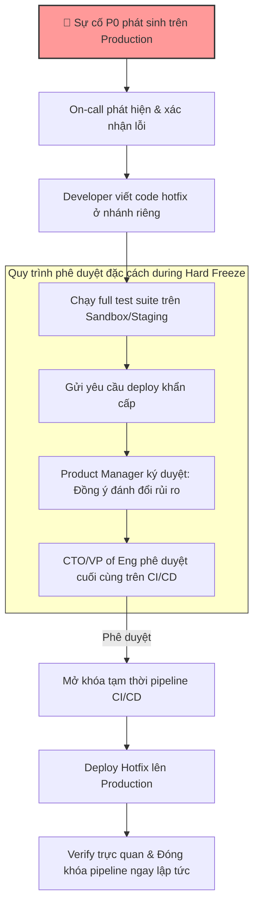

# Khi nào nên freeze deployment?

## ⚡ Tóm tắt ngắn (30s)
* **Bản chất**: Đóng băng Deploy (Deployment Freeze / Change Freeze) là một **chính sách kiểm soát rủi ro vận hành** nhằm tạm thời dừng tất cả hoạt động deploy code, cấu hình hoặc hạ tầng mới lên production trong các khoảng thời gian nhạy cảm. Mục tiêu tối thượng là giữ cho hệ thống ở trạng thái ổn định tuyệt đối (Maximum Stability) vào những dịp quan trọng của doanh nghiệp.
* **Thảm họa thực chiến được giải quyết**:
  1. **Deploy sập hệ thống đúng dịp cao điểm bán hàng**: Deploy một "bugfix nhỏ" vào lúc 23h ngày 10/11. Đúng 0h ngày 11/11 (Mega Sale 11.11), hệ thống thanh toán sập hoàn toàn do lỗi quá tải liên quan đến bug mới. Doanh thu sụt giảm nghiêm trọng và team không kịp rollback vì nghẽn mạng.
  2. **Friday Deployments (Ác mộng cuối tuần)**: Deploy một tính năng mới lúc 17h chiều thứ Sáu. Lỗi Memory Leak âm ỉ chỉ xuất hiện sau 6 tiếng chạy thực tế (lúc 23h đêm thứ Sáu). Toàn bộ ngày nghỉ cuối tuần của team biến thành thảm họa debug, rollback và giải trình.
* **Quyết định Senior**:
  1. **Áp dụng quy tắc "Không deploy cuối tuần/cuối ngày"**: Thiết lập chính sách không deploy sau 15h00 hàng ngày và tuyệt đối không deploy vào thứ Sáu (trừ hotfix khẩn cấp).
  2. **Phân cấp Freeze linh hoạt**: Phân biệt rõ ràng giữa **Hard Freeze** (chỉ cho phép hotfix cứu sinh) và **Soft Freeze** (dừng tính năng mới, vẫn cho phép bugfix nhẹ có kiểm soát).
  3. **Tự động hóa chặn deploy bằng CI/CD**: Không quản lý freeze bằng "mồm" hoặc chat Slack. Tích hợp script kiểm tra múi giờ/lịch vào pipeline CI/CD để tự động khóa nút "Deploy to Prod" trong thời gian freeze.

---

## 🔍 Chi tiết bản chất thực chiến: Các khung giờ vàng để kích hoạt Freeze

Một Senior Engineer cần chủ động phối hợp với Product và Business để lên lịch đóng băng deploy dựa trên 3 khung cảnh thực tế:

```
[Kế hoạch Đóng băng Deploy - Freeze Calendar]
                   │
  ┌────────────────┼────────────────┐
  ▼ (Theo Sự kiện)  ▼ (Theo Chu kỳ)  ▼ (Theo Nhân sự)
[Business Peak]   [Daily/Weekly]   [Team Capacity]
 ├── Black Friday  ├── Sau 15h00     ├── Lễ Tết
 ├── Mega Sale     └── Thứ Sáu       └── Key member
 └── Product Launch                    đi vắng
```

### 1. Thời kỳ đỉnh điểm kinh doanh (Business Peak Windows)
* **E-commerce / Fintech**: Black Friday, Giáng Sinh, Tết Nguyên Đán, các ngày đôi (9.9, 10.10, 11.11, 12.12). Khung giờ freeze thường kéo dài từ 2 ngày trước sự kiện đến 1 ngày sau sự kiện kết thúc.
* **SaaS / B2B**: Các ngày cuối tháng hoặc cuối quý (thời điểm các khách hàng doanh nghiệp chốt sổ sách, đối soát tài chính).

### 2. Chu kỳ vận hành hàng tuần (Weekly Cycle)
* **Quy tắc "No Friday Deploy"**: Thứ Sáu không phải là ngày để deploy. Nếu deploy lỗi, team sẽ phải sửa trong trạng thái mệt mỏi vào cuối tuần, thiếu sự hỗ trợ của các bên thứ ba (nhà mạng, ngân hàng thanh toán cũng nghỉ cuối tuần).
* **Quy tắc "No End-of-Day Deploy"**: Tránh deploy sau 15h00 chiều. Hãy deploy vào buổi sáng (9h00 - 11h00), khi toàn bộ nhân sự kỹ thuật đang tỉnh táo nhất và có cả ngày phía trước để theo dõi hệ thống.

### 3. Thời điểm nhân sự mỏng (Holiday / Event Windows)
* Đóng băng deploy khi các key members của team (Architect, SRE, DB Admin) đi nghỉ phép hoặc đi teambuilding. Tuyệt đối không deploy khi hệ thống thiếu người ứng cứu khi có sự cố.

---

## 🎨 Sơ đồ trực quan: Quy trình phê duyệt Hotfix khẩn cấp trong thời gian Hard Freeze

Trong thời gian Hard Freeze, mọi nút deploy tự động đều bị khóa. Nếu có sự cố P0 xảy ra, quy trình bypass phê duyệt để hotfix phải tuân thủ nghiêm ngặt:



---

## 💻 Code thực chiến: Tự động hóa chặn deploy bằng GitHub Actions Workflow

Để tránh việc thành viên trong team vô tình click nút Deploy lên Production trong thời gian freeze, ta có thể viết một script kiểm tra thời gian tích hợp trực tiếp vào CI/CD. Dưới đây là cấu hình GitHub Actions tự động chặn deploy nếu rơi vào thứ Sáu, thứ Bảy, Chủ Nhật, hoặc ngoài giờ hành chính (sau 17h00).

### Cấu hình GitHub Actions (`.github/workflows/deploy.yml`)

```yaml
name: Production Deployment

on:
  push:
    branches:
      - main

jobs:
  check-freeze:
    name: 🛡️ Kiểm tra chính sách Deployment Freeze
    runs-on: ubuntu-latest
    steps:
      - name: Kiểm tra thời gian hiện tại
        id: time-check
        run: |
          # Thiết lập múi giờ Việt Nam (UTC+7)
          export TZ="Asia/Ho_Chi_Minh"
          CURRENT_DAY=$(date +%u) # 1: Thứ 2, ..., 5: Thứ 6, 6: Thứ 7, 7: Chủ Nhật
          CURRENT_HOUR=$(date +%H) # Giờ định dạng 24h (00-23)
          
          echo "Day of week: $CURRENT_DAY (1:Mon, 5:Fri, 6:Sat, 7:Sun)"
          echo "Current hour: $CURRENT_HOUR"
          
          FREEZE=false
          REASON=""
          
          # 1. Chặn deploy vào cuối tuần (Thứ Sáu, Thứ Bảy, Chủ Nhật)
          # Lưu ý: Cho phép deploy Thứ Sáu nhưng CHỈ TRƯỚC 15h00
          if [ "$CURRENT_DAY" -eq 5 ] && [ "$CURRENT_HOUR" -ge 15 ]; then
            FREEZE=true
            REASON="Chính sách: KHÔNG deploy sau 15h00 Thứ Sáu (Tránh sự cố cuối tuần)."
          elif [ "$CURRENT_DAY" -eq 6 ] || [ "$CURRENT_DAY" -eq 7 ]; then
            FREEZE=true
            REASON="Chính sách: KHÔNG deploy vào Thứ Bảy và Chủ Nhật."
          fi
          
          # 2. Chặn deploy ngoài giờ hành chính ngày thường (sau 17h00 và trước 08h00)
          if [ "$CURRENT_HOUR" -ge 17 ] || [ "$CURRENT_HOUR" -lt 8 ]; then
            FREEZE=true
            REASON="Chính sách: KHÔNG deploy ngoài giờ hành chính ($CURRENT_HOUR:00) để đảm bảo có đủ nhân sự ứng cứu."
          fi
          
          # 3. Chặn deploy dịp Tết / Mega Sale chốt cứng lịch (Ví dụ từ 10/11 đến 12/11)
          CURRENT_DATE=$(date +%m-%d)
          if [[ "$CURRENT_DATE" >= "11-10" && "$CURRENT_DATE" <= "11-12" ]]; then
            FREEZE=true
            REASON="Hệ thống đang đóng băng cứng (Hard Freeze) phục vụ sự kiện Mega Sale 11.11!"
          fi
          
          if [ "$FREEZE" = true ]; then
            echo "🚨 DEPLOYMENT BLOCKED!"
            echo "Reason: $REASON"
            echo "::error file=deploy.yml::Pipeline bị từ chối do vi phạm chính sách Deployment Freeze: $REASON"
            exit 1
          else
            echo "✅ Thời gian hợp lệ. Cho phép tiếp tục deploy."
          fi

  deploy:
    name: 🚀 Deploy to Production
    needs: check-freeze
    runs-on: ubuntu-latest
    steps:
      - name: Checkout Code
        uses: actions/checkout@v3
        
      - name: Thực hiện Deploy
        run: |
          echo "Đang deploy ứng dụng lên môi trường Production..."
          # Thực hiện các câu lệnh helm upgrade hoặc kubectl apply ở đây
```

---

## 📊 Bảng so sánh các Cấp độ Đóng băng Deploy (Freeze Levels)

| Tiêu chí | Cấp độ 1: Soft Freeze (Đóng băng mềm) | Cấp độ 2: Hard Freeze (Đóng băng cứng) | Cấp độ 3: Không Freeze (Standard) |
| :--- | :--- | :--- | :--- |
| **Mục đích** | Ngăn chặn lỗi từ các tính năng lớn, mới phát triển. | Bảo toàn trạng thái hệ thống ổn định 100% cho các sự kiện cực lớn. | Vận hành phát triển bình thường hàng ngày. |
| **Loại Code được phép deploy** | **Bugfix** (đã được test kỹ), cấu hình nhỏ. | **Không cho phép deploy gì**, trừ phi có sự cố sập hệ thống (P0 Hotfix). | Toàn bộ các tính năng, refactor, nâng cấp thư viện, DB migrations. |
| **Quy trình phê duyệt** | Đội trưởng (Tech Lead) hoặc Product Owner phê duyệt pull request. | **Đặc cách**. Cần sự phê duyệt bằng văn bản/ký duyệt của CTO hoặc VP of Engineering. | Quy trình review thông thường (2 đồng nghiệp chấp thuận). |
| **Áp dụng khi nào** | Các đợt chốt sổ tài chính cuối tháng, nâng cấp hệ thống định kỳ. | Black Friday, Tết Nguyên Đán, Mega Sale 11.11, ngày ra mắt sản phẩm chiến lược. | Ngày thường từ thứ Hai đến thứ Năm, trong giờ hành chính. |

---

## ⚠️ Common Gotchas & Questions follow-up

### 1. Cạm bẫy "Cơn bão tích tụ sau rã băng (The Post-Freeze Avalanche Trap)"
* **Vấn đề**: Sau khi kết thúc đợt Hard Freeze kéo dài 2 tuần (ví dụ sau Tết Nguyên Đán), team phát triển có khoảng 30 Pull Requests (tính năng mới, refactor code) đã được merge sẵn vào nhánh `develop`. Ngay ngày đầu tiên mở khóa (Unfreeze), toàn bộ 30 PR này được gộp chung lại và deploy một cú "Big Bang" lên production. Kết quả là hệ thống sập toàn diện. Việc debug trở thành thảm họa vì không thể biết lỗi đến từ PR nào trong số 30 thay đổi lớn kia.
* **Giải pháp khắc phục**:
  * Khi Unfreeze, tuyệt đối không thực hiện deploy gộp (Bulk deployment).
  * Lên lịch deploy cuốn chiếu: Mỗi ngày chỉ cho phép deploy tối đa 2-3 PR nhỏ, theo dõi metrics trong 2-3 tiếng trước khi deploy PR tiếp theo.
  * Ưu tiên deploy các PR sửa bug (bugfix) trước, sau đó mới đến các PR tính năng mới.

### 2. Câu hỏi đào sâu từ interviewer
* **Interviewer: "Nếu trong thời gian Hard Freeze (ví dụ đêm 30 Tết), đối tác thanh toán gửi thông báo họ sẽ nâng cấp API và deprecate version cũ trong 24h tới, bắt buộc chúng ta phải cập nhật code kết nối. Bạn xử lý thế nào khi đang trong lịch freeze?"**
* **Trả lời**:
  * Đây là tình huống bất khả kháng liên quan đến rủi ro sập dịch vụ (External Dependency Deprecation):
    1. **Đánh giá rủi ro**: Triệu tập cuộc họp khẩn cấp gồm Tech Lead, Product Manager và Business Owner để phân tích. Nếu không cập nhật, 100% giao dịch thanh toán qua đối tác này sẽ thất bại. Đây được xếp vào sự cố P0 tiềm ẩn.
    2. **Xây dựng giải pháp tối thiểu (Minimum Viable Hotfix)**: Viết code sửa đổi với phạm vi nhỏ nhất có thể (chỉ thay đổi endpoint URL hoặc sửa cấu hình API version, không refactor, không viết thêm logic).
    3. **Test cực kỳ nghiêm ngặt**: Chạy toàn bộ hệ thống test tự động (Unit/Integration Test) trên Staging, thực hiện test thủ công giả lập kết nối tới môi trường Sandbox mới của đối tác.
    4. **Ký duyệt đặc cách**: CTO trực tiếp phê duyệt mở khóa pipeline CI/CD để deploy bản vá này lên Production, thực hiện deploy vào khung giờ thấp điểm nhất (ví dụ 3h00 sáng) dưới sự giám sát trực tiếp của 1 Developer viết code và 1 SRE túc trực.
