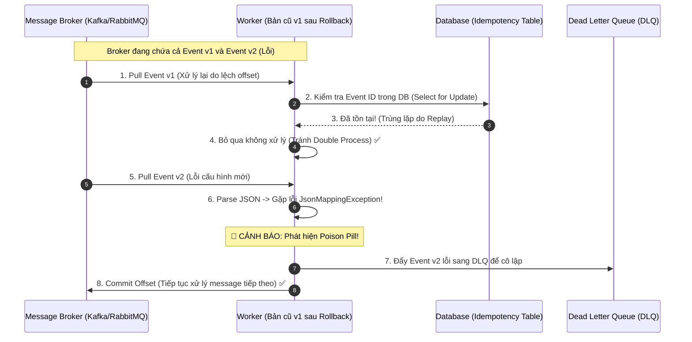

# Làm sao rollback an toàn khi có message/event đã phát ra?

## ⚡ Tóm tắt ngắn (30s)
* **Bản chất**: Khi thực hiện Rollback code v2 về v1, thách thức lớn nhất không nằm ở cụm Web API mà nằm ở các **Message/Event đã phát ra (Event Inflight)** vào Message Queue (Kafka, RabbitMQ) hoặc gửi sang bên thứ ba (Webhooks). Ta không thể "thu hồi" một event đã được gửi đi. Giải pháp rollback an toàn là sự phối hợp giữa **Thiết kế Event tương thích ngược (Schema Evolution)**, **Cơ chế khử trùng lặp (Idempotent Consumer)** và **Giao dịch đền bù (Compensating Transactions)**.
* **Thảm họa thực chiến được giải quyết**:
  1. **Nghẽn hàng đợi do Event lạ (Poison Pill)**: Code v2 gửi event có cấu trúc mới (Schema v2) vào hàng đợi. Khi rollback về v1, code v1 consume trúng event này nhưng JSON Parser bị lỗi (`JsonMappingException`) gây crash liên tục. Hàng đợi bị tắc nghẽn hoàn toàn, không thể xử lý tiếp các event sau đó (Head-of-Line Blocking).
  2. **Trùng lặp giao dịch (Double Charging)**: Rollback code làm lệch checkpoint/offset của Message Queue, khiến worker khởi động lại và xử lý lại từ đầu các event thanh toán cũ, charge tiền khách hàng lần thứ hai.
* **Quyết định Senior**:
  1. **Khóa Schema bằng Registry**: Luôn sử dụng Schema Registry (như Confluent Schema Registry với Avro/Protobuf) để ép buộc tính tương thích ngược (Backward Compatibility). Code cũ (v1) phải đọc được và bỏ qua các trường mới của event v2 mà không bị crash.
  2. **Bắt buộc Idempotency ở Consumer**: Mọi logic xử lý event phải kiểm tra tính trùng lặp thông qua Database Unique Constraint hoặc Redis Idempotency Key trước khi thực hiện nghiệp vụ ghi dữ liệu.
  3. **Sử dụng Giao dịch đền bù**: Nếu v2 đã gửi message sai lệch và làm thay đổi trạng thái của hệ thống đối tác, thay vì sửa DB thủ công, ta phải viết script phát đi các **Message đền bù** (ví dụ: Event Hủy/Hoàn tiền) để đưa trạng thái hệ thống phân tán về cân bằng.

---

## 🔍 Chi tiết bản chất thực chiến: Quy trình Rollback Event An toàn

Khi phát hiện phiên bản v2 lỗi và bắt buộc phải rollback về v1, ta thực hiện theo quy trình 4 bước:

```
[Phát hiện lỗi v2 🚨] ──> [1. CÔ LẬP NGUỒN PHÁT EVENT (Stop Producer)]
                                 │
                                 ▼
                     [2. DỊN ĐƯỜNG CHO CONSUMER (DLQ)]
         (Chuyển hướng các event v2 lỗi sang Dead Letter Queue)
                                 │
                                 ▼
                    [3. TIẾN HÀNH ROLLBACK APP v2 -> v1]
                                 │
                                 ▼
                    [4. XỬ LÝ ĐỀN BÙ DỮ LIỆU SAI LỆCH]
       (Phát Compensating Events để sửa đổi trạng thái downstream)
```

### Bước 1: Cô lập nguồn phát (Stop Producer)
Tắt ngay các luồng phát event lỗi của phiên bản v2 (ví dụ: chuyển API Gateway dừng nhận request mới dẫn đến luồng này, hoặc dùng Feature Flag tắt luồng phát event).

### Bước 2: Dọn dẹp Hàng đợi và Chuyển hướng (Handle Poison Pill)
* Nếu hàng đợi đang chứa nhiều event v2 có cấu trúc mới mà code v1 không parse được, tuyệt đối không rollback code v1 ngay lập tức vì sẽ gây nghẽn hàng đợi (Poison Pill).
* **Giải pháp**: Cấu hình cơ chế Error Handling trên consumer để tự động đẩy các event lỗi parser sang **Dead Letter Queue (DLQ)** để xử lý sau, giữ cho luồng xử lý chính thông suốt.

### Bước 3: Thực hiện Rollback App
Đưa code từ v2 về v1. Nhờ có bước 2, code v1 khi lên lại sẽ bỏ qua các event v2 lỗi (bị đẩy sang DLQ) và tiếp tục xử lý các event chuẩn bình thường.

### Bước 4: Chạy Giao dịch đền bù (Compensating Transactions)
Phân tích các event v2 đã được xử lý thành công trước đó làm lệch dữ liệu. Phát đi các event đền bù để downstream cập nhật lại trạng thái chuẩn.
* *Ví dụ*: Phiên bản lỗi v2 tính sai số tiền và gửi event `ORDER_COMPLETED` với số tiền giảm giá 100%. Ta phải phát event đền bù `ORDER_ADJUSTED` mang số tiền chênh lệch để downstream thu hồi/cập nhật lại hóa đơn.

---

## 🎨 Sơ đồ trực quan: Cơ chế Idempotent Consumer & Xử lý Event lỗi v2

Sơ đồ dưới đây thể hiện cách một Consumer an toàn xử lý event khi hệ thống rollback, ngăn chặn trùng lặp dữ liệu và cô lập event cấu hình lỗi:



---

## 💻 Code thực chiến: Cấu hình Kafka Idempotent Consumer & Safe Parsing

Dưới đây là cài đặt trong Java Spring Boot bằng cách sử dụng `Idempotency Key` lưu trong Database để lọc trùng và cấu hình `DefaultErrorHandler` để đẩy các message lỗi parser sang Dead Letter Topic (DLT).

### 1. Consumer kiểm tra Idempotency trước khi ghi dữ liệu

```java
package com.example.consumer;

import org.apache.kafka.clients.consumer.ConsumerRecord;
import org.slf4j.Logger;
import org.slf4j.LoggerFactory;
import org.springframework.dao.DataIntegrityViolationException;
import org.springframework.jdbc.core.JdbcTemplate;
import org.springframework.kafka.annotation.KafkaListener;
import org.springframework.kafka.support.Acknowledgment;
import org.springframework.stereotype.Service;
import org.springframework.transaction.annotation.Transactional;

@Service
public class IdempotentOrderConsumer {
    private static final Logger log = LoggerFactory.getLogger(IdempotentOrderConsumer.class);
    
    private final JdbcTemplate jdbcTemplate;

    public IdempotentOrderConsumer(JdbcTemplate jdbcTemplate) {
        this.jdbcTemplate = jdbcTemplate;
    }

    @KafkaListener(topics = "order-events", groupId = "order-group")
    @Transactional
    public void consume(ConsumerRecord<String, String> record, Acknowledgment ack) {
        String eventId = record.key(); // Sử dụng Unique Event ID / Message ID phát từ Producer làm Key
        String eventPayload = record.value();

        log.info("📥 Nhận event. ID: {}, Payload: {}", eventId, eventPayload);

        try {
            // 1. Thực hiện chèn Event ID vào bảng khóa chống trùng lặp (Idempotent Table)
            // Bảng này có UNIQUE CONSTRAINT trên cột event_id
            jdbcTemplate.update("INSERT INTO processed_events (event_id, processed_at) VALUES (?, NOW())", eventId);
            
            // 2. Thực hiện logic nghiệp vụ thực tế
            processOrderLogic(eventPayload);
            
            // 3. Commit offset thủ công sau khi xử lý thành công
            ack.acknowledge();
            log.info("✅ Xử lý thành công event: {}", eventId);
            
        } catch (DataIntegrityViolationException e) {
            // Lỗi trùng Unique Constraint -> Event này đã được xử lý trước đó
            log.warn("⚠️ CẢNH BÁO: Phát hiện event trùng lặp (ID: {}). Bỏ qua không xử lý tiếp.", eventId);
            ack.acknowledge(); // Vẫn commit offset để tránh bị nghẽn hàng đợi
        } catch (Exception e) {
            log.error("❌ Lỗi xử lý nghiệp vụ cho event {}: {}", eventId, e.getMessage());
            // Ném ngoại lệ để Spring Kafka tự động kích hoạt Retry/DLQ Handler
            throw e;
        }
    }

    private void processOrderLogic(String payload) {
        // Thực hiện logic ghi dữ liệu vào database ở đây
    }
}
```

### 2. Cấu hình Kafka Dead Letter Topic Handler (Cô lập Poison Pill)

```java
package com.example.config;

import org.slf4j.Logger;
import org.slf4j.LoggerFactory;
import org.springframework.context.annotation.Bean;
import org.springframework.context.annotation.Configuration;
import org.springframework.kafka.core.KafkaTemplate;
import org.springframework.kafka.listener.DeadLetterPublishingRecoverer;
import org.springframework.kafka.listener.DefaultErrorHandler;
import org.springframework.util.backoff.FixedBackOff;

@Configuration
public class KafkaErrorConfig {
    private static final Logger log = LoggerFactory.getLogger(KafkaErrorConfig.class);

    @Bean
    public DefaultErrorHandler errorHandler(KafkaTemplate<Object, Object> template) {
        log.info("⚙️ Khởi tạo Default Error Handler cho Kafka Consumer...");
        
        // 1. Cấu hình tự động đẩy message lỗi sang Dead Letter Topic (tên mặc định: <topic_gốc>.DLT)
        DeadLetterPublishingRecoverer recoverer = new DeadLetterPublishingRecoverer(template);
        
        // 2. Cấu hình chính sách Retry: Thử lại tối đa 3 lần, mỗi lần cách nhau 2 giây
        // Sau 3 lần vẫn lỗi (ví dụ lỗi JsonMappingException do xung đột schema), đẩy sang DLT
        DefaultErrorHandler errorHandler = new DefaultErrorHandler(recoverer, new FixedBackOff(2000L, 3L));
        
        // Chỉ định các Exception không cần retry mà đẩy thẳng sang DLT (ví dụ: Lỗi Parser)
        errorHandler.addNotRetryableExceptions(com.fasterxml.jackson.databind.JsonMappingException.class);
        errorHandler.addNotRetryableExceptions(com.fasterxml.jackson.core.JsonParseException.class);
        
        return errorHandler;
    }
}
```

---

## 📊 Bảng so sánh 3 Chiến lược xử lý Event lỗi khi Rollback

| Tiêu chí | Chiến lược 1: Replay từ đầu (Reset Offset) | Chiến lược 2: Dead Letter Queue (DLQ / DLT) | Chiến lược 3: Giao dịch đền bù (Compensation) |
| :--- | :--- | :--- | :--- |
| **Cách thức** | Reset Kafka offset về thời điểm trước deploy để chạy lại toàn bộ. | Cô lập các message lỗi v2 cấu trúc mới sang một topic riêng biệt. | Phát ra các message mang giá trị ngược lại để trung hòa lỗi. |
| **Độ rủi ro trùng lặp** | **Rất cao** (Bắt buộc 100% hệ thống downstream phải hỗ trợ Idempotency). | Thấp (Chỉ xử lý lại các message lỗi bị cô lập). | Thấp (Các event đền bù được xử lý như các transaction mới bình thường). |
| **Khi nào áp dụng** | Khi bị mất dữ liệu hàng loạt trên DB và bắt buộc phải dựng lại từ event log. | **Mặc định**. Khi có message lỗi cấu trúc mới gây nghẽn hàng đợi (Poison Pill). | Khi dữ liệu sai đã ghi nhận vào DB của đối tác (ví dụ đã trót gửi lệnh thanh toán tiền). |
| **Nhược điểm** | Gây quá tải (Spike) hệ thống do phải xử lý lượng lớn dữ liệu cũ cùng lúc. | Cần viết thêm worker để xử lý thủ công đống message lỗi trong DLQ sau đó. | Logic thiết kế phức tạp (phải định nghĩa hành động đảo ngược cho mọi nghiệp vụ). |

---

## ⚠️ Common Gotchas & Questions follow-up

### 1. Cạm bẫy "Mất thứ tự xử lý Message khi dùng DLQ (The Out-of-Order Trap)"
* **Vấn đề**: Đối với hệ thống yêu cầu bảo toàn thứ tự xử lý nghiêm ngặt (ví dụ: Event `ORDER_CREATED` bắt buộc phải chạy trước Event `ORDER_PAID`). 
  * Khi deploy v2 gặp lỗi, Event `ORDER_CREATED` (cấu trúc mới v2) bị parse lỗi và bị đẩy sang DLQ.
  * Tuy nhiên, Event `ORDER_PAID` (cấu trúc v1 cũ) vẫn parse thành công và được xử lý ngay lập tức trên DB.
  * Hậu quả: DB cố gắng ghi nhận thanh toán cho một Order chưa hề được tạo, gây lỗi khóa ngoại (Foreign Key Violation) hoặc lỗi logic nghiệp vụ.
* **Giải pháp khắc phục**: 
  * Đối với các topic yêu cầu thứ tự (như luồng Order), khi gặp lỗi Poison Pill, **không được đẩy lẻ tẻ từng message sang DLQ** rồi chạy tiếp.
  * Thay vào đó, bắt buộc phải dừng (pause) consumer lại, phát chuông báo động để kỹ sư can thiệp trực tiếp (thay đổi schema dynamic hoặc skip offset thủ công) nhằm bảo toàn tính tuần tự của dòng dữ liệu (Sequential Stream).

### 2. Câu hỏi đào sâu từ interviewer
* **Interviewer: "Nếu chúng ta dùng RabbitMQ (chế độ At-Least-Once), khi rollback app và worker restart, làm sao chúng ta đảm bảo không xảy ra tình trạng nén dữ liệu do auto-ack?"**
* **Trả lời**:
  * Để đảm bảo không mất mát dữ liệu và không trùng lặp khi worker restart đột ngột trong lúc rollback trên RabbitMQ:
    1. **Tắt chế độ Auto-Ack**: Luôn cấu hình `AcknowledgeMode.MANUAL`. Worker chỉ gửi lệnh `basicAck` về cho RabbitMQ Server sau khi dữ liệu đã được ghi nhận vào Database thành công (Database Transaction đã COMMIT).
    2. **Xử lý tín hiệu shutdown**: Khi nhận `SIGTERM`, worker dừng nhận message mới từ hàng đợi (`basicCancel`), xử lý nốt message hiện tại, commit ack rồi mới tắt.
    3. **Chống trùng lặp ở RabbitMQ level**: Nếu worker crash trước khi kịp gửi ack, RabbitMQ sẽ tự động trả message đó về hàng đợi (Redelivered). Khi worker mới (bản v1 sau rollback) khởi chạy lại, nó sẽ nhận lại message đó kèm theo cờ `redelivered=true`. Lúc này, lớp kiểm tra Idempotency ở DB sẽ phát hiện và bỏ qua giao dịch trùng lặp một cách an toàn.
