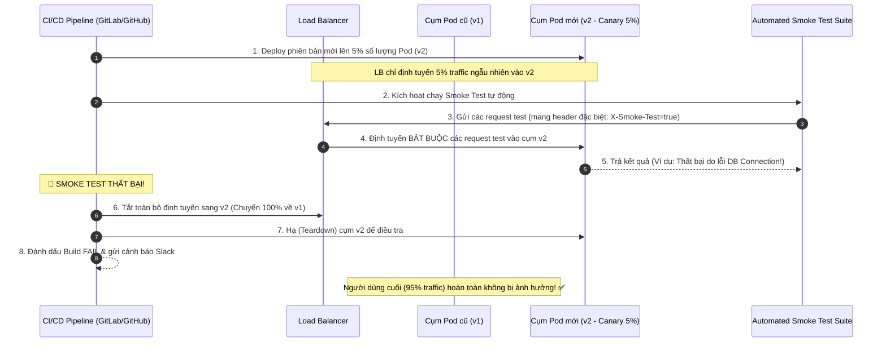

# Smoke test sau deploy nên kiểm tra gì?

## ⚡ Tóm tắt ngắn (30s)
* **Bản chất**: Kiểm thử khói (Smoke Test / Sanity Test) sau khi deploy là bước **xác minh nhanh các luồng nghiệp vụ cốt lõi (Core Business Paths)** và tính thông suốt của các liên kết hạ tầng (Database, Cache, Message Queue) trên môi trường Production trước khi mở cổng định tuyến 100% traffic cho người dùng. Kỹ sư Senior không bao giờ tin hoàn toàn vào trạng thái "Green/Ready" của Kubernetes Pods mà bắt buộc phải chạy thực chứng (Smoke Test) để tự chứng minh tính ổn định của hệ thống.
* **Thảm họa thực chiến được giải quyết**:
  1. **"Xanh vỏ đỏ lòng" (Fake Ready Pods)**: Kubernetes báo Pods sẵn sàng 3/3 (Ready) vì Spring Boot khởi động thành công. Tuy nhiên, luồng mua hàng bị sập 100% do cấu hình sai URL kết nối cổng thanh toán (Stripe API). Việc thiếu smoke test luồng cốt lõi dẫn đến hệ thống tê liệt 8 tiếng cho đến khi khách hàng gửi email phàn nàn.
  2. **Data Test làm bẩn báo cáo tài chính**: Chạy thử luồng đặt hàng và thanh toán thật trên production bằng tài khoản cá nhân, làm phát sinh các giao dịch giả mạo trị giá hàng triệu đồng trong database, gây sai lệch báo cáo doanh thu và khiến đội kế toán/đối soát (Reconciliation) phải làm việc cực kỳ vất vả để dọn dẹp.
* **Quyết định Senior**:
  1. **Tự động hóa tích hợp trong CI/CD**: Sử dụng các script nhẹ (như Newman/Postman CLI, k6 hoặc curl) chạy tự động ngay sau khi deploy lên cụm Canary/Staging/Production (trước khi tráo traffic hoàn toàn).
  2. **Thiết lập "Shadow/Test Tenant" an toàn**: Sử dụng một tài khoản kiểm thử đặc biệt (Test Account/Shadow Tenant) đã được cấu hình loại trừ (whitelisted) khỏi các báo cáo tài chính và hệ thống phân tích dữ liệu (BI/Analytics).
  3. **Tập trung vào "Read-Only" và "Safe-Write"**: Tránh các tác vụ ghi dữ liệu phá hủy hoặc tốn phí (ví dụ gửi SMS thật, trích xuất tiền thật). Nếu bắt buộc phải test luồng ghi, hãy sử dụng cơ chế Mock Gateway có kiểm soát ở môi trường Production.

---

## 🔍 Chi tiết bản chất thực chiến: Checklist Smoke Test Chuẩn của Senior Engineer

Một bộ Smoke Test tinh gọn, chạy trong vòng dưới 2 phút, cần tập trung vào 4 nhóm kiểm tra chính:

```
[Môi trường mới Deploy 🚀]
           │
           ▼
[1. HEALTH & METRICS CHECK] ──> Đọc /actuator/health, kiểm tra Version Tag khớp.
           │
           ▼
[2. CORE READ PATHS]        ──> Đăng nhập, Duyệt sản phẩm, Đọc giỏ hàng.
           │
           ▼
[3. CORE WRITE PATHS (Safe)]──> Thêm vào giỏ hàng, Tạo đơn nháp (Draft Order).
           │
           ▼
[4. CONNECTION VERIFY]      ──> Đảm bảo kết nối DB, Redis, Kafka hoạt động thực tế.
```

### 1. Kiểm tra Cấu hình & Phiên bản (Configuration & Version Verification)
* Gọi endpoint `/info` hoặc `/health` để xác nhận: Phiên bản vừa deploy có đúng là phiên bản mong muốn không (xem git commit hash).
* Kiểm tra xem các biến môi trường cấu hình (Configuration Properties) đã được nạp đúng từ Secret Store chưa (không bị rò rỉ raw password ra ngoài).

### 2. Kiểm tra Luồng Đọc cốt lõi (Core Read-Only Paths)
* Thực hiện gọi API đăng nhập (Authentication API) bằng tài khoản test.
* Gọi API đọc dữ liệu quan trọng nhất: Đọc danh mục sản phẩm, đọc thông tin cá nhân.
* Nếu các API đọc cơ bản này trả về lỗi 500, khả năng cao database connection pool đang bị lỗi cấu hình hoặc thiếu cột.

### 3. Kiểm tra Luồng Ghi an toàn (Core Write Paths with Shadow Account)
* Thực hiện luồng thêm sản phẩm vào giỏ hàng.
* Tạo một đơn hàng nháp (Draft Order) nhưng không thực hiện thanh toán thật.
* Gọi API kết nối sang cổng thanh toán ở chế độ Dry-Run (nếu đối tác hỗ trợ) để kiểm tra API key có hiệu lực không.

### 4. Kiểm tra Tương tác Bất đồng bộ (Async & Pub/Sub Connectivity)
* Phát ra một event test lên Kafka và xác minh xem Service có nhận và xử lý ghi nhận log thành công hay không (chứng minh Kafka partition không bị kẹt).

---

## 🎨 Sơ đồ trực quan: Tích hợp Smoke Test Tự động trong CI/CD Pipeline

Sơ đồ dưới đây thể hiện quy trình Canary Rollout phối hợp với Smoke Test tự động. Nếu Smoke Test thất bại, pipeline lập tức tự động rollback, bảo vệ 100% người dùng thực tế khỏi lỗi:



---

## 💻 Code thực chiến: Script Smoke Test Tự động bằng Shell Script & Curl

Dưới đây là một script Shell gọn nhẹ, thường được nhúng vào step `post-deploy` trong GitLab CI/CD hoặc Jenkins để kiểm tra tính sẵn sàng của Production API.

### Script `smoke-test.sh` tự động xác minh API

```bash
#!/bin/bash
# smoke-test.sh
# Hướng dẫn: Chạy script này ngay sau khi deploy lên môi trường Staging/Production Canary.

API_URL="https://canary-api.example.com"
TEST_USER="smoke_test_user@example.com"
TEST_PASS="SafePassword123"

# Thiết lập mã màu terminal
RED='\033[0;31m'
GREEN='\033[0;32m'
NC='\033[0m' # No Color

echo "🚀 BẮT ĐẦU CHẠY AUTOMATED SMOKE TEST SUITE..."

# 1. KIỂM TRA ENDPOINT HEALTH & VERSION TAG
echo -n "🔍 1. Kiểm tra Liveness/Readiness Endpoint: "
HEALTH_RESPONSE=$(curl -s -w "%{http_code}" -o /tmp/health_response.json "${API_URL}/actuator/health")

if [ "$HEALTH_RESPONSE" -eq 200 ]; then
    VERSION_TAG=$(jq -r '.components.db.details.version' /tmp/health_response.json 2>/dev/null || echo "N/A")
    echo -e "${GREEN}PASS (HTTP 200). DB Version: ${VERSION_TAG}${NC}"
else
    echo -e "${RED}FAIL! HTTP Status: ${HEALTH_RESPONSE}${NC}"
    exit 1
fi

# 2. KIỂM TRA ĐĂNG NHẬP (Luồng Auth & Database Connection)
echo -n "🔍 2. Kiểm tra API Đăng Nhập (Auth & DB Read): "
AUTH_RESPONSE=$(curl -s -w "%{http_code}" -o /tmp/auth_response.json \
  -X POST \
  -H "Content-Type: application/json" \
  -d "{\"email\":\"${TEST_USER}\",\"password\":\"${TEST_PASS}\"}" \
  "${API_URL}/api/v1/auth/login")

if [ "$AUTH_RESPONSE" -eq 200 ]; then
    # Trích xuất JWT Token để dùng cho các test step sau
    TOKEN=$(jq -r '.access_token' /tmp/auth_response.json)
    echo -e "${GREEN}PASS (Đăng nhập thành công!)${NC}"
else
    echo -e "${RED}FAIL! Không thể đăng nhập. HTTP Status: ${AUTH_RESPONSE}${NC}"
    exit 1
fi

# 3. KIỂM TRA LUỒNG ĐỌC CORE (API Giỏ Hàng)
echo -n "🔍 3. Kiểm tra API Đọc Giỏ Hàng (Redis / Cache Connection): "
CART_RESPONSE=$(curl -s -w "%{http_code}" -o /tmp/cart_response.json \
  -H "Authorization: Bearer ${TOKEN}" \
  "${API_URL}/api/v1/cart")

if [ "$CART_RESPONSE" -eq 200 ]; then
    echo -e "${GREEN}PASS (Đọc giỏ hàng OK)${NC}"
else
    echo -e "${RED}FAIL! HTTP Status: ${CART_RESPONSE}${NC}"
    exit 1
fi

# 4. KIỂM TRA LUỒNG GHI AN TOÀN (Thêm vào Giỏ Hàng)
echo -n "🔍 4. Kiểm tra API Thêm vào Giỏ Hàng (Write Path): "
ADD_RESPONSE=$(curl -s -w "%{http_code}" -o /tmp/add_response.json \
  -X POST \
  -H "Authorization: Bearer ${TOKEN}" \
  -H "Content-Type: application/json" \
  -d '{"product_id": "prod_9999", "quantity": 1}' \
  "${API_URL}/api/v1/cart/items")

if [ "$ADD_RESPONSE" -eq 200 ] || [ "$ADD_RESPONSE" -eq 201 ]; then
    echo -e "${GREEN}PASS (Thêm item thành công)${NC}"
else
    echo -e "${RED}FAIL! HTTP Status: ${ADD_RESPONSE}${NC}"
    exit 1
fi

echo -e "${GREEN}🎉🎉🎉 CHÚC MỪNG! TẤT CẢ CÁC BƯỚC SMOKE TEST ĐỀU THÀNH CÔNG AN TOÀN.${NC}"
exit 0
```

---

## 📊 Bảng so sánh 3 Loại Hình Kiểm Thử Hệ Thống

| Tiêu chí | Smoke Test (Kiểm thử khói) | Liveness/Readiness Probe | Regression Test (Kiểm thử hồi quy) |
| :--- | :--- | :--- | :--- |
| **Mục đích** | Xác minh nhanh các luồng **nghiệp vụ cốt lõi** hoạt động thông suốt sau khi deploy. | Xác định trạng thái sống/chết và sẵn sàng nhận traffic của **từng container đơn lẻ**. | Đảm bảo **toàn bộ tính năng** của hệ thống hoạt động đúng, không có bug cũ tái phát. |
| **Tần suất chạy** | Chỉ chạy một lần ngay sau khi hoàn thành deploy phiên bản mới. | Chạy liên tục và định kỳ suốt vòng đời của container (mỗi 10-15 giây). | Chạy trong giai đoạn build code (Testing stage) của CI/CD hoặc trước khi release lớn. |
| **Phạm vi kiểm tra** | Rất nhỏ (Chỉ test 3-5 API quan trọng nhất, mất dưới 2 phút). | Cực kỳ nhỏ (In-memory endpoint check, mất dưới 1 giây). | Cực kỳ rộng (Hàng ngàn testcase, tích hợp test UI/UX, mất từ 15 phút đến vài tiếng). |
| **Cách thức** | Tự động hóa qua curl/k6 hoặc QA test thủ công nhanh bằng tay. | Do Kubernetes Agent (`kubelet`) tự động gọi qua HTTP/TCP/gRPC. | Tự động hóa hoàn toàn bằng JUnit, Selenium, Cypress. |

---

## ⚠️ Common Gotchas & Questions follow-up

### 1. Cạm bẫy "Lỗi xóa nhầm data test (The Test Cleanup Catastrophe)"
* **Vấn đề**: Bạn thiết kế smoke test tự động tạo ra một đơn hàng nháp trên production để kiểm tra luồng ghi. Để dọn dẹp (cleanup), bạn viết một teardown script gọi API delete đơn hàng vừa tạo. Tuy nhiên, do lỗi logic trong script cleanup (ví dụ: truyền nhầm `order_id = null` hoặc `order_id = ''`), API delete của bạn được hiểu thành lệnh xóa toàn bộ đơn hàng của Database Production!
* **Giải pháp khắc phục**:
  * **Tuyệt đối không dùng API DELETE** nguy hiểm trong script dọn dẹp dữ liệu smoke test.
  * Thay vào đó, hãy sử dụng cơ chế **Hết hạn tự động (Auto-expiry)**: Các dữ liệu do tài khoản smoke test tạo ra sẽ được gắn cờ `is_test = true` hoặc lưu với thời hạn TTL (Time-To-Live). Một background job chạy hàng đêm sẽ quét các bản ghi này và dọn dẹp một cách chậm rãi, an toàn, có giới hạn số lượng xóa mỗi lần (batch delete rate-limiting) để đảm bảo không bao giờ xảy ra thảm họa xóa nhầm dữ liệu thật của khách hàng.

### 2. Câu hỏi đào sâu từ interviewer
* **Interviewer: "Làm sao bạn chạy được smoke test luồng thanh toán (Checkout) trên production mà không làm mất tiền thật và không ảnh hưởng tới sổ sách tài chính?"**
* **Trả lời**:
  * Để chạy được smoke test luồng thanh toán cực kỳ nhạy cảm trên production, em sử dụng kỹ thuật **Mock Gateway có kiểm soát (Feature-Flagged Sandbox Client)**:
    1. **Whitelisting Account**: Trên hệ thống, tài khoản kiểm thử của team QA được cấu hình đặc biệt trong database (ví dụ trường `role = 'SMOKE_TESTER'`).
    2. **Định tuyến Mock ở Code**: Trong code xử lý thanh toán, ta tích hợp một cấu hình kiểm tra: Nếu user hiện tại có role `SMOKE_TESTER`, hệ thống sẽ bypass luồng gọi sang Stripe production. Thay vào đó, nó sẽ định tuyến cuộc gọi sang **Stripe Sandbox / Mock API Endpoint** để giả lập kết quả thanh toán thành công/thất bại mà không phát sinh giao dịch tiền thật.
    3. **Đánh dấu dữ liệu**: Mọi đơn hàng tạo ra từ luồng này đều được ghi nhận ở trạng thái `status = 'TEST_COMPLETED'` để đội kế toán đối soát tự động lọc bỏ khỏi báo cáo doanh thu cuối tháng.
