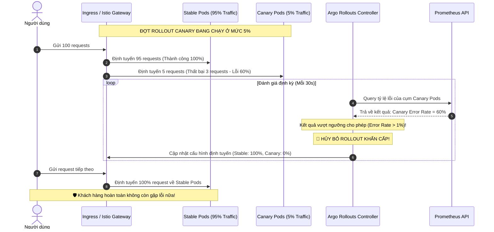

# Canary deployment phát hiện lỗi ở 5% traffic. Bạn làm gì?

## ⚡ Tóm tắt ngắn (30s)
* **Bản chất**: Khi phát hiện lỗi ở 5% traffic chạy Canary, hành động cốt lõi là **Hủy bỏ đợt Rollout lập tức và điều hướng 100% traffic trở lại phiên bản cũ (Abort & Rollback Routing)**. Mục tiêu cốt lõi của Canary chính là làm "lá chắn sống" để phát hiện lỗi sớm trên một lượng nhỏ người dùng thực tế mà không gây ảnh hưởng tới 95% khách hàng còn lại.
* **Thảm họa thực chiến được giải quyết**:
  1. **Mở rộng vùng ảnh hưởng (Blast Radius Expansion)**: Chần chừ không hủy đợt rollout hoặc tiếp tục tăng tỷ lệ traffic lên 10%, 20% với hy vọng lỗi chỉ là nhất thời, dẫn đến việc hàng chục ngàn khách hàng khác tiếp tục gặp lỗi.
  2. **Zombie Pods & Nhiễu hệ thống APM**: Hủy định tuyến traffic nhưng để mặc các container v2 lỗi tiếp tục chạy ngầm, khiến chúng tiếp tục consume message từ queue hoặc thực hiện các tác vụ batch job nền gây hỏng dữ liệu.
* **Quyết định Senior**:
  1. **Quy tắc Tự động ngắt (Auto-Abort Rules)**: Cấu hình công cụ GitOps/CD (ví dụ: Argo Rollouts + Prometheus) tự động hủy đợt rollout Canary ngay lập tức nếu tỷ lệ lỗi của phiên bản mới vượt quá ngưỡng cho phép (ví dụ: > 1% trong 2 phút).
  2. **Chuyển hướng Traffic siêu tốc**: Cấu hình Load Balancer/Service Mesh (Istio) để hạ trọng số (weight) của bản Canary về `0%` chỉ trong vài giây.
  3. **Cô lập Pod lỗi để Khám nghiệm (Pod Preservation)**: Giữ lại duy nhất 1 Pod lỗi, ngắt hoàn toàn khỏi Service Discovery (không cho nhận traffic từ user) để giữ nguyên hiện trạng giúp On-call Engineer vào debug, lấy heap dump hoặc thread dump, sau đó mới tiêu hủy (terminate).

---

## 🔍 Chi tiết bản chất thực chiến: Quy trình ứng phó khi Canary thất bại

Khi đợt rollout Canary (ở mức 5% traffic) bị cảnh báo lỗi đỏ, quy trình xử lý chuẩn hóa của một Senior Engineer sẽ diễn ra như sau:

```
[Phát hiện lỗi ở 5% Canary 🚨] ──> [1. DỪNG NAY ĐỢT ROLLOUT (Argo Rollouts/Istio)]
                                          │
                                          ▼
                                   [2. CHUYỂN TRAFFIC VỀ 0% (Hệ thống an toàn)]
                                          │
                                          ▼
                                   [3. CÔ LẬP POD LỖI (Preserve Pod)]
                                          │
                                          ▼
                                   [4. ĐIỀU TRA & FIX BUG Ở STAGING]
```

### 1. Cơ chế hoạt động của Auto-Promotion & Auto-Abort trong Argo Rollouts
Trong mô hình CI/CD hiện đại, ta không thực hiện Canary bằng tay. Ta khai báo cấu trúc Rollout bao gồm các bước (Steps) tăng dần traffic (ví dụ: 5% -> 10% -> 25% -> 50% -> 100%) kết hợp với **AnalysisTemplates** chạy liên tục ở background.
* **AnalysisTemplate**: Thực hiện quét Prometheus Metrics của riêng cụm Pod Canary sau mỗi 30 giây.
* **Auto-Abort**: Nếu số lần chạy thất bại (Failure Limit) của metric vượt ngưỡng (ví dụ: 2 lần liên tiếp tỷ lệ lỗi > 1%), Argo Rollouts sẽ tự động chuyển trạng thái đợt deploy sang `Degraded`, hạ traffic Canary về 0%, và khôi phục hoàn toàn bản cũ.

### 2. Sự cần thiết của việc cô lập Pod lỗi (Preserving the Crime Scene)
* Lỗi cực kỳ phổ biến của các DevOps non trẻ là khi thấy Canary lỗi, lập tức nhấn nút "Delete" hoặc "Scale Down v2 về 0".
* **Hậu quả**: Toàn bộ dữ liệu bộ nhớ (RAM), log chưa kịp đẩy về trung tâm, các network connection đang treo bị biến mất vĩnh viễn. Việc debug lỗi trở nên cực kỳ khó khăn vì mất sạch dấu vết.
* **Giải pháp Senior**: Rút Pod lỗi ra khỏi Kubernetes Service (bằng cách xóa label định tuyến của Service) nhưng **vẫn giữ Pod đó tiếp tục chạy**. Khi đó, Pod lỗi không còn nhận traffic từ user nữa nhưng On-call Engineer vẫn có thể dùng lệnh `kubectl exec` hoặc `kubectl port-forward` truy cập trực tiếp vào JVM bên trong Pod để kiểm tra trạng thái CPU/RAM hoặc thu thập log.

---

## 🎨 Sơ đồ trực quan (Hành trình tự động bảo vệ hệ thống của Argo Rollouts)



---

## 💻 Code thực chiến: Cấu hình tự động hủy Canary bằng Argo Rollouts Analysis

Dưới đây là file cấu hình declarative hoàn chỉnh bằng **Argo Rollouts** (Custom Resource Definition trong Kubernetes) tích hợp sẵn cơ chế giám sát Prometheus và tự động hủy bỏ đợt rollout khi phát hiện lỗi ở Canary.

### 1. Định nghĩa AnalysisTemplate (Mẫu phân tích tỷ lệ lỗi)
```yaml
# analysis-template.yaml
apiVersion: argoproj.io/v1alpha1
kind: AnalysisTemplate
metadata:
  name: success-rate-analysis
  namespace: production
spec:
  metrics:
  - name: success-rate
    interval: 30s # Cứ mỗi 30 giây query Prometheus một lần
    successCondition: result[0] >= 0.99 # Thành công nếu tỷ lệ thành công >= 99% (tức tỷ lệ lỗi < 1%)
    failureLimit: 2 # Cho phép thất bại tối đa 2 lần, lần thứ 3 sẽ tự động Abort
    provider:
      prometheus:
        address: http://prometheus.monitoring:9090
        query: |
          sum(rate(http_requests_total{status!~"5..",app="payment-service",role="canary"}[1m]))
          /
          sum(rate(http_requests_total{app="payment-service",role="canary"}[1m]))
```

### 2. Định nghĩa Rollout (Cấu hình các bước deploy Canary)
```yaml
# rollout.yaml
apiVersion: argoproj.io/v1alpha1
kind: Rollout
metadata:
  name: payment-service
  namespace: production
spec:
  replicas: 5
  strategy:
    canary:
      analysis:
        templates:
          - templateName: success-rate-analysis
        args:
          - name: service-name
            value: payment-service
      steps:
        - setWeight: 5 # Bước 1: Route 5% traffic sang Canary
        - pause: { duration: 5m } # Dừng lại 5 phút để phân tích tự động
        - setWeight: 20 # Bước 2: Tăng lên 20% traffic nếu bước 1 an toàn
        - pause: { duration: 10m }
        - setWeight: 50
        - pause: { duration: 10m }
      # Cấu hình tự động định tuyến qua Service của Kubernetes
      stableService: payment-service-stable
      canaryService: payment-service-canary
```

---

## 📊 Bảng so sánh Cách Xử Lý Canary Lỗi

| Tiêu chí | Giải pháp 1: Auto-Abort bằng CD (Khuyên dùng) | Giải pháp 2: Hủy thủ công bằng nút bấm (Manual Abort) | Giải pháp 3: Hotfix đẩy đè lên Canary |
| :--- | :--- | :--- | :--- |
| **Thời gian phản ứng** | **Tính bằng giây** (Hệ thống tự động phát hiện và xử lý ngầm). | Trung bình (5 - 15 phút từ lúc nhận alert đến lúc Engineer thực hiện lệnh). | Cực kỳ chậm (15 - 30 phút, tăng rủi ro lỗi nặng thêm). |
| **Độ chính xác** | **Tuyệt đối** (Dựa trên số liệu metrics thực tế đo đạc liên tục). | Trung bình (Dễ bị ảnh hưởng bởi phán đoán chủ quan của con người). | Thấp (Dễ gây rối loạn hệ thống). |
| **Ảnh hưởng người dùng** | Thấp nhất (Hạn chế tối đa số lượng request bị lỗi). | Trung bình (Một lượng lớn user sẽ tiếp tục dính lỗi trong lúc chờ engineer bấm nút). | Rất cao (Canary lỗi kéo dài gây trải nghiệm cực kỳ tệ). |
| **Sự chuẩn bị cần thiết** | Cao (Phải cấu hình Prometheus, Argo Rollouts, viết script phân tích). | Thấp (Chỉ cần có dashboard giám sát cơ bản). | Trung bình (Chuẩn bị quy trình build nhanh). |

---

## ⚠️ Common Gotchas & Questions follow-up

### 1. Cạm bẫy "Bẫy dữ liệu rác từ Canary Pods (Canary Poisoning)"
* **Vấn đề**: Bạn deploy bản Canary v2 bị lỗi NullPointerException ở luồng ghi dữ liệu vào database. Khi Pod Canary chạy lỗi, nó đã vô tình lưu hàng trăm bản ghi thiếu trường dữ liệu quan trọng hoặc định dạng sai vào Database. Dù bạn đã rollback Canary về 0% traffic cực nhanh, nhưng lượng "dữ liệu độc" kia vẫn nằm trong database và sẽ tiếp tục gây crash cho phiên bản Stable cũ khi nó đọc trúng các bản ghi này.
* **Giải pháp khắc phục**: Đối với các luồng ghi dữ liệu phức tạp hoặc nghiệp vụ tài chính, Canary Pods nên được cấu hình ghi dữ liệu sang một Sandbox Database hoặc cấu hình cờ đánh dấu dữ liệu thử nghiệm (`is_canary=true`). Sau khi xác nhận Canary ổn định 100%, ta mới tiến hành merge dữ liệu hoặc cho phép ghi trực tiếp. Đồng thời, thiết kế code luôn có cơ chế phòng ngự (Defensive Coding) để nếu đọc trúng dữ liệu rác, ứng dụng sẽ log cảnh báo thay vì crash toàn bộ luồng xử lý.

### 2. Câu hỏi đào sâu từ interviewer
* **Q: Nếu 5% traffic của Canary quá nhỏ, không đủ để tạo ra lượng request cần thiết cho Prometheus tính toán chính xác tỷ lệ lỗi (Cold Start / Low Traffic), bạn sẽ xử lý thế nào để giám sát Canary hiệu quả?**
* **Trả lời**:
  * Đối với các service có traffic thấp, việc tính toán tỷ lệ % lỗi dựa trên HTTP request sẽ không còn chính xác (chỉ cần 1 request lỗi đơn lẻ trong tổng số 3 request cũng tạo ra tỷ lệ lỗi 33.3% giả tạo). Ta khắc phục bằng 2 cách:
    1. **Sử dụng Synthetic Testing (Traffic Generator)**: Ngay khi Canary khởi chạy, thiết lập một bot hoặc cronjob tự động bắn hàng ngàn request mẫu (Synthetic Requests) được giả lập đầy đủ nghiệp vụ vào riêng cụm Canary Pod để kiểm tra lỗi, tự tạo ra đủ mẫu số lớn cho hệ thống phân tích.
    2. **Chuyển sang đo đạc chỉ số Tuyệt đối thay vì Phần trăm**: Thay vì đo `% error rate`, ta cấu hình AnalysisTemplate giám sát số lượng lỗi tuyệt đối. Ví dụ: *Hủy rollout nếu phát hiện >= 5 lỗi nghiêm trọng (Critical Exception) xuất hiện trong log của Canary trong vòng 1 phút*, bất kể tổng số request là bao nhiêu.
