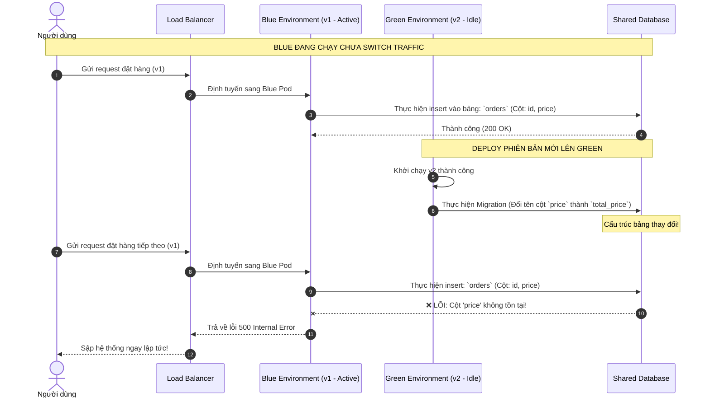

# Blue-green deployment có thể fail ở điểm nào?

## ⚡ Tóm tắt ngắn (30s)
* **Bản chất**: Blue-Green Deployment là phương pháp chạy **hai môi trường production giống hệt nhau** (Blue là bản active hiện tại, Green là bản mới chuẩn bị active). Khi hoàn tất deploy lên Green, ta chuyển hướng Load Balancer/Router từ Blue sang Green. Mặc dù lý thuyết cực kỳ an toàn, nhưng Blue-Green rất dễ sập ở tầng **Dữ liệu (Database), Trạng thái (Session) và Tác vụ ngầm (Background/Async tasks)** do sự không đồng nhất về kiến trúc.
* **Thảm họa thực chiến được giải quyết**:
  1. **Database Schema Collision (Xung đột database)**: Deploy bản v2 lên môi trường Green làm thay đổi cấu trúc bảng (DB Schema) khiến môi trường Blue đang chạy v1 lập tức bị crash hàng loạt, gây downtime ngay trong khi đang deploy.
  2. **Double processing (Xử lý trùng lặp)**: Cả hai môi trường Blue và Green cùng kết nối vào một database và một hàng đợi Message Broker (Kafka/RabbitMQ), khiến cả hai bản cùng tiêu thụ message và chạy scheduler song song, tạo ra dữ liệu trùng lặp hoặc sai lệch nghiêm trọng.
* **Quyết định Senior**:
  1. **Quy tắc Vàng - Tương thích ngược DB**: Tách rời thay đổi DB schema và thay đổi code. DB schema mới phải luôn tương thích ngược hoàn toàn với phiên bản code cũ (v1 trên Blue) và phiên bản code mới (v2 trên Green).
  2. **Quản lý Session Tập trung**: Không bao giờ lưu trữ trạng thái người dùng (Session state) trong bộ nhớ RAM của local container. Bắt buộc phải sử dụng bộ lưu trữ session tập trung như **Redis Session Store**.
  3. **Tắt nóng Consumer / Scheduler trên Idle Environment**: Môi trường Green khi chưa được chuyển hướng traffic (idle) bắt buộc phải cấu hình tắt toàn bộ Consumer của Message Queue và các Cronjob/Scheduler ngầm.

---

## 🔍 Chi tiết bản chất thực chiến: 5 điểm chết của kiến trúc Blue-Green

Kiến trúc Blue-Green thường sụp đổ bởi các yếu tố phi trạng thái (stateless) không đồng bộ với các yếu tố có trạng thái (stateful):

```
       [Load Balancer] ──(DNS Cache / Route switch)
              │
      ┌───────┴───────┐
      ▼               ▼
 [Blue - v1]     [Green - v2]  <── (Consumer / Scheduler chạy ngầm ❌)
      │               │
      └───────┬───────┘
              ▼
       [SHARED DATABASE] <── (Database Schema thay đổi không tương thích ngược ❌)
```

### 1. Database Schema không tương thích ngược (Backward Incompatibility)
* **Vấn đề**: Blue và Green chia sẻ chung một Database duy nhất. Bản v2 trên Green thực hiện thay đổi schema (ví dụ: Xóa một cột, đổi tên cột, hoặc thêm cột bắt buộc `NOT NULL` không có giá trị mặc định).
* **Hậu quả**: Blue (v1) đang phục vụ 100% traffic thực tế của khách hàng lập tức bị lỗi ghi dữ liệu vì cấu trúc bảng đã thay đổi dưới chân nó. Blue-Green biến thành một đợt downtime toàn hệ thống.

### 2. DNS Caching và độ trễ chuyển hướng (Router Switch Latency)
* **Vấn đề**: Chuyển hướng traffic bằng cách thay đổi bản ghi DNS (ví dụ: Cập nhật DNS từ IP của Blue sang IP của Green).
* **Hậu quả**: Do cơ chế DNS Caching ở phía ISP của người dùng hoặc trên trình duyệt của client kéo dài (TTL dính lâu), nhiều user vẫn tiếp tục gửi request về môi trường Blue cũ kể cả sau khi bạn đã tắt môi trường Blue, gây lỗi mất kết nối (`502 Bad Gateway` hoặc `Connection Refused`).
* *Giải pháp Senior*: Luôn thực hiện chuyển hướng ở tầng **Load Balancer / API Gateway / Reverse Proxy** (Nginx, HAProxy, AWS ALB) bằng cách đổi trọng số định tuyến (Weight) tức thì, không sử dụng DNS switch trực tiếp cho người dùng cuối.

### 3. Trạng thái Session bị mất mát (Lost Session State)
* **Vấn đề**: Ứng dụng sử dụng Sticky Sessions (lưu session trực tiếp trong bộ nhớ RAM của máy chủ Blue).
* **Hậu quả**: Ngay khi Load Balancer đổi hướng sang Green, hàng loạt người dùng đang sử dụng ứng dụng lập tức bị đá văng ra màn hình đăng nhập (Session loss), gây trải nghiệm cực kỳ tệ hại.

### 4. Xung đột tác vụ chạy ngầm (Dual Active Background Tasks)
* **Vấn đề**: Cả hai bản v1 (Blue) và v2 (Green) đều có các Cronjob ngầm quét database để gửi email hoặc tính toán doanh thu định kỳ.
* **Hậu quả**: Khi Green khởi chạy nhưng chưa nhận traffic từ Load Balancer, các class Cronjob của Green vẫn tự động kích hoạt, dẫn đến việc gửi 2 email trùng lặp cho cùng một khách hàng, hoặc tính toán sai lệch số liệu doanh thu.

### 5. Chi phí hạ tầng tăng gấp đôi (Cost Over-provisioning)
* Chạy song song 2 môi trường hoàn chỉnh, mỗi bên gánh được 100% tải thực tế đòi hỏi chi phí hạ tầng (VM, Cluster) tăng **100%**. Đây là rào cản tài chính rất lớn đối với các startup hoặc dự án vừa và nhỏ.

---

## 🎨 Sơ đồ trực quan (Hiệu ứng lỗi phá hủy chéo của DB Schema trong Blue-Green)



---

## 💻 Code thực chiến: Sử dụng Spring Boot Profiles để tắt nóng Consumer/Scheduler trên Idle Environment

Để khắc phục điểm chết số 4 (Xung đột tác vụ ngầm), ta cấu hình ứng dụng Spring Boot sao cho các Service ngầm (Kafka Consumer, Scheduled Tasks) chỉ được phép chạy khi ứng dụng được kích hoạt Profile tương ứng. Khi deploy lên môi trường Green (idle), ta KHÔNG truyền profile này vào, chỉ truyền sau khi thực hiện switch traffic thành công.

### 1. Cấu hình Conditional Annotation cho Scheduled Tasks
```java
import lombok.extern.slf4j.Slf4j;
import org.springframework.boot.autoconfigure.condition.ConditionalOnProperty;
import org.springframework.scheduling.annotation.Scheduled;
import org.springframework.stereotype.Service;

@Slf4j
@Service
// ✅ Class này chỉ được khởi tạo nếu config 'app.background-tasks.enabled' là true
@ConditionalOnProperty(name = "app.background-tasks.enabled", havingValue = "true")
public class HeavyCalculationScheduler {

    @Scheduled(cron = "0 0 1 * * ?") // Chạy lúc 1h sáng hàng ngày
    public void runDailyReport() {
        log.info("📊 Bắt đầu chạy tính toán báo cáo doanh thu ngày...");
        // Logic xử lý báo cáo thực tế
    }
}
```

### 2. Cấu hình Conditional Annotation cho Message Queue (Kafka Consumer)
```java
import lombok.extern.slf4j.Slf4j;
import org.springframework.boot.autoconfigure.condition.ConditionalOnProperty;
import org.springframework.kafka.annotation.KafkaListener;
import org.springframework.stereotype.Service;

@Slf4j
@Service
// ✅ Chỉ lắng nghe hàng đợi Kafka nếu ứng dụng ở trạng thái Active phục vụ traffic
@ConditionalOnProperty(name = "app.consumers.enabled", havingValue = "true")
public class PaymentEventConsumer {

    @KafkaListener(topics = "payment-events", groupId = "payment-group")
    public void consumePaymentEvent(String message) {
        log.info("📥 Nhận được sự kiện thanh toán: {}", message);
        // Xử lý logic nghiệp vụ
    }
}
```

### 3. File cấu hình `application-active.yml` (Sử dụng cho Môi trường Active)
```yaml
# Môi trường Active (Blue hoặc Green đã được switch traffic) nhận diện đầy đủ tính năng:
app:
  background-tasks:
    enabled: true
  consumers:
    enabled: true
```

### 4. File cấu hình `application-idle.yml` (Sử dụng cho Môi trường Idle chuẩn bị deploy)
```yaml
# Môi trường Idle (Mới deploy chuẩn bị switch) sẽ tắt sạch các tác vụ nền tránh xung đột:
app:
  background-tasks:
    enabled: false
  consumers:
    enabled: false
```

---

## 📊 Bảng so sánh Điểm Chết và Cách Khắc Phục trong Blue-Green

| Điểm chết | Hậu quả nghiêm trọng | Giải pháp khắc phục Senior |
| :--- | :--- | :--- |
| **Xung đột Database Schema** | Gây sập chéo hệ thống cũ (Blue v1) ngay lập tức. | Áp dụng quy trình deploy DB 2 bước độc lập (Expand & Contract Pattern). |
| **DNS Cache / TTL kéo dài** | Client bị mất kết nối khi IP cũ của Blue bị shutdown. | Chuyển hướng ở tầng Load Balancer/Reverse Proxy (tức thì, không đổi IP DNS). |
| **Xung đột Consumer/Scheduler** | Gửi trùng thông báo, chạy trùng tác vụ ghi đè dữ liệu. | Dùng Spring/Env Profiles để tắt nóng (Disable) Consumer/Scheduler trên Idle environment. |
| **Mất Session State** | Khách hàng bị log out hàng loạt khi switch traffic. | Chuyển Session tập trung sang Redis cluster, giải phóng stateless hoàn toàn cho app. |
| **Tốn kém chi phí hạ tầng** | Chi phí vận hành hạ tầng tăng gấp 2 lần. | Sử dụng các giải pháp Containerization có khả năng Auto-scaling (Kubernetes) linh hoạt. |

---

## ⚠️ Common Gotchas & Questions follow-up

### 1. Cạm bẫy "Bẫy rollback ghi đè dữ liệu mới (The Data Write Trap)"
* **Vấn đề**: Bạn deploy Green (v2) thành công và switch 100% traffic sang Green. Trong vòng 1 tiếng chạy trên Green, có 5,000 đơn hàng mới được tạo ra và lưu vào Database. Đột nhiên, bạn phát hiện Green bị lỗi memory leak nặng và quyết định switch ngược traffic trở lại Blue (v1). Lúc này, do phiên bản v1 chạy trên Blue hoàn toàn không biết cấu trúc dữ liệu mới của v2 (nếu có bổ sung cột phức tạp hoặc chuyển đổi format JSON), ứng dụng v1 sẽ crash liên tục khi cố gắng đọc 5,000 đơn hàng mới tạo kia.
* **Giải pháp khắc phục**: Tuyệt đối không bao giờ thực hiện switch ngược về phiên bản cũ (Rollback routing) mà không có **Kịch bản phục hồi dữ liệu (Data Migration Rollback Script)**. Khi viết script thay đổi cấu trúc DB lên v2, bắt buộc phải viết kèm script revert dữ liệu tương ứng để làm sạch dữ liệu trước khi chuyển dòng traffic trở lại v1.

### 2. Câu hỏi đào sâu từ interviewer
* **Q: Nếu chúng ta sử dụng Microservices với 50 services khác nhau, chúng ta có nên áp dụng Blue-Green deployment cho toàn bộ 50 services này đồng thời không? Vì sao?**
* **Trả lời**:
  * **Không nên**. Áp dụng Blue-Green cho toàn bộ 50 services cùng lúc (Big Bang Blue-Green) là một thảm họa thiết kế vì:
    1. Triệt tiêu khả năng phát triển và deploy độc lập (Independent Deployability) của từng team.
    2. Chi phí hạ tầng sẽ tăng phi mã đến mức không thể chi trả nổi (vì phải duy trì 50 x 2 = 100 cụm hệ thống chạy song song).
    3. Rủi ro tích lũy cực lớn: Chỉ cần 1 trong số 50 services gặp lỗi khi switch sang Green, toàn bộ đợt rollout lớn sẽ thất bại và phải rollback toàn bộ.
  * **Giải pháp Senior**: Chỉ áp dụng Blue-Green độc lập cho từng service riêng lẻ (Fine-grained Blue-Green) ở tầng API Gateway hoặc Kubernetes Service. Mỗi team tự quản lý đợt Blue-Green của service mình bằng cách tuân thủ nghiêm ngặt tính tương thích ngược của API (Backward compatibility) thông qua các tiêu chuẩn REST/gRPC.
