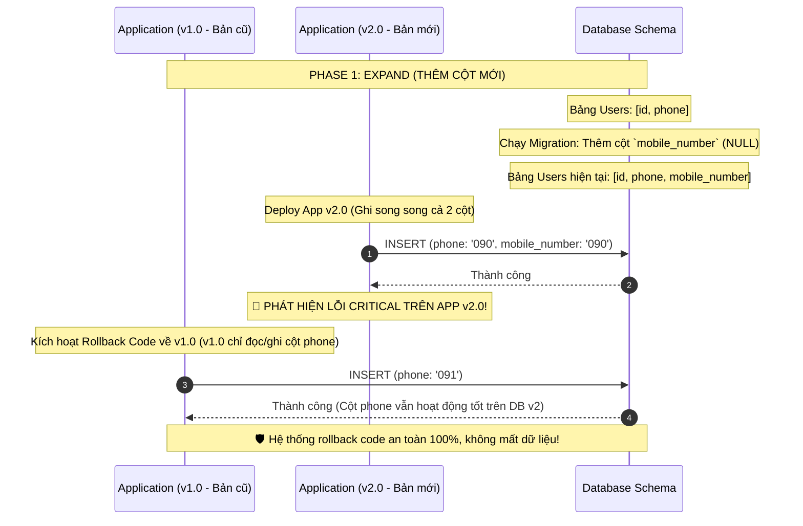

# Rollback code nhưng database schema đã migrate. Bạn xử lý thế nào?

## ⚡ Tóm tắt ngắn (30s)
* **Bản chất**: Đây là một trong những thử thách vận hành lớn nhất trong hệ thống chịu tải cao. Sự cố xảy ra khi code v2 bị lỗi nghiêm trọng đòi hỏi rollback khẩn cấp về v1, nhưng database schema đã chạy script migration lên v2. Giải pháp Senior bắt buộc là **"Thiết kế tương thích ngược từ đầu" (Expand and Contract Pattern)** chứ không phải tìm cách hạ cấp database (rollback schema) một cách mù quáng trên production vì nguy cơ mất dữ liệu và sập luồng ghi là cực kỳ lớn.
* **Thảm họa thực chiến được giải quyết**:
  1. **Mất sạch dữ liệu thực tế (Data Loss)**: Chạy lệnh `db rollback` (ví dụ: `drop column` hoặc `drop table`) làm xóa sổ vĩnh viễn toàn bộ các bản ghi/giao dịch mới mà khách hàng đã tạo ra trong khoảng thời gian hệ thống chạy phiên bản v2.
  2. **Khóa chết chu trình khởi động (Startup Crash Loop)**: Code v1 sau khi rollback cố gắng kết nối database nhưng crash lập tức vì thực thể ORM (Entity) của v1 đòi hỏi cấu trúc bảng cũ, trong khi bảng thực tế đã bị migration v2 thay đổi hoàn toàn.
* **Quyết định Senior**:
  1. **Áp dụng mô hình Expand and Contract**: Không bao giờ thực hiện breaking change database trong một đợt deploy duy nhất. Chia thay đổi thành nhiều đợt độc lập để đảm bảo code v1 luôn chạy tốt trên schema v2.
  2. **Quy tắc Forward-Only Migration**: Tuyệt đối cấm chạy các lệnh `rollback migration` tự động trên production. Mọi hành động sửa đổi schema database sau sự cố đều phải được thực hiện dưới dạng một migration tiến lên phía trước (Forward Migration) để bảo toàn tính toàn vẹn của dữ liệu.
  3. **Phục hồi bằng Feature Flag**: Sử dụng Feature Flag tắt nóng logic v2 lỗi, đưa ứng dụng về luồng v1 nhưng vẫn hoạt động hoàn toàn trơn tru trên cấu trúc Database v2.

---

## 🔍 Chi tiết bản chất thực chiến: Mô hình Expand and Contract (Mở rộng và Co hẹp)

Quy trình thay đổi cấu trúc Database chuẩn Enterprise (không downtime, an toàn tuyệt đối khi rollback code) được thực hiện qua mô hình song song **Expand and Contract**:

Hãy tưởng tượng bạn cần đổi tên cột `phone` thành `mobile_number` trong bảng `users`.

```
[TRẠNG THÁI BAN ĐẦU] ──> [PHASE 1: EXPAND (Mở rộng)] ──> [PHASE 2: TRUYỀN DỮ LIỆU] ──> [PHASE 3: CONTRACT (Co hẹp)]
   (Bảng chỉ có phone)     (Thêm cột mobile_number,      (Code v2 đọc ghi cả hai cột,      (Code v2.1 chỉ đọc mobile_number,
                            giữ nguyên cột phone)         đồng bộ dữ liệu ngầm từ cũ sang mới)   xóa bỏ hoàn toàn cột phone)
```

### Chi tiết các Phase thực hiện:

#### Phase 1: Expand (Mở rộng) - Deploy đợt 1
* **Database**: Chạy migration thêm cột mới `mobile_number` cho phép giá trị `NULL`. **Tuyệt đối không xóa cột `phone` cũ**.
* **Code (v1.1)**: Deploy bản code mới. Bản code này:
  * Khi Ghi dữ liệu: Ghi đồng thời vào cả 2 cột `phone` và `mobile_number`.
  * Khi Đọc dữ liệu: Chỉ đọc từ cột cũ `phone` (hoặc ưu tiên cột mới nếu có, fallback về cột cũ nếu NULL).
* **Khả năng an toàn**: Nếu code v1.1 lỗi và cần rollback về v1.0, hệ thống vẫn hoạt động 100% trơn tru vì cột `phone` cũ vẫn tồn tại và đầy đủ dữ liệu mới nhất.

#### Phase 2: Đồng bộ hóa dữ liệu (Data Migration)
* Chạy một background job (hoặc batch job ngầm) quét toàn bộ các bản ghi cũ để copy dữ liệu từ cột `phone` sang `mobile_number` cho những dòng chưa được cập nhật.

#### Phase 3: Contract (Co hẹp) - Deploy đợt 2 (Chỉ thực hiện sau khi Phase 2 an toàn)
* **Code (v2.0)**: Cấu hình code chỉ đọc và ghi duy nhất vào cột mới `mobile_number`.
* **Database**: Chạy migration xóa bỏ hoàn toàn cột cũ `phone` khỏi bảng để làm sạch dung lượng.

---

## 🎨 Sơ đồ trực quan (Expand & Contract Pattern giúp rollback an toàn)



---

## 💻 Code thực chiến: Triển khai Dual-Write (Ghi song song) trong Hibernate Entity

Dưới đây là cách triển khai Java JPA/Hibernate Entity hỗ trợ ghi song song vào cả hai cột trong Phase 1 (Expand) để đảm bảo an toàn tuyệt đối khi rollback code.

### Hibernate Entity hỗ trợ Dual-Write trong quá trình chuyển dịch cột
```java
import jakarta.persistence.*;
import lombok.Getter;
import lombok.NoArgsConstructor;
import lombok.Setter;
import lombok.extern.slf4j.Slf4j;

@Slf4j
@Entity
@Table(name = "users")
@Getter
@Setter
@NoArgsConstructor
public class UserEntity {

    @Id
    @GeneratedValue(strategy = GenerationType.IDENTITY)
    private Long id;

    @Column(name = "username", nullable = false)
    private String username;

    // ❌ Cột cũ chuẩn bị loại bỏ
    @Column(name = "phone")
    private String phone;

    // ✅ Cột mới chuẩn bị thay thế (phải cho phép NULL trong giai đoạn chuyển đổi)
    @Column(name = "mobile_number")
    private String mobileNumber;

    /**
     * ✅ Lifecycle Hook của JPA: Tự động đồng bộ dữ liệu trước khi INSERT/UPDATE
     * Đảm bảo dù code cũ hay mới gọi, dữ liệu cả 2 cột luôn luôn khớp nhau.
     */
    @PrePersist
    @PreUpdate
    public void ensureDualWrite() {
        if (this.phone != null && this.mobileNumber == null) {
            log.info("🔄 Đồng bộ dữ liệu: Ghi đè mobileNumber bằng giá trị của phone.");
            this.mobileNumber = this.phone;
        } else if (this.mobileNumber != null && this.phone == null) {
            log.info("🔄 Đồng bộ dữ liệu: Ghi đè phone bằng giá trị của mobileNumber.");
            this.phone = this.mobileNumber;
        }
    }

    // Constructor tiện lợi
    public UserEntity(String username, String phone) {
        this.username = username;
        this.phone = phone;
        this.mobileNumber = phone; // Ghi song song ngay từ lúc khởi tạo
    }
}
```

---

## 📊 Bảng so sánh 3 Hướng xử lý Sự cố Xung đột Code - Database

| Tiêu chí | Giải pháp 1: Expand & Contract (Khuyên dùng) | Giải pháp 2: Chạy Forward Migration Revert | Giải pháp 3: Chạy Lệnh Downward Revert (`db rollback`) |
| :--- | :--- | :--- | :--- |
| **Độ rủi ro mất dữ liệu** | **Tuyệt đối bằng 0** (Vì các cột cũ và mới luôn song song dữ liệu). | Thấp (Nếu viết script di chuyển dữ liệu cẩn thận). | **Cực kỳ cao** (Dễ bị mất toàn bộ dữ liệu mới tạo ở bản v2). |
| **Downtime hệ thống** | **Bằng 0** (Không cần bảo trì hay khóa bảng). | Thấp (Có thể cần khóa luồng ghi trong vài phút để chạy script). | Cao (Bắt buộc phải dừng hệ thống để tránh xung đột ghi dữ liệu). |
| **Mức độ phức tạp code** | Trung bình (Đòi hỏi thiết kế thực thể ORM hỗ trợ ghi song song). | Cao (Đòi hỏi viết script SQL xử lý dữ liệu phức tạp). | Thấp (Chỉ cần 1 lệnh rollback tự động của Flyway/Liquibase). |
| **Khuyên dùng** | Cho mọi hệ thống lớn, chịu tải cao, giao dịch tài chính/e-commerce. | Khi lỡ deploy breaking change mà không chuẩn bị Expand & Contract trước. | **Tuyệt đối tránh** trên môi trường Production. |

---

## ⚠️ Common Gotchas & Questions follow-up

### 1. Cạm bẫy "Bẫy cột NOT NULL không có giá trị mặc định (The Default Value Trap)"
* **Vấn đề**: Khi bạn thực hiện bước Expand (thêm cột mới `mobile_number`), do thói quen thiết kế, bạn khai báo cột này là `NOT NULL` nhưng không thiết lập giá trị mặc định (Default Value) trong Database.
* **Hậu quả**: Khi rollback code về v1.0, code cũ v1.0 thực hiện lệnh `INSERT` vào bảng chỉ khai báo cột `phone`. Database sẽ lập tức từ chối lệnh insert này và trả về lỗi: `Field 'mobile_number' doesn't have a default value`. Hệ thống bị tê liệt luồng ghi hoàn toàn.
* **Giải pháp khắc phục**: Trong giai đoạn Expand (Phase 1), mọi cột mới thêm vào bắt buộc phải cho phép **NULL** hoặc bắt buộc phải có giá trị mặc định (`DEFAULT ''` hoặc `DEFAULT 0`). Chỉ sau khi code v2.0 đã ổn định 100% và không còn khả năng rollback về v1.0 nữa, ta mới chạy một migration phụ để chuyển cột đó thành `NOT NULL` (nếu cần).

### 2. Câu hỏi đào sâu từ interviewer
* **Q: Nếu lỡ xảy ra sự cố trên production: Bạn rollback code về v1 thành công, nhưng database đã bị chạy một migration xóa mất một cột quan trọng rồi (Contract phá hủy dữ liệu). Lúc này hệ thống cũ v1 đang crash hàng loạt. Bạn sẽ xử lý tình huống khẩn cấp này như thế nào?**
* **Trả lời**:
  * Đây là sự cố nghiêm trọng cấp độ P0 (Thảm họa mất dữ liệu). Quy trình xử lý khẩn cấp gồm:
    1. **Ngắt kết nối luồng ghi (Freeze Writes)**: Lập tức chuyển API Gateway sang chế độ bảo trì (Maintenance Mode) đối với các luồng ghi liên quan tới bảng lỗi để ngăn chặn dữ liệu bị sai lệch thêm.
    2. **Khôi phục cấu trúc cột từ bản Backup gần nhất**:
       * Tạo một bảng phụ tạm thời từ bản backup database gần nhất (ví dụ: Bản backup tự động lúc 0h sáng).
       * Khôi phục cấu trúc cột bị xóa trên bảng chính.
       * Chạy một script SQL để đối chiếu và nạp lại dữ liệu của cột bị mất từ bảng tạm thời sang bảng chính dựa trên ID của user.
    3. **Bù đắp dữ liệu bị mất trong khoảng trống (Data Gap Reconcile)**:
       * Đối với dữ liệu phát sinh mới từ lúc deploy lỗi đến lúc bảo trì (không có trong bản backup 0h sáng), ta tiến hành rà soát log giao dịch (Transaction Logs, Application Logs, Kafka Event Logs) để thu thập lại thông tin khách hàng và chạy script bù dữ liệu thủ công.
    4. **Mở lại hệ thống**: Kiểm tra tính toàn vẹn của dữ liệu và mở lại API Gateway.
