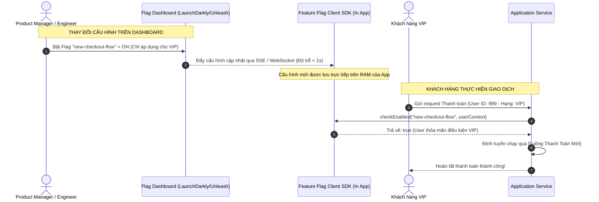

# Feature flag giúp giảm rủi ro production như thế nào?

## ⚡ Tóm tắt ngắn (30s)
* **Bản chất**: Feature Flag (hay Feature Toggle) là kỹ thuật kiến trúc cho phép **tách biệt hoàn toàn giữa việc triển khai code (Deployment) và việc phát hành tính năng (Release)**. Code mới được deploy trực tiếp lên production nhưng được ẩn sau một cấu hình bật/tắt động quản lý từ xa. Điều này biến quy trình vận hành từ "Big Bang Launch" đầy rủi ro thành các đợt kích hoạt tính năng nhẹ nhàng, có kiểm soát và có khả năng phục hồi tức thời.
* **Thảm họa thực chiến được giải quyết**:
  1. **Tắc nghẽn quy trình phát hành (All-or-Nothing Rollback)**: Một tính năng bị lỗi trong bản release chung bắt buộc phải rollback toàn bộ container, kéo theo việc trì hoãn hàng loạt tính năng hoạt động tốt khác của các team khác.
  2. **Thất bại do sập tải khi ra mắt (Scalability Failure)**: Mở tính năng mới phức tạp (tốn CPU/Database) cho 100% người dùng cùng lúc làm quá tải hệ thống, gây sập toàn diện dịch vụ mà không thể cứu vãn kịp thời.
* **Quyết định Senior**:
  1. **Thiết lập Nút Tắt Khẩn Cấp (Kill Switch)**: Mọi tính năng mới có rủi ro trung bình-cao bắt buộc phải được bọc trong Feature Flag để nếu xảy ra sự cố, ta có thể tắt nóng ngay lập tức trong vòng dưới 2 giây trên Dashboard quản lý (Unleash, LaunchDarkly) mà không cần restart service hay redeploy code.
  2. **Phát hành lũy tiến (Progressive Rollout)**: Cấu hình phân phối tính năng theo tỷ lệ phần trăm (1% -> 10% -> 50% -> 100%) hoặc theo phân khúc khách hàng (nhóm Beta Testers, nhân viên nội bộ) để hạn chế tối đa vùng ảnh hưởng (Blast Radius) nếu có lỗi xảy ra.
  3. **Dọn dẹp nợ kỹ thuật định kỳ (Flag Cleanup)**: Feature Flag là khoản nợ kỹ thuật tạm thời. Bắt buộc phải có task dọn dẹp (xóa bỏ flag, giữ lại code path chính thức) sau khi tính năng đã chạy ổn định 100% trên production trong vòng 2-4 tuần.

---

## 🔍 Chi tiết bản chất thực chiến: Cơ chế giảm thiểu rủi ro của Feature Flag

Feature Flag thay đổi hoàn toàn cách thức vận hành và phát hành phần mềm thông qua các cơ chế cốt lõi sau:

```
[Mã nguồn mới] ──> [Kiểm tra Feature Flag: Bật? 🎯]
                         │               │
                         ├──► YES ───────┼──► [Luồng Tính Năng Mới] ──► (Thử nghiệm 5% user)
                         │               │
                         └──► NO ────────┼──► [Luồng Code Cũ Ổn Định] ──► (An toàn cho 95% user)
```

### 1. Tách biệt Deployment và Release (Decoupling)
* **Deployment ( Stateless & An Toàn)**: Đẩy code mới lên production. Lúc này, do Feature Flag đang ở trạng thái `OFF`, toàn bộ luồng code mới hoàn toàn "ngủ đông". Không có bất kỳ rủi ro nào đối với hệ thống đang chạy.
* **Release (Có điều kiện & Kiểm soát)**: Bật flag cho một nhóm đối tượng cụ thể. Quá trình này hoàn toàn động, được cấu hình trên bộ nhớ RAM (In-Memory Configuration) thông qua các SDK truyền tải cấu hình thời gian thực (Real-time Config Delivery).

### 2. Giảm thiểu rủi ro xung đột nhánh Code (Avoiding Branch Hell)
* Thay vì duy trì các nhánh Git chạy dài hạn (Long-lived feature branches) gây xung đột khủng khiếp khi merge, lập trình viên sử dụng **Trunk-Based Development**.
* Code mới được merge trực tiếp vào nhánh `main` hàng ngày nhưng được khóa sau Feature Flag. Toàn bộ team luôn làm việc trên một gốc code duy nhất, loại bỏ hoàn toàn rủi ro lỗi tích hợp (Integration errors).

### 3. Canary Testing ở tầng Nghiệp Vụ (Application-level Canary)
* Thay vì phân tách 5% traffic ở tầng Network (Load Balancer/Istio) vốn phức tạp và khó phân loại người dùng, Feature Flag cho phép phân tách 5% traffic dựa trên **Thuộc tính nghiệp vụ** (User ID, Email Domain, Quốc gia, hoặc Hạng thành viên VIP).
* Ví dụ: Chỉ bật tính năng thanh toán mới cho 1% khách hàng thuộc nhóm thành viên Bạc (Silver) ở khu vực TP.HCM. Nếu có lỗi, chỉ 1% nhóm nhỏ này bị ảnh hưởng và hệ thống tự động cảnh báo.

---

## 🎨 Sơ đồ trực quan (Kiến trúc Feature Flag phân phối thời gian thực)



---

## 💻 Code thực chiến: Triển khai Feature Flag bằng Unleash SDK trong Spring Boot

Dưới đây là ví dụ thực tế cách tích hợp **Unleash** (Mã nguồn mở Feature Flag hàng đầu) vào dịch vụ Spring Boot để chuyển đổi luồng xử lý dynamically dựa trên Context của người dùng.

### 1. Cấu hình Unleash Client SDK Bean
```java
import io.getunleash.DefaultUnleash;
import io.getunleash.Unleash;
import io.getunleash.util.UnleashConfig;
import org.springframework.beans.factory.annotation.Value;
import org.springframework.context.annotation.Bean;
import org.springframework.context.annotation.Configuration;

@Configuration
public class UnleashConfigBean {

    @Value("${unleash.api-url}")
    private String apiUrl;

    @Value("${unleash.api-token}")
    private String apiToken;

    @Bean
    public Unleash unleash() {
        UnleashConfig config = UnleashConfig.builder()
                .appName("payment-service")
                .instanceId("instance-1")
                .unleashAPI(apiUrl)
                .customHttpHeaders(customHeaders -> customHeaders.put("Authorization", apiToken))
                .build();

        return new DefaultUnleash(config);
    }
}
```

### 2. Triển khai Service sử dụng Feature Flag để phân tách luồng xử lý
```java
import io.getunleash.Unleash;
import io.getunleash.UnleashContext;
import lombok.RequiredArgsConstructor;
import lombok.extern.slf4j.Slf4j;
import org.springframework.stereotype.Service;

@Slf4j
@Service
@RequiredArgsConstructor
public class CheckoutService {

    private final Unleash unleash;
    private final OldCheckoutFlow oldCheckoutFlow;
    private final NewCheckoutFlow newCheckoutFlow;

    public CheckoutResponse processCheckout(UserContext user) {
        // ✅ Khai báo context người dùng để Unleash phân tách đối tượng (Targeting)
        UnleashContext context = UnleashContext.builder()
                .userId(String.valueOf(user.getId()))
                .addContextAttribute("tier", user.getMembershipTier()) // Ví dụ: VIP, SILVER
                .build();

        // ✅ Kiểm tra trạng thái Flag thời gian thực (Lấy trực tiếp từ RAM, độ trễ < 1ms)
        boolean isNewFlowEnabled = unleash.isEnabled("new-checkout-flow", context);

        if (isNewFlowEnabled) {
            log.info("🚀 Người dùng {} (Tier: {}) chạy qua luồng thanh toán MỚI.", user.getId(), user.getMembershipTier());
            try {
                return newCheckoutFlow.execute(user);
            } catch (Exception e) {
                log.error("🚨 Lỗi luồng mới! Tự động Fallback sang luồng cũ để cứu giao dịch...", e);
                return oldCheckoutFlow.execute(user); // Fallback khẩn cấp cấp độ code
            }
        } else {
            log.info("🔒 Chạy luồng thanh toán CŨ ổn định cho người dùng {}.", user.getId());
            return oldCheckoutFlow.execute(user);
        }
    }
}
```

---

## 📊 Bảng so sánh Sự khác biệt giữa Feature Flag và Deploy Phục hồi

| Tiêu chí | Giải pháp 1: Feature Flag (Kill Switch) | Giải pháp 2: Rollback Deployment (Redeploy) |
| :--- | :--- | :--- |
| **Thời gian khôi phục (MTTR)** | **Cực nhanh** (< 2 giây, không downtime). | Chậm (2 - 10 phút, phụ thuộc tốc độ build/boot container). |
| **Phạm vi tác động (Blast Radius)** | Có thể giới hạn cực nhỏ (ví dụ: chỉ 1% user bị lỗi). | Ảnh hưởng toàn bộ traffic hoặc 100% người dùng trên Pod lỗi. |
| **Độ linh hoạt điều hướng** | Cực cao (Có thể bật/tắt theo User ID, Quốc gia, Hạng VIP). | Thấp (Chỉ có thể phân chia ngẫu nhiên theo tỷ lệ % IP mạng). |
| **Ảnh hưởng tới CI/CD pipeline** | Không làm nghẽn pipeline (Mọi team vẫn deploy code bình thường). | Có thể làm đóng băng (freeze) pipeline của cả công ty để xử lý rollback. |
| **Nợ kỹ thuật (Tech Debt)** | **Cao** (Code sẽ có nhiều câu lệnh `if-else` phân nhánh cần dọn dẹp). | **Thấp** (Vì code lỗi đã bị xóa sạch sau khi rollback). |

---

## ⚠️ Common Gotchas & Questions follow-up

### 1. Cạm bẫy "Bão lỗi do Flag lồng nhau (Flag Cascade/Dependency Hell)"
* **Vấn đề**: Bạn tạo ra quá nhiều Feature Flag lồng nhau trong code (ví dụ: `if (FlagA) { if (FlagB) { ... } }`). Khi bật Flag A nhưng quên bật Flag B, hoặc bật cả hai gây ra một trạng thái tổ hợp (Combinatorial state) chưa từng được kiểm thử (Test Matrix Exhaustion). Hậu quả là ứng dụng crash do các biến phụ thuộc lẫn nhau không khớp nhau.
* **Giải pháp khắc phục**: 
  * Giữ thiết kế Feature Flag độc lập tối đa. Tuyệt đối tránh lồng các flag nghiệp vụ phức tạp vào nhau.
  * Thiết lập chính sách **"Không chạy quá 5 Flag hoạt động cùng lúc trong một module"**. 
  * Thực hiện kiểm thử tự động (Matrix Tests) chạy qua tất cả các trạng thái bật/tắt của flag trước khi merge code vào main.

### 2. Câu hỏi đào sâu từ interviewer
* **Q: Làm sao để đảm bảo việc gọi Feature Flag liên tục ở mọi request không làm chậm API (Latency) và không làm quá tải máy chủ lưu cấu hình Feature Flag trung tâm?**
* **Trả lời**:
  * Để đảm bảo hiệu năng cực cao, các hệ thống Feature Flag chuẩn Senior được thiết kế theo mô hình **Local Evaluation (Đánh giá cục bộ)**:
    1. **Không gọi API mạng ở mỗi request**: SDK của Feature Flag (như Unleash/LaunchDarkly) KHÔNG bao giờ thực hiện cuộc gọi HTTP/gRPC sang server trung tâm mỗi khi hàm `isEnabled()` được gọi.
    2. **Đồng bộ hóa ngầm (Background Sync & In-Memory Cache)**: Khi ứng dụng khởi động, SDK kết nối với server trung tâm thông qua WebSocket hoặc Server-Sent Events (SSE) để tải toàn bộ bảng quy tắc (Rule set) về lưu trên bộ nhớ RAM của ứng dụng.
    3. **Tính toán trực tiếp trên RAM**: Khi kiểm tra flag, SDK chỉ thực hiện đối chiếu điều kiện (ví dụ: User ID có đuôi là 5 có nằm trong nhóm 10% được chọn không?) trực tiếp trên RAM bằng thuật toán băm (Hashing) siêu tốc. Thời gian xử lý là **dưới 0.1 miligiây (sub-millisecond)**, hoàn toàn không tốn tài nguyên mạng và không gây trễ API.
