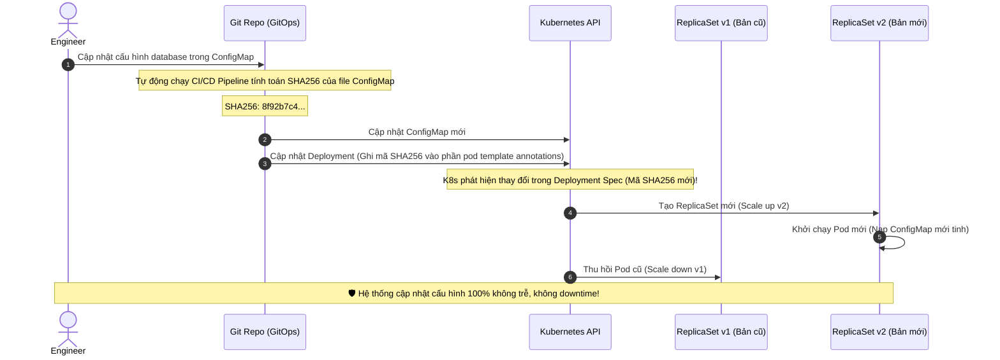

# Deploy thành công nhưng app không nhận config mới. Vì sao?

## ⚡ Tóm tắt ngắn (30s)
* **Bản chất**: Lỗi deploy thành công nhưng ứng dụng vẫn hoạt động với cấu hình cũ (Stale Configuration) là một sự cố cực kỳ phổ biến trong môi trường phân tán và Cloud-Native (Kubernetes). Nguyên nhân cốt lõi là do sự đứt gãy trong **Chu kỳ vòng đời cấu hình (Configuration Lifecycle)**, cơ chế DNS/JVM caching, hoặc do Kubernetes không nhận biết được sự thay đổi của file cấu hình gắn ngoài (ConfigMap/Secret) để tự động khởi động lại Pod.
* **Thảm họa thực chiến được giải quyết**:
  1. **Sự cố ngầm kéo dài (Silent Failures)**: Ứng dụng báo trạng thái xanh (Running) nhưng thực chất đang kết nối sang Database cũ hoặc sử dụng API Key hết hạn, gây gián đoạn nghiệp vụ âm thầm mà các cảnh báo hệ thống thông thường không phát hiện được.
  2. **Trạng thái bất nhất (Configuration Drift)**: Trong cụm 10 Pod, 5 Pod nhận cấu hình mới còn 5 Pod cũ vẫn cache cấu hình cũ, khiến request của khách hàng lúc thành công lúc thất bại một cách ngẫu nhiên và cực kỳ khó debug.
* **Quyết định Senior**:
  1. **Quy tắc Cấu hình Bất biến (Immutable Configuration via Config Hashing)**: Tuyệt đối không cập nhật cấu hình trực tiếp tại chỗ (in-place). Khi thay đổi ConfigMap/Secret, bắt buộc phải cập nhật mã băm cấu hình (Config Hash) vào Annotation của Deployment để Kubernetes nhận biết và kích hoạt quy trình Rolling Update Pod mới tự động.
  2. **Kiểm tra phiên bản cấu hình lúc khởi chạy (Config Version Logging)**: In ra mã hash SHA256 hoặc số phiên bản của file cấu hình ngay khi ứng dụng boot. Điều này giúp On-call Engineer đối chiếu tức thì trên log hệ thống khi có sự cố xảy ra.
  3. **Triển khai `@RefreshScope` thông minh**: Đối với các cấu hình cần thay đổi nóng không cần restart (ví dụ: Feature Flags, Rate limit thresholds), sử dụng cơ chế nạp động của Spring Cloud Config hoặc Consul và bọc các Bean liên quan trong `@RefreshScope`.

---

## 🔍 Chi tiết bản chất thực chiến: 4 Nguyên nhân khiến App không nhận Config mới

Khi xảy ra lỗi lệch cấu hình trên Production, Senior Engineer cần rà soát nhanh 4 nguyên nhân chính sau:

```
[Thay đổi ConfigMap/Secret]
            │
            ├─► 1. THIẾU TRIGGER RESTART? ──► (Kubernetes không tự restart Pod khi ConfigMap thay đổi ❌)
            ├─► 2. LỖI K8S SYNC DELAY?    ──► (Thời gian sync volume ConfigMap mất từ 60s - 120s ❌)
            ├─► 3. JVM / APP LOCAL CACHE? ──► (Ứng dụng nạp file lúc boot và không đọc lại khi chạy ❌)
            └─► 4. LỆCH PROFILE/ENV?      ──► (Nạp sai file config do ghi đè biến môi trường ❌)
```

### 1. Kubernetes không tự động restart Pod khi cập nhật ConfigMap/Secret
* **Vấn đề**: ConfigMap hoặc Secret của Kubernetes được cập nhật giá trị mới. Tuy nhiên, Kubernetes Deployment hoàn toàn không thay đổi (image tag giữ nguyên, env key giữ nguyên).
* **Thực tế**: Kubernetes sẽ cập nhật file cấu hình bên trong Pod (nếu gắn dưới dạng Volume Mount), nhưng **không tự động restart Pod**. Ứng dụng Spring Boot/NodeJS truyền thống vốn chỉ đọc file cấu hình một lần duy nhất lúc khởi động (Bootstrap phase) sẽ tiếp tục chạy với cấu hình cũ trong RAM mãi mãi.

### 2. Độ trễ đồng bộ của Kubernetes Volume Mount (Sync Delay)
* **Vấn đề**: Kể cả khi ứng dụng có cơ chế tự động đọc lại file định kỳ (File watcher). Khi cập nhật ConfigMap, Kubernetes Kubelet mất từ **60 đến 120 giây** (tùy thuộc vào tham số `syncFrequency` và cache TTL của kubelet) để đồng bộ nội dung mới từ Master Node vào bên trong container.
* **Hậu quả**: Có một khoảng trống thời gian (Time window) khá lớn khiến cấu hình bị bất nhất giữa các Pod.

### 3. Cấu hình JVM Cache (DNS / Properties Caching)
* **Vấn đề**: Thay đổi URL của một downstream service trong cấu hình. Cấu hình đã được nạp mới thành công vào ứng dụng, nhưng JVM của Java mặc định cache kết quả phân giải tên miền DNS **vô hạn thời gian** (`networkaddress.cache.ttl = -1`).
* **Hậu quả**: Ứng dụng vẫn tiếp tục gửi request đến địa chỉ IP cũ của service đã bị tiêu hủy.

### 4. Đè cấu hình do thứ tự ưu tiên nạp (Precedence Drift)
* **Vấn đề**: Cấu hình mới được cập nhật trong file `application.yml`, nhưng trên môi trường Kubernetes, ai đó đã cấu hình đè một Biến môi trường (Environment Variable) trùng tên trong file Deployment YAML.
* **Thực tế**: Theo thứ tự ưu tiên của Spring Boot, Biến môi trường luôn có quyền ưu tiên cao hơn file YAML, làm cho cấu hình mới bị bỏ qua hoàn toàn.

---

## 🎨 Sơ đồ trực quan (Cơ chế Config Hashing ép buộc Rolling Update)



---

## 💻 Code thực chiến: Ép buộc Rolling Update bằng Kustomize / Helm và Khắc phục JVM DNS Cache

Để khắc phục triệt để lỗi Stale Configuration, ta áp dụng kỹ thuật tự động tính toán mã Hash cấu hình trong Helm/Kustomize và cấu hình lại TTL DNS của JVM Java.

### 1. Kỹ thuật Helm Template: Tự động restart Pod khi ConfigMap thay đổi
Bằng cách thêm dòng tính mã SHA256 của file cấu hình vào phần `annotations` của Pod template, mỗi khi file `config.yaml` thay đổi, Kubernetes sẽ tự động thực hiện Rolling Update Pod mới.

```yaml
# templates/deployment.yaml
apiVersion: apps/v1
kind: Deployment
metadata:
  name: payment-service
spec:
  replicas: 3
  template:
    metadata:
      annotations:
        # ✅ Tự động tính toán mã hash SHA256 của file config.yaml.
        # Nếu nội dung file thay đổi, annotation thay đổi -> Kube-controller lập tức restart Pod an toàn.
        checksum/config: {{ include (print $.Template.WorkingDirectory "/templates/configmap.yaml") . | sha256sum }}
    spec:
      containers:
        - name: payment-service
          image: payment-service:v1.0.0
          volumeMounts:
            - name: config-volume
              mountPath: /app/config
      volumes:
        - name: config-volume
          configMap:
            name: payment-service-config
```

### 2. Cấu hình Java JVM: Giới hạn thời gian Cache DNS (Network TTL)
Bắt buộc phải đặt lại thời gian cache DNS của JVM về giá trị ngắn (ví dụ: 10 giây) để ứng dụng có thể nhận biết được IP mới khi dịch vụ thay đổi cấu hình định tuyến.

Thêm cấu hình này vào hàm `main` khi khởi chạy ứng dụng Spring Boot:

```java
import org.springframework.boot.SpringApplication;
import org.springframework.boot.autoconfigure.SpringBootApplication;
import java.security.Security;

@SpringBootApplication
public class PaymentApplication {

    public static void main(String[] args) {
        // ✅ Cấu hình JVM chỉ cache DNS trong 10 giây thay vì vô hạn (-1)
        // Cực kỳ quan trọng khi chạy trong môi trường Kubernetes hoặc sử dụng Read Replicas.
        Security.setProperty("networkaddress.cache.ttl", "10");
        
        // Cấu hình cache cho trường hợp phân giải DNS thất bại (chỉ cache 3 giây)
        Security.setProperty("networkaddress.cache.negative.ttl", "3");

        SpringApplication.run(PaymentApplication.class, args);
    }
}
```

---

## 📊 Bảng so sánh 3 Hướng giải quyết Cập nhật Cấu hình

| Tiêu chí | Giải pháp 1: Immutable Config + Restart Pod (Khuyên dùng) | Giải pháp 2: Dynamic Refresh (`@RefreshScope` / Polling) | Giải pháp 3: Thay đổi tại chỗ (In-place ConfigMap Update) |
| :--- | :--- | :--- | :--- |
| **Độ an toàn** | **Tối đa** (App khởi động mới tinh, nạp sạch sẽ, loại bỏ hoàn toàn rác bộ nhớ). | Trung bình (Dễ gây rò rỉ bộ nhớ hoặc lỗi không đồng nhất trạng thái Bean). | **Cực kỳ thấp** (Gây trạng thái bất nhất kéo dài giữa các Pod). |
| **Độ trễ nhận cấu hình** | Thấp (Mất thời gian khởi động Pod mới - khoảng 1 - 2 phút). | **Cực thấp** (Thay đổi có tác dụng lập tức trong vòng vài giây). | Rất cao (Mất từ 1 - 2 phút để Kubelet đồng bộ file ngầm). |
| **Độ phức tạp triển khai** | **Rất đơn giản** (Chỉ cần thêm cấu hình checksum vào Helm/Kustomize). | Cao (Đòi hỏi tích hợp Spring Cloud Config Server, Consul hoặc Spring Actuator `/refresh`). | Rất đơn giản (Không cần làm gì cả). |
| **Use case phù hợp** | Cấu hình tĩnh: URL database, Port, credentials, Threadpool size, GC parameters. | Cấu hình động: Ngưỡng log level (DEBUG/INFO), Feature flags, Rate limits. | **Không bao giờ khuyên dùng** trên môi trường Production. |

---

## ⚠️ Common Gotchas & Questions follow-up

### 1. Cạm bẫy "Bẫy restart đồng loạt do Config lỗi (The Cascading Restart Trap)"
* **Vấn đề**: Bạn áp dụng cơ chế tự động restart Pod khi ConfigMap thay đổi. Bạn thực hiện cập nhật ConfigMap nhưng vô tình viết sai cú pháp file YAML (ví dụ: Viết sai khoảng trắng thụt lề).
* **Hậu quả**: Tất cả các Pod cũ đang chạy yên ổn lập tức bị Kubernetes tiêu hủy đồng loạt để khởi chạy Pod mới. Tuy nhiên, các Pod mới khi boot lên đọc trúng file YAML lỗi sẽ bị crash ngay lập tức. Hệ thống rơi vào trạng thái sập toàn diện (`CrashLoopBackOff`) chỉ trong vài giây.
* **Giải pháp khắc phục**: Luôn luôn triển khai cơ chế **Khởi động cuốn chiếu (Rolling Update)** với cấu hình `maxUnavailable: 1` hoặc `maxUnavailable: 25%`. Điều này đảm bảo Kubernetes chỉ restart trước 1 Pod mới. Nếu Pod mới boot thất bại do lỗi cấu hình, Kubernetes sẽ dừng đợt rollout lại ngay lập tức, giữ nguyên các Pod cũ chạy cấu hình cũ an toàn để bảo vệ hệ thống.

### 2. Câu hỏi đào sâu từ interviewer
* **Q: Làm sao để bảo mật các thông tin nhạy cảm (như Password database, API Key) trong file cấu hình khi deploy lên Kubernetes mà không sợ bị lộ trong Git repository của công ty?**
* **Trả lời**:
  * Để quản lý cấu hình nhạy cảm (Secrets) an toàn, ta áp dụng quy trình bảo mật chuẩn Senior:
    1. **Không lưu Secret trực tiếp trên Git**: Tuyệt đối không commit pass/key dạng clear-text lên Git.
    2. **Sử dụng Công cụ mã hóa Git (Sealed Secrets / SOPS)**: Mã hóa file Secret bằng khóa công khai (Public Key). File mã hóa an toàn để commit lên Git. Khi deploy lên cụm K8s, một Controller chạy trong cụm có khóa riêng (Private Key) sẽ tự động giải mã thành Secret nguyên bản.
    3. **Tích hợp External Secret Manager (AWS Secrets Manager, HashiCorp Vault)**: Đây là giải pháp tối ưu nhất. Ứng dụng không trực tiếp lưu secret. Khi khởi chạy, Pod sử dụng cơ chế **Kubernetes External Secrets (KES)** hoặc **Vault Agent Injector** để tự động lấy secret an toàn từ Vault và gắn trực tiếp vào bộ nhớ RAM (biến môi trường ngầm) hoặc mount thành file tạm thời trên RAM (`tmpfs`), đảm bảo secret không bao giờ ghi xuống đĩa cứng vật lý.
