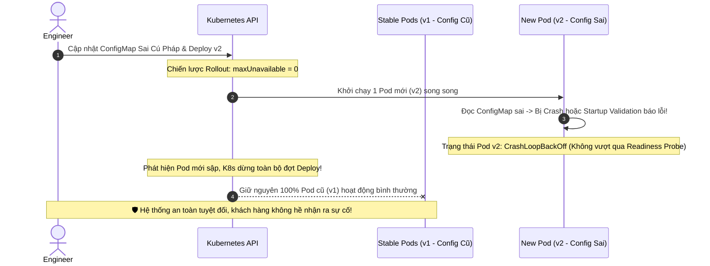

# Một config sai làm toàn bộ service không start được. Làm sao phòng tránh?

## ⚡ Tóm tắt ngắn (30s)
* **Bản chất**: Lỗi cấu hình (Configuration Error) là một trong những nguyên nhân hàng đầu gây ra thảm họa sập hệ thống diện rộng trên Production. Khi một file cấu hình sai cú pháp hoặc thiếu tham số bắt buộc lọt lên, toàn bộ các Pod mới sẽ bị chết ngầm khi khởi động. Giải pháp Senior là thiết lập cơ chế **"Phòng thủ đa tầng" (Multi-layered Config Validation & Fail-Fast)** để phát hiện và chặn đứng cấu hình lỗi từ trước khi nó được deploy lên Production.
* **Thảm họa thực chiến được giải quyết**:
  1. **Vòng lặp khởi động chết chóc (CrashLoopBackOff Domino)**: Toàn bộ cụm Pod bị sập đồng loạt do nạp trúng config lỗi, kéo sập toàn bộ dịch vụ và làm mất khả năng tự phục hồi của Kubernetes.
  2. **Sụp đổ muộn (Late Crash/Lazy Failure)**: Ứng dụng khởi chạy thành công nhưng chạy được 2 tiếng thì sập đột ngột khi đi vào luồng code đọc trúng tham số cấu hình bị sai định dạng (ví dụ: chuỗi thay vì số).
* **Quyết định Senior**:
  1. **Xác thực cấu hình Fail-Fast lúc khởi chạy (Startup Config Validation)**: Sử dụng `@Validated` của Spring Boot hoặc các thư viện Schema Validation (như Zod/Joi trong NodeJS) để ép buộc ứng dụng crash lập tức (`System.exit(1)`) ngay ở giây đầu tiên khởi động nếu phát hiện cấu hình thiếu hoặc sai định dạng.
  2. **Xác thực tự động trên CI/CD Pipeline (Config Dry-Run)**: Tích hợp các công cụ quét tự động (`helm lint`, `kube-linter`, `yq`) vào CI/CD pipeline để từ chối merge các file cấu hình YAML/JSON sai cú pháp ngay tại bước Pull Request.
  3. **Cấu hình Chiến lược Rollout an toàn**: Đặt tham số `maxUnavailable: 0` và `maxSurge: 1` trong Kubernetes Deployment để đảm bảo luôn giữ 100% Pod cũ chạy ổn định, không cho phép tắt Pod cũ nếu Pod cấu hình mới chưa vượt qua bước `Readiness Probe` thành công.

---

## 🔍 Chi tiết bản chất thực chiến: Quy trình Xác thực Cấu hình 3 Tầng (3-Tier Validation)

Để ngăn chặn 100% lỗi cấu hình lọt lên Production, hệ thống cần được thiết lập lá chắn bảo vệ ở cả 3 tầng:

```
[Thay đổi cấu hình]
        │
        ▼
 [TẦNG 1: CI/CD PIPELINE] ──► (Linter, Dry-run, Schema check) ──► Cấm deploy nếu lỗi! ❌
        │
        ▼ (Vượt qua)
 [TẦNG 2: KUBERNETES ROLLOUT] ──► (maxUnavailable: 0, Readiness Probe) ──► Giữ Pod cũ chạy nếu Pod mới crash! ❌
        │
        ▼ (Khởi chạy Pod)
 [TẦNG 3: STARTUP VALIDATION] ──► (Spring @Validated / Zod Schema) ──► Crash lập tức ở giây đầu nếu sai! ❌
```

### Tầng 1: Chặn đứng cấu hình lỗi trên CI/CD Pipeline
* **Linting tự động**: Viết job CI chạy các lệnh kiểm tra định dạng. Ví dụ: `python -m json.tool` đối với JSON, hoặc `yamllint` đối với các file YAML.
* **Schema Validation**: Định nghĩa một file JSON Schema mô tả chi tiết kiểu dữ liệu, các trường bắt buộc và giới hạn giá trị của file cấu hình. Chạy job validate file config thực tế với JSON Schema này trước khi đóng gói.
* **Kubernetes Dry-Run**: Chạy lệnh `kubectl apply --dry-run=server` hoặc `helm template` để kiểm tra tính hợp lệ của cấu trúc file YAML trước khi thực sự apply vào cluster.

### Tầng 2: Vận hành chiến lược Rollout an toàn của Kubernetes
* Nhiều hệ thống bị sập do cấu hình Deployment mặc định cho phép tắt Pod cũ trước khi Pod mới sẵn sàng.
* **Giải pháp Senior**: Cấu hình `RollingUpdateStrategy` khắt khe:
  * `maxUnavailable: 0` (Hoặc `maxUnavailable: 0%`): Không được phép tắt bất kỳ một Pod cũ nào cho đến khi Pod mới hoạt động an toàn.
  * `maxSurge: 25%` (hoặc ít nhất là 1 Pod): Kubernetes sẽ khởi chạy Pod mới song song bên cạnh Pod cũ. Nếu Pod mới bị crash do cấu hình lỗi, Kubernetes sẽ dừng đợt rollout lại, 100% Pod cũ chạy cấu hình cũ vẫn hoạt động hoàn toàn bình thường, không gây ra bất kỳ giây downtime nào cho khách hàng.

### Tầng 3: Xác thực Fail-Fast ở tầng Code Ứng dụng
* Không bao giờ đọc cấu hình kiểu "Lazy" (khi nào dùng mới đọc bằng `@Value`). Bắt buộc phải gom toàn bộ cấu hình vào các Object Class tập trung (Configuration Properties) và kích thực xác thực chặt chẽ ngay khi khởi chạy (Eager Loading).
* Nếu phát hiện cấu hình sai (ví dụ: URL kết nối thiếu tiền tố `http://` hoặc timeout đặt giá trị âm), cho ứng dụng ném ra Exception và kết thúc tiến trình ngay lập tức để Kubernetes ghi nhận trạng thái lỗi và dừng rollout.

---

## 🎨 Sơ đồ trực quan (Cơ chế cô lập lỗi của Kubernetes Rolling Update)



---

## 💻 Code thực chiến: Cấu hình Tự động Xác thực Cấu hình chặt chẽ trong Spring Boot

Dưới đây là cách triển khai hoàn chỉnh bằng **Spring Boot** sử dụng thư viện **Jakarta Validation** để tự động kiểm tra định dạng và tính bắt buộc của các tham số cấu hình ngay khi ứng dụng khởi động.

### 1. File cấu hình lỗi trên Production (`application.yml`)
```yaml
# ❌ File cấu hình lỗi: timeout âm và URL thiếu format HTTP
app:
  payment:
    api-url: "payment-provider.com" # Sai định dạng URL
    timeout-millis: -500           # Lỗi giá trị âm
    retry-attempts: 10             # Vượt quá giới hạn cho phép (max 5)
```

### 2. Class định nghĩa cấu hình tích hợp Validation Annotations
```java
import jakarta.validation.constraints.*;
import lombok.Getter;
import lombok.Setter;
import org.springframework.boot.context.properties.ConfigurationProperties;
import org.springframework.context.annotation.Configuration;
import org.springframework.validation.annotation.Validated;

@Getter
@Setter
@Configuration
@ConfigurationProperties(prefix = "app.payment")
@Validated // ✅ Kích hoạt tính năng tự động xác thực cấu hình của Spring Boot
public class PaymentConfig {

    @NotBlank(message = "URL API thanh toán không được để trống!")
    @Pattern(regexp = "^https?://.*", message = "URL API thanh toán bắt buộc phải bắt đầu bằng http:// hoặc https://!")
    private String apiUrl;

    @Min(value = 100, message = "Timeout không được nhỏ hơn 100ms!")
    @Max(value = 5000, message = "Timeout không được lớn hơn 5000ms!")
    private int timeoutMillis;

    @Min(0)
    @Max(value = 5, message = "Số lần retry tối đa không được vượt quá 5 lần!")
    private int retryAttempts;
}
```

### 3. Log hệ thống khi khởi chạy ứng dụng với cấu hình lỗi
Khi ứng dụng boot lên, Spring Boot sẽ tự động quét class `@Validated` trên, phát hiện lỗi cấu hình và dừng ứng dụng lập tức với thông báo lỗi cực kỳ chi tiết thay vì để lỗi âm thầm lọt lên production:

```text
***************************
APPLICATION FAILED TO START
***************************

Description:

Binding to target org.springframework.boot.context.properties.bind.BindException: Failed to bind properties under 'app.payment' to com.example.config.PaymentConfig:

    Reason: Only elements matching the validation annotations were expected.

    Property: app.payment.apiUrl
    Value: "payment-provider.com"
    Reason: URL API thanh toán bắt buộc phải bắt đầu bằng http:// hoặc https://!

    Property: app.payment.timeoutMillis
    Value: -500
    Reason: Timeout không được nhỏ hơn 100ms!

    Property: app.payment.retryAttempts
    Value: 10
    Reason: Số lần retry tối đa không được vượt quá 5 lần!

Action:

Update your application's configuration
```

---

## 📊 Bảng so sánh Các Giải Pháp Quản Lý và Xác thực Cấu hình

| Tiêu chí | Giải pháp 1: Startup Validation + Rolling Update (Khuyên dùng) | Giải pháp 2: Sử dụng Giá trị mặc định (Default Values) | Giải pháp 3: Đọc lazy cấu hình bằng `@Value` |
| :--- | :--- | :--- | :--- |
| **Mức độ an toàn** | **Tối đa** (Chặn đứng lỗi cấu hình ngay ở giây đầu khởi động). | Trung bình (Ứng dụng chạy được nhưng có thể chạy sai logic mong muốn). | **Rất thấp** (Ứng dụng dễ bị sập muộn lúc đang xử lý giao dịch thực tế). |
| **Khả năng tự phục hồi** | **Cực cao** (Kubernetes tự động giữ lại bản cũ chạy tốt). | Trung bình (Không báo lỗi nên K8s vẫn tắt bản cũ). | Bằng 0 (K8s tắt sạch bản cũ trước khi bản mới bị crash muộn). |
| **Độ rõ ràng khi debug** | **Cực kỳ rõ ràng** (Log in ra chính xác tham số nào bị lỗi và lỗi gì). | Rất mờ nhạt (Ứng dụng chạy ngầm với default value mà dev không biết). | Rất kém (Trace log lỗi nằm sâu trong business logic). |
| **Khuyên dùng** | Bắt buộc cho mọi service trong hệ thống Microservices lớn. | Cho các tham số không quan trọng (ví dụ: cache TTL, Page size). | **Tránh sử dụng** đối với các cấu hình cốt lõi (Core configs). |

---

## ⚠️ Common Gotchas & Questions follow-up

### 1. Cạm bẫy "Bẫy sập dây chuyền do cấu hình dịch vụ trung tâm (Central Config Server Outage)"
* **Vấn đề**: Bạn sử dụng Spring Cloud Config Server hoặc HashiCorp Vault để quản lý cấu hình tập trung cho 50 microservices. Khi trung tâm Config Server bị sập hoặc gặp sự cố quá tải mạng đúng lúc hệ thống thực hiện scale-up tự động (Auto-scaling). 50 Pod mới khởi chạy đồng loạt không thể kết nối tới Config Server trung tâm để lấy cấu hình, dẫn đến toàn bộ 50 services bị crash liên tục.
* **Giải pháp khắc phục**: Thiết lập cơ chế **Lưu trữ cấu hình dự phòng cục bộ (Fail-safe Local Cache / Bootstrap Cache)**. Khi ứng dụng kết nối thành công tới Config Server, nó tự động lưu một bản sao cấu hình sạch gần nhất (Golden Config Copy) xuống phân vùng đĩa cứng tạm thời của container. Nếu Config Server bị sập ở đợt khởi động tiếp theo, ứng dụng sẽ tự động fallback đọc bản cấu hình backup này để khởi chạy an toàn.

### 2. Câu hỏi đào sâu từ interviewer
* **Q: Nếu một cấu hình đúng cú pháp kỹ thuật (YAML hoàn hảo, URL đúng format) nhưng sai về mặt logic nghiệp vụ (ví dụ: Đặt nhầm tỷ lệ giảm giá sản phẩm là 90% thay vì 9%), các tầng validation kỹ thuật trên hoàn toàn không phát hiện được. Làm sao bạn phòng tránh lỗi cấu hình nghiệp vụ nguy hiểm này?**
* **Trả lời**:
  * Đối với các cấu hình nghiệp vụ nhạy cảm, ta phòng chống bằng cơ chế **"Quy trình phê duyệt cấu hình 4 mắt" (Four-Eyes Principle / Maker-Checker Flow)**:
    1. **Tách biệt quyền hạn**: Người tạo cấu hình (Maker - ví dụ: Product Manager) và người phê duyệt cấu hình (Checker - ví dụ: Tech Lead hoặc QA) bắt buộc phải là 2 tài khoản khác nhau trên hệ thống Git/CMS.
    2. **Chạy đối chiếu tự động ở Sandbox (Shadow Mode)**: Trước khi kích hoạt cấu hình mới lên Production, cấu hình đó được áp dụng ngầm ở môi trường Shadow (chạy song song và nhân bản traffic thực tế để xử lý thử). Hệ thống sẽ tự động so sánh kết quả đầu ra của cấu hình mới với cấu hình cũ. Nếu phát hiện biên độ chênh lệch quá lớn (ví dụ: Tổng tiền giảm giá tăng đột biến gấp 10 lần), hệ thống sẽ tự động khóa cấu hình và gửi cảnh báo khẩn cấp.
