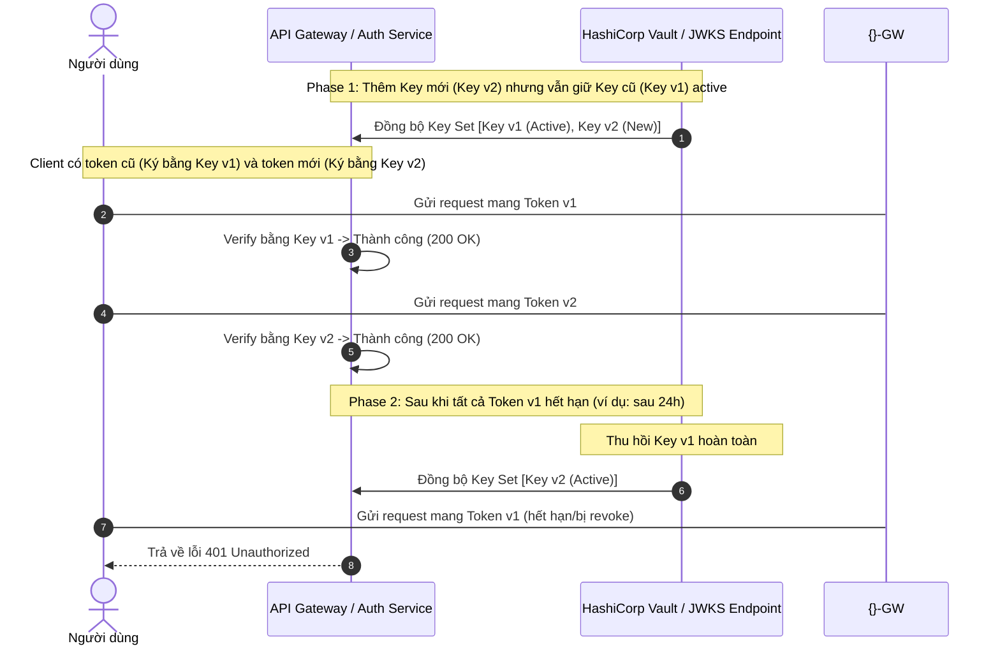

# Secret hết hạn sau deploy. Bạn xử lý thế nào?

## ⚡ Tóm tắt ngắn (30s)
* **Bản chất**: Sự cố secret (Database credential, API key của bên thứ ba, TLS Certificate, JWT private key...) bị hết hạn ngay sau khi deploy thường do cấu hình môi trường mới không khớp hoặc trùng với lịch rotate secret nhưng app mới chưa cập nhật. Cách xử lý khẩn cấp là **nạp lại secret mới qua cấu hình động (Hot Reload / Dynamic Configuration)** hoặc thực hiện **phát hành lại (Reissue/Rotate)** mà không cần viết lại code hay rebuild image.
* **Thảm họa thực chiến được giải quyết**:
  1. **Hardcoded Secret**: Secret được lưu cứng (hardcode) trong code hoặc nén trực tiếp vào Docker image. Khi secret hết hạn, team buộc phải sửa code, commit, build image và chạy lại toàn bộ CI/CD pipeline mất 30-45 phút trong khi hệ thống hoàn toàn tê liệt.
  2. **Đứt gãy kết nối do rotate thủ công**: Xóa secret cũ trước khi pods mới được khởi động hoàn chỉnh, làm cho các pods cũ đang phục vụ traffic bị lỗi kết nối hàng loạt (Zero-downtime rotation failure).
* **Quyết định Senior**:
  1. **Dynamic Config / Hot reload**: Sử dụng cơ chế nạp cấu hình động thông qua Spring Cloud Config, Vault, Kubernetes Secret Mount hoặc viết logic tự động retry/refresh credential khi nhận lỗi `401 Unauthorized` / `403 Forbidden` từ downstream.
  2. **Mô hình Secret song song (Graceful Rotation)**: Khi rotate secret (ví dụ JWT Key hoặc DB password), luôn giữ cả **Secret cũ (Active)** và **Secret mới (Pending/Next)** hoạt động song song trong một khoảng thời gian đệm (Buffer time) để đảm bảo cả Pods cũ và Pods mới đều kết nối thành công.
  3. **Giám sát thời hạn tự động (Expirations alerting)**: Thiết lập giám sát cảnh báo tự động trên Vault/AWS Secrets Manager trước khi secret hết hạn 30 ngày, 14 ngày và 3 ngày thông qua Slack/PagerDuty.

---

## 🔍 Chi tiết bản chất thực chiến: Quy trình xử lý sự cố & Rotate Secret an toàn

Khi xảy ra sự cố Secret hết hạn ngay sau khi deploy, quy trình phản ứng nhanh gồm các bước:

```
[Sự cố: Lỗi Auth 401/403/DB Connection 🚨]
                     │
                     ▼
       [1. KHÔI PHỤC DỊCH VỤ KHẨN CẤP]
  ┌──────────────────┴──────────────────┐
  ▼ (Nếu lưu dynamic)                   ▼ (Nếu lưu env/hardcode)
[Update Secret Manager & Reload]      [Revert/Rollback sang v1 hoặc]
                                      [Update K8s Secret + Restart Pods]
                     │
                     ▼
       [2. THIẾT KẾ DÀI HẠN: GRACEFUL ROTATION]
  (Dual-active secret -> Client migration -> Deprecate old secret)
```

### Bước 1: Khôi phục dịch vụ khẩn cấp (Emergency Recovery)
1. **Kiểm tra Log**: Xác định chính xác loại secret nào hết hạn (DB password, API key bên thứ ba như Stripe/SendGrid, hay JWT signing key).
2. **Cập nhật Dynamic Store**: Nếu app đọc cấu hình từ các dịch vụ như Vault hoặc AWS Secrets Manager, tiến hành cập nhật secret mới lên store. Sau đó kích hoạt endpoint `/actuator/refresh` (nếu dùng Spring Boot) để hot-reload cấu hình mà không cần restart container.
3. **Trường hợp lưu qua K8s Secret (Environment Variable)**: Cập nhật K8s Secret và thực hiện lệnh restart pods cuốn chiếu (`kubectl rollout restart deployment/<service-name>`) để ép container nhận biến môi trường mới.
4. **Trường hợp xấu nhất (Hardcoded)**: Rollback ngay lập tức về version cũ (nếu version cũ vẫn chạy credentials cũ còn hạn) để giảm thiểu downtime, song song với việc hotfix gỡ bỏ hardcode.

### Bước 2: Thiết kế quy trình Rotate Secret không downtime (Graceful Rotation Pattern)
Để rotate secret an toàn mà không ảnh hưởng tới người dùng, ta áp dụng mô hình 4 giai đoạn:

```
Phase 1: Deploy Secret Mới (Trạng thái: Chờ - Pending)
         ├── DB/Provider chấp nhận cả mật khẩu Cũ và Mới.
         └── App vẫn đang dùng mật khẩu Cũ để connect.

Phase 2: Chuyển đổi cấu hình ứng dụng (App migration)
         ├── Cập nhật cấu hình App để sử dụng mật khẩu Mới.
         └── Pods mới khởi động dùng mật khẩu Mới, pods cũ vẫn dùng mật khẩu Cũ để xử lý nốt request.

Phase 3: Verify & Giám sát
         ├── Đảm bảo 100% các Pods đã chuyển sang kết nối bằng mật khẩu Mới thành công.
         └── Không còn active session nào dùng mật khẩu Cũ.

Phase 4: Thu hồi mật khẩu Cũ (Deprecate Old Secret)
         └── Vô hiệu hóa mật khẩu Cũ trên DB/Provider.
```

---

## 🎨 Sơ đồ trực quan: Graceful JWT Key Rotation

JWT Key rotation là ví dụ điển hình của việc chuyển đổi key ký số không downtime. API Gateway lưu trữ Key Set (JWKS). Khi rotate, cả key cũ và key mới đều dùng để verify token.



---

## 💻 Code thực chiến: Tự động nạp lại Secret từ AWS Secrets Manager khi gặp lỗi Auth

Dưới đây là cách cài đặt trong Java Spring Boot bằng cách sử dụng một `ClientHttpRequestInterceptor` tùy chỉnh. Khi gọi API bên thứ ba nhận lỗi `401 Unauthorized`, interceptor sẽ tự động call sang AWS Secrets Manager để refresh secret mới nhất, lưu vào cache, và tự động retry request ban đầu.

### Config và Interceptor nạp Secret động trong Spring Boot

```java
package com.example.security;

import com.amazonaws.services.secretsmanager.AWSSecretsManager;
import com.amazonaws.services.secretsmanager.model.GetSecretValueRequest;
import com.amazonaws.services.secretsmanager.model.GetSecretValueResult;
import org.springframework.http.HttpRequest;
import org.springframework.http.HttpStatus;
import org.springframework.http.client.ClientHttpRequestExecution;
import org.springframework.http.client.ClientHttpRequestInterceptor;
import org.springframework.http.client.ClientHttpResponse;
import org.slf4j.Logger;
import org.slf4j.LoggerFactory;
import java.io.IOException;
import java.util.concurrent.atomic.AtomicReference;

public class DynamicApiKeyInterceptor implements ClientHttpRequestInterceptor {
    private static final Logger log = LoggerFactory.getLogger(DynamicApiKeyInterceptor.class);
    
    private final AWSSecretsManager secretsManager;
    private final String secretId; // Tên của secret trên AWS (ví dụ: "prod/stripe-key")
    private final AtomicReference<String> cachedApiKey = new AtomicReference<>("");

    public DynamicApiKeyInterceptor(AWSSecretsManager secretsManager, String secretId) {
        this.secretsManager = secretsManager;
        this.secretId = secretId;
        // Nạp cấu hình lần đầu khi khởi động ứng dụng
        refreshSecret();
    }

    @Override
    public ClientHttpResponse intercept(HttpRequest request, byte[] body, ClientHttpRequestExecution execution) throws IOException {
        // Gắn API Key hiện tại vào Header
        request.getHeaders().set("Authorization", "Bearer " + cachedApiKey.get());
        
        ClientHttpResponse response = execution.execute(request, body);
        
        // Nếu nhận lỗi 401 Unauthorized, có thể do key đã hết hạn
        if (response.getStatusCode() == HttpStatus.UNAUTHORIZED) {
            log.warn("🚨 Nhận lỗi 401 Unauthorized. Tiến hành refresh API Key từ AWS Secrets Manager...");
            
            synchronized (this) {
                // Double-checked locking tránh gọi AWS nhiều lần từ concurrent requests
                String currentKey = cachedApiKey.get();
                refreshSecret();
                
                if (!currentKey.equals(cachedApiKey.get())) {
                    log.info("✅ API Key mới đã được nạp. Đang thực hiện retry request...");
                    // Build lại request mới với API Key mới
                    request.getHeaders().set("Authorization", "Bearer " + cachedApiKey.get());
                    return execution.execute(request, body);
                }
            }
        }
        
        return response;
    }

    private void refreshSecret() {
        try {
            log.info("Fetching secret from AWS Secrets Manager for: {}", secretId);
            GetSecretValueRequest valueRequest = new GetSecretValueRequest().withSecretId(secretId);
            GetSecretValueResult valueResult = secretsManager.getSecretValue(valueRequest);
            
            // AWS Secrets Manager có thể trả về chuỗi JSON hoặc plaintext
            String rawSecret = valueResult.getSecretString();
            // Lưu ý: Thực tế bạn nên dùng thư viện Jackson để parse JSON lấy đúng field mong muốn.
            cachedApiKey.set(rawSecret);
            log.info("Successfully refreshed dynamic secret from AWS.");
        } catch (Exception e) {
            log.error("❌ Không thể nạp secret mới từ AWS: {}", e.getMessage(), e);
        }
    }
}
```

---

## 📊 Bảng so sánh 3 Phương pháp Quản lý & Nạp Secret cho Ứng dụng

| Tiêu chí | Giải pháp 1: Environment Variables (K8s Secret env) | Giải pháp 2: File Mount (K8s Secret volume mount) | Giải pháp 3: Dynamic Secrets SDK (HashiCorp Vault API) |
| :--- | :--- | :--- | :--- |
| **Cách thức hoạt động** | Secret được inject vào biến môi trường khi Container khởi chạy. | Secret được ghi thành file vật lý mount vào pod (`/etc/secrets/db_password`). | App chủ động gọi API sang Vault Server để lấy secret. |
| **Cơ chế Hot-reload** | **Không thể**. Phải restart/recreate Pod mới nhận biến môi trường mới. | **Có thể**. K8s tự động cập nhật file mount sau vài giây/phút. App cần chạy luồng đọc file theo lịch. | **Cực tốt**. App tự refresh định kỳ hoặc refresh theo sự kiện nhận lỗi Auth. |
| **Bảo mật** | Thấp (Dễ bị lộ qua lệnh dump biến môi trường, crash logs, `/proc/1/environ`). | Trung bình (Secret được lưu trong RAMDisk `/dev/shm` hoặc tmpfs, hạn chế ghi đĩa cứng). | **Rất cao** (Secret chỉ tồn tại trong bộ nhớ RAM ứng dụng, hỗ trợ dynamic leasing/revocation). |
| **Khuyên dùng** | Phù hợp dự án nhỏ, CI/CD đơn giản. | Phù hợp dự án Kubernetes chuẩn mà không muốn viết thêm code tích hợp SDK. | **Bắt buộc** cho hệ thống lớn, fintech, yêu cầu PCI-DSS đòi hỏi audit trail nghiêm ngặt. |

---

## ⚠️ Common Gotchas & Questions follow-up

### 1. Cạm bẫy "Mật khẩu Database mới quá mạnh làm JDBC Connection Pool bị treo (The DB Lockout Trap)"
* **Vấn đề**: Khi rotate mật khẩu database, mật khẩu mới có chứa các ký tự đặc biệt (ví dụ: `;`, `@`, `&`, `?`). Khi nạp mật khẩu này qua JDBC connection string mà không encode đúng cách, parser của JDBC driver hiểu nhầm ký tự đặc biệt thành dấu phân tách tham số, dẫn đến connection string bị hỏng. Hậu quả là toàn bộ Connection Pool (như HikariCP) liên tục thử kết nối sai và bị lock account database do nhập sai mật khẩu quá số lần quy định.
* **Giải pháp khắc phục**: 
  * Luôn truyền thông tin mật khẩu thông qua các config properties riêng biệt thay vì nối chuỗi thủ công vào JDBC URL.
  * Thiết lập cấu hình database chỉ lock account tạm thời trong vòng 5 phút (Temporary lockout policy) thay vì lock vĩnh viễn (Permanent lock) để tránh phá hủy dịch vụ toàn diện khi xảy ra lỗi cấu hình.

### 2. Câu hỏi đào sâu từ interviewer
* **Interviewer: "Nếu chúng ta dùng mô hình dynamic credentials (ví dụ Vault sinh ra một DB user/password ngẫu nhiên có TTL 1h cho mỗi instance của app), làm sao chúng ta đảm bảo các transaction đang chạy dở dang không bị ngắt quãng khi credential cũ hết hạn?"**
* **Trả lời**:
  * Khi sử dụng Dynamic Credentials của Vault (Database Secrets Engine), Vault cấp phát tài khoản kèm theo một **Lease Duration** (thời hạn thuê, ví dụ 1 giờ) và cơ chế gia hạn (**Renew**).
  * Ứng dụng sẽ tích hợp Vault Agent hoặc dùng SDK (như Spring Cloud Vault) để chạy một background thread định kỳ xin gia hạn lease trước khi nó hết hạn (thường là khi thời gian lease trôi qua 50%, tức là 30 phút).
  * Trong trường hợp không thể renew (ví dụ kết nối tới Vault bị nghẽn), SDK sẽ không lập tức xóa credential cũ mà sẽ kích hoạt luồng lấy credential dự phòng (Failover) đồng thời phát cảnh báo. Các connection đang active trong JDBC pool vẫn được giữ nguyên cho tới khi connection đó đóng tự nhiên, JDBC connection pool sẽ nạp credential mới cho các connection tạo mới sau đó (Graceful connection transition).
