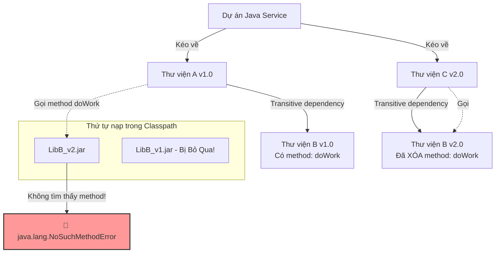

# Dependency version mới gây lỗi runtime. Bạn debug thế nào?

## ⚡ Tóm tắt ngắn (30s)
* **Bản chất**: Lỗi runtime do nâng cấp thư viện (Dependency) thường xuất hiện dưới dạng các exception kinh điển như `NoSuchMethodError`, `ClassNotFoundException` hoặc `NoClassDefFoundError`. Lỗi này cực kỳ nguy hiểm vì code vẫn **compile hoàn toàn thành công (Compile-time OK)** nhưng lại crash bất ngờ trên production khi luồng chạy thực tế gọi trúng class/method bị xung đột. Debug lỗi này đòi hỏi phải phân tích sâu vào sơ đồ phụ thuộc (Dependency Tree) để giải quyết vấn đề "Dependency Hell".
* **Thảm họa thực chiến được giải quyết**:
  1. **Cạm bẫy Transitive Dependency Xung đột**: Nâng cấp thư viện A lên bản mới vô tình kéo theo phiên bản `v2.0` của thư viện B. Tuy nhiên, thư viện C trong project vẫn đang chạy bản cũ và yêu cầu phiên bản `v1.0` của thư viện B. Khi chạy luồng nghiệp vụ của thư viện C, JVM load nhầm class của `v2.0` gây lỗi sập hệ thống.
  2. **Build không đồng nhất giữa các môi trường**: Thiếu file khóa phiên bản (lockfile) dẫn đến việc máy local chạy bình thường (vì cache thư viện cũ) nhưng lên CI/CD build ra artifact lỗi do tự động kéo phiên bản mới nhất (LATEST/SNAPSHOT) từ Repository.
* **Quyết định Senior**:
  1. **Lock Dependency nghiêm ngặt**: Không bao giờ sử dụng các ký tự wildcard (như `+`, `LATEST` hay `[1.0,)`) cho phiên bản thư viện. Sử dụng BOM (Bill of Materials) hoặc Dependency Locking để khóa cứng phiên bản build ở mọi môi trường.
  2. **Cách ly thư viện lỗi bằng Exclusion**: Khi phát hiện thư viện transitive gây xung đột, lập tức dùng thẻ `<exclusion>` trong Maven hoặc `exclude` trong Gradle để loại bỏ phiên bản lỗi, sau đó chỉ định tường minh phiên bản an toàn.
  3. **Kiểm tra JAR Artifact trực tiếp**: Dùng các công cụ giải nén hoặc lệnh `jar tf` để kiểm tra cấu trúc bên trong file Uber-JAR sau khi build xem có class nào bị ghi đè hay trùng lặp (Shade class conflict) hay không.

---

## 🔍 Chi tiết bản chất thực chiến: Quy trình Debug & Khắc phục Xung đột Dependency

Khi gặp lỗi runtime liên quan đến dependency ngay sau khi deploy, quy trình cô lập lỗi của Senior Engineer diễn ra như sau:

```
[Crash: NoSuchMethodError / NoClassDefFoundError 🚨]
                         │
                         ▼
           [1. XÁC ĐỊNH CLASS BỊ XUNG ĐỘT]
 (Tìm package/class gây lỗi từ Stacktrace, ví dụ: org.yaml.snakeyaml)
                         │
                         ▼
        [2. TRUY VẾT SƠ ĐỒ DEPENDENCY TREE]
     (mvn dependency:tree hoặc ./gradlew dependencies)
                         │
                         ▼
           [3. ÁP DỤNG EXCLUSION & LOCKING]
   (Loại bỏ bản transitive lỗi -> Force chỉ định bản tương thích)
                         │
                         ▼
         [4. VERIFY BẰNG LỆNH JVM DIAGNOSTIC]
       (-XX:+TraceClassLoading hoặc -verbose:class)
```

### Bước 1: Phân tích Stack Trace để tìm Class gây lỗi
* Đọc kỹ log lỗi để xác định Class nào bị thiếu hoặc Method nào không tìm thấy.
  * *Ví dụ*: `java.lang.NoSuchMethodError: org.yaml.snakeyaml.constructor.SafeConstructor: method 'void <init>()' not found`
  * Điều này có nghĩa là class `SafeConstructor` có tồn tại trong bộ nhớ (classpath), nhưng phiên bản đang được load không chứa method khởi tạo không tham số `<init>()` như code mong đợi. Đây là dấu hiệu 100% của xung đột phiên bản (class của version cũ bị load đè lên version mới, hoặc ngược lại).

### Bước 2: Truy vết đồ thị Dependency (Dependency Tree)
Chạy lệnh kiểm tra đồ thị phụ thuộc để xem những thư viện nào đang kéo class lỗi về:
* **Maven**: 
  ```bash
  mvn dependency:tree -Dincludes=org.yaml:snakeyaml
  ```
* **Gradle**:
  ```bash
  ./gradlew dependencies --configuration compileClasspath | grep snakeyaml
  ```
Lệnh này sẽ hiển thị chính xác con đường (path) dẫn đến thư viện xung đột. Ví dụ:
```
[INFO] +- com.example:payment-service:jar:1.0.0
[INFO] |  +- org.springframework.boot:spring-boot-starter-web:jar:3.1.0:compile
[INFO] |  |  \- org.yaml:snakeyaml:jar:2.0:compile (Kéo bản 2.0)
[INFO] |  \- com.thirdparty:reporting-sdk:jar:1.2.0:compile
[INFO] |     \- org.yaml:snakeyaml:jar:1.33:compile (Kéo bản 1.33 - Xung đột!)
```

### Bước 3: Áp dụng Exclusion và Cố định Phiên bản tương thích
Sau khi xác định được nguyên nhân, tiến hành loại bỏ phiên bản cũ không mong muốn ra khỏi thư viện bên thứ ba và ép hệ thống dùng bản mới hơn thông qua `<dependencyManagement>` (Maven) hoặc `constraints` (Gradle).

---

## 🎨 Sơ đồ trực quan: Cơ chế Class Loading Xung đột trong JVM

Sơ đồ dưới đây minh họa vì sao xung đột Dependency xảy ra khi JVM ClassLoader quét classpath và nạp class theo thứ tự ưu tiên (First-match wins):



---

## 💻 Code thực chiến: Cấu hình Maven/Gradle giải quyết xung đột triệt để

Dưới đây là các kỹ thuật xử lý xung đột trong file cấu hình build system.

### 1. Giải quyết bằng Maven (Sử dụng Dependency Management và Exclusion)

```xml
<!-- pom.xml -->
<project xmlns="http://maven.apache.org/POM/4.0.0">
    <modelVersion>4.0.0</modelVersion>
    <groupId>com.example</groupId>
    <artifactId>payment-service</artifactId>
    <version>1.0.0</version>

    <dependencyManagement>
        <dependencies>
            <!-- Sử dụng Spring Boot BOM để đồng bộ hóa phiên bản của tất cả các starter -->
            <dependency>
                <groupId>org.springframework.boot</groupId>
                <artifactId>spring-boot-dependencies</artifactId>
                <version>3.1.5</version>
                <type>pom</type>
                <scope>import</scope>
            </dependency>
            <!-- Ép buộc toàn bộ project sử dụng phiên bản snakeyaml an toàn là 2.0 -->
            <dependency>
                <groupId>org.yaml</groupId>
                <artifactId>snakeyaml</artifactId>
                <version>2.0</version>
            </dependency>
        </dependencies>
    </dependencyManagement>

    <dependencies>
        <!-- Thư viện bên thứ ba kéo theo snakeyaml phiên bản cũ -->
        <dependency>
            <groupId>com.thirdparty</groupId>
            <artifactId>reporting-sdk</artifactId>
            <version>1.2.0</version>
            <exclusions>
                <!-- Exclusion: Loại bỏ snakeyaml phiên bản cũ khỏi sdk này -->
                <exclusion>
                    <groupId>org.yaml</groupId>
                    <artifactId>snakeyaml</artifactId>
                </exclusion>
            </exclusions>
        </dependency>

        <dependency>
            <groupId>org.springframework.boot</groupId>
            <artifactId>spring-boot-starter-web</artifactId>
        </dependency>
    </dependencies>
</project>
```

### 2. Giải quyết bằng Gradle (Sử dụng Dependency Constraints)

```groovy
// build.gradle
plugins {
    id 'java'
    id 'org.springframework.boot' version '3.1.5'
    id 'io.spring.dependency-management' version '1.1.3'
}

dependencies {
    implementation('com.thirdparty:reporting-sdk:1.2.0') {
        // Loại bỏ snakeyaml xuyên suốt thư viện này
        exclude group: 'org.yaml', module: 'snakeyaml'
    }
    implementation 'org.springframework.boot:spring-boot-starter-web'

    // Áp dụng constraints để ép buộc phiên bản snakeyaml cho toàn bộ project
    constraints {
        implementation('org.yaml:snakeyaml:2.0') {
            because 'Sửa lỗi bảo mật CVE và đồng bộ hóa version giữa các thư viện'
        }
    }
}
```

---

## 📊 Bảng so sánh 3 Exception lỗi Dependency kinh điển

| Tiêu chí | java.lang.ClassNotFoundException | java.lang.NoClassDefFoundError | java.lang.NoSuchMethodError |
| :--- | :--- | :--- | :--- |
| **Bản chất lỗi** | Lỗi động (Checked Exception). | Lỗi liên kết (Linkage Error / Unchecked Error). | Lỗi tương thích phiên bản (Linkage Error / Unchecked Error). |
| **Thời điểm xảy ra** | Khi dùng code động (Reflection, `Class.forName()`) để load class bằng tên chuỗi nhưng không tìm thấy file `.class` trong classpath. | Khi class đã được compile thành công, nhưng tại thời điểm runtime, JVM **không thể tìm thấy** định nghĩa của class đó (ví dụ: file jar chứa class bị thiếu ở production). | Class tồn tại trong classpath, nhưng **không chứa method** có chữ ký (signature) cụ thể mà client mong muốn gọi. |
| **Nguyên nhân phổ biến** | Quên add dependency vào file POM/Gradle; lỗi chính tả tên class khi gọi reflection. | Thư viện bị loại bỏ ở runtime (`provided` scope); ClassLoader của container (Tomcat/Wildfly) chặn không cho nạp class. | Xung đột phiên bản transitive dependency (thư viện A v1.0 và thư viện A v2.0 cùng nằm trên classpath). |
| **Cách xử lý** | Bổ sung dependency vào classpath; kiểm tra lại chuỗi tên class. | Kiểm tra xem file jar chứa class có bị loại trừ (excluded) khi đóng gói artifact (jar/war) không. | Dùng `mvn dependency:tree` tìm thư viện kéo bản cũ, tiến hành `exclude` bản cũ và ép dùng bản mới. |

---

## ⚠️ Common Gotchas & Questions follow-up

### 1. Cạm bẫy "Môi trường Compile sạch sẽ, Môi trường Runtime đứt gãy (Provided Scope Pitfall)"
* **Vấn đề**: Bạn khai báo thư viện lombok, servlet-api, hoặc logback với scope `<scope>provided</scope>` hoặc `compileOnly`. Khi bạn chạy test ở local hoặc compile bằng IDE, hệ thống load thư viện đó từ thư mục cài đặt của IDE hoặc local maven repo nên chạy cực kỳ mượt mà. Tuy nhiên, khi đóng gói thành jar để deploy lên Docker, các thư viện này không được đóng gói kèm theo (đúng theo tính chất của `provided`). Khi chạy trên container thực tế, app lập tức crash do lỗi `NoClassDefFoundError` vì thiếu runtime dependency.
* **Giải pháp khắc phục**: Chỉ đặt `provided` hoặc `compileOnly` đối với các thư viện chắc chắn đã được môi trường host cung cấp sẵn (như servlet container Tomcat cài sẵn trên server). Các thư viện tiện ích thông thường bắt buộc phải để scope `compile` (hoặc `implementation` trong Gradle).

### 2. Câu hỏi đào sâu từ interviewer
* **Interviewer: "Làm sao bạn debug được lỗi Classpath Conflict khi chạy ứng dụng trên môi trường K8s production mà không thể debug bằng IDE?"**
* **Trả lời**:
  * Em sẽ sử dụng hai kỹ thuật chẩn đoán runtime của JVM:
    1. **Bật Class Loading Trace**: Thêm tham số JVM `-XX:+TraceClassLoading` hoặc `-verbose:class` vào cấu hình khởi chạy container. JVM sẽ log chi tiết từng class được load từ file `.jar` cụ thể nào. Từ log này, ta có thể phát hiện ngay class `snakeyaml` đang bị load nhầm từ `reporting-sdk.jar` thay vì `spring-boot-starter.jar`.
    2. **Kiểm tra JAR thực tế**: Truy cập trực tiếp vào Pod thông qua `kubectl exec -it <pod_name> -- /bin/sh`, tìm đến file jar của ứng dụng và thực hiện trích xuất classpath hoặc giải nén cấu hình để kiểm tra thư mục `BOOT-INF/lib` nhằm xác minh xem có tồn tại 2 file jar của cùng một thư viện nhưng khác phiên bản hay không.
