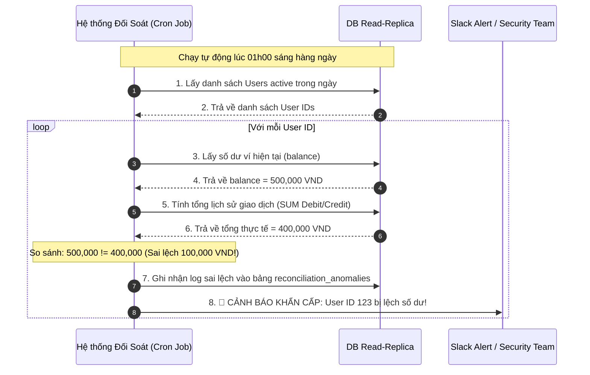

# User báo số dư/order/status hiển thị sai. Bạn điều tra thế nào?

## ⚡ Tóm tắt ngắn (30s)
* **Bản chất**: Lỗi sai lệch dữ liệu (Data Discrepancy) như số dư ví sai, trạng thái đơn hàng hiển thị lệch, hoặc thông tin đơn hàng bị tráo đổi là những lỗi cực kỳ nghiêm trọng ảnh hưởng trực tiếp đến tài chính và uy tín hệ thống. Quy trình điều tra của Senior Engineer tuân thủ nguyên tắc **"Không đoán mò, truy vết thực tế từ ngoài vào trong" (Triage from Edge to Core)**, đi qua 5 điểm chạm: Frontend Local State → CDN/Gateway Cache → Redis/Application Cache → Database State → Transaction Ledger (Sổ cái giao dịch).
* **Thảm họa thực chiến được giải quyết**:
  1. **Cạm bẫy "Sửa DB mù" (Blind DB Update)**: Thấy số dư user hiển thị sai, dev vội vã chạy lệnh SQL `UPDATE users SET balance = balance + 100000` trực tiếp trên DB production để xoa dịu khách hàng mà không tìm nguyên nhân gốc rễ. Vài ngày sau, lỗi lặp lại và DB bị mất đối soát hoàn toàn, không thể kiểm toán tài chính (Auditing).
  2. **Đổ lỗi chéo giữa các team (Finger-pointing)**: Team API đổ lỗi cho Frontend hiển thị sai, Frontend đổ lỗi cho DB, DB đổ lỗi cho Network do không có cơ chế Trace ID đồng bộ.
* **Quyết định Senior**:
  1. **Đóng băng & Bảo toàn chứng cứ**: Chụp log API, lưu giữ payload, ghi nhận `Trace ID`, `User ID`, `Order ID`. Khóa tạm thời tài khoản hoặc tạm ngưng giao dịch của user đó nếu nghi ngờ có lỗi rò rỉ tiền tệ (Double-spending/Exploit).
  2. **Thực hiện Đối soát Sổ cái (Ledger Reconciliation)**: Không bao giờ tin vào trường `balance` lưu tĩnh trong bảng `users`. Senior sẽ tính toán lại số dư bằng cách cộng dồn toàn bộ lịch sử giao dịch (Debit/Credit Ledger) của user đó từ lúc khởi tạo xem có khớp với số dư hiện tại không.
  3. **Truy vết Event Log / Audit Trail**: Quét toàn bộ log lịch sử chỉnh sửa (Audit Log) để xem có background job, cron job hoặc kỹ sư nào đã can thiệp sửa đổi trực tiếp dữ liệu hay không.

---

## 🔍 Chi tiết bản chất thực chiến: Quy trình điều tra 5 Điểm chạm (Edge-to-Core Triage)

Khi nhận ticket báo lỗi hiển thị sai lệch dữ liệu của một User cụ thể, ta tiến hành kiểm tra theo quy trình 5 bước sau:

```
[User Báo Lỗi: Số Dư/Trạng Thái Sai 🚨]
                   │
                   ▼
  [Bước 1: KIỂM TRA FRONTEND & EDGE CACHE]
    ├── Xóa cache trình duyệt / Re-login.
    └── Kiểm tra cấu hình CDN (Có cache nhầm Header/HTTP 200)?
                   │
                   ▼
  [Bước 2: KIỂM TRA APPLICATION CACHE (REDIS)]
    ├── Lấy dữ liệu từ Redis: GET user:balance:123
    └── So sánh với Database. Nếu lệch -> Lỗi Stale Cache.
                   │
                   ▼
  [Bước 3: KIỂM TRA DATABASE STATE]
    └── SELECT balance, status FROM users WHERE id = 123;
                   │
                   ▼
  [Bước 4: ĐỐI SOÁT SỔ CÁI GIAO DỊCH (LEDGER RECONCILIATION)]
    └── Cộng dồn SUM(amount) FROM transactions WHERE user_id = 123;
                   │
                   ▼
  [Bước 5: QUÉT AUDIT LOG & SYSTEM EVENT]
    └── Tìm Trace ID trong ElasticSearch/Splunk xem API nào đã ghi đè dữ liệu.
```

### Bước 1: Kiểm tra Frontend & Edge Cache (CDN/API Gateway)
* Yêu cầu user chụp màn hình kèm URL.
* Xác minh xem API Gateway có cấu hình nhầm Cache-Control làm cache kết quả API chứa thông tin cá nhân của User A và hiển thị cho User B hay không (cực kỳ nguy hiểm).

### Bước 2: Kiểm tra Tầng Cache Ứng dụng (Redis Stale Cache)
* Truy cập Redis, lấy trực tiếp key của user: `GET user:profile:123` hoặc `HGETALL user:balance:123`.
* So sánh giá trị này với giá trị thực tế trong Database. Nếu DB đúng mà Redis sai, nguyên nhân chắc chắn là do **Stale Cache / Cache Invalidation Failure** (App cập nhật DB nhưng quên xóa cache Redis, hoặc event xóa cache bị mất/slow).

### Bước 3: Kiểm tra Database State (Giá trị Tĩnh)
* Chạy query SELECT trực tiếp trên Database Read-Replica để xem giá trị lưu tĩnh.
* Nếu giá trị tĩnh trong DB thực sự sai lệch (ví dụ: status của Order là `PENDING` nhưng DB lại lưu `CANCELLED` mà không rõ lý do). Chuyển sang Bước 4.

### Bước 4: Đối soát Sổ cái (Ledger Reconciliation)
* Trong thiết kế tài chính chuẩn, số dư ví không được xem là chân lý tuyệt đối. Chân lý là **Sổ cái Giao dịch (Transaction Ledger)**.
* Ta chạy câu lệnh đối soát: Tính tổng tiền nạp (Credit/Deposit) trừ đi tổng tiền tiêu (Debit/Withdraw).
* Nếu **Tổng sổ cái = Số dư ví hiện tại**: DB hoàn toàn nhất quán. Lỗi hiển thị sai có thể do tầng logic hiển thị (Frontend parse sai định dạng).
* Nếu **Tổng sổ cái != Số dư ví hiện tại**: DB đã bị vỡ tính toàn vẹn (Data Inconsistency). Chuyển sang Bước 5 để tìm thủ phạm sửa đổi dữ liệu.

### Bước 5: Truy vết qua Audit Log & Event Trace
* Quét log ElasticSearch/Kibana theo `User ID` và lọc các hành động ghi (`POST`, `PUT`, `PATCH`).
* Tìm kiếm các câu lệnh SQL được thực thi bởi background jobs, cron jobs hoặc lệnh chạy tay của DBA thông qua DB Audit Log.

---

## 🎨 Sơ đồ trực quan: Luồng đối soát dòng tiền tự động (Auto-Reconciliation)

Sơ đồ dưới đây mô tả cơ chế đối soát tự động hàng đêm để phát hiện sớm các tài khoản bị sai lệch số dư trên Production trước khi người dùng kịp phát hiện:



---

## 💻 Code thực chiến: Query SQL Đối soát Ví tài chính & Script Khôi phục an toàn

Dưới đây là thiết kế DB Ledger chuẩn và query SQL đối soát dòng tiền của một User cụ thể để tìm ra số dư thực tế.

### 1. Schema Database Ví Tài Chính Chuẩn (Double-Entry Bookkeeping)

```sql
-- Bảng chứa số dư ví hiển thị (Được cập nhật thường xuyên)
CREATE TABLE user_wallets (
    user_id BIGINT PRIMARY KEY,
    balance DECIMAL(18, 4) NOT NULL DEFAULT 0.0000,
    updated_at TIMESTAMP NOT NULL DEFAULT CURRENT_TIMESTAMP
);

-- Bảng sổ cái giao dịch (Bất biến - Chỉ chèn chèn mới, KHÔNG BAO GIỜ UPDATE/DELETE)
CREATE TABLE wallet_ledger (
    id BIGINT AUTO_INCREMENT PRIMARY KEY,
    user_id BIGINT NOT NULL,
    amount DECIMAL(18, 4) NOT NULL, -- Số tiền giao dịch (Dương: Nạp tiền, Âm: Rút/Tiêu tiền)
    type VARCHAR(50) NOT NULL, -- DEPOSIT, WITHDRAW, PAYMENT, REFUND
    reference_id VARCHAR(100) NOT NULL, -- Mã giao dịch tham chiếu (Order ID, Payment ID)
    created_at TIMESTAMP NOT NULL DEFAULT CURRENT_TIMESTAMP,
    KEY idx_user_created (user_id, created_at)
);
```

### 2. Query SQL Đối soát dòng tiền của User

```sql
-- Query tìm ra sự sai lệch giữa Số dư tĩnh và Tổng lịch sử Sổ cái của User '123'
SELECT 
    w.user_id,
    w.balance AS static_balance,
    COALESCE(SUM(l.amount), 0.0000) AS ledger_calculated_balance,
    (w.balance - COALESCE(SUM(l.amount), 0.0000)) AS discrepancy_amount
FROM 
    user_wallets w
LEFT JOIN 
    wallet_ledger l ON w.user_id = l.user_id
WHERE 
    w.user_id = 123
GROUP BY 
    w.user_id, w.balance;
```
*Kết quả mẫu nếu có sai lệch:*
| user_id | static_balance | ledger_calculated_balance | discrepancy_amount |
| :--- | :--- | :--- | :--- |
| 123 | 500000.0000 | 400000.0000 | **100000.0000** |

### 3. Script Cập Nhật Số Dư An Toàn Bằng SQL (Không ghi đè mù)
Nếu phát hiện số dư tĩnh bị lệch và bắt buộc phải khôi phục về giá trị đúng theo sổ cái, tuyệt đối không set cứng giá trị mà phải dùng kỹ thuật **Optimistic Lock** kết hợp so sánh:

```sql
-- Đúng: Cập nhật số dư an toàn dựa trên tính toán đối soát và so sánh chống ghi đè chéo (Dirty Write)
UPDATE user_wallets 
SET balance = (
    SELECT COALESCE(SUM(amount), 0.0000) 
    FROM wallet_ledger 
    WHERE user_id = 123
)
WHERE user_id = 123 
  AND balance = 500000.0000; -- Chỉ cập nhật nếu số dư tĩnh cũ vẫn chưa bị thay đổi bởi luồng khác
```

---

## 📊 Bảng so sánh 3 Nguyên nhân phổ biến gây hiển thị sai lệch Dữ liệu

| Tiêu chí | Nguyên nhân 1: Stale Cache (Redis lỗi) | Nguyên nhân 2: Race Condition (Double-Spending) | Nguyên nhân 3: CDN / LB Cache nhầm |
| :--- | :--- | :--- | :--- |
| **Bản chất lỗi** | DB lưu giá trị mới (v2) nhưng Redis vẫn giữ giá trị cũ (v1). | 2 requests song song cùng đọc số dư cũ, cùng thực hiện ghi dẫn đến ghi đè dữ liệu. | CDN cache nhầm HTTP response của User A và trả về cho User B khi User B gọi API. |
| **Phạm vi ảnh hưởng** | Nhỏ (Chỉ ảnh hưởng hiển thị của user đó, F5 hoặc xóa cache Redis là hết). | **Cực kỳ nguy hiểm** (Gây mất mát tiền thật, làm hỏng tính toàn vẹn DB). | **Cực kỳ nguy hiểm** (Rò rỉ thông tin cá nhân của hàng ngàn user, vi phạm bảo mật). |
| **Dấu hiệu nhận biết** | SELECT DB thấy đúng, nhưng gọi API GET qua Postman thấy giá trị cũ. | Xem sổ cái giao dịch thấy 2 record giao dịch cùng tạo tại một mili-giây, số dư bị trừ 2 lần. | User B thấy tên, số dư của User A trên màn hình. F5 có thể đổi sang User C. |
| **Cách khắc phục** | Viết code Evict/Delete Redis key ngay trong DB transaction commit hook. | Sử dụng **Database Pessimistic Lock** (`SELECT ... FOR UPDATE`) hoặc **Redis Distributed Lock**. | Cấu hình Header `Cache-Control: no-store, private` cho toàn bộ các API chứa dữ liệu nhạy cảm. |

---

## ⚠️ Common Gotchas & Questions follow-up

### 1. Cạm bẫy "Double-Entry Bookkeeping bị bỏ quên (The Lazy Wallet Design Trap)"
* **Vấn đề**: Nhiều hệ thống ví điện tử thiết kế cẩu thả bằng cách chỉ tạo bảng `users` với cột `balance`. Khi user nạp tiền, app gọi `UPDATE users SET balance = balance + 10000`. Khi rút tiền gọi `UPDATE users SET balance = balance - 5000`. Khi DB bị mất điện đột ngột hoặc xảy ra lỗi logic làm cập nhật thất bại giữa chừng, ta hoàn toàn **không có bất kỳ bằng chứng lịch sử nào** để chứng minh vì sao số dư của user bị thay đổi. Việc khôi phục dữ liệu đúng là bất khả thi.
* **Giải pháp khắc phục**: Bắt buộc áp dụng nguyên lý kế toán kép (Double-Entry Bookkeeping). Số dư tĩnh ở bảng `user_wallets` chỉ là bộ đệm hiển thị (Cache). Mọi biến động số dư bắt buộc phải ghi nhận thành một dòng (record) bất biến trong bảng `wallet_ledger` trước. Số dư ví chỉ được phép thay đổi sau khi dòng sổ cái đã được ghi thành công.

### 2. Câu hỏi đào sâu từ interviewer
* **Interviewer: "Giả sử hệ thống microservices của chúng ta có 2 dịch vụ độc lập: Order Service (lưu trạng thái đơn hàng) và Payment Service (lưu trạng thái thanh toán). User báo trên UI là đơn hàng đã thanh toán tiền nhưng trạng thái đơn hàng vẫn là PENDING. Bạn điều tra như thế nào?"**
* **Trả lời**:
  * Đây là lỗi không nhất quán trạng thái do đứt gãy giao tiếp phân tán (Distributed Consistency Failure):
    1. **Kiểm tra Payment Service**: Tra cứu theo `Order ID` xem trạng thái giao dịch bên Payment đã thực sự chuyển sang `SUCCESS` chưa. Nếu chưa thành công -> Phía đối tác chưa charge tiền, trạng thái `PENDING` ở Order Service là đúng.
    2. **Kiểm tra Event Queue (Message Broker)**: Nếu Payment đã `SUCCESS` nhưng Order vẫn `PENDING`, có nghĩa là event thông báo `PAYMENT_COMPLETED` chưa sang được Order Service.
       * *Truy vết*: Quét log Kafka xem message `PAYMENT_COMPLETED` có được phát ra thành công không? Có bị kẹt ở Dead Letter Queue (DLQ) của Order Service do lỗi parse schema không?
    3. **Kiểm tra API Webhook**: Nếu giao tiếp qua Webhook, kiểm tra log API Gateway xem Payment Service gọi webhook sang Order Service có bị lỗi timeout (504) hoặc lỗi phân quyền (401) làm request không thực hiện được hay không.
