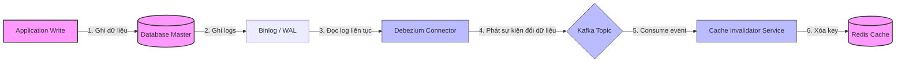

# Dữ liệu trong cache sai nhưng DB đúng. Bạn xử lý thế nào?

## ⚡ Tóm tắt ngắn (30s)
* **Bản chất**: Hiện tượng dữ liệu trong Cache (Redis/Memcached) bị cũ hoặc sai lệch so với Database (Source of Truth) là lỗi **Không nhất quán bộ đệm (Cache Inconsistency)**. Lỗi này thường do sự đứt gãy của mô hình ghi song song (Dual-write) hoặc các điều kiện chạy đua (Race Conditions) giữa các tiến trình đọc/ghi song song.
* **Thảm họa thực chiến được giải quyết**:
  1. **Cơ chế đọc-ghi đồng thời phá hủy Cache (The Reader-Writer Race Condition)**: Kỹ sư viết code cập nhật dữ liệu: (1) Cập nhật DB → (2) Xóa key Redis. Khi lượng request lớn, một luồng đọc chạy song song thấy Redis trống, nó truy cập DB để lấy dữ liệu cũ (vì DB transaction của luồng ghi chưa commit xong), rồi nạp lại dữ liệu cũ này vào Redis. Kết quả là Redis bị stale vô hạn cho đến khi hết TTL.
  2. **Cạm bẫy cập nhật Cache trực tiếp (Cache Update Trap)**: Thay vì xóa key (Evict) khi sửa dữ liệu, dev lại viết lệnh `redis.set(key, newValue)`. Khi có 2 request cập nhật ghi song song, do độ trễ mạng, Request 2 cập nhật DB trước nhưng ghi Redis sau, ghi đè giá trị cũ lên Redis, làm lệch dữ liệu vĩnh viễn với DB.
* **Quyết định Senior**:
  1. **Ưu tiên Xóa (Evict) thay vì Cập nhật (Update)**: Khi dữ liệu thay đổi, luôn thực hiện xóa key khỏi Redis (`DEL key`). Không bao giờ thực hiện cập nhật đè (`SET key`) trên các luồng nghiệp vụ ghi trực tiếp.
  2. **Chỉ xóa Cache sau khi DB Transaction COMMIT thành công**: Sử dụng cơ chế Transaction Synchronization (như `@TransactionalEventListener` trong Spring) để đảm bảo key Redis chỉ bị xóa sau khi dữ liệu đã ghi xuống DB vật lý hoàn tất.
  3. **CDC (Change Data Capture) cho hệ thống phức tạp**: Sử dụng Debezium để lắng nghe DB Binlog/WAL, phát event qua Kafka để xóa cache bất đồng bộ, loại bỏ hoàn toàn rủi ro lỗi Dual-write từ ứng dụng.

---

## 🔍 Chi tiết bản chất thực chiến: Tại sao xảy ra & Quy trình xử lý

### 1. Nguyên nhân cốt lõi gây lệch Cache và DB

#### Kịch bản 1: Race Condition kinh điển (Cập nhật DB -> Xóa Cache)
```
Luồng Ghi (Writer)                                Luồng Đọc (Reader)
┌─────────────────────────────────┐               ┌──────────────────────────────────┐
│ 1. Cập nhật DB (Chưa commit)    │               │                                  │
│ 2. Xóa key Redis (Thành công)   │               │                                  │
│                                 │               │ 3. Đọc Redis -> Cache Miss ❌     │
│                                 │               │ 4. Đọc DB -> Lấy dữ liệu CŨ ⚠️    │
│                                 │               │    (Do Writer chưa commit)       │
│                                 │               │ 5. Nạp lại dữ liệu CŨ vào Redis  │
│ 6. Commit DB transaction ✔      │               │                                  │
└─────────────────────────────────┘               └──────────────────────────────────┘
=> KẾT QUẢ: DB có dữ liệu MỚI, nhưng Redis bị kẹt dữ liệu CŨ vĩnh viễn.
```

#### Kịch bản 2: Lỗi Dual-write (Cập nhật DB thành công, Xóa Cache thất bại)
Ứng dụng gọi DB thành công, nhưng khi gọi sang Redis để xóa key thì Redis bị quá tải (CPU 100%), timeout hoặc mạng bị chập chờn (Network Partition). Ứng dụng ném ra ngoại lệ hoặc nuốt exception, làm key cũ tồn tại mãi mãi trong cache.

---

### 2. Quy trình xử lý sự cố thực chiến (Incident Playbook)

Khi phát hiện dữ liệu hiển thị sai do lệch Cache trên Production, ta tuân thủ quy trình 3 bước sau:

#### Bước 1: Tác động nhanh (Quick Mitigate)
* Thực hiện xóa thủ công key lỗi trên Redis thông qua CLI hoặc công cụ quản trị: `DEL user:profile:123`.
* Đối với lỗi diện rộng (ví dụ: cấu hình sai làm toàn bộ cache bị stale), **không flush toàn bộ Redis** (`FLUSHALL` là cấm kỵ trên Production vì sẽ gây ra **Cache Avalanche** sập DB). Ta thực hiện chạy script xóa key theo pattern một cách từ từ hoặc giảm TTL của các key đó xuống.

#### Bước 2: Thiết lập cơ chế Transactional Cache Eviction (Sửa code tầng App)
* Đảm bảo việc xóa cache không nằm chung trong luồng xử lý Transaction của Database. Phải chuyển sang cơ chế bất đồng bộ hoặc lắng nghe sự kiện Commit thành công mới kích hoạt xóa.

#### Bước 3: Triển khai Kỹ thuật Cache Double-Delete (Xóa đúp) nếu cần thiết
* Nếu hệ thống không thể dùng CDC và có traffic cực cao, ta áp dụng kỹ thuật **Delay Double-Delete**:
  1. Xóa key Redis.
  2. Cập nhật DB.
  3. Chờ một khoảng thời gian ngắn (ví dụ: 500ms để đảm bảo các luồng đọc song song đã chạy xong).
  4. Xóa key Redis một lần nữa.

---

## 🎨 Sơ đồ trực quan: Đồng bộ Cache bất biến qua CDC (Change Data Capture)

Mô hình thiết kế tối ưu nhất của Senior để loại bỏ hoàn toàn lỗi lệch dữ liệu giữa DB và Cache:



---

## 💻 Code thực chiến: Sử dụng Spring `@TransactionalEventListener` xóa Cache an toàn

Để đảm bảo key Redis chỉ bị xóa sau khi Database Transaction đã commit hoàn toàn, ta sử dụng cơ chế Event Publisher của Spring Framework.

### 1. Tạo sự kiện thay đổi dữ liệu (Domain Event)

```java
package com.example.event;

import lombok.Getter;
import org.springframework.context.ApplicationEvent;

@Getter
public class UserUpdateEvent extends ApplicationEvent {
    private final Long userId;

    public UserUpdateEvent(Object source, Long userId) {
        super(source);
        this.userId = userId;
    }
}
```

### 2. Service cập nhật DB và phát sự kiện (Publisher)

```java
package com.example.service;

import com.example.entity.User;
import com.example.event.UserUpdateEvent;
import com.example.repository.UserRepository;
import lombok.RequiredArgsConstructor;
import org.springframework.context.ApplicationEventPublisher;
import org.springframework.stereotype.Service;
import org.springframework.transaction.annotation.Transactional;

@Service
@RequiredArgsConstructor
public class UserService {

    private final UserRepository userRepository;
    private final ApplicationEventPublisher eventPublisher;

    @Transactional
    public void updateUserProfile(Long userId, String newName) {
        User user = userRepository.findById(userId)
                .orElseThrow(() -> new IllegalArgumentException("User not found"));
        
        user.setName(newName);
        userRepository.save(user); // Cập nhật xuống DB (nhưng chưa commit thực sự)

        // Phát event cập nhật. Sự kiện này sẽ bị trì hoãn cho đến khi transaction COMMIT thành công.
        eventPublisher.publishEvent(new UserUpdateEvent(this, userId));
    }
}
```

### 3. Bộ lắng nghe sự kiện xóa Cache (Listener)

```java
package com.example.listener;

import com.example.event.UserUpdateEvent;
import lombok.RequiredArgsConstructor;
import lombok.extern.slf4j.Slf4j;
import org.springframework.data.redis.core.StringRedisTemplate;
import org.springframework.stereotype.Component;
import org.springframework.transaction.event.TransactionPhase;
import org.springframework.transaction.event.TransactionalEventListener;

@Component
@Slf4j
@RequiredArgsConstructor
public class CacheInvalidationListener {

    private final StringRedisTemplate redisTemplate;

    // QUYẾT ĐỊNH SENIOR: Chỉ lắng nghe sự kiện sau khi transaction đã COMMIT thành công
    @TransactionalEventListener(phase = TransactionPhase.AFTER_COMMIT)
    public void handleUserUpdateEvent(UserUpdateEvent event) {
        String cacheKey = "user:profile:" + event.getUserId();
        log.info("Database transaction committed successfully. Invalidating cache key: {}", cacheKey);
        
        try {
            redisTemplate.delete(cacheKey);
            log.info("Successfully evicted cache key: {}", cacheKey);
        } catch (Exception e) {
            // Gotchas: Tránh làm sập luồng chính nếu Redis lỗi. Ta ghi log cảnh báo và gửi vào DLQ/Retry Queue.
            log.error("Failed to delete cache key {} due to Redis error. Sending to dead-letter queue.", cacheKey, e);
            sendToRetryQueue(cacheKey);
        }
    }

    private void sendToRetryQueue(String cacheKey) {
        // Thực hiện gửi key lỗi sang Kafka hoặc RabbitMQ để chạy lại job xóa cache sau 5 giây
        log.warn("Key {} has been pushed to reconciliation queue for delayed eviction.", cacheKey);
    }
}
```

---

## 📊 Bảng so sánh 3 Giải pháp đồng bộ hóa Cache & DB

| Tiêu chí | Giải pháp 1: Cache-Aside thường (Ghi DB + Xóa Cache liền) | Giải pháp 2: Delayed Double-Delete (Xóa đúp) | Giải pháp 3: Event-Driven CDC (Debezium + Kafka) |
| :--- | :--- | :--- | :--- |
| **Độ phức tạp** | **Rất thấp** (Dễ viết, dễ hiểu). | **Trung bình** (Phải tính toán thời gian delay hợp lý). | **Cao** (Cần setup hạ tầng Debezium, Kafka, Kafka Connect). |
| **Tính nhất quán dữ liệu** | **Thấp** (Rất dễ bị race condition khi lượng truy cập cao). | **Cao** (Giải quyết được 99% lỗi race condition tầng biên). | **Tuyệt đối** (Gần như 100% không lệch dữ liệu vì đi trực tiếp từ DB Log). |
| **Tác động đến Performance** | Không ảnh hưởng ghi. | Luồng ghi bị delay nhẹ do phải chờ bước xóa thứ 2. | Tách biệt hoàn toàn luồng ghi, luồng cập nhật cache chạy ngầm (Non-blocking). |
| **Use Case phù hợp** | Hệ thống traffic nhỏ, dữ liệu không quá nhạy cảm. | Hệ thống monolith, trung bình lớn, không có hạ tầng Kafka/CDC. | Hệ thống Microservices lớn, tài chính, e-commerce yêu cầu tính nhất quán cao. |

---

## ⚠️ Common Gotchas & Questions follow-up

### 1. Cạm bẫy "Cache Stampede / Thảm họa tuyết lở khi xóa key Hot"
* **Vấn đề nguy hiểm**: Khi bạn thực hiện xóa một key rất "hot" (ví dụ: thông tin khuyến mãi trang chủ có 50.000 requests/giây). Ngay tại mili-giây key bị xóa khỏi Redis, cả 50.000 requests đồng loạt thấy Cache Miss và cùng lúc phóng thẳng xuống Database để đọc dữ liệu nạp lại. Điều này ngay lập tức làm Database quá tải connection pool, CPU spike 100% và gây sập toàn bộ hệ thống.
* **Giải pháp khắc phục (Mutex Lock / SingleFlight)**: Thay vì để 50.000 luồng tự do xuống DB, ta sử dụng cơ chế khóa phân tán hoặc dùng thư viện (như `SingleFlight` trong Go hoặc đồng bộ hóa luồng trong Java) để chỉ cho phép **đúng 1 luồng duy nhất** xuống DB lấy dữ liệu và ghi lại vào Redis, các luồng khác xếp hàng chờ lấy từ Redis. Hoặc áp dụng chiến lược **Không bao giờ xóa cứng (Soft Expiration)**: key luôn tồn tại trong Redis kèm một field `expire_at` tượng trưng. Khi app đọc thấy quá hạn, nó tự chạy background thread đi cập nhật ngầm, các request vẫn đọc tạm value cũ.

### 2. Câu hỏi đào sâu từ interviewer
* **Interviewer: "Nếu DB commit thành công, nhưng ứng dụng bị sập nguồn (Crash/OOM) ngay trước khi Listener gọi lệnh xóa Redis. Dữ liệu trong Redis sẽ bị stale mãi mãi. Bạn giải quyết kịch bản góc này thế nào?"**
* **Trả lời**:
  * Đây là lỗi bất khả kháng của kiến trúc Dual-write khi không có cơ chế phân tán đồng thuận 2PC. Để giải quyết, ta có 2 phương án:
    1. **Thiết lập TTL ngắn**: Mọi key trong Redis bắt buộc phải cấu hình thời gian sống (TTL) cụ thể (ví dụ: 10 phút hoặc tối đa 1 tiếng). Dữ liệu lệch tối đa sau 10 phút sẽ tự động được làm tươi.
    2. **Chạy Job đối soát dữ liệu (Reconciliation Job)**: Thiết lập một cron job chạy định kỳ hàng giờ/hàng ngày quét qua các bản ghi được cập nhật gần đây trong DB, so sánh với Redis, nếu phát hiện lệch thì tự động đồng bộ lại (Self-healing).
    3. **Chuyển sang kiến trúc Event-Driven CDC**: Vì CDC đọc trực tiếp từ DB Binlog lưu trên ổ đĩa vật lý của Database, nên dù ứng dụng backend có crash, Debezium vẫn ghi nhớ offset và tiếp tục consume log để xóa Redis ngay sau khi backend khởi động lại.
