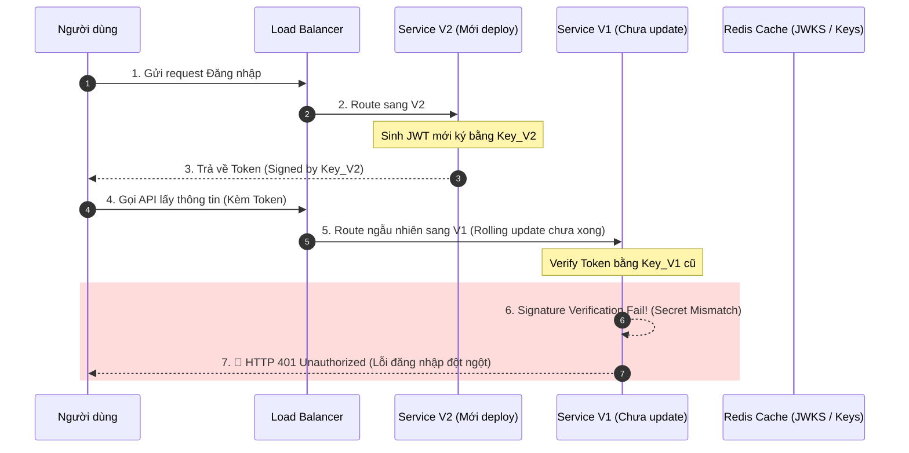

# User không login được sau deploy. Bạn debug thế nào?

## ⚡ Tóm tắt ngắn (30s)
* **Bản chất**: Lỗi đăng nhập sau deploy thường đến từ sự đứt gãy tính nhất quán của hệ thống ở 4 khía cạnh: **Thay đổi cấu trúc DB (Schema Migration)**, **Sai lệch khóa ký token (Secret/Signing Key Invalidation)**, **Stale Cache/Session Serialization mismatch**, hoặc **Clock Drift** giữa các server mới và cũ. Quy trình debug của Senior tuân thủ nguyên tắc **"Thu hẹp phễu lỗi" (Funnel Triage)**: tách biệt lỗi diện rộng (System-wide) và lỗi nhóm nhỏ (Isolated-user), tiếp đó là kiểm tra các dependency trung tâm.
* **Thảm họa thực chiến được giải quyết**:
  1. **Cạm bẫy "Blind Rollback"**: Lỗi login xảy ra, dev hoảng loạn rollback ngay lập tức nhưng DB schema đã thay đổi và không thể rollback ngược (Backward incompatible), gây crash ứng dụng và làm hỏng toàn bộ dữ liệu hiện hành.
  2. **Finger-pointing**: Web/Mobile App đổ lỗi cho Backend, Backend đổ lỗi cho Identity Provider (Auth0/Keycloak) vì thiếu một Trace ID xuyên suốt hệ thống.
* **Quyết định Senior**:
  1. **Phân vùng khẩn cấp (Symptom Isolation)**: Xác định xem 100% user bị lỗi (mất khóa Token/Secret, DB connection pool exhausted) hay chỉ một nhóm user (stale cache, token serialization mismatch do đổi DTO class structure).
  2. **Kiểm tra Health & Connectivity**: Quét tình trạng kết nối tới Database, Redis Session Store và Identity Provider.
  3. **Truy dấu JWKS / Secret Rotations**: Đảm bảo phiên bản code mới không sử dụng private key/secret mới mà chưa được đồng bộ sang các node đang chạy.

---

## 🔍 Chi tiết bản chất thực chiến: Quy trình Triage 5 bước (Funnel Triage Runbook)

Khi xảy ra sự cố người dùng không đăng nhập được ngay sau khi deploy, ta tiến hành thu hẹp phạm vi lỗi theo phễu sau:

```
[🚨 Sự Cố Đăng Nhập Sau Deploy]
                │
                ▼
  [Bước 1: PHÂN VÙNG TRIỆU CHỨNG (ISOLATION)]
    ├── Lỗi diện rộng (Tất cả user) -> Hệ thống trung tâm (Key, DB, Auth Provider).
    └── Lỗi cục bộ (Một số user) -> Stale Session, Serialization, hoặc CDN.
                │
                ▼
  [Bước 2: KIỂM TRA LOG HỆ THỐNG & TRACE ID]
    └── Tìm lỗi 401, 403, 500 kèm Stack Trace trên ElasticSearch/Kibana.
                │
                ▼
  [Bước 3: TRUY VẾT SIGNING KEY & TOKENS]
    └── Verify Signature của JWT. Có bị đổi Secret Key đột ngột ở bản mới?
                │
                ▼
  [Bước 4: ĐỐI SOÁT DATABASE MIGRATION]
    └── Cột mới có NOT NULL mà thiếu DEFAULT value? Bảng `users` bị lock?
                │
                ▼
  [Bước 5: KIỂM TRA SESSION SERIALIZATION]
    └── Bản mới đổi cấu trúc User Class làm lỗi Deserialization session cũ từ Redis.
```

### Bước 1: Phân vùng triệu chứng (Symptom Isolation)
* **Kịch bản A: Lỗi 100% (Hệ thống tê liệt)**: User nhận lỗi ngay khi click "Login" hoặc submit form. Nguyên nhân thường do Database Migration lỗi (làm khóa bảng `users`), cấu hình Environment Variable sai (sai URI Auth Service), hoặc JWT Secret Key bị gen mới ngẫu nhiên lúc khởi động (mất trạng thái bất biến).
* **Kịch bản B: Lỗi cục bộ (Mất phiên / Stale Session)**: Chỉ một số user bị lỗi. Có thể do họ đang giữ cookie cũ, session lưu trong Redis không thể deserialization do phiên bản mới đổi cấu trúc Object, hoặc do cân bằng tải (Load Balancer) trỏ nhầm user sang instance cũ đang chạy song song (Canary/Rolling update) có cấu hình khác biệt.

### Bước 2: Kiểm tra Log hệ thống qua Correlation ID / Trace ID
* Sử dụng Kibana/Grafana quét mã lỗi HTTP `401 Unauthorized` hoặc `500 Internal Server Error` tăng đột biến.
* Lấy một `Trace ID` cụ thể của một request thất bại và xem luồng đi:
  `API Gateway` ➔ `Auth Service` ➔ `User DB`.
* Tìm kiếm các từ khóa đặc trưng: `SignatureException`, `ExpiredJwtException`, `Invalid credentials`, `Connection timeout to DB`.

### Bước 3: Xác minh Signing Key & Thuật toán mã hóa JWT
* Nếu hệ thống dùng JWT và deploy bản mới có rotate/change Secret Key cấu hình ở file YAML (hoặc Vault/AWS Secrets Manager) nhưng quên cập nhật cho các replica cũ đang chạy song song, các API Gateway/Service cũ sẽ reject token do service mới sinh ra.
* Nếu dùng cơ chế JWKS (Json Web Key Set), kiểm tra xem endpoint public key `/certs` có trả về đúng kid (Key ID) mới hay chưa.

### Bước 4: Kiểm tra Database Schema & Version Compatibility
* Rất nhiều vụ deploy lỗi do chạy Liquibase/Flyway thêm cột `last_login_at` kiểu `TIMESTAMP NOT NULL` nhưng không có giá trị mặc định (`DEFAULT`), khiến câu lệnh INSERT user mới hoặc UPDATE trạng thái đăng nhập bị crash do vi phạm constraint DB.
* Kiểm tra xem có transaction nào chạy ngầm giữ lock bảng `users` quá lâu làm connection pool bị exhausted.

### Bước 5: Lỗi Deserialization Session cũ (Redis Store)
* Nếu lưu Session trong Redis bằng Spring Session, khi deploy bản mới có thay đổi cấu trúc class `UserSession` (thêm/bớt trường, đổi kiểu dữ liệu) mà không khai báo `serialVersionUID` cố định, JVM mới sẽ ném ngoại lệ `InvalidClassException` khi đọc session cũ của user. Hậu quả là user bị đá văng (kick-out) hoặc lỗi 500 khi gọi API.

---

## 🎨 Sơ đồ trực quan: Luồng xử lý sự cố xác thực trong Rolling Update

Sơ đồ dưới đây minh họa kịch bản lỗi do lệch khóa ký (Secret Key mismatch) giữa phiên bản ứng dụng cũ (V1) và mới (V2) khi chạy Rolling Update:



---

## 💻 Code thực chiến: Cấu hình an toàn cho JWT Signing Key & Session Serialization

Dưới đây là cách triển khai Java Spring Boot chuẩn để phòng tránh và cô lập lỗi xác thực khi deploy bản mới.

### 1. Chỉ định `serialVersionUID` cố định cho Class Session
Tránh thảm họa `InvalidClassException` khi deserialize session cũ lưu trong Redis sau khi deploy code mới.

```java
package com.example.auth.dto;

import java.io.Serializable;

public class UserSession implements Serializable {
    // Luôn khai báo serialVersionUID cố định!
    private static final long serialVersionUID = 20260523L; 

    private Long userId;
    private String username;
    private String role;
    // Ngay cả khi thêm trường mới ở đây, việc deserialize vẫn thành công mà không gây crash
    private String email; 

    // Getters, Setters, Constructor
}
```

### 2. Cấu hình JWT Decoder với Clock Skew Tolerant & Public Key Provider (JWKS)
Đảm bảo hệ thống chịu được độ lệch thời gian (Clock Drift) lên tới 60 giây và tự động tải lại Key từ JWKS Server thay vì lưu cứng.

```java
package com.example.auth.config;

import org.springframework.context.annotation.Bean;
import org.springframework.context.annotation.Configuration;
import org.springframework.security.oauth2.jwt.JwtDecoder;
import org.springframework.security.oauth2.jwt.NimbusJwtDecoder;
import java.time.Duration;

@Configuration
public class SecurityConfig {

    @Bean
    public JwtDecoder jwtDecoder() {
        // Lấy public keys động từ JWKS endpoint giúp rotate key không downtime
        String jwkSetUri = "https://identity.company.com/.well-known/jwks.json";
        NimbusJwtDecoder jwtDecoder = NimbusJwtDecoder.withJwkSetUri(jwkSetUri).build();

        // Cấu hình cho phép lệch thời gian (Clock Skew) 60s để tránh lỗi token hết hạn do NTP lệch
        jwtDecoder.setJwtValidator(token -> {
            // Tích hợp logic validation tùy chỉnh ở đây
            return org.springframework.security.oauth2.jwt.JwtValidators
                    .createDefaultWithIssuer("https://identity.company.com")
                    .validate(token);
        });

        return jwtDecoder;
    }
}
```

---

## 📊 Bảng so sánh các nguyên nhân lỗi login phổ biến sau deploy

| Tiêu chí | Lỗi 1: Lệch khóa ký JWT (Secret Mismatch) | Lỗi 2: Lỗi DB Schema Constraints | Lỗi 3: Serialization Mismatch |
| :--- | :--- | :--- | :--- |
| **Triệu chứng** | 100% User bị reject Token (lỗi 401) hoặc lỗi xen kẽ trong Rolling Update. | Đăng ký mới hoặc cập nhật trạng thái login trả về lỗi 500. | User cũ bị logout, gọi API báo lỗi 500 do Deserialization. |
| **Phạm vi** | Toàn bộ hệ thống (System-wide). | Toàn bộ hệ thống hoặc nhóm hành động cụ thể. | Chỉ ảnh hưởng user đang active giữ Session cũ từ bản cũ. |
| **Nguyên nhân gốc** | Đổi Secret Key cấu hình nhưng không đồng bộ, hoặc generate Random Key lúc khởi động. | Chạy migration SQL thêm cột `NOT NULL` mà thiếu giá trị mặc định (`DEFAULT`). | Đổi cấu trúc class DTO trong Session mà không khai báo `serialVersionUID`. |
| **Khắc phục khẩn cấp** | Khôi phục lại Secret Key cũ. | Thực hiện rollback schema/chạy SQL bổ sung DEFAULT value cho cột mới. | Xóa sạch session cache trong Redis (`FLUSHDB` hoặc xóa key session). |

---

## ⚠️ Common Gotchas & Questions follow-up

### 1. Cạm bẫy "Random Secret Generator" lúc khởi chạy
* **Vấn đề**: Nhiều dev cấu hình JWT Secret bằng cách sinh ngẫu nhiên chuỗi byte khi ứng dụng khởi tạo:
  `Key key = Keys.secretKeyFor(SignatureAlgorithm.HS256);`
  Mỗi lần restart hoặc scale-up pod mới trên Kubernetes, mỗi instance ứng dụng sẽ sở hữu một Key hoàn toàn khác nhau. Kết quả là request của user trỏ sang node 1 thì verify thành công, trỏ sang node 2 thì verify thất bại (lỗi đăng nhập chập chờn).
* **Giải pháp khắc phục**: Tuyệt đối không sinh Key ngẫu nhiên khi Runtime. Phải nạp Key từ biến môi trường cố định (Environment Variable), Vault, Secrets Manager, hoặc triển khai máy chủ JWKS tập trung.

### 2. Câu hỏi đào sâu từ interviewer
* **Interviewer: "Nếu chúng ta chạy Rolling Update trên Kubernetes (deploy từng pod một), làm sao để tránh việc các pod cũ và pod mới từ chối token của nhau trong suốt thời gian triển khai dài 10 phút?"**
* **Trả lời**:
  * Để đảm bảo không gián đoạn xác thực trong quá trình Rolling Update, ta phải áp dụng cơ chế **Active-Active Key Rotation (Hỗ trợ nhiều Key đồng thời)**:
    1. **Key Cũ (Key_A) và Key Mới (Key_B)** phải cùng tồn tại trong cấu hình của cả bản cũ và mới.
    2. Cấu hình dịch vụ Identity luôn dùng **Key Mới (Key_B)** để ký các token mới sinh ra.
    3. Các dịch vụ Gateway/Resource Server khi nhận token sẽ chấp nhận cả hai chữ ký từ **Key_A** và **Key_B**.
    4. Sau khi quá trình Rolling Update hoàn thành 100% (tất cả các node đã lên phiên bản mới) và tất cả session/token cũ đã hết hạn, ta mới thực hiện gỡ bỏ hoàn toàn **Key_A** ra khỏi cấu hình ở đợt deploy tiếp theo.
