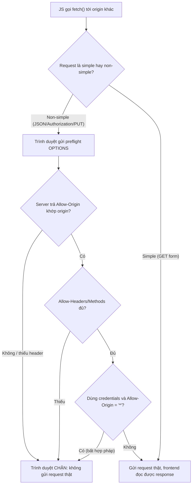

# CORS config sai gây lỗi frontend. Bạn debug ra sao?

## ⚡ Tóm tắt ngắn (30s)
* **Bản chất**: CORS (Cross-Origin Resource Sharing) là cơ chế **do trình duyệt thực thi** để kiểm soát việc JavaScript ở origin này gọi API ở origin khác. Lỗi CORS thực ra là *trình duyệt chặn response*, không phải server từ chối — server thường vẫn xử lý request bình thường. Senior debug bằng cách đọc đúng tín hiệu: phân biệt **preflight (OPTIONS)** thất bại với **request thật** thất bại, kiểm tra header `Access-Control-Allow-*`, và phát hiện các bẫy cấu hình (header trùng lặp do nhiều tầng, `*` + credentials).
* **Thảm họa thực chiến được giải quyết**:
  1. **`*` + credentials = combo bất hợp pháp**: Dev set `Access-Control-Allow-Origin: *` *và* `Access-Control-Allow-Credentials: true`. Trình duyệt cấm tổ hợp này theo spec → frontend gửi cookie/token bị chặn dù server "có vẻ" đã mở CORS.
  2. **Header trùng lặp do nhiều tầng**: Cả Spring `@CrossOrigin` *và* Nginx *và* API Gateway cùng thêm `Access-Control-Allow-Origin` → response có 2 header → trình duyệt báo lỗi "multiple values".
* **Quyết định Senior**:
  1. **Đọc Network tab trước, sửa code sau**: Xem chính xác preflight OPTIONS trả về header gì, thiếu cái nào.
  2. **Cấu hình CORS ở MỘT tầng duy nhất**: Tránh chồng header.
  3. **Liệt kê origin tường minh, không reflect mù**: Không echo lại `Origin` của request — đó là lỗ hổng bảo mật.

---

## 🔍 Chi tiết bản chất thực chiến: Hiểu preflight để debug đúng

### Same-Origin Policy & vai trò của CORS
* Trình duyệt mặc định chặn JS đọc response từ origin khác (khác scheme/host/port). CORS là cách server *cho phép có chọn lọc* việc này qua các response header. **Điểm mấu chốt**: CORS là rào của *trình duyệt* để bảo vệ *người dùng*, KHÔNG phải lớp bảo mật cho *server*. `curl`/Postman/server-to-server bỏ qua CORS hoàn toàn.

### Preflight (OPTIONS) — nơi 90% lỗi xảy ra
* Với request "non-simple" (có header `Authorization`, `Content-Type: application/json`, method `PUT/DELETE`...), trình duyệt gửi trước một request **OPTIONS** (preflight) để hỏi server "tôi được phép gọi không?". Server phải trả về:
  * `Access-Control-Allow-Origin`: origin được phép (khớp chính xác, hoặc `*`).
  * `Access-Control-Allow-Methods`: ví dụ `GET, POST, PUT, DELETE`.
  * `Access-Control-Allow-Headers`: phải liệt kê các header custom client gửi (ví dụ `Authorization, Content-Type`).
  * `Access-Control-Allow-Credentials: true` *nếu* dùng cookie/credential — và khi đó `Allow-Origin` **không được là `*`**, phải là origin cụ thể.
* Nếu preflight thất bại, request thật *không bao giờ được gửi* — đây là lý do bạn thấy lỗi CORS mà server log không có request POST nào.

### Quy trình debug 4 bước
1. **Mở DevTools → Network**: Tìm request OPTIONS (preflight). Status của nó? Header response có đủ `Allow-Origin/Methods/Headers` không?
2. **Đọc thông điệp lỗi console chính xác**: Trình duyệt nói rất rõ — "No 'Access-Control-Allow-Origin' header", "header X is not allowed by Access-Control-Allow-Headers", "credentials mode... but Allow-Origin is '*'". Mỗi câu chỉ đúng nguyên nhân.
3. **Kiểm tra trùng header**: Response có *hai* `Access-Control-Allow-Origin`? → có nhiều tầng cùng cấu hình CORS.
4. **Kiểm tra OPTIONS có bị chặn bởi security**: Nếu preflight trả `401`, thường do filter security yêu cầu auth cho cả OPTIONS — phải `permitAll` cho preflight.

---

## 🎨 Sơ đồ trực quan: Luồng preflight CORS và điểm gãy



---

## 💻 Code thực chiến: BAD vs GOOD

### ❌ BAD: Wildcard + credentials, cấu hình nhiều tầng
```java
@Configuration
public class CorsConfig implements WebMvcConfigurer {
    @Override
    public void addCorsMappings(CorsRegistry registry) {
        registry.addMapping("/**")
            .allowedOrigins("*")            // ❌ '*' không dùng được với credentials
            .allowCredentials(true)         // ❌ Tổ hợp bị trình duyệt cấm theo spec
            .allowedMethods("*");
        // ❌ Đồng thời Nginx cũng add header CORS -> trùng "multiple values"
    }
}
```

### ✅ GOOD: Origin tường minh, một tầng duy nhất, preflight permitAll
```java
@Configuration
public class CorsConfig {
    @Bean
    public CorsConfigurationSource corsConfigurationSource() {
        CorsConfiguration cfg = new CorsConfiguration();
        // ✅ Liệt kê origin tường minh (đọc từ config theo môi trường), KHÔNG '*'
        cfg.setAllowedOrigins(List.of("https://app.example.com",
                                      "https://admin.example.com"));
        cfg.setAllowedMethods(List.of("GET", "POST", "PUT", "DELETE", "OPTIONS"));
        cfg.setAllowedHeaders(List.of("Authorization", "Content-Type"));
        cfg.setAllowCredentials(true);   // ✅ Hợp lệ vì Allow-Origin là origin cụ thể
        cfg.setMaxAge(3600L);            // cache preflight 1h, giảm số OPTIONS

        UrlBasedCorsConfigurationSource src = new UrlBasedCorsConfigurationSource();
        src.registerCorsConfiguration("/**", cfg);
        return src;
    }
}

@Bean
SecurityFilterChain filterChain(HttpSecurity http) throws Exception {
    http
      // ✅ Bật CORS trong security filter, dùng đúng 1 nguồn cấu hình
      .cors(Customizer.withDefaults())
      .authorizeHttpRequests(auth -> auth
        // ✅ preflight OPTIONS phải permitAll, nếu không sẽ trả 401
        .requestMatchers(HttpMethod.OPTIONS, "/**").permitAll()
        .anyRequest().authenticated());
    return http.build();
}
```

---

## 📊 Bảng so sánh: Triệu chứng lỗi CORS và nguyên nhân

| Thông điệp lỗi trình duyệt | Nguyên nhân gốc | Cách sửa |
| :--- | :--- | :--- |
| "No 'Access-Control-Allow-Origin' header" | Server không trả header / origin không khớp allowlist | Thêm origin vào `allowedOrigins` |
| "header ... is not allowed by Access-Control-Allow-Headers" | Client gửi header custom chưa khai báo | Thêm header vào `allowedHeaders` |
| "credentials mode is 'include' but Allow-Origin is '*'" | Dùng `*` cùng credentials | Đặt origin cụ thể thay cho `*` |
| "multiple values ... but only one is allowed" | Nhiều tầng (Spring + Nginx) cùng add header | Cấu hình CORS ở đúng 1 tầng |
| Preflight OPTIONS trả 401 | Security chặn cả OPTIONS | `permitAll` cho method OPTIONS |

---

## ⚠️ Common Gotchas & Questions follow-up

### 1. Cạm bẫy "CORS là bảo mật" và reflect Origin mù
* **Hiểu lầm nguy hiểm**: Nhiều dev tưởng CORS bảo vệ API. Sai. CORS chỉ ngăn *JavaScript trình duyệt* của origin khác *đọc* response. Nó **không** ngăn được request từ `curl`, server khác, hay công cụ tấn công. Authorization (token, session) mới là lớp bảo mật thật.
* **Lỗ hổng reflect Origin**: Để "cho nhanh", một số dev đọc header `Origin` của request rồi echo y nguyên vào `Access-Control-Allow-Origin` kèm `Allow-Credentials: true`. Điều này biến CORS thành "cho phép mọi origin có credentials" — bất kỳ website độc hại nào cũng gọi được API kèm cookie của nạn nhân. Phải dùng **allowlist tĩnh**, không reflect.

### 2. Câu hỏi đào sâu từ interviewer
* **Interviewer: "Frontend gọi API qua cookie session và bị lỗi CORS dù bạn đã thêm đúng origin. Còn nguyên nhân nào bạn kiểm tra?"**
* **Trả lời**:
  1. **Cookie cross-site cần `SameSite=None; Secure`**: Nếu frontend và API khác site, cookie session phải đặt `SameSite=None` và `Secure` (chỉ HTTPS), nếu không trình duyệt sẽ không gửi cookie kèm request cross-site dù CORS đã đúng.
  2. **`allowCredentials(true)` ở cả hai phía**: Server set `Access-Control-Allow-Credentials: true` *và* client `fetch(..., { credentials: 'include' })`.
  3. **Kiểm tra tầng chắn trước app**: CDN/WAF/Load balancer có thể nuốt hoặc viết đè header CORS, hoặc cache response OPTIONS sai. Test trực tiếp tới app (bỏ qua CDN) để khoanh vùng.
  4. **Trung thực**: CORS đúng *không* thay thế CSRF protection cho luồng cookie — vẫn cần `SameSite`/CSRF token. Hai cơ chế giải quyết hai vấn đề khác nhau.
