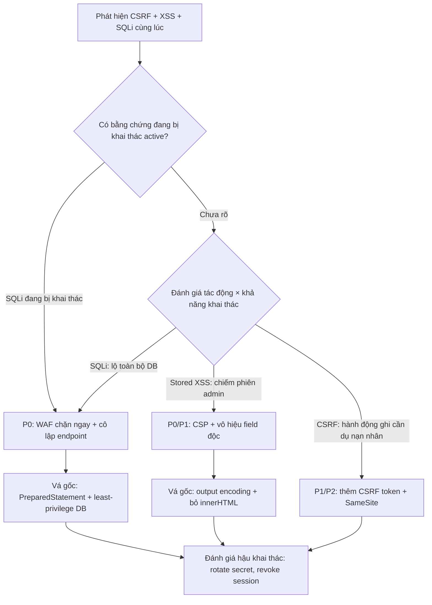

# CSRF/XSS/SQL injection phát hiện ở production. Bạn xử lý gì trước?

## ⚡ Tóm tắt ngắn (30s)
* **Bản chất**: Đây là câu hỏi về **triage và ưu tiên** khi có nhiều lỗ hổng cùng lúc, không phải hỏi định nghĩa từng loại. Nguyên tắc Senior: ưu tiên theo công thức **Mức độ nghiêm trọng = Khả năng khai thác × Tác động × Bằng chứng đang bị khai thác**. Theo kinh nghiệm, thứ tự thường là **SQL Injection (P0) → Stored XSS (P0/P1) → CSRF (P1/P2)**, vì SQLi có thể dẫn tới rò rỉ/sửa toàn bộ database (thậm chí RCE), trong khi CSRF cần lừa nạn nhân thực hiện hành động.
* **Thảm họa thực chiến được giải quyết**:
  1. **SQLi đang bị khai thác active**: Log cho thấy payload `' OR '1'='1` và `UNION SELECT` → kẻ tấn công đang rút dữ liệu *ngay lúc này*. Đây là P0 tuyệt đối, cầm máu bằng WAF rule trong vài phút.
  2. **Stored XSS trong field hồ sơ**: Script độc nằm sẵn trong DB, mỗi lần admin xem là chạy → chiếm phiên admin (account takeover). Nguy hiểm hơn reflected XSS vì không cần lừa từng nạn nhân.
* **Quyết định Senior**:
  1. **Ưu tiên cái đang bị khai thác và cái có tác động lớn nhất**: SQLi active trước.
  2. **Cầm máu bằng WAF rồi vá tận gốc bằng code**: WAF chỉ là *mitigation tạm thời*, không phải *fix*. Fix thật là PreparedStatement, output encoding, CSRF token + SameSite.
  3. **Đánh giá hậu khai thác**: SQLi/XSS có thể đã lộ dữ liệu/chiếm phiên → rotate secret, revoke session, soi audit log.

---

## 🔍 Chi tiết bản chất thực chiến: Khung ưu tiên & cách vá từng loại

### Vì sao thứ tự thường là SQLi → XSS → CSRF
* **SQL Injection** — *tác động cao nhất*: kẻ tấn công thao túng câu lệnh SQL, có thể đọc/sửa/xóa toàn bộ DB, vượt qua đăng nhập, đôi khi RCE qua các hàm hệ thống của DB. Một lỗ hổng = toàn bộ dữ liệu.
* **Stored XSS** — *cao*: chèn JS chạy trên trình duyệt nạn nhân, đánh cắp token/session, thực hiện hành động thay nạn nhân. Stored (lưu trong DB) nguy hiểm hơn reflected vì tự động tấn công mọi người xem.
* **CSRF** — *trung bình*: lừa trình duyệt nạn nhân (đang đăng nhập) gửi request ngoài ý muốn. Không đọc được dữ liệu (do Same-Origin chặn đọc response), chỉ thực hiện được hành động *ghi*, và cần nạn nhân đang có phiên hợp lệ + bị dụ truy cập trang độc.
* **Lưu ý**: thứ tự này là *điểm khởi đầu*, không cứng nhắc. Nếu CSRF nằm trên endpoint chuyển tiền và đang bị khai thác hàng loạt, nó vượt lên P0. **Bằng chứng đang bị khai thác luôn nâng độ ưu tiên.**

### Cách cầm máu và vá đúng từng loại
* **SQLi**:
  * Cầm máu: WAF rule chặn pattern (`UNION SELECT`, `' OR `), hoặc tắt endpoint dính lỗi.
  * Fix gốc: **PreparedStatement / parameterized query** (tách dữ liệu khỏi lệnh). Dùng ORM với bind parameter, validate input, least-privilege cho DB user (app không cần `DROP`).
* **XSS**:
  * Cầm máu: bật **Content-Security-Policy** chặt, vô hiệu hóa field chứa payload.
  * Fix gốc: **output encoding theo ngữ cảnh** (encode khi render ra HTML, không phải khi nhận), không dùng `innerHTML` với dữ liệu user, sanitize HTML đầu vào nếu buộc phải cho rich text (OWASP Java HTML Sanitizer).
* **CSRF**:
  * Fix gốc: **CSRF token** (synchronizer token) cho luồng dùng cookie, cookie `SameSite=Lax/Strict`. API stateless dùng Bearer token trong header thì miễn nhiễm CSRF cơ bản (vì attacker không set được header).

### Tín hiệu nhận biết & xác định "đang bị khai thác" trong log
Để xếp đúng độ ưu tiên, ta cần bằng chứng *có đang bị khai thác hay không*, không đoán mò:
* **SQLi**: tìm trong access log các payload `UNION SELECT`, `' OR '1'='1`, `--`, `sleep(`, `pg_sleep`, hoặc tỷ lệ lỗi `500` tăng đột biến trên một endpoint kèm thời gian phản hồi bất thường (dấu hiệu blind/time-based SQLi).
* **Stored XSS**: quét dữ liệu trong DB các field hiển thị tìm `<script>`, `onerror=`, `javascript:`; đối chiếu log xem payload được tạo bởi tài khoản nào, đã được render cho bao nhiêu người xem.
* **CSRF**: tìm các request `POST/PUT/DELETE` thành công có `Referer`/`Origin` lạ (không thuộc domain của mình) trên endpoint đổi-trạng-thái dùng cookie.

> **Nguyên tắc**: chỉ cần một payload SQLi *thành công* (trả về dữ liệu) là đủ để nâng lên P0 và kích hoạt quy trình giả định breach, kể cả khi chưa định lượng được thiệt hại.

---

## 🎨 Sơ đồ trực quan: Cây triage ưu tiên xử lý



---

## 💻 Code thực chiến: BAD vs GOOD

### ❌ BAD: Nối chuỗi SQL, render thô, không CSRF token
```java
// ❌ SQL Injection: nối thẳng input vào câu lệnh
String sql = "SELECT * FROM users WHERE email = '" + email + "'";
stmt.executeQuery(sql); // email = "' OR '1'='1" -> trả về toàn bộ user
```
```javascript
// ❌ XSS: nhét dữ liệu user thẳng vào innerHTML -> <script> sẽ chạy
element.innerHTML = "Xin chào " + userProfile.displayName;
```
```java
// ❌ CSRF: state-changing endpoint dùng cookie session, tắt CSRF bừa
http.csrf(csrf -> csrf.disable()); // với app dùng cookie là mở toang CSRF
```

### ✅ GOOD: Parameterized + encoding + CSRF token đúng ngữ cảnh
```java
// ✅ SQLi fix: PreparedStatement tách dữ liệu khỏi lệnh, DB coi email là giá trị
String sql = "SELECT * FROM users WHERE email = ?";
try (PreparedStatement ps = conn.prepareStatement(sql)) {
    ps.setString(1, email);     // input không bao giờ trở thành cú pháp SQL
    ResultSet rs = ps.executeQuery();
}
// ✅ Hoặc JPA: @Query("... WHERE u.email = :email") + @Param("email")
```
```javascript
// ✅ XSS fix: dùng textContent (trình duyệt tự escape), không diễn giải HTML
element.textContent = "Xin chào " + userProfile.displayName;
// Nếu cần rich text: sanitize bằng thư viện (DOMPurify) trước khi render
```
```java
// ✅ CSRF: app dùng cookie -> bật CSRF token + SameSite; app dùng Bearer header -> miễn nhiễm
http
  .csrf(csrf -> csrf
     .csrfTokenRepository(CookieCsrfTokenRepository.withHttpOnlyFalse()))
  .sessionManagement(s -> s.sessionCreationPolicy(SessionCreationPolicy.STATELESS));
```

---

## 📊 Bảng so sánh 3 lỗ hổng

| Tiêu chí | SQL Injection | XSS (Stored) | CSRF |
| :--- | :--- | :--- | :--- |
| **Mục tiêu tấn công** | Database (server) | Trình duyệt nạn nhân | Phiên đăng nhập nạn nhân |
| **Tác động tối đa** | Lộ/sửa/xóa toàn bộ DB, RCE | Chiếm phiên, account takeover | Thực hiện hành động ghi thay nạn nhân |
| **Điều kiện khai thác** | Endpoint dính + input không lọc | Field hiển thị không encode | Nạn nhân đang đăng nhập + bị dụ |
| **Fix gốc** | Parameterized query | Output encoding theo ngữ cảnh | CSRF token + SameSite cookie |
| **Ưu tiên điển hình** | P0 | P0/P1 | P1/P2 |

---

## ⚠️ Common Gotchas & Questions follow-up

### 1. Cạm bẫy "WAF đã chặn nên coi như xong"
* **Vấn đề**: WAF chặn được nhiều payload phổ biến, nên dev tưởng đã an toàn và không vá code. Nhưng WAF dựa trên pattern và **bypass được** (mã hóa, biến thể, double-encoding). WAF là *mitigation* mua thời gian, không phải *fix*. Lỗ hổng vẫn còn nguyên trong code.
* **Giải pháp**: Coi WAF rule như băng gạc tạm. Việc bắt buộc là vá tận gốc (parameterized query/encoding) rồi mới gỡ phụ thuộc WAF.

### 2. Câu hỏi đào sâu từ interviewer
* **Interviewer: "Bạn nói SQLi là P0. Sau khi cầm máu bằng WAF, làm sao biết kẻ tấn công đã lấy được gì để báo cáo chính xác?"**
* **Trả lời**:
  1. **Phân tích log & truy vấn**: Đối chiếu access log (payload, thời điểm) với DB query log / slow log để xác định những câu `UNION SELECT`/`OR 1=1` đã chạy thành công và chạm vào bảng nào.
  2. **Giả định breach**: Nếu không đủ log để chứng minh *không* bị lấy, phải giả định dữ liệu trong tầm với của câu query đã lộ — rotate secret, buộc đổi mật khẩu, revoke session, vô hiệu token.
  3. **Phòng ngừa giúp điều tra**: Least-privilege DB user (app không có quyền đọc bảng `credentials`/`audit`) thu hẹp thiệt hại; bật query logging/CDC giúp tái dựng được kẻ tấn công đã làm gì.
  4. **Trung thực**: Không phải lúc nào cũng *chứng minh được* phạm vi chính xác. Khi đó nguyên tắc là phản ứng theo kịch bản xấu nhất hợp lý và minh bạch với các bên liên quan, thay vì phỏng đoán lạc quan.
