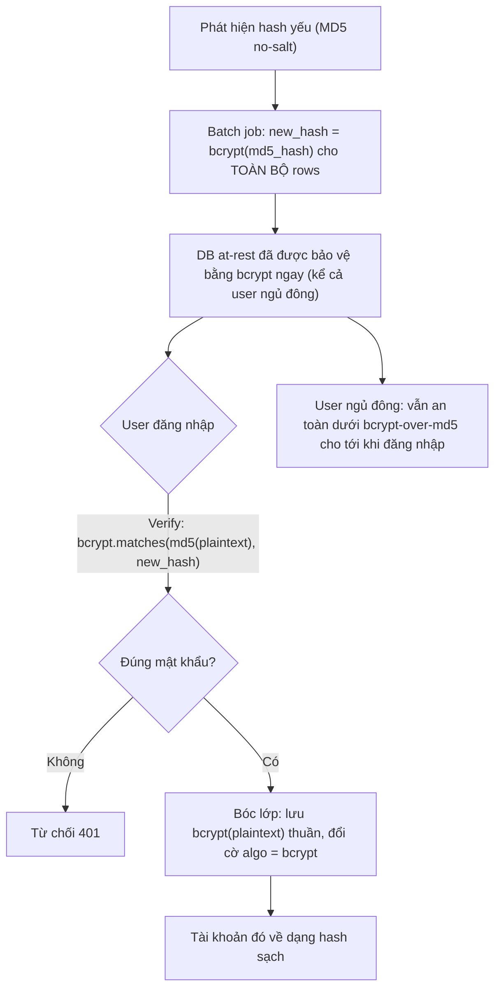

# Password hashing config yếu, bạn migrate thế nào?

## ⚡ Tóm tắt ngắn (30s)
* **Bản chất**: Phát hiện mật khẩu đang lưu bằng thuật toán yếu (MD5/SHA-1, không salt, hoặc bcrypt cost quá thấp) là một **rủi ro bảo mật cần migrate khẩn cấp**. Nghịch lý cốt lõi: hash là **một chiều**, ta **không thể giải ngược** để hash lại bằng thuật toán mạnh. Vì vậy Senior dùng hai chiến lược kết hợp: **(1) rehash-on-login** (hash lại bằng thuật toán mạnh khi user đăng nhập thành công) và **(2) layered/onion hashing** (bọc hash cũ trong hash mới ngay lập tức cho *toàn bộ* DB để bảo vệ at-rest mà không cần đợi user đăng nhập).
* **Thảm họa thực chiến được giải quyết**:
  1. **MD5 không salt = rainbow table**: Mật khẩu lưu `md5(password)` bị crack hàng loạt trong vài phút nếu DB lộ, vì rainbow table cho MD5 có sẵn khắp nơi.
  2. **Chờ user đăng nhập để rehash → user ngủ đông không bao giờ được bảo vệ**: Chỉ dùng rehash-on-login thì các tài khoản không đăng nhập trong nhiều tháng vẫn nằm dưới hash yếu suốt thời gian đó.
* **Quyết định Senior**:
  1. **Layered hashing ngay**: `newHash = bcrypt(md5(pw))` cho *mọi* hàng trong một batch job → toàn bộ DB được bảo vệ bằng bcrypt ngay lập tức, không cần plaintext, không đợi đăng nhập.
  2. **DelegatingPasswordEncoder**: Dùng prefix `{id}` của Spring Security để hỗ trợ nhiều thuật toán song song, tự nâng cấp dần.
  3. **Không bắt toàn bộ user đổi mật khẩu** trừ khi DB đã thực sự bị lộ — tránh phá trải nghiệm.

---

## 🔍 Chi tiết bản chất thực chiến: Hai chiến lược migrate

### Chiến lược 1: Rehash-on-login (nâng cấp khi đăng nhập)
* Khi user đăng nhập, ta *có plaintext trong tay* (chỉ tại khoảnh khắc đó). Quy trình:
  1. Verify mật khẩu nhập vào với hash cũ (MD5).
  2. Nếu đúng, lập tức hash lại plaintext bằng bcrypt/argon2 và *ghi đè* vào DB.
  3. Lần sau user đó đã ở thuật toán mạnh.
* **Ưu**: hash kết quả "sạch" (bcrypt trực tiếp của plaintext). **Nhược**: chỉ nâng cấp được tài khoản *có đăng nhập*; tài khoản ngủ đông vẫn yếu.

### Chiến lược 2: Layered "onion" hashing (bọc lớp ngay lập tức)
* Vấn đề của chiến lược 1 là các tài khoản không đăng nhập. Giải pháp: chạy batch job hash lại *hash cũ* bằng thuật toán mạnh — không cần plaintext:
  * `new_hash = bcrypt(existing_md5_hash)` lưu kèm cờ `algo = 'bcrypt-over-md5'`.
* Sau bước này, **toàn bộ DB at-rest được bảo vệ bằng bcrypt ngay**, kể cả tài khoản ngủ đông. Nếu DB lộ, kẻ tấn công gặp bcrypt chứ không phải MD5 trần.
* Khi user đăng nhập: verify bằng `bcrypt.matches(md5(plaintext), new_hash)`, rồi *bóc lớp* — hash lại plaintext trực tiếp thành `bcrypt(plaintext)` thuần, đổi cờ về `bcrypt`. Dần dần DB "bóc vỏ" về dạng sạch.
* **Senior thường kết hợp cả hai**: layered ngay (bảo vệ at-rest tức thì) + rehash-on-login (làm sạch dần).

### Công cụ: DelegatingPasswordEncoder
* Spring Security lưu hash kèm prefix định danh thuật toán: `{bcrypt}$2a$...`, `{argon2}$argon2id$...`. Encoder đọc prefix để chọn đúng cách verify. Nhờ vậy nhiều thuật toán *cùng tồn tại* trong DB trong giai đoạn chuyển tiếp, và `upgradeEncoding()` báo khi nào cần rehash.

### Tham số an toàn (định cỡ chi phí)
* Chọn cost factor sao cho mỗi lần hash mất khoảng $t \approx 0.25\text{–}0.5\text{s}$ trên phần cứng production — đủ chậm để chống brute-force, đủ nhanh để không nghẽn login. Với bcrypt thường là cost 12; argon2id thì cấu hình memory/iteration theo khuyến nghị OWASP và đo lại định kỳ vì phần cứng nhanh dần.

---

## 🎨 Sơ đồ trực quan: Luồng migrate hai lớp



---

## 💻 Code thực chiến: BAD vs GOOD

### ❌ BAD: MD5 không salt, một thuật toán cứng
```java
// ❌ MD5 không salt: nhanh, không salt -> rainbow table crack tức thì
public String hash(String password) {
    return DigestUtils.md5Hex(password);
}
public boolean verify(String raw, String stored) {
    return DigestUtils.md5Hex(raw).equals(stored); // ❌ so sánh non-constant-time
}
```

### ✅ GOOD: DelegatingPasswordEncoder + upgrade khi login
```java
@Bean
public PasswordEncoder passwordEncoder() {
    // ✅ Mặc định mã hóa mới bằng bcrypt, nhưng verify được nhiều thuật toán cũ
    String defaultId = "bcrypt";
    Map<String, PasswordEncoder> encoders = Map.of(
        "bcrypt", new BCryptPasswordEncoder(12),
        "argon2", Argon2PasswordEncoder.defaultsForSpringSecurity_v5_8(),
        "MD5", new MessageDigestPasswordEncoder("MD5") // chỉ để verify hash cũ
    );
    return new DelegatingPasswordEncoder(defaultId, encoders);
}
```
```java
@Service
public class AuthService {
    private final PasswordEncoder encoder;
    private final UserRepository repo;

    public void login(String username, String rawPassword) {
        User u = repo.findByUsername(username).orElseThrow();

        // ✅ matches() tự nhận diện thuật toán qua prefix {id}
        if (!encoder.matches(rawPassword, u.getPasswordHash())) {
            throw new BadCredentialsException("Sai thông tin đăng nhập");
        }
        // ✅ Nếu hash đang ở thuật toán/cost yếu -> rehash lên bcrypt ngay
        if (encoder.upgradeEncoding(u.getPasswordHash())) {
            u.setPasswordHash(encoder.encode(rawPassword));
            repo.save(u);
        }
    }
}
```

---

## 📊 Bảng so sánh thuật toán hash mật khẩu

| Thuật toán | Có salt | Chống GPU brute-force | Đánh giá |
| :--- | :--- | :--- | :--- |
| **MD5 / SHA-1** | Không (mặc định) | Rất kém (cực nhanh) | ❌ Tuyệt đối không dùng cho mật khẩu |
| **SHA-256 + salt** | Có | Kém (vẫn quá nhanh) | ❌ Không đủ — thiết kế để nhanh |
| **bcrypt** | Có (tích hợp) | Tốt (cost factor) | ✅ Chuẩn phổ biến, lưu ý giới hạn 72 byte |
| **scrypt** | Có | Tốt (memory-hard) | ✅ Tốt, cấu hình phức tạp hơn |
| **argon2id** | Có | Rất tốt (memory-hard) | ✅ Khuyến nghị hiện đại (OWASP) |

---

## ⚠️ Common Gotchas & Questions follow-up

### 1. Cạm bẫy "bcrypt cắt cụt 72 byte" và đăng xuất toàn bộ
* **Vấn đề 1**: bcrypt chỉ dùng tối đa **72 byte** đầu của input; phần dư bị bỏ qua âm thầm. Nếu hệ thống cho phép mật khẩu dài hoặc tiền-hash sai cách, hai mật khẩu khác nhau có thể coi là giống. Cách an toàn khi cần hỗ trợ input dài: pre-hash bằng SHA-256 *rồi* base64 *rồi* bcrypt (đảm bảo ≤72 byte và không chứa null byte) — hoặc đơn giản là dùng argon2.
* **Vấn đề 2**: Khi đổi cơ chế hash, *không* nên vô hiệu hóa toàn bộ phiên / bắt mọi người đổi mật khẩu trừ khi DB thực sự đã lộ. Migrate phải *trong suốt* với người dùng (verify được hash cũ), nếu không sẽ gây làn sóng reset gây tải support và mất khách.

### 2. Câu hỏi đào sâu từ interviewer
* **Interviewer: "Nếu DB hash đã thực sự bị lộ (không chỉ là config yếu), chiến lược migrate có gì khác?"**
* **Trả lời**:
  1. **Coi mọi mật khẩu là đã bị xâm phạm**: Hash yếu đã lộ thì layered/rehash *không cứu* được các mật khẩu yếu/phổ biến — kẻ tấn công crack offline được. Lúc này phải **buộc reset mật khẩu** (qua kênh xác thực an toàn) cho tài khoản bị ảnh hưởng, đồng thời revoke session/token hiện hành.
  2. **Bắt buộc bước xác minh bổ sung**: Bật/khuyến khích MFA để giảm thiệt hại ngay cả khi mật khẩu đã lộ.
  3. **Phòng ngừa lần sau**: Thêm **pepper** (khóa bí mật lưu ở secret manager, không trong DB) vào trước khi hash, để hash lộ mà thiếu pepper thì khó crack hơn; và theo dõi cost factor theo thời gian (phần cứng nhanh dần thì tăng cost).
  4. **Trung thực**: Không thể "rút lại" mật khẩu đã lộ; chỉ có thể *thay* chúng và giảm rủi ro bằng MFA + giám sát đăng nhập bất thường.
